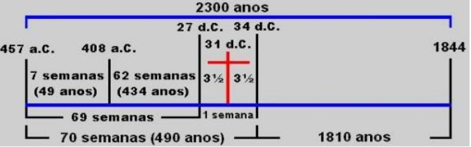

---
puppeteer:
    pdf:
        format: A4
        displayHeaderFooter: true
        margin:
            top: .7cm
            right: .7cm
            bottom: .9cm
            left: .7cm
    imagen:
        quality: 100
        fullPage: true
---
**Lezione della scuola biblica**{class=titulo_capa}


**I pilastri della fede**{class=titulo_capa}

<div class='page'><div class = 'page'> & nbsp; </div>nbsp;</div>

[[OCD]]

**Citazioni bibliche:**ARA: Almeida rivisto e aggiornato, ARC: Almeida rivisto e corretto
 
**Versione:**...00817

#Introduzione

La chiesa è il luogo in cui i membri del corpo di Cristo devono essere amati, preservati da false dottrine o insegnamenti; deve anche rafforzarli nella fede e nella parola, crescendo nella conoscenza della Bibbia come verità e fonte della conoscenza spirituale.

Deve anche soddisfare il bisogno dei membri di addestramento al servizio di Cristo: andare alla ricerca delle anime per le quali Gesù è morto e rendere queste persone discepoli o studenti della scuola di Cristo, insegnando loro a osservare tutte le cose che Gesù ha insegnato e ci ha insegnato.

Affinché lo scopo di Cristo per la chiesa si adempia, abbiamo le lezioni della scuola biblica. L'obiettivo è preparare gli studenti a essere saldi in Cristo, sapendo come difendere le loro convinzioni attraverso la parola, la Bibbia, proprio come Gesù ha confutato e vinto lo stesso nemico delle anime, Satana, con un * "è scritto". * La Bibbia è nostra regola di fede e pratica per questa vita e per la preparazione della vita eterna in compagnia degli angeli che sono alla santa presenza di Dio.

Preghiamo che il nostro Padre eterno possa realizzare questo scopo nella sua vita e che questi studi diventino un mezzo per aiutarlo in questo scopo in Cristo Gesù. Amen.

**Istruzioni per le lezioni bibliche:**  

Prima di iniziare la lezione, ti suggeriamo di pregare per l'illuminazione dello Spirito di Dio che ti permetta di comprendere, comprendere, le verità bibliche da studiare ogni giorno. Suggeriamo anche di fare le lezioni la mattina presto, nelle prime ore della giornata, in modo che il fratello possa mettere in pratica ciò che ha imparato nella giornata a venire, sia nel prendere piccole o grandi decisioni quotidiane.

La maggior parte dei passaggi biblici sono già presenti nella lezione per evitare difficoltà con le traduzioni, ma è sempre bene controllare la propria Bibbia e assicurarsi di comprendere l'argomento in teoria. Dopo aver letto e compreso bene i versetti, avrai tre tipi di domande. Il primo tipo è un'alternativa, contrassegna X, devi scegliere l'unica risposta corretta nella domanda e contrassegnarla come richiesta. Il secondo tipo di domanda è vero e falso, devi porre la domanda di fronte se è vero o se è falso. Nel terzo tipo, dovresti elencare i problemi, come affermato.

Suggeriamo anche che i testi biblici che sono solo citati dovrebbero essere cercati e studiati nella tua Bibbia. Alla fine di ogni lezione ci sarà un appello affinché il fratello prenda una decisione in merito allo studio svolto in cui il fratello deve compilare sì o no. In caso di dubbi, chiarimenti e / o suggerimenti, lasciamo uno spazio alla fine di ogni lezione perché il fratello possa riempire se lo desidera. Preghiamo che il Signore Gesù lo benedica e lo assista in questo viaggio cristiano.

Cordiali saluti,

Gli editori

Quarto Angelo Ministero - Avvertimento finale

# (1) Il Vangelo in simboli

!!!quote Back Ground
    **E mi faranno un santuario, così che io possa abitare in mezzo a loro.**{class=verso} **Esodo 25:8**{class=livro}

## Domenica

Dio desidera che il suo popolo, che è vivo nel momento finale della storia di questo mondo, conosca le verità speciali o fondamentali che lo aiuteranno a conoscere il tempo e gli eventi che lo circondano e il loro rapporto con gli scopi di Dio.

La conoscenza della verità e l'applicazione di queste verità nella nostra vita ci renderà testimoni viventi per predicare e proclamare l'ultimo avvertimento; L'AVVERTIMENTO FINALE agli abitanti della Terra in modo che possano prendere la loro decisione accanto a Dio o accanto al nemico di Dio e alle anime per le quali Gesù è morto.

Quasi duemila anni fa, quando Cristo camminava tra gli uomini, alcuni lo accettarono come profeta e prossimo messia; altri Lo vedevano come un nuovo insegnante tra loro; altri ancora come un brav'uomo. Tuttavia, alcuni di loro, quando hanno sentito parlare di Gesù, non si sono accontentati di quello che hanno detto di Lui o dei Suoi insegnamenti pubblici, ma hanno voluto e sentito il bisogno di più tempo con Lui da solo; Lo riconoscevano come Salvatore e Signore e quindi volevano sapere dove viveva. Rimasero con lui nella sua casa. **Giovanni 1:35-39.**{class=livro}

Anche quando Gesù insegnava alle folle; poi in particolare alcuni chiedevano più intimamente e avevano una maggiore comprensione, questi erano conosciuti come i dodici apostoli e anche tra gli apostoli c'era un gruppo più piccolo che accompagnava Gesù in situazioni particolari. Infine, la Bibbia parla dell'amato discepolo Giovanni, che dei dodici era il più vicino al Maestro. A questo Giovanni fu data una visione speciale del Salvatore, come possiamo vedere nel Vangelo che scrisse, come nelle sue lettere piene d'amore per i suoi fratelli. A Giovanni fu data anche l'Apocalisse, la rivelazione di cose che sarebbero presto accadute.

Come popolo, dobbiamo conoscere le verità per i tempi della fine, ma come individui possiamo mantenere una relazione più intima con Gesù per rivelare al mondo la potenza di Dio che è manifestata da Cristo che vive in noi.

**Come sarà il peculiare popolo di Dio sulla Terra appena prima del ritorno di Gesù?**{class=questao} **Apocalisse 14:1,4,5**{class=livroQ}  
**Ho guardato, ed ecco, l'Agnello in piedi sul monte Sion, e con lui centoquarantaquattromila, avendo scritto sulla sua fronte il suo nome e il nome di suo Padre. Questi sono quelli che non sono stati contaminati con le donne, perché sono casti. Sono quelli che seguono l'Agnello ovunque vada. Sono coloro che sono stati redenti di fra gli uomini, primizie a Dio e all'Agnello; e nessun errore è stato trovato nella sua bocca; non hanno difetti.**{class=versoQ} **Apocalisse 14:1,4,5**{class=livroVerso}

**Contrassegna le dichiarazioni con V se vere e F se false.**  

a) ( ) Il popolo di Dio che vivrà negli ultimi giorni sarà un popolo santo, cioè separato dalla corruzione del mondo.  
b) ( ) Saranno testimoni viventi del potere trasformante di Dio.  
c) ( ) Non avranno dottrine o insegnamenti diversi da quelli della Bibbia.  
d) ( ) Saranno estremamente strani e diversi da Gesù.  

## Lunedi

Abbiamo visto nel libro dell'Apocalisse che il popolo di Dio in questo tempo in cui viviamo, che la Bibbia chiama il tempo della fine, non è stato contaminato da "donne" perché sono caste e seguono l'Agnello ovunque vadano.

**Cosa rappresenta il simbolo *"donna"* nella profezia?**{class=questao} **Efesini 5:22-25**{class=livroQ}   
**Le donne siano sottomesse al proprio marito, come al Signore; perché il marito è il capo della donna, proprio come Cristo è il capo della chiesa, essendo questo il salvatore del corpo ... Mariti, amate vostra moglie, proprio come Cristo ha amato la chiesa e si è dato per lei.**{class=versoQ} **Efesini 5:22-25**{class=livroVerso}

**Spunta la risposta corretta:**  
a) La donna rappresenta la figura femminile.   
b) La donna rappresenta una dea.   
c) La donna rappresenta nella chiesa biblica.   

!!!note ""
	La chiesa di Cristo è rappresentata come una donna, di cui Cristo è lo sposo che ha dato se stesso per salvarla. La chiesa è composta dai fedeli seguaci di Gesù Cristo.

**Chi è la casa di Cristo, e come dovrebbe essere stabilita questa casa?**{class=questao} **Ebrei 3:6**{class=livroQ}  
**Cristo, invece, come Figlio, nella sua casa; di quale casa siamo, se manteniamo ferma la fiducia, fino alla fine, l'audacia e l'esaltazione della speranza.**{class=versoQ} **Ebrei 3:6**{class=livroVerso}

**Spunta la risposta corretta:**  
a) La casa di Cristo è la chiesa che frequento.   
b) Siamo la casa di Cristo, se lo Spirito di Dio dimora in noi.   
c) La casa di Cristo è in cielo con gli angeli.   

!!!note ""
	Dobbiamo considerare Gesù Cristo, apostolo e sommo sacerdote della nostra confessione, come un essere fedele a Dio, che Lo costituì sulla Sua casa o sulla Sua chiesa. Perché ogni casa è costruita da qualcuno, ma colui che ha costruito tutte le cose è Dio.

## martedì

**A cosa confronta la Bibbia con Cristo?**{class=questao} **I Corinzi 1:24,30**{class=livroQ}  
**Ma ai chiamati, sia ebrei che greci, predichiamo Cristo, il potere di Dio e la saggezza di Dio.**{class=versoQ} **I Corinzi 1:24,30**{class=livroVerso}

**Spunta la risposta corretta:**  
a) Cristo è chiamato uomo saggio.   
b) Cristo è chiamato la saggezza di Dio.   
c) Cristo è chiamato casa.   

!!!note ""
	Cristo vuole che la nostra mente sia la sua casa, dove vuole vivere. Vediamo nell'Apocalisse la figura di Gesù in piedi alla porta del nostro cuore chiedendo il permesso di entrare. **Ecco, io sto alla porta e busso, se qualcuno sente la mia voce e apre la porta, entrerò in casa sua e cenerò con lui e lui con me.**{class=verso} **Apocalisse 3:20**{class=livro}

L'intera casa ha pilastri che la sostengono.

**Quanti pilastri ci sono nella casa o nella chiesa di Dio?**{class=questao} **Proverbi 9:1**{class=livroQ}  
**La saggezza ha costruito la sua casa, arato i suoi sette pilastri.**{class=versoQ} **Proverbi 9:1**{class=livroVerso}

**Spunta la risposta corretta:**  
a) Sei pilastri o colonne.   
b) Dieci pilastri o colonne.   
c) Sette pilastri o colonne.   

La Parola di Dio ci mostra che la casa di Dio, che siamo noi (la Sua chiesa), ha sette colonne (o pilastri). Nei prossimi studi vedremo più in dettaglio ciascuno dei pilastri della nostra fede, che sono:

```
I - IL TEMPIO DI DIO IN CIELO
II - LA PURIFICAZIONE DEL SANTUARIO
III - I TRE MESSAGGI ANGELICI
IV - I COMANDAMENTI DI DIO E LA FEDE DI GESÙ
V - LA LEGGE DI DIO
VI - IL SABATO
VII - LA MORTALITÀ DELL'ANIMA
```

## mercoledì

**Il Santuario - Il Vangelo in simboli**  

Gli israeliti erano il popolo di Dio quando lasciarono l'Egitto. Erano stati lì come schiavi per quattrocentotrent'anni e avevano perso gran parte della conoscenza del Dio che ci aveva creati. In quanto schiavi non avevano modo di adorare e servire il loro Dio, e ora che se ne andavano grazie al potere manifestato dal Grande Dio, dovevano imparare o imparare di nuovo molto dell'adorazione, della gratitudine e della lode dell'unico vero Dio. Lo scopo di Dio era quello di essere rivelato a tutte le persone attraverso l'amore, la misericordia, la gentilezza e la conoscenza di Se Stesso manifestate al popolo di Israele. Un ordine fu comunicato a Mosè, mentre era sulla montagna con Dio ...

**Cosa comandò Dio al popolo di Israele tramite Mosè?**{class=questao} **Esodo 25:8,9,40**{class=livroQ}  
**E mi faranno un santuario, così che io possa vivere in mezzo a loro. Secondo tutto quello che ti mostro per il modello del tabernacolo e per il modello di tutti i suoi mobili, lo farai comunque. Vedi, quindi, che tutto funzioni secondo il modello che ti è stato mostrato sulla montagna.**{class=versoQ} **Esodo 25:8,9,40**{class=livroVerso}

**Spunta la risposta corretta:**  
a) Dio ha ordinato a Mosè di organizzare una grande festa.   
b) Dio ordinò a Mosè di creare un posto per la Sua dimora. Mostrò a Mosè il modello: il santuario del cielo per farne una copia qui sulla Terra.   
c) Dio ordinò al popolo di andare in chiesa, perché lì e solo lì sarebbe stato con il suo popolo.   

!!!note ""
	A causa della loro apostasia, gli israeliti furono privati ​​della benedizione della presenza divina e per qualche tempo resero loro impossibile stabilire un santuario per Dio. Ma, dopo essere stato nuovamente ricevuto in favore del Cielo, il grande capo procedette a eseguire l'ordine divino. Il santuario era una tenda pieghevole composta da diverse coperture. Conteneva un cortile e una tenda stessa con due scompartimenti: il luogo santo e il luogo santissimo che erano separati da un velo. Ogni scompartimento aveva mobili specifici per insegnare l'opera di redenzione e salvezza di Cristo per noi.

**Come e dove viene mostrato il modello a Mosè sul monte in modo che possa fare lo stesso?**{class=questao} **Ebrei 9:24**{class=livroQ}  
**Perché Cristo non è entrato in un santuario fatto di mano, una figura del vero, ma nello stesso cielo, per apparire ora per noi, davanti al volto di Dio.**{class=versoQ} **Ebrei 9:24**{class=livroVerso}

**Spunta la risposta corretta:**  
a) Il vero santuario è stato fatto da mani umane e si trova a Gerusalemme.   
b) La copia del santuario non è stata realizzata da mani umane e si trova in Egitto.   
c) Il vero santuario si trova in cielo e non è stato fatto da mani umane.   

## Giovedi

**Cosa veniva offerto al Santuario?**{class=questao} **Ebrei 9:9**{class=livroQ}   
**Questa è una parabola per il tempo presente; e, secondo questo, vengono offerti sia doni che sacrifici, sebbene questi, in termini di coscienza, siano inefficaci nel perfezionare l'adoratore.**{class=versoQ} **Ebrei 9:9**{class=livroVerso}

**Spunta la risposta corretta:**  
a) Sono stati offerti denaro e beni.   
b) Doni e sacrifici che in realtà non hanno migliorato gli adoratori.   
c) Non è stato offerto nulla.   


**Cosa c'era nel cortile, o anche chiamato atrio, del santuario?**{class=questao} **Esodo 40:29-33**{class=livroQ}   
**E pose l'altare degli olocausti all'ingresso della tenda della tenda di convegno e vi offrì un olocausto e un'offerta di cibo, come il Signore aveva ordinato a Mosè. Mise anche il lavello tra la tenda del convegno e l'altare e vi mise l'acqua per lavarsi. E Mosè, Aaronne ei loro figli vi si lavarono mani e piedi. Quando entrarono nella tenda di convegno e quando raggiunsero l'altare, si lavarono, come il Signore aveva ordinato a Mosè. Innalzò anche il cortile intorno al tabernacolo e all'altare e appese la cortina alla porta del cortile. Così Mosè terminò il lavoro.**{class=versoQ} **Esodo 40:29-33**{class=livroVerso}

**Spunta la risposta corretta:**  
a) Fiori, animali e una fontana.   
b) Sacrificio altare, lavabo o lavello.   
c) Molte banche per le persone a stabilirsi.   

!!!note ""
	L'altare dell'olocausto o sacrificio, che era molto vicino all'ingresso del cortile, rappresentava o indicava il grande sacrificio della croce sul Calvario dove Gesù, il vero Agnello di Dio, morì al nostro posto. Là apparve il peccatore pentito, prendendo un animale come suo sostituto, o per prendere il posto del peccatore; guidato dai sacerdoti del piano di salvezza, il peccatore pose la sua mano sul capo della vittima e lo uccise. I nostri peccati hanno ucciso il Figlio di Dio. Quindi il sacerdote prese il sangue della vittima, lo pose sull'altare e lo spruzzò sul velo. Il peccato è stato registrato nel santuario e il peccatore è stato perdonato. Il lavabo era il luogo in cui il sacerdote doveva lavarsi le mani e i piedi ogni volta che entrava negli scompartimenti sacri o si avvicinava all'altare per offrire un olocausto al Signore. Dopo che l'animale fu sacrificato al suo posto, il peccatore fu sostituito dal sacerdote che officiava a suo favore nel santuario. Dove il peccatore non poteva entrare. È stato lavato e pulito dall'acqua del lavandino, proprio come Cristo ci purifica e purifica mediante la Parola applicata alla nostra esperienza di vita.

**Oltre al cortile, quante parti c'erano in questo santuario?**{class=questao} **Ebrei 9:2,3**{class=livroQ}  
**In effetti, fu preparato il tabernacolo, la cui parte anteriore, dove era la lampada, e la tavola, e l'esposizione dei pani, è chiamata Luogo Santo; dietro il secondo velo c'era il tabernacolo chiamato Holy of Holies**{class=versoQ} **Ebrei 9:2,3**{class=livroVerso}

**Spunta la risposta corretta:**  
a) Oltre al patio c'erano altre due parti: Lugar Santo e Lugar Santíssimo.   
b) Non c'erano altre parti.   
c) Oltre al cortile, c'era un'altra parte della chiesa.   


**Cosa c'era nel luogo santo?**{class=questao} **Esodo 40:22-26**{class=livroQ}   
**Apparve anche la tavola nella tenda di convegno, accanto alla tenda, a nord, fuori dal velo, e su di essa pose il pane in ordine davanti all'Eterno, come l'Eterno aveva ordinato a Mosè. Posò anche il candelabro davanti alla tavola, vicino al tabernacolo, a sud, nella tenda di convegno, e accese le lampade davanti all'Eterno, come l'Eterno aveva ordinato a Mosè. E pose l'altare d'oro nella tenda del convegno, davanti al velo.**{class=versoQ} **Esodo 40:22-26**{class=livroVerso}   
**Perché fu preparato un tabernacolo, il primo, in cui c'erano il candelabro, la tavola e il pane della proposta; quello che viene chiamato il santuario.**{class=versoQ} **Ebrei 9:2**{class=livroVerso}

**Spunta la risposta corretta:**  
a) Molte immagini e candele accese.   
b) Un bellissimo altare d'oro.   
c) Tavola del pane, candelabro e davanti al velo l'altare d'oro.   


I tre mobili che erano nel Luogo Sacro, come abbiamo visto, erano:

a) La lampada o il candelabro che serviva per illuminare il Santuario, così come Cristo è la Luce del mondo; I cristiani sono chiamati ad essere leggeri, ad essere come Gesù in questo mondo, attirando le persone a Cristo.

b) Tavola dei pani propositivi che indicano Gesù, il vero Pane del cielo che ci nutre e ci dona la vita eterna; liberandoci dal peccato.

c) Altare dell'incenso che indica Cristo Gesù, l'unico mediatore tra Dio e il peccatore. Questo mobile era più vicino all'Arca dell'Alleanza e questo per ricordarci che attraverso la preghiera ci avviciniamo a Dio. Precisamente, davanti al velo che separava il santo dal luogo santissimo e dalla presenza immediata di Dio, c'era l'altare d'oro dell'incenso. Su questo altare il sacerdote doveva bruciare incenso ogni mattina e ogni pomeriggio; le sue estremità furono toccate con il sangue del sacrificio espiatorio, ed esso fu asperso di sangue nel grande giorno dell'espiazione. Il fuoco su questo altare era stato acceso da Dio stesso e conservato in modo sacro. La fragranza dell'incenso sacro si diffondeva attraverso gli scomparti del santuario e anche all'esterno, in lontananza, si poteva percepire la sua morbida fragranza.

## Venerdì

Era nel sancta sanctorum o nel luogo santissimo, oltre al velo interiore che veniva centralizzato il servizio simbolico di espiazione e intercessione, che costituiva il collegamento tra cielo e terra.

**Cosa c'era nel luogo santissimo del santuario?**{class=questao} **Ebrei 9:3-5 ed Esodo 26:33**{class=livroQ}  
**Ma dopo il secondo velo c'era il tabernacolo chiamato il sancta sanctorum.**{class=versoQ} **Ebrei 9:3**{class=livroVerso}   
**Appenderete il velo sotto le staffe e mettete lì dentro il velo l'arca della testimonianza; e questo velo ti separerà tra il santuario e il luogo santissimo.**{class=versoQ} **Esodo 26:33**{class=livroVerso}

**Spunta la risposta corretta:**  
a) Arca della Testimonianza, coperta con il propiziatorio e dentro l'arca c'erano le tavole della Legge di Dio.   
b) Una grande statua di un santo da adorare.   
c) L'arca che Noè usò durante il diluvio.   

**Cosa c'era dentro l'arca dell'alleanza, sotto il propiziatorio?**{class=questao} **Deuteronomio 10:4,5**{class=livroQ}  
**Poi scrisse sulle tavole, secondo la prima scrittura, i dieci comandamenti, che il Signore ti aveva detto il giorno dell'assemblea, sul monte, in mezzo al fuoco; e il Signore me l'ha dato; E mi voltai e scesi dal monte, e misi le assi nell'arca che avevo fatto; ed eccoli lì, come il SIGNORE mi ha comandato.**{class=versoQ} **Deuteronomio.10:4,5**{class=livroVerso}

**Spunta la risposta corretta:**  
a) Molto oro e argento.   
b) Le tavole contenenti i dieci comandamenti.   
c) Non c'era niente.   

!!!note ""
	Nel luogo santissimo c'era l'arca dell'alleanza e al suo interno si trovava:  
		1. Una porzione di manna, cibo dato agli israeliti mentre erano nel deserto per quarant'anni (simbolo del cibo divinamente scelto per noi. **I Corinzi 10:31**{class=livro}  
		2. La verga di Aaronne che sbocciò (un ricordo del mormorio del popolo contro Dio). **Numeri 17:5**{class=livro}  
		3. I dieci comandamenti; la santa legge; il governo del governo di Dio. **Deuteronomio 9:9,10**{class=livro}


**Come si chiamava la copertina dell'Arca dell'Alleanza?**{class=questao} **Esodo 25:21**{class=livroQ}  
**E metterai il propiziatorio sull'arca, dopo aver posto la testimonianza che ti darò nell'arca.**{class=versoQ} **Esodo.25:21**{class=livroVerso}

**Spunta la risposta corretta:**  
a) Copertura toracica.   
b) La copertura è stata chiamata Propiziatoria.   
c) L'arca non aveva copertura.   

!!!note ""
	Sulla copertina o propiziatorio c'era la figura di due angeli, cherubini **...rei 9:5).**{class=livro} Era tutto fatto d'oro puro e in un unico pezzo con i cherubini.

**Chi è entrato nel Luogo Sacro e quando?**{class=questao} **Ebrei 9:6**{class=livroQ}  
**Ora, quando queste cose erano così preparate, i sacerdoti entravano sempre nel primo tabernacolo, svolgendo i loro servizi.**{class=versoQ} **Ebrei 9:6**{class=livroVerso}

**Spunta la risposta corretta:**  
a) Il peccatore pentito, ogni volta che ha peccato.   
b) Sacerdoti, in ogni momento per lo svolgimento dei sacri servizi.   
c) Tutti gli adoratori, quando sono andati alla casa del Signore.   

!!!note ""
	Solo i sacerdoti potevano entrare nel compartimento *"santo"* del santuario quando eseguivano servizi sacri.

**Chi è entrato solo nel Santissimo Sacramento e quando?**{class=questao} **Ebrei 9:7**{class=livroQ}  
**Ma nella seconda, solo il sommo sacerdote, una volta all'anno, non senza sangue, che offriva per sé e per la colpa del popolo;**{class=versoQ} **Ebrei 9:7**{class=livroVerso}

**Spunta la risposta corretta:**  
a) Il sommo sacerdote, una volta all'anno.   
b) Il peccatore pentito quando ha peccato.   
c) Nessuno è entrato in questo luogo santissimo.   

!!!note ""
	Nel Luogo Santissimo poteva entrare solo il Sommo Sacerdote, e ciò avveniva solo una volta all'anno nel giorno dell'espiazione **...vitico 16:23; 23:27-32).**{class=livro} Se in qualsiasi altro giorno chiunque osava entrare in questo compartimento, veniva ucciso dalla gloria di Geova. **Levitico 16:2**{class=livro}

**Quali servizi o cerimonie si tenevano lì nel santuario?**{class=questao} **Levitico 4:2,27-30; Numeri 28:3,4; Levitico 16:29,30,34; Numeri 28:3-4**{class=livroQ}  
**Parla ai figli d'Israele, dicendo: Quando un'anima pecca, per ignoranza, contro alcuni dei comandamenti del SIGNORE, su ciò che non dovrebbe essere fatto, e procedi contro qualcuno di loro;**{class=versoQ} **Levitico 4 : 2**{class=livroVerso}  
**E, se qualcuno del popolo della terra pecca per ignoranza, facendo contro uno qualsiasi dei comandamenti dell'Eterno, ciò che non dovrebbe essere fatto, e quindi sii colpevole; Oppure, se il peccato che hai commesso ti viene notificato, porterai un capro senza difetto per la tua offerta, perché hai commesso il tuo peccato, e metterai la tua mano sulla testa del sacrificio per il peccato e lo decapiterai al posto dell'olocausto. Allora il sacerdote prenderà il suo sangue con il dito e lo metterà sulle estremità dell'altare degli olocausti; e tutto il resto del suo sangue si verserà alla base dell'altare;**{class=versoQ} **Levitico 4:27-30**{class=livroVerso}  
**E questo sarà per te lo status perpetuo: nel settimo mese, il 10 del mese, affliggerai le tue anime, e non lavorerai né il naturale né lo straniero che vaga in mezzo a te. In quel giorno sarà fatta per te l'espiazione per purificarti; e sarai purificato da tutti i tuoi peccati davanti al Signore.**{class=versoQ} **Levitico 16:29,30**{class=livroVerso}  
**E questo sarà per te lo status perpetuo, per fare l'espiazione per i figli di Israele per tutti i loro peccati, una volta all'anno. E Aaronne fece come il SIGNORE aveva ordinato a Mosè.**{class=versoQ} **Levitico 16:34**{class=livroVerso}  
**E dirai loro: Questo è l'olocausto che offrirai al Signore: due agnelli all'anno, senza difetti, ogni giorno, in un olocausto continuo; Un agnello sacrificherai al mattino e l'altro agnello sacrificherai nel pomeriggio;**{class=versoQ} **Numeri 28:3-4**{class=livroVerso}

**Contrassegna le dichiarazioni con V se vere e F se false.**  
a) ( ) Il servizio quotidiano svolto dal sacerdote nell'offrire il sangue per il perdono dei peccati del peccatore pentito dopo aver presentato e ucciso invece la vittima.   
b) ( ) Il servizio annuale di espiazione o purificazione del santuario da parte del sommo sacerdote.   
c) ( ) Sacrificio quotidiano di due agnelli, uno al mattino e uno al pomeriggio.   
d) ( ) A volte si celebravano matrimoni lì.   

**Il perdono dei peccati richiedeva un sacrificio per i peccati?**{class=questao}

**Spunta la risposta corretta:**  
( ) Si  ( ) No

!!!note ""
	Il peccato veniva simbolicamente trasferito dal peccatore al santuario, tramite il sacerdote, a simboleggiare l'assoluzione. Il peccatore è stato perdonato, mentre il suo peccato è stato registrato fino al giorno della purificazione annuale del santuario.

**Il giorno dell'espiazione il santuario fu purificato o ripulito da cosa?**{class=questao} **Levitico 16:16, 29,30,34.**{class=livroQ}  
**Così farà l'espiazione per il santuario a causa della sporcizia dei figli d'Israele e delle loro trasgressioni e di tutti i loro peccati; e così farà per la tenda della congregazione che risiede con loro in mezzo alla loro sporcizia. <br/> E questo sarà per voi uno statuto perpetuo: nel settimo mese, il 10 del mese, affliggerete le vostre anime e non lavorerete né il naturale né lo straniero che vaga in mezzo a voi. In quel giorno sarà fatta per te l'espiazione per purificarti; e sarai mondato da tutti i tuoi peccati davanti al Signore. <br/> E questo sarà il tuo statuto perpetuo, fare l'espiazione per i figli d'Israele per tutti i loro peccati, una volta all'anno. E Aaronne fece come il SIGNORE aveva ordinato a Mosè.**{class=versoQ} **Levitico 16:16, 29,30,34**{class=livroVerso}

**Spunta la risposta corretta:**  
a) Di tutti i peccati commessi dai figli d'Israele.   
b) Peccati trasferiti al santuario durante l'anno.   
c) Di tutti i peccati che il popolo aveva commesso e di quelli che dovevano ancora commettere, poiché erano peccatori.   

## Sabato

**Per studiare e meditare con la famiglia:**  

Il santuario a cui si riferisce l'apostolo Paolo in ebrei era quello costruito da Mosè, per ordine di Dio, mentre gli israeliti viaggiavano nel deserto. È stato costruito in modo da poter essere portato da un luogo all'altro. Oltre al patio esterno, dove si trovava l'altare degli olocausti; il tabernacolo conteneva due scompartimenti chiamati santo e santissimo; separati da una ricca e bella tenda o velo identico a quello che chiudeva l'ingresso al primo vano.

Nel luogo santo c'era la tavola con la presenza del pane da un lato e, sul lato sud, il candelabro con sette lampade che illuminava giorno e notte il santuario; e davanti al velo che separava il luogo santo dal luogo santissimo c'era l'altare d'oro dell'incenso, dal quale la nuvola profumata, con le preghiere d'Israele, ascendeva quotidianamente alla presenza di Dio. Nel luogo santissimo c'era l'arca ricoperta d'oro e il deposito delle tavolette di pietra su cui Dio aveva inscritto la legge dei Dieci Comandamenti.

Sopra l'arca che formava il coperchio di questo sacro ricettacolo c'era il propiziatorio, sormontato da due putti, uno per lato, tutti lavorati in oro massiccio. In questo luogo la presenza divina si è manifestata nella nuvola di gloria tra i cherubini. Quando gli ebrei si stabilirono a Canaan, il tabernacolo fu sostituito dal tempio di Salomone, una struttura permanente che manteneva le stesse proporzioni ed era presidiata in modo simile. In questa forma il santuario è esistito fino alla sua distruzione da parte dei Romani, nell'anno 70 della nostra era, tranne nel periodo in cui era in rovina al tempo di Daniele.

**Questo santuario terrestre è ancora in vigore oggi dopo la morte di Gesù Cristo?**{class=questao} **Matteo 27:50,51**{class=livroQ}  
**E Gesù, gridando di nuovo a gran voce, si arrese allo spirito. Ed ecco, il velo del tempio si squarciò in due da cima a fondo; e la terra tremò e le pietre si spaccarono;**{class=versoQ} **Matteo 27:50,51**{class=livroVerso}

**Spunta la risposta corretta:**  
a) Sì in ogni chiesa che esiste.   
b) No, la sua validità era fino alla morte del vero Agnello di Dio che toglie il peccato del mondo, Gesù.   
c) Sì, è ancora a Gerusalemme oggi e se voglio essere perdonato dei miei peccati, devo andare lì.   

!!!esempio ""
	Accetto Gesù oggi come unico mediatore e prego per essere purificato e perdonato dai miei peccati e vivere una vita piena in Cristo Gesù.

	( ) Si  ( ) No

**Appunti:**  

# (2) Il Santuario Celeste - Il Tempio di Dio in Cielo

!!!cite zione Golden Back
	Perché Cristo non è entrato in un santuario fatto di mano, figura del vero, ma nello stesso cielo, per apparire, ora, per noi, davanti a Dio; **Ebrei 9:24**{class=livro}

## Domenica

La Bibbia riporta l'esistenza di un altro santuario, che in realtà esisteva già in cielo, che Dio stesso mostrò a Mosè quando gli ordinò di costruire un santuario secondo il modello che gli era stato mostrato. **Ora la somma di ciò che abbiamo detto è che abbiamo un tale sacerdote, che è seduto in cielo alla destra del trono di Maestà, ministro del santuario e del vero tabernacolo, che il Signore ha fondato, e non uomo.**{class=verso} **Ebrei 8:1,2**{class=livro}

Questo si rivela come il santuario del nuovo concerto. Il santuario del primo concerto è stato costruito dall'uomo, costruito da Mosè. Quest'ultimo è stato costruito dal Signore e non dall'uomo. Quando l'apostolo Giovanni ricevette la visione di Rivelazione, contemplava il santuario celeste, come possiamo vedere dagli scomparti e dai mobili riportati ...

**Cosa vide Giovanni in cielo?**{class=questao} **Rivelazione 11:19; 15:8**{class=livroQ}  
**Quindi il santuario di Dio, che è nei cieli, fu aperto e l'Arca dell'Alleanza fu vista nel suo santuario, e si accesero fulmini, voci, tuoni, terremoti e una grande raffica.**{class=versoQ} **Rivelazione 11:19**{class=livroVerso}   
**Il santuario era pieno del fumo della gloria di Dio e della sua potenza, e nessuno poteva entrare nel santuario fino a quando i sette flagelli dei sette angeli non furono compiuti.**{class=versoQ} **Apocalisse 15:8**{class=livroVerso}

**Spunta la risposta corretta:**  
a) Giovanni vide gli angeli.   
b) Giovanni vide un santuario.   
c) Giovanni ha visto il cielo.   

**Il lavoro svolto dai Sacerdoti nel santuario terreno era un esempio di cosa?**{class=questao} **Ebrei 8:5**{class=livroQ}   
**Che ministrano in figura e ombra delle cose celesti, proprio come Mosè fu divinamente istruito quando stava per costruire il tabernacolo; perché dice: Guarda di fare ogni cosa secondo lo schema che ti è stato mostrato sulla montagna.**{class=versoQ} **Ebrei 8:5**{class=livroVerso}

**Spunta la risposta corretta:**  
a) Il ministero svolto dai sacerdoti nel santuario sulla terra era una *"figura"* (esempio) del ministero di Cristo nel vero santuario in cielo.   
b) Il ministero svolto dai sacerdoti nel santuario della terra era un'imitazione dei culti pagani di altri popoli.   
c) Il ministero svolto dai sacerdoti nel santuario della terra non rappresentava nulla.   

**Chi è il Sommo Sacerdote, ministro di questo vero tabernacolo?**{class=questao} **Ebrei 8:1,2; 4:14**{class=livroQ}  
**Ora, l'essenza delle cose che abbiamo detto è che abbiamo un tale sommo sacerdote, che sedeva alla destra del trono della Maestà in cielo, come ministro del santuario e del vero tabernacolo eretto dal Signore, non uomo.**{class=versoQ} **Ebrei 8:1,2**{class=livroVerso}   
**Pertanto, avendo Gesù, il Figlio di Dio, come il grande sommo sacerdote che entrò nei cieli, manteniamo ferma la nostra confessione.**{class=versoQ} **Ebrei 4:14**{class=livroVerso}

**Spunta la risposta corretta:**  
a) Aaron è il sommo sacerdote del vero tabernacolo.   
b) Gesù è il Sommo Sacerdote del vero tabernacolo.   
c) Mosè è il Sommo Sacerdote del vero tabernacolo.   

!!!note ""
	Mentre nel santuario terreno i sacerdoti terreni hanno svolto i loro servizi; nel santuario celeste, Cristo, il nostro grande Sommo Sacerdote, ministri alla destra di Dio.

## Lunedi

Nel santuario costruito da Mosè, ogni giorno gli animali venivano uccisi come offerta per il peccato al posto del peccatore per simboleggiare il perdono dei peccati. Così anche Gesù si offrì come sacrificio per pagare la nostra colpa. Il salario del peccato è la morte **...mani 6:23),**{class=livro} e Gesù è morto al posto nostro per darci il perdono.

**Chi è la vittima o l'agnello nel santuario del paradiso?**{class=questao} **Ebrei 7:27**{class=livroQ}   
**Che non c'è bisogno, come i sommi sacerdoti, di offrire sacrifici ogni giorno, prima per i propri peccati, poi per il popolo; perché l'ha fatto una volta per tutte, quando si è offerto.**{class=versoQ} **Ebrei 7:27**{class=livroVerso}

**Spunta la risposta corretta:**  
a) Gesù si è offerto in sacrificio per pagare la nostra colpa. È morto per noi solo una volta per darci il perdono.   
b) I sacerdoti della terra furono vittime di sacrifici.   
c) Un agnello viene ucciso in cielo ogni giorno come sacrificio.   

**C'era qualche relazione tra il Santuario della Terra dell'Antico Testamento e i suoi servizi con il Santuario del Cielo?**{class=questao} **Esodo 25:8,9,40**{class=livroQ}   
**E mi faranno un santuario, così che io possa vivere in mezzo a loro. Secondo tutto quello che ti mostro per il modello del tabernacolo e per il modello di tutti i suoi mobili, lo farai comunque. Esodo 25:8,9 Vedi, quindi, di fare tutto secondo il modello mostrato sulla montagna.**{class=versoQ} **Esodo 25:40**{class=livroVerso}

**Spunta la risposta corretta:**  
a) Non c'era alcuna relazione.   
b) Come nell'adorazione pagana, il santuario terrestre fu creato per placare l'ira di Dio.   
c) Il santuario della Terra è stato realizzato sulla base del modello celeste, il vero tabernacolo realizzato da Dio.   

**Per chi rappresentavano tutti i sacrifici dell'Antico Testamento?**{class=questao} **Giovanni 1:29**{class=livroQ}   
**Il giorno dopo, vide Giovanni il Gesù che veniva da lui e disse: Ecco l'Agnello di Dio, che toglie il peccato del mondo!**{class=versoQ} **Giovanni 1:29**{class=livroVerso}

**Spunta la risposta corretta:**  
a) Rappresentavano la Vergine Maria.   
b) Rappresentavano Gesù.   
c) Rappresentavano Dio.   

Gesù è il vero agnello che è stato sacrificato per i nostri peccati.

## martedì

La Bibbia ci dice che Cristo non è entrato in un santuario fatto di mano, figura del vero, ma nello stesso Cielo per apparire ora per noi davanti al volto di Dio.

**Dove entrò Gesù dopo la sua morte?**{class=questao} **Ebrei 8:1,2**{class=livroQ}  
**Ora, l'essenza delle cose che abbiamo detto è che abbiamo un tale sommo sacerdote, che sedeva alla destra del trono della Maestà in cielo, come ministro del santuario e del vero tabernacolo eretto dal Signore, non uomo.**{class=versoQ} **Ebrei 8:1,2**{class=livroVerso}

**Spunta la risposta corretta:**  
a) Gesù entrò nella tomba di Giuseppe di Arimatea.   
b) Gesù non è andato da nessuna parte.   
c) Gesù è entrato nel santuario celeste.   

**In quale scompartimento Gesù stava ministrando quando Giovanni ebbe le visioni dell'Apocalisse?**{class=questao} **Apocalisse 1:12,13**{class=livroQ}  
**Mi voltai per vedere chi mi parlava e, voltandomi, vidi sette lucerne d'oro e, al centro delle lampade, una simile al figlio dell'uomo, con vesti talare e cinta, all'altezza del petto, con una cintura d'oro.**{class=versoQ} **Apocalisse 1:12,13**{class=livroVerso}

**Spunta la risposta corretta:**  
a) Nello scomparto del Santo.   
b) Nella hall o nel patio.   
c) Nello scomparto del Santíssimo.   

!!!note ""
	Quando Giovanni fu portato in visione in cielo, vide che Gesù era tra le lampade d'oro. Come abbiamo visto nello studio precedente, la lampada era un mobile nel compartimento *"Santo"* del Santuario, così quando Giovanni vide la visione (nel I secolo), Gesù stava ministrando per i peccatori nel compartimento *"Santo"* del Santuario celeste.

**Perché Gesù entrò nel Santuario celeste?**{class=questao} **Ebrei 9:24; 7:25**{class=livroQ}
**Perché Cristo non è entrato in un santuario fatto di mano, figura del vero, ma nello stesso cielo, per apparire, ora, per noi, davanti a Dio; Ebrei 9:24 Pertanto, può anche salvare totalmente coloro che vengono a Dio attraverso di lui, vivendo sempre per intercedere per loro.**{class=versoQ} **Ebrei 7:25**{class=livroVerso}

**Spunta la risposta corretta:**  
a) Gesù è entrato nel Santuario Celeste per intercedere per noi davanti a Dio Padre.   
b) Gesù entrò nel Santuario Celeste per riposare alcuni
c) Gesù non è nel Santuario Celeste, è in paradiso.   

**Spunta la risposta corretta:**  
a) Non c'era alcuna relazione.   
b) Come nell'adorazione pagana, il santuario terrestre fu creato per placare l'ira di Dio.   
c) Il santuario della Terra è stato realizzato sulla base del modello celeste, il vero tabernacolo realizzato da Dio.   

**Per chi rappresentavano tutti i sacrifici dell'Antico Testamento?**{class=questao} **Giovanni 1:29**{class=livroQ}  
**Il giorno dopo, vide Giovanni il Gesù che veniva da lui e disse: Ecco l'Agnello di Dio, che toglie il peccato del mondo!**{class=versoQ} **Giovanni 1:29**{class=livroVerso}  

**Spunta la risposta corretta:**  
a) Rappresentavano la Vergine Maria.   
b) Rappresentavano Gesù.   
c) Rappresentavano Dio.   

!!!note ""
	 Gesù è il vero agnello che è stato sacrificato per i nostri peccati.

## martedì

La Bibbia ci dice che Cristo non è entrato in un santuario fatto di mano, figura del vero, ma nello stesso Cielo per apparire ora per noi davanti al volto di Dio.

**Dove entrò Gesù dopo la sua morte?**{class=questao} **Ebrei 8:1,2**{class=livroQ}  
**Ora, l'essenza delle cose che abbiamo detto è che abbiamo un tale sommo sacerdote, che sedeva alla destra del trono della Maestà in cielo, come ministro del santuario e del vero tabernacolo eretto dal Signore, non uomo.**{class=versoQ} **Ebrei 8:1,2**{class=livroVerso}  

**Spunta la risposta corretta:**  
a) Gesù entrò nella tomba di Giuseppe di Arimatea.   
b) Gesù non è andato da nessuna parte.   
c) Gesù è entrato nel santuario celeste.   

**In quale scompartimento Gesù stava ministrando quando Giovanni ebbe le visioni dell'Apocalisse?**{class=questao} **Apocalisse 1:12,13**{class=livroQ}  
**Mi voltai per vedere chi mi parlava e, voltandomi, vidi sette lucerne d'oro e, al centro delle lampade, una simile al figlio dell'uomo, con vesti talare e cinta, all'altezza del petto, con una cintura d'oro.**{class=versoQ} **Apocalisse 1:12,13**{class=livroVerso}  

**Spunta la risposta corretta:**  
a) Nello scomparto del Santo.   
b) Nella hall o nel patio.   
c) Nello scomparto del Santíssimo.   

!!!note ""
	 Quando Giovanni fu portato in visione in cielo, vide che Gesù era tra le lampade d'oro. Come abbiamo visto nello studio precedente, la lampada era un mobile nel compartimento *"Santo"* del Santuario, così quando Giovanni vide la visione (nel I secolo), Gesù stava ministrando per i peccatori nel compartimento *"Santo"* del Santuario celeste.

**Perché Gesù entrò nel Santuario celeste?**{class=questao} **Ebrei 9:24; 7:25**{class=livroQ}  
**Perché Cristo non è entrato in un santuario fatto di mano, una figura del vero, ma nello stesso cielo, per apparire davanti a noi ora davanti a Dio;**{class=versoQ} **Ebrei 9:24**{class=livroVerso}  
**Pertanto, può anche salvare totalmente coloro che vengono a Dio attraverso di lui, vivendo sempre per intercedere per loro.**{class=versoQ} **Ebrei 7:25**{class=livroVerso}  

**Spunta la risposta corretta:**  
a) Gesù è entrato nel Santuario Celeste per intercedere per noi davanti a Dio Padre.   
b) Gesù entrò nel Santuario Celeste per riposare alcuni   
c) Gesù non è nel Santuario Celeste, è in paradiso.   

## mercoledì

Proprio davanti al velo che separava il santo dal luogo santissimo e dalla presenza immediata di Dio, si trovava l'altare d'oro dell'incenso. Su questo altare il sacerdote doveva bruciare incenso ogni mattina e ogni sera, le sue estremità venivano toccate con il sangue del sacrificio espiatorio, ed era asperso di sangue nel grande giorno dell'espiazione. Così anche Cristo, come nostro sacerdote, presenta il suo sacrificio sufficiente a nostro favore, formando un legame tra la Terra e il Cielo, vivendo sempre per intercedere per noi.

**Quali due cose fa Gesù quando confessiamo i nostri peccati?**{class=questao} **I Giovanni 1:9**{class=livroQ}  
**Se confessiamo i nostri peccati, è fedele e solo per perdonarci i nostri peccati e purificarci da ogni ingiustizia.**{class=versoQ} **I Giovanni 1:9**{class=livroVerso}  

**Spunta la risposta corretta:**  
a) Gesù ci giudica e analizza il nostro peccato per vedere se può perdonare.   
b) Gesù ci perdona dei nostri peccati e ci purifica da ogni peccato.   
c) Gesù scrive i nostri peccati nei nostri libri e li mostra a Dio Padre.   

**Cos'altro fa Gesù in noi?**{class=questao} **Romani 6:22**{class=livroQ}  
**Ora, però, libero dal peccato, trasformato in servi di Dio, hai il tuo frutto per la santificazione e, infine, la vita eterna;**{class=versoQ} **Romani 6:22**{class=livroVerso}  

**Contrassegna le dichiarazioni con V se vere e F se false.**  

a) ( ) Quando accettiamo Cristo come nostro Salvatore e Intercessore, Egli inizia a vivere in noi e ci conduce a un'esperienza di santificazione (separazione dalle pratiche del mondo).   
b) ( ) Gesù ci libera dai nostri peccati.   
c) ( ) Gesù ci dà la vita eterna.   
d) ( ) Gesù non fa nulla per noi, dopotutto siamo stati noi a peccare e non Lui.   

**Che invito ci viene fatto?**{class=questao} **Ebrei 4:16**{class=livroQ}  
**Accostiamoci quindi fiduciosi al trono di grazia per ricevere misericordia e trovare grazia per ricevere aiuto al momento opportuno.**{class=versoQ} **Ebrei 4:16**{class=livroVerso}  

**Spunta la risposta corretta:**  
a) Siamo invitati a una festa in paradiso.   
b) Non siamo invitati a nulla.   
c) Gesù ci invita, per i suoi meriti, ad avvicinarci con fiducia davanti al trono di Dio, sapendo che, attraverso suo Figlio, ci accetta.   

## Giovedi

L'incomparabile splendore del tabernacolo terreno rifletteva negli occhi umani le glorie del tempio celeste in cui Cristo, il nostro Precursore, ha ministrato per noi davanti a Dio. La dimora del Re dei re, dove migliaia di migliaia Lo servono e milioni di milioni stanno davanti a Lui, sì, quel tempio, pieno di gloria dal trono eterno, dove i serafini, le sue guardie splendenti, velano i loro volti in adorazione - non riusciva a trovare nella struttura più meravigliosa che le mani umane potessero erigere, ma un pallido riflesso della sua grandezza e gloria. Tuttavia, importanti verità riguardanti il ​​santuario celeste e la grande opera ivi svolta mediante la redenzione dell'uomo furono insegnate dal santuario terreno e dalla sua adorazione.

Leggi attentamente e osserva il luogo del santuario celeste, a cui si riferiscono i seguenti passaggi biblici:  
**E dal trono vennero fulmini, tuoni e voci; e sette lampade di fuoco bruciate davanti al trono, che sono i sette spiriti di Dio.**{class=versoQ} **Apocalisse 4:5**{class=livroVerso}  
**E un altro angelo venne e si fermò presso l'altare, con un incensiere d'oro; e gli fu dato molto incenso, per metterlo con le preghiere di tutti i santi sull'altare d'oro, che è davanti al trono.**{class=versoQ} **Apocalisse 8:3**{class=livroVerso}  

**Spunta la risposta corretta:**  
a) Fare riferimento al cortile del santuario terreno.   
b) Fare riferimento al luogo santo.   
c) Fare riferimento al luogo Santo dos Santos   

!!!note ""
	 Al profeta fu permesso di contemplare il primo compartimento del santuario celeste; e là vide le *"sette lampade di fuoco",* e l '* "altare d'oro", * rappresentato dal candelabro d'oro e dall'altare dell'incenso, del santuario terreno.

**Leggi attentamente il brano biblico e rispondi a quale scompartimento del santuario si riferisce?**{class=questao} **Apocalisse 11:19**{class=livroQ}  
**Quindi il santuario di Dio, che è nei cieli, fu aperto e l'Arca dell'Alleanza fu vista nel suo santuario, e si accesero fulmini, voci, tuoni, terremoti e una grande raffica.**{class=versoQ} **Rivelazione 11:19**{class=livroVerso}  

**Spunta la risposta corretta:**  
a) Si riferisce al luogo santo.   
b) Si riferisce al luogo santissimo.   
c) Si riferisce al cortile del santuario terreno.   

!!!note ""
	 Nel tempio celeste, la dimora di Dio, è il Suo trono, stabilito nella giustizia e nel giudizio. Nel luogo santissimo c'è la sua legge, la grande regola di giustizia, con la quale tutta l'umanità è messa alla prova. L'arca che racchiude le tavole della legge è coperta dal propiziatorio, davanti al quale Cristo, con il suo sangue, supplica il peccatore. È così che viene rappresentata l'unione di giustizia e misericordia nel piano di redenzione umana. Solo la saggezza infinita poteva concepire questa unione e il potere infinito per realizzarla; è un'unione che riempie tutto il cielo di ammirazione e adorazione.

## Venerdì

I putti del santuario terreno, che guardano con riverenza al propiziatorio, rappresentano l'interesse con cui l'esercito celeste contempla l'opera della redenzione. Questo è il mistero della misericordia di cui gli angeli desiderano essere consapevoli: che Dio può essere giusto, mentre giustifica il peccatore pentito e rinnova i suoi rapporti con la razza caduta; che Cristo può umiliarsi per sollevare innumerevoli moltitudini dall'abisso della rovina e vestirle con vesti immacolate della Sua stessa giustizia, per unirsi agli angeli che non sono mai caduti e dimorano per sempre alla presenza di Dio.

Nota come il profeta Zaccaria presenta l'opera di Cristo come intercessore dell'uomo in questa profezia. 
**... Ecco l'uomo il cui nome è Renovo; germoglierà dal suo posto e costruirà il tempio del Signore. Egli stesso costruirà il tempio del Signore, porterà gloria, si siederà e regnerà sul suo trono, sarà sacerdote sul suo trono e il consiglio di pace sarà tra loro.**{class=verso} * * Zaccaria 6:12,13**{class=livro}  

**Contrassegna le dichiarazioni con V se vere e F se false.**  
a) ( ) Egli stesso costruirà il tempio del Signore.   
b) ( ) Con il Suo sacrificio e mediazione, Cristo è il fondamento e il costruttore della chiesa di Dio.   
c) ( ) A Cristo appartiene la gloria della redenzione della razza caduta.   
d) ( ) Cristo è sia Re che Sacerdote.   
e) ( ) Cristo costruirà il tempio che è stato distrutto a Gerusalemme.   

!!!note ""
	E siederà e regnerà sul suo trono, e sarà sacerdote sul suo trono. Oggi, Cristo non è ancora sul trono della Sua gloria; questo regno non è aperto. Solo dopo aver terminato la sua opera di mediatore, Dio Padre, gli darà il trono di Davide, che questo regno non avrà fine (**Luca 1:32,33**{class=livro}). Come sacerdote, Cristo è ora seduto con il Padre sul suo trono (**Apocalisse 3:21**{class=livro}). Cristo presenta l'intercessione di un corpo ereditario e spezzato, di una vita immacolata. Il manos heridas, il lato perforato, i pezzi borchiati, supplicavano l'uomo caduto, la cui redenzione era impegnata a un prezzo infinito.

## Sabato

Meditare e studiare con la famiglia.

E il consiglio di pace sarà tra loro due. L'amore del Padre, non meno dell'amore del Figlio, è il fondamento della salvezza per la razza perduta. Gesù disse ai suoi discepoli, prima di lasciarli: **Non vi dico che pregherò il Padre; poiché il Padre stesso ti ama.**{class=versoQ} **Giovanni 16:26,27**{class=livroVerso}  
**Dio era in Cristo riconciliando il mondo con se stesso.**{class=versoQ} **II Corinzi 5:19**{class=livroVerso}  

E nel ministero del santuario in cielo, **... un consiglio di pace sarà tra loro due.**{class=versoQ} **Zaccaria 6:13**{class=livroVerso}  
**Dio ha tanto amato il mondo che ha dato il Suo unigenito Figlio, in modo che chiunque crede in Lui non muoia, ma abbia la vita eterna.**{class=versoQ} **Giovanni 3:16**{class=livroVerso}  

**Qual è il motivo per cui non dovremmo aver paura di venire davanti alla presenza di Dio?**{class=questao} **I Giovanni 2:1**{class=livroQ}  
**Figli miei, queste cose vi scrivo, affinché non pecchiate; e se qualcuno pecca, abbiamo un Avvocato del Padre, Gesù Cristo, il giusto.**{class=versoQ} **I Giovanni 2:1**{class=livroVerso}  

**Spunta la risposta corretta:**  
a) Gesù è il nostro avvocato presso il Padre.   
b) Perché il Padre ci ama sempre.   
c) Perché Gesù ci accetta sempre.   

!!!esempio ""
	Conoscendo la verità del santuario celeste e che Cristo intercede per me lì. Voglio accettare la sua mediazione per me?

	( ) Si  ( ) No

**Appunti:**  

# (3) La purificazione del Santuario

!!!quote Back Ground
    Ma nella seconda, il sommo sacerdote, lui solo, una volta all'anno, non senza sangue, che offre per sé e per i peccati di ignoranza del popolo. **Ebrei 9:7**{class=livro}

## Domenica

La Bibbia fa riferimento nel libro del profeta Daniele, a un santuario che dovrebbe essere purificato **E lui mi disse: Fino a duemilatrecento pomeriggi e mattine; e il santuario sarà purificato**{class=verso} **Daniele 8:14**{class=livro}. Non poteva essere il tabernacolo costruito da Mosè; perché ai tempi di Daniele non c'era più, e anche l'angelo parlò al profeta e disse: **Comprendi, figlio dell'uomo, perché questa visione si avvererà nel tempo della fine**{class=verso} **Daniele 8:17**{class=livro}.

Quindi un tempo molto prima dei giorni del profeta Daniele. Il termine santuario nella Bibbia si riferisce principalmente al tabernacolo terreno costruito da Mosè, come modello per le cose celesti; e, secondo, al vero tabernacolo in cielo, a cui indicava il santuario. Alla morte di Cristo, il servizio tipico terminò: il *"vero tabernacolo"* in cielo è il santuario dell'alleanza, e deve essere quello che deve essere purificato, secondo le parole dell'angelo.

Mi viene in mente una domanda importante: cos'è la purificazione del santuario?

Impariamo la purificazione nel libro di Ebrei, capitolo 9.

**"Quasi tutte le cose, secondo la legge, sono purificate con il sangue; e senza spargimento di sangue non c'è remissione, o purificazione dei peccati. Quindi era molto necessario che le figure delle cose in Cielo fossero purificate in questo modo [ con sangue animale], ma le stesse cose celesti con sacrifici migliori di questi"**{class=verso}, cioè con il sangue prezioso di Cristo.

Il ministero del santuario terreno consisteva di due parti: i sacerdoti servivano quotidianamente nel luogo santo, mentre una volta all'anno il sommo sacerdote compiva un'opera speciale di espiazione nel luogo santissimo, per la purificazione del santuario. Giorno dopo giorno il peccatore pentito portava la sua offerta alla porta del tabernacolo e, ponendo la mano sul capo della vittima, confessava i suoi peccati, trasferendoli così in una figura di sé al sacrificio innocente. L'animale è stato poi ucciso. *"Senza spargimento di sangue"*, dice l'apostolo, non c'è remissione dei peccati. **La vita della carne è nel tuo sangue.**{class=versoQ} **Levitico 17:11**{class=livroVerso}  

**Quando è stata fatta l'offerta per il peccato, cosa è stato fatto con il sangue dell'offerta?**{class=questao} **Levitico 4:17,30**{class=livroQ}  
**Immergerà il suo dito nel sangue e lo spruzzerà sette volte davanti al SIGNORE, davanti al velo.**{class=versoQ} **Levitico 4:17**{class=livroVerso}  
**Allora il sacerdote, con il dito, prenderà il sangue dell'offerta e lo metterà sui corni dell'altare degli olocausti; e tutto il resto del sangue si verserà alla base dell'altare.**{class=versoQ} **Levitico 4:30**{class=livroVerso}  

**Spunta la risposta corretta:**  
a) Il sangue dell'offerta fu sparso ai piedi del peccatore pentito.   
b) Il sangue dell'offerta veniva posto dal sacerdote sulle estremità o sui corni dell'altare e il resto veniva versato alla base dell'altare in caso di peccato individuale. Quando questo veniva commesso dal sacerdote o da tutta la congregazione, il sangue veniva spruzzato sul velo, rimanendo come testimonianza del peccato fino al giorno della purificazione del santuario.   
c) Il sangue è stato spruzzato sull'agnello.   

!!!note ""
	 Dopo che la persona ha scoperto il suo peccato in base alla legge che richiedeva la morte dell'autore del reato, ha prima portato la sua offerta, ha confessato il suo peccato tenendo le mani sulla vittima e quindi, in figura, ha trasferito il suo peccato alla vittima; veniva poi ucciso nel cortile, o fuori dal santuario, e il suo sangue veniva messo alle estremità dell'altare e versato alla sua base. Attraverso questa procedura, i peccati venivano perdonati e, nel servizio tipico, trasferiti al santuario.

**C'è anche una registrazione dei nostri peccati in cielo?**{class=questao} **Isaia 65:6,7**{class=livroQ}  
**Ecco, è scritto davanti a me, e non tacerò; ma pagherò, mi vendicherò completamente delle tue iniquità e, insieme, delle iniquità dei tuoi genitori, dice il Signore ...**{class=versoQ} **Isaia 65:6,7**{class=livroVerso}  

**Spunta la risposta corretta:**  
a) Sì, proprio come nel santuario della terra, quando per i meriti di Cristo ci pentiamo dei nostri peccati Egli ci perdona, ma una testimonianza dei nostri peccati rimane in cielo.   
b) No, quando chiediamo perdono per i nostri peccati, Dio li cancella come se non fossero mai esistiti.   
c) No, non c'è nessun santuario in paradiso.   

!!!note ""
	 Come nel santuario terreno, quando noi, per i meriti di Cristo, ci pentiamo dei nostri peccati, Egli ci perdona; ma una testimonianza dei nostri peccati rimane in cielo.

## Lunedi

Questo è stato il lavoro che è continuato, giorno dopo giorno, durante tutto l'anno. I peccati di Israele furono così trasferiti al santuario e un'opera speciale divenne indispensabile per la loro rimozione.

**Per un anno, i peccati furono accumulati lì. Quale cerimonia si teneva il decimo giorno del settimo mese di ogni anno?**{class=questao} **Levitico 16:29,30**{class=livroQ}  
**Questo sarà per te lo status perpetuo: nel settimo mese, il 10 del mese, affliggerai la tua anima e non farai lavoro, né il naturale né lo straniero che vaga tra di te. Per quel giorno sarà fatta per te l'espiazione per purificarti; e sarai purificato da tutti i tuoi peccati davanti al Signore.**{class=versoQ} **Levitico 16:29,30**{class=livroVerso}  

**Spunta la risposta corretta:**  
a) La cerimonia di Pasqua.   
b) La cerimonia di espiazione.   
c) La cerimonia di Pentecoste.   

!!!note ""
	 Una volta all'anno nel calendario ebraico c'era il giorno dell'espiazione, quando l'intera registrazione dei peccati della congregazione veniva cancellata dal santuario e poi venivano mondati da tutti i peccati.

**In quale scompartimento del santuario si teneva la cerimonia nel Giorno dell'Espiazione?**{class=questao} **Ebrei 9:7; Levitico 16:2**{class=livroQ}  
**Ma nel secondo [velo], il sommo sacerdote, lui solo, una volta all'anno, non senza sangue, che offre per sé e per i peccati di ignoranza del popolo.**{class=versoQ} **Ebrei 9:7**{class=livroVerso}  
**Allora l'Eterno disse a Mosè: "Di 'ad Aaronne, tuo fratello, di non entrare sempre nel santuario, sotto il velo, davanti al propiziatorio sull'arca, affinché non muoia; perché apparirò nella nuvola sopra il propiziatorio.**{class=versoQ} **Levitico 16:2**{class=livroVerso}  

**Spunta la risposta corretta:**  
a) Nella hall.   
b) Nello scomparto del Santo.   
c) Nello scomparto del Santíssimo.   

!!!note ""
	 Al Sommo Sacerdote era vietato entrare ogni giorno nel compartimento più sacro del santuario (Santíssimo). L'unico giorno dell'anno in cui poteva entrare in questo luogo era il giorno dell'espiazione. La cerimonia di espiazione si è svolta presso il Santissimo Sacramento.

**Come verrebbe purificato il santuario e cosa succederebbe alla fine con i peccati delle persone depositate lì?**{class=questao} **Levitico 16:9,10**{class=livroQ}  
**Aaronne porterà il capro su cui cade la sorte perché venga il Signore e lo offrirà come sacrificio espiatorio. Ma il capro su cui cade la sorte per il capro espiatorio sarà presentato vivo davanti al SIGNORE, per fare l'espiazione tramite lui e mandarlo nel deserto come capro espiatorio.**{class=versoQ} **Levitico 16:9,10**{class=livroVerso}  

**Spunta la risposta corretta:**  
a) Due capre furono portate davanti al Sommo Sacerdote. La fortuna era stata lanciata su entrambi. Uno fu scelto per essere sacrificato per la purificazione dei peccati del popolo, mentre l'altro rimase in vita e ricevette tutti i peccati su di lui. Così il Santuario fu mondato dai peccati del popolo.   
b) Il Santuario fu lavato con acqua dai Leviti. Così il Santuario fu mondato dai peccati del popolo.   
c) Il Santuario è stato sostituito. Quindi il Santuario era pulito   
dei peccati del popolo.

**Cosa è stato fatto con il sangue di capra su cui cadde la sorte del Signore?**{class=questao} **Levitico 16:15**{class=livroQ}  
**Quindi ucciderà il capro del sacrificio espiatorio, che sarà per il popolo, e porterà il suo sangue nel velo; e farà con il suo sangue come ha fatto con il sangue del toro; lo spargerà sul propiziatorio e anche davanti a esso.**{class=versoQ} **Levitico 16:15**{class=livroVerso}  

**Spunta la risposta corretta:**  
a) Il sangue della capra è stato gettato via, poiché era pieno dei peccati del popolo.   
b) Il sangue del capro è stato portato al Santissimo per essere offerto come espiazione per i peccati di tutto il popolo. Allo stesso modo, Cristo, entrando nel santuario celeste, non è entrato con il sangue di capra, ma con il proprio sangue. (Vedi anche: **Ebrei 9:11-13**{class=livro})   
c) Il sangue della capra è stato versato sull'altare bruciato nell'atrio del santuario.   

## martedì

Dio comandò che fosse fatta l'espiazione per ciascuno dei sacri compartimenti. **Farà l'espiazione per il santuario a causa della sporcizia dei figli d'Israele e delle loro trasgressioni, secondo tutti i loro peccati: alla tenda della congregazione che vive con loro in mezzo alla loro sporcizia.**{class=verso} **Levitico 16:16**{class=livro}

Inoltre, si dovrebbe fare un'espiazione per l'altare, per purificarlo.

**Perché era necessario fare questa espiazione e come dovrebbero essere le persone oggi?**{class=questao} **Levitico 16:16**{class=livroQ}  
**Così farà l'espiazione per il santuario a causa delle contaminazioni dei figli d'Israele, delle loro trasgressioni e di tutti i loro peccati. Allo stesso modo, farà per la tenda del convegno, che è con loro in mezzo alle loro impurità.**{class=versoQ} **Levitico 16:16**{class=livroVerso}   
**Perché ogni anima che, in quel giorno, non piange sarà eliminata dal suo popolo.**{class=versoQ} **Levitico 23:29**{class=livroVerso}  

**Spunta la risposta corretta:**  
a) Perché era l'usanza del tempo e le persone non dovevano fare nulla.   
b) Per imitare i culti pagani del popolo intorno al popolo di Israele e il popolo dovrebbe rallegrarsi.   
c) Perché i peccati venivano gettati giorno dopo giorno sul santuario e lo contaminavano. Il giorno dell'espiazione l'intera storia dei peccati fu purificata e il santuario fu purificato e le persone dovevano piangere, esaminare i loro cuori e chiedere perdono per i loro peccati.   

**Dopo aver compiuto l'espiazione per le persone nel Santissimo Sacramento, cosa ha fatto il Sommo Sacerdote?**{class=questao} **Levitico 16:20,21**{class=livroQ}  
**Non appena avrà fatto l'espiazione per il santuario, la tenda di convegno e l'altare, manderà il capro vivo. Aaronne metterà entrambe le mani sulla testa del capro vivente e confesserà tutte le iniquità dei figli d'Israele, tutte le loro trasgressioni e tutti i loro peccati; e li metterà sulla testa della capra e lo manderà nel deserto, per mano di un uomo a sua disposizione.**{class=versoQ} **Levitico 16:20,21**{class=livroVerso}  

**Spunta la risposta corretta:**  
a) Dopo che il Sommo Sacerdote aveva terminato l'espiazione, imponeva le mani sulla testa del capro espiatorio e trasferiva simbolicamente i peccati registrati nel santuario a questo capro, quindi il capro sarebbe stato portato nel deserto.   
b) Dopo che il Sommo Sacerdote ebbe terminato l'espiazione, ci fu una grande festa.   
c) Dopo che il Sommo Sacerdote ebbe terminato l'espiazione, tutti tornarono a casa.   

**Che fine hanno fatto i peccati del popolo?**{class=questao} **Levitico 16:22**{class=livroQ}  
**Così, quel capro porterà tutte le sue iniquità in una terra solitaria; e l'uomo rilascerà la capra nel deserto.**{class=versoQ} **Levitico 16:22**{class=livroVerso}  

**Spunta la risposta corretta:**  
a) I peccati del popolo furono posti sul Sommo Sacerdote.   
b) I peccati del popolo furono posti sul capro, che in questo atto rappresenta Satana, così il capro fu portato in una terra solitaria, lontano dal campo di Israele, per non tornarvi mai più.   
c) I peccati del popolo venivano posti sul capro e questo veniva rilasciato in mezzo alla congregazione.   

**Cosa voleva dire il capro espiatorio per essere portato nel deserto?**{class=questao} **Apocalisse 20:1,2**{class=livroQ}  
**Poi ho visto un angelo che scendeva dal cielo; teneva la chiave dell'abisso e una grande catena. Ha tenuto il drago, l'antico serpente, che è il diavolo, Satana, e lo ha tenuto per mille anni; lo gettò nell'abisso, lo chiuse e vi mise sopra un sigillo, affinché non ingannasse di nuovo le nazioni finché i mille anni non fossero compiuti. Dopodiché, dovrà essere rilasciato a breve.**{class=versoQ} **Apocalisse 20:1,2**{class=livroVerso}  

**Spunta la risposta corretta:**  
a) Non rappresentava nulla.   
b) Rappresentava solo un atto per sbarazzarsi della capra.   
c) La prigionia di Satana per mille anni su una Terra desolata.   

!!!note ""
	 Come il capro espiatorio ha ricevuto i peccati ed è stato portato nel deserto, quando Cristo avrà finito la Sua intercessione in cielo, Satana sarà imprigionato in questa terra deserta, lontano dalla congregazione dei santi che sarà in cielo, e come il creatore del male riceverà tutti i peccati che hanno indotto il Il popolo di Dio si impegni, in modo da ricevere la sentenza su se stesso.

## mercoledì

Importanti verità riguardanti l'espiazione venivano insegnate dal servizio tipico:

1. Al posto del peccatore veniva accettato un sostituto.
2. Tuttavia, il peccato non è stato cancellato dal sangue della vittima.
3. Ciò ha fornito un mezzo con cui è stato trasferito al santuario.
4. Offrendo il sangue, il peccatore ha riconosciuto l'autorità della legge.
5. Ha confessato la sua colpa nella trasgressione ed ha espresso il suo desiderio di perdono attraverso la fede nel prossimo Redentore.
6. Ma non era ancora del tutto libero dalla condanna della legge.
7. Il giorno dell'espiazione il sommo sacerdote prese un'offerta dalla congregazione.
8. Entrò nel luogo santissimo con il sangue di quell'offerta e lo asperse sul propiziatorio, direttamente sulla legge, soddisfacendo le sue richieste.
9. In qualità di mediatore, il sommo sacerdote si prese i peccati e li rimosse dal santuario.
10. Mettendo le mani sulla testa del capro espiatorio, confessò tutti questi peccati, trasferendoli figurativamente da se stesso al capro.
11. Il capro portava via i peccati e quindi veniva considerato separato dal popolo per sempre.


**Cos'era questo santuario terreno e la sua serie di cerimonie?**{class=questao} **Ebrei 9:9,11**{class=livroQ}  
**Questa è una parabola per l'epoca presente; e, secondo questo, vengono offerti sia doni che sacrifici, sebbene questi, in termini di coscienza, siano inefficaci nel perfezionare l'adoratore.**{class=versoQ} **Ebrei 9:9**{class=livroVerso}  
**Quando, invece, Cristo venne come sommo sacerdote dei beni già compiuti, attraverso il tabernacolo più grande e perfetto, non fatto a mano, cioè non di questa creazione.**{class=versoQ} **Ebrei 9:11**{class=livroVerso}  

**Spunta la risposta corretta:**  
a) Il santuario terreno era una "parabola", un'illustrazione del vero santuario del cielo. Tutto ciò che c'era era una rappresentazione di ciò che sarebbe accaduto in paradiso in futuro.   
b) Il Santuario era un'illustrazione dei servizi pagani del tempo.   
c) Il Santuario è stato un esempio inefficace.   

!!!note ""
	 Durante tutto l'anno, il ministero sacerdotale nel primo scompartimento del santuario, all'interno del velo che costituiva la porta e separava il luogo santo dal cortile esterno, rappresenta l'opera del ministero che Cristo iniziò ascendendo al Cielo. Fu l'opera del sacerdote nel ministero quotidiano, per presentare davanti a Dio il sangue del sacrificio espiatorio, così come l'incenso che ascese con le preghiere di Israele. È stato fatto tutto l'anno. Così supplica Cristo davanti al Padre e attraverso il Suo sangue per i peccatori, e presenta anche davanti a Lui, con la preziosa fragranza della Sua stessa giustizia, le preghiere dei credenti pentiti. Questa era l'opera del ministero nel primo compartimento del santuario celeste.

La fede dei discepoli accompagnò Gesù quando ascese al cielo davanti ai suoi occhi. Le sue speranze erano allora incentrate lì, come dice l'apostolo Paolo: **Che abbiamo come un'ancora dell'anima, salda e salda, e che penetra nel velo, dove Gesù, il nostro precursore, entrò per noi, fatto eternamente sommo sacerdote , secondo l'ordine di Melchizedek. Non per il sangue di capre e vitelli, ma per il Suo stesso sangue, una volta entrò nel santuario, avendo compiuto una redenzione eterna.**{class=versoQ} **Ebrei 6:19,20; 9:12**{class=livroVerso}  

**Quando è scaduto il santuario della terra?**{class=questao} **Matteo 27:50,51**{class=livroQ}  
**E Gesù, gridando di nuovo a gran voce, liberò lo spirito. Ecco, il velo del santuario si squarciò in due da cima a fondo; la terra tremò, le rocce si spaccarono;**{class=versoQ} **Matteo 27:50,51**{class=livroVerso}  

**Spunta la risposta corretta:**  
a) Il Santuario della Terra non ha ancora perso la sua validità.   
b) Quando Gesù, il vero Agnello, fu sacrificato per i nostri peccati, il velo del santuario fu squarciato, mostrando che quel santuario terreno non era più in vigore e che Cristo sarebbe quindi entrato nel vero santuario del cielo. (Vedi anche: **Ebrei 9:23-24**{class=livro})   
c) Il Santuario della terra non è mai valso la pena, era un semplice culto ebraico.   

## Giovedi


**Con quale paragone mostra che il santuario celeste sarà purificato?**{class=questao} **Ebrei 9:23**{class=livroQ}  
**Era necessario, quindi, che le figure delle cose che sono nei cieli fossero purificate con tali sacrifici, ma le cose celesti stesse, con sacrifici superiori a loro.**{class=versoQ} **Ebrei 9:23**{class=livroVerso}  

**Spunta la risposta corretta:**  
a) Proprio come il santuario sulla terra doveva essere purificato a causa dei peccati registrati dei figli d'Israele, così anche il santuario in cielo ha bisogno di essere purificato a causa delle registrazioni dei nostri peccati.   
b) Il santuario del cielo non ha bisogno di essere purificato, è già puro perché non c'è peccato in cielo.   
c) Non c'è Santuario.   

**Quale decreto verrà emesso quando Cristo terminerà la sua opera di mediazione nel santuario celeste?**{class=questao} **Apocalisse 22:11**{class=livroQ}  
**Conserva gli ingiusti facendo ingiustizia, mantieni l'impuro che è ancora impuro; i giusti continuano nella pratica della giustizia, e il santo continua a santificare se stesso.**{class=versoQ} **Apocalisse 22:11**{class=livroVerso}  

**Spunta la risposta corretta:**  
a) Cristo dirà che verrà di nuovo per noi.   
b) Cristo decreterà la morte dei malvagi.   
c) I giusti continueranno ad essere giusti e gli impuri continueranno a fare ingiustizia e il santo continuerà a santificarsi.   

!!!note ""
	 Quando l'opera di mediazione di Cristo terminerà in cielo, il caso di tutti gli abitanti di questa terra sarà deciso per sempre, ognuno avrà preso la sua decisione, o per la giustizia, di ricevere la ricompensa della vita eterna, o per l'ingiustizia, per la morte eterna.

**Dopo che Cristo avrà terminato la Sua opera nel Santuario Celeste, cosa farà?**{class=questao} **Apocalisse 22:12; Atti 3:19,20**{class=livroQ}   
**Ed ecco, vengo senza indugio, e con me c'è la ricompensa che devo ripagare ciascuno secondo le loro opere.**{class=versoQ} **Apocalisse 22:12**{class=livroVerso}  
**Pentiti, dunque, e convertiti, affinché i tuoi peccati possano essere cancellati, e che possano venire tempi di ristoro alla presenza del Signore, e mandalo a Gesù Cristo, che ti è stato predicato prima.**{class=versoQ} **Atti 3:19,20**{class=livroVerso}


**Spunta la risposta corretta:**  
a) Cristo verrà per noi e darà la ricompensa di ciascuno secondo le sue opere.   
b) Cristo non farà nulla.   
c) Cristo distruggerà la terra.   

**Quale evento è direttamente collegato alla cancellazione del peccato e al ristoro finale della presenza di Dio?**{class=questao} **Atti 3:19-21**{class=livroQ}  
**Pentitevi, dunque, e convertitevi per cancellare i vostri peccati, così che dalla presenza del Signore possano venire tempi di ristoro, e che Egli possa inviare il Cristo, che è già stato designato a voi, Gesù, al che è necessario che il cielo riceva fino al tempo della restaurazione di tutte le cose, di cui Dio ha parlato per bocca dei suoi santi profeti sin dai tempi antichi.**{class=versoQ} **Atti 3:19 -21**{class=livroVerso}  

**Spunta la risposta corretta:**  
a) Il ritorno di Gesù su questa terra   
b) Gesù sarà ricevuto in cielo.   
c) Dio parlerà ai profeti.   

!!!note ""
	 Quando Gesù finirà l'opera di purificare i nostri peccati e cancellarli tutti, allora verrà a prenderci.

## Venerdì


**Qual è il tempo per la purificazione del santuario?**{class=questao} **Daniele 8:14**{class=livroQ}  
**Mi ha detto: Fino a duemilatrecento pomeriggi e mattine; e il santuario sarà purificato.**{class=versoQ} **Daniele 8:14**{class=livroVerso}  

**Spunta la risposta corretta:**  
a) La profezia data a Daniele indica il tempo in cui sarebbe iniziata l'opera di purificazione del santuario celeste.   
b) La profezia del 2012.   
c) Non c'è tempo per la purificazione del Santuario.   

**Questo santuario sarebbe il santuario terrestre?**{class=questao} **Daniele 8:17**{class=livroQ}  
**È venuto, quindi, vicino a dove mi trovavo; quando è arrivato, ho avuto paura e sono caduto con la faccia a terra; ma mi disse: Comprendi, figlio dell'uomo, perché questa visione si riferisce al tempo della fine.**{class=versoQ} **Daniele 8:17**{class=livroVerso}  

**Spunta la risposta corretta:**  
a) No, il Santuario o Tempio di Gerusalemme è stato distrutto nel 70 d.C., quindi non è un santuario terreno ma un santuario celeste.   
b) Sì, quando gli ebrei lo ricostruiranno.   
c) Non lo so.   

**Quale dovrebbe essere l'atteggiamento delle persone durante il giorno dell'espiazione?**{class=questao} **Levitico 23:29.**{class=livroQ}  
**Perché ogni anima che non si addolora in quel giorno sarà tagliata fuori dalla sua gente.**{class=versoQ} **Levitico 23:29**{class=livroVerso}  

**Spunta la risposta corretta:**  
a) Dovrebbe rallegrarsi della rimozione dei peccati.   
b) Un profondo esame del cuore per evitare di essere espulsi dal popolo di Dio.   
c) L'atteggiamento non era importante, poiché i loro peccati erano già stati perdonati.   

## Sabato

**Per meditare e studiare con la famiglia.**  

Per più di diciotto secoli Gesù svolse l'opera di offrire il Suo sangue per il credente pentito; assicurò loro il perdono e l'accettazione davanti al Padre; tuttavia, i loro peccati rimangono ancora nei libri dei record. Proprio come nel servizio tipico c'era un'opera di espiazione alla fine di ogni anno, così, prima che l'opera di Cristo per la redenzione dell'uomo sia completata, c'è anche un'opera di espiazione per rimuovere il peccato dal santuario. Questo è il servizio avviato quando i 2300 giorni sono finiti. A quel tempo il nostro Sommo Sacerdote entrò nel luogo santissimo per svolgere l'ultima fase della Sua opera solenne: purificare il santuario. Questa vera purificazione del santuario celeste deve essere effettuata rimuovendo o cancellando i peccati ivi registrati.

Ma prima che questo sia compiuto, ci deve essere un esame dei libri contabili per determinare chi, tramite il pentimento dei peccati e la fede in Cristo, ha diritto ai benefici della Sua espiazione. La pulizia del santuario implica quindi un'indagine, un processo. Questo lavoro deve essere svolto prima della venuta di Cristo per salvare il suo popolo, poiché quando verrà porterà la sua ricompensa per dare a ciascuno secondo le sue opere.

**E Aaronne (il sommo sacerdote) poserà le mani sulla testa del capro vivente e confesserà tutte le iniquità dei figli d'Israele e tutte le loro trasgressioni, secondo tutti i loro peccati; e li metterà sulla testa del capro e lo manderà nel deserto per mano di un uomo designato per questo. Così quel capro porterà le sue iniquità nella terra solitaria**{class=verso} (**Levitico 16:21,22**{class=livro}). Il capro espiatorio non veniva più all'accampamento di Israele e l'uomo che lo aveva preso doveva lavare se stesso e le sue vesti con acqua prima di tornare al campo.

L'intera cerimonia aveva lo scopo di impressionare gli israeliti con la santità di Dio e il suo orrore del peccato; e troppo, per mostrare loro che non potevano entrare in contatto con il peccato senza essere contaminati. Si richiedeva che mentre si svolgeva l'opera di espiazione, tutte le occupazioni fossero messe da parte e l'intera congregazione di Israele doveva trascorrere la giornata in solenne umiliazione davanti a Dio, con la preghiera, il digiuno e un profondo esame del cuore.

!!!esempio ""
	Voglio prepararmi in modo che il giorno in cui il mio caso verrà analizzato, sarò trovato puro da Gesù.
	
	( ) Si  ( ) No

**Appunti:**  

# (4) La profezia del pomeriggio e del mattino delle 2300

!!!quote Back Ground
    Mi ha detto: Fino a duemilatrecento pomeriggi e mattine; e il santuario sarà purificato. **Daniele 8:14**{class=livro}

## Domenica

Dio aveva stabilito in anticipo nel Suo calendario profetico una data in cui l'opera di purificazione dello stesso sarebbe iniziata nel santuario celeste.
Daniele, che visse la maggior parte della sua vita a Babilonia, dopo essere stato deportato lì intorno al 606 aC fu rivelata la data in cui sarebbe iniziata la *"Purificazione del Santuario"*. Daniele ci dice nel libro che porta il suo nome, nel capitolo 9:1,2 della Scrittura, che lo studio dei libri del profeta Geremia giunse alla conclusione che gli anni della prigionia del suo popolo erano vicini alla fine e quindi iniziò a pregare Dio su di esso. Questo era il primo anno del re Dario, 538 aC Gli anni di desolazione, secondo il profeta Geremia, avrebbero dovuto essere 70 anni; quindi, il restauro era a circa due anni di distanza ...

**Con l'avvicinarsi del momento della liberazione dalla prigionia, cosa fece Daniel allora?**{class=questao} **Daniel 9:3**{class=livroQ}  
**E ho rivolto la mia faccia al Signore Dio, per cercarlo con preghiera e supplica, con digiuno, sacco e cenere.**{class=versoQ} **Daniele 9:3**{class=livroVerso}  

**Spunta la risposta corretta:**  
a) Ha iniziato a spingere le persone a partire per Gerusalemme.   
b) Ha cominciato a pregare e implorare Dio.   
c) Ha smesso di lavorare, poiché era già alla fine della sua prigionia.   

**A cosa interessava particolarmente il profeta?**{class=questao} **Daniele 9:17**{class=livroQ}  
**Ora dunque, o nostro Dio, ascolta la preghiera del tuo servo e le sue suppliche, e fai risplendere il tuo volto per amor tuo sul tuo santuario devastato.**{class=versoQ} **Daniele 9 : 17**{class=livroVerso}  

**Spunta la risposta corretta:**  
a) Che il santuario di Dio a Gerusalemme che è stato devastato venga restaurato.   
b) Possa il volto di Dio splendere di nuovo su di lui.   
c) Che il popolo di Dio fosse rimandato a Gerusalemme.   

**Quando Daniel terminò la preghiera, Gabriel arrivò e gli diede una certezza, qual era quella certezza?**{class=questao} **Daniel 9:21-23**{class=livroQ}  
**Mentre dico, ancora parlando in preghiera, l'uomo Gabriele, che avevo visto all'inizio nella mia visione, venne, volando velocemente, e mi toccò, nell'ora del sacrificio pomeridiano. Mi istruì e mi parlò dicendo: Daniele, ora sono uscito per farti capire il significato. All'inizio delle vostre suppliche è uscito l'ordine, e io sono venuto a dichiararlo, perché siete molto amati; quindi considera la parola e comprendi la visione.**{class=versoQ} **Daniele 9:21-23**{class=livroVerso}  

**Spunta la risposta corretta:**  
a) Per quanto riguarda l'ora della partenza del popolo in patria.   
b) L'angelo voleva far capire a Daniele il significato della visione.   
c) Quel Daniele era molto caro a Dio.   

**Quale istruzione precedente, relativa alla visione di Daniele 8, veniva quindi eseguita più ampiamente?**{class=questao} **Daniele 8:14-16**{class=livroQ}  
**E mi disse: Fino a duemilatrecento pomeriggi e mattine; e il santuario sarà purificato. E avvenne che, quando io, Daniele, ebbi la visione, cercai il significato, ed ecco, mi apparve davanti come se fosse a somiglianza di un uomo. E ho sentito la voce di un uomo tra le rive dell'Ulai, che ha gridato e ha detto: Gabriel, fai capire a questa visione.**{class=versoQ} **Daniele 8:14-16**{class=livroVerso}  

**Spunta la risposta corretta:**  
a) La vista di animali mostruosi.   
b) La visione del santuario da purificare.   
c) La visione della fine del mondo.   

**Perché erano necessarie ulteriori istruzioni riguardo a questa visualizzazione?**{class=questao} **Daniel 8:27**{class=livroQ}  
**E io, Daniel, indebolito, e sono stato malato per alcuni giorni; così mi alzai e mi occupai degli affari del re. E sono rimasto sbalordito dalla visione, e nessuno l'ha capito.**{class=versoQ} **Daniel 8:27**{class=livroVerso}  

**Spunta la risposta corretta:**  
a) Perché nessuno sapeva come capire la visione, e Daniel ne rimase sbalordito.   
b) In modo che Daniel potesse spiegare alla gente, quando ha chiesto.   
c) Per rendere più chiaro ciò che Dio voleva che Daniele facesse.   

**Gabriel ha indirizzato l'attenzione di Daniel sull'argomento che lo riguardava. Qual era questo argomento?**{class=questao} **Daniel 9:23**{class=livroQ}  
**All'inizio delle tue suppliche è uscito l'ordine, e io sono venuto a dichiararlo, perché sei molto amato; quindi considera la parola e comprendi la visione.**{class=versoQ} **Daniele 9:23**{class=livroVerso}  

**Spunta la risposta corretta:**  
a) L'argomento che preoccupava Daniele era il ritorno del popolo d'Israele alla sua terra.   
b) Ciò che preoccupava Daniele era la vista del santuario devastato e le parole dell'angelo che ci sarebbero voluti 2300 pomeriggi e mattine per essere purificato.   
c) Daniel non era preoccupato per nulla.   

!!!note ""
	 Molti fatti ci confermano che le istruzioni contenute nel nono capitolo di Daniele integrano e interpretano la visione dell'ottavo capitolo:

1. Daniele non capì la visione del suo popolo e del santuario che venivano calpestati, quindi indagò di nuovo sulle profezie sul periodo di cattività.
2. Certamente stabilì una relazione tra il periodo di settant'anni menzionato da Geremia ei duemilatrecento giorni della visione, e subito iniziò a pregare con tutto fervore per la restaurazione della città e del santuario.
3. L'angelo Gabriele, che gli apparve all'inizio e interpretò tutta la visione tranne i duemilatrecento giorni, ora si presenta a lui, e dirige la sua attenzione alla visione.
4. Gli eventi della visione iniziano con il regno dei Medi e dei Persiani, il tempo della restaurazione degli ebrei nella loro terra. In assenza di istruzioni contrarie, questo sarebbe il tempo naturale in cui deve trovarsi l'inizio del periodo di duemilatrecento giorni; e questo è precisamente il tempo indicato per l'inizio delle settanta settimane, che sono chiaramente una parte dei 2300 giorni, e quindi determinano il tempo del suo inizio.
5. Le settanta settimane, o quattrocentonovanta giorni, si estendono dalla restaurazione di Gerusalemme e del tempio letterale, alla predicazione del Vangelo a tutti.

## Lunedi


**A che ora dovrebbe essere purificato il Santuario?**{class=questao} **Daniele 8:14**{class=livroQ}  
**Mi ha detto: Fino a duemilatrecento pomeriggi e mattine; e il santuario sarà purificato.**{class=versoQ} **Daniele 8:14**{class=livroVerso}  

**Spunta la risposta corretta:**  
a) Fino a duemilatrecento pomeriggi e mattine.   
b) Fino a milleduecento giorni.   
c) Fino a 365 giorni.   

**A che ora, disse l'angelo, apparteneva la visione?**{class=questao} **Daniele 8:19,26**{class=livroQ}  
**E disse: Ecco, ti farò sapere cosa accadrà nell'ultimo tempo dell'ira, perché questa visione si riferisce al tempo determinato della fine.**{class=versoQ} **Daniele 8:19**{class=livroVerso}  
**La visione del pomeriggio e del mattino, che è stato detto, è vera; tu, però, conserva la visione, perché si riferisce a giorni ancora molto lontani.**{class=versoQ} **Daniele 8:26**{class=livroVerso}  

**Spunta la risposta corretta:**  
a) Questa visione si riferisce al tempo di Daniele.   
b) Questa visione si riferisce al tempo del re Dario.   
c) Questa visualizzazione si riferisce all'ora di fine.   

**Cosa rappresentano "pomeriggio e mattina" nella Bibbia?**{class=questao} **Genesi 1:5**{class=livroQ}  
**Ha chiamato Dio per illuminare il giorno e l'oscurità, la notte. C'erano la sera e la mattina, il primo giorno.**{class=versoQ} **Genesi 1:5**{class=livroVerso}  

**Spunta la risposta corretta:**  
a) Un pomeriggio e una mattina equivalgono a un'ora.   
b) Un "pomeriggio e mattina" equivale a un giorno. Duemilatrecento pomeriggi e mattine equivalgono a duemilatrecento giorni.   
c) Un pomeriggio e una mattina equivalgono a un mese.   

**Cosa rappresenta un giorno in un simbolo profetico?**{class=questao} **Numeri 14:34**{class=livroQ}  
**Secondo il numero di giorni in cui hai spiato la terra, quaranta giorni, ogni giorno rappresenta un anno, ti caricherai addosso le tue iniquità per quarant'anni e proverai il mio dispiacere.**{class=versoQ} **Numeri 14:34**{class=livroVerso}  

**Spunta la risposta corretta:**  
a) Ogni giorno rappresenta un anno.   
b) Ogni giorno rappresenta uno stesso giorno   
c) Ogni giorno rappresenta 1000 anni.   

!!!note ""
    Se ogni giorno rappresenta un anno, vedere la tabella descrittiva di seguito:
    ```	 
	pomeriggio e mattina = 1 giorno
    2300 pomeriggi e mattine = 2300 giorni
    1 giorno = 1 anno
    2300 giorni = 2300 anni
    ```
	 La profezia indicava quindi un tempo profetico di 2.300 anni. (Vedi anche **Ezechiele 4:6-7**{class=livro})

## martedì


**Come appariva Daniele quando vide il popolo di Dio perseguitato e la città desolata e il santuario?**{class=questao} **Daniele 8:27**{class=livroQ}  
**Io, Daniele, mi sono indebolito e sono stato malato per alcuni giorni; così mi alzai e mi occupai degli affari del re. Sono rimasto sbalordito dalla visione e nessuno l'ha capito.**{class=versoQ} **Daniel 8:27**{class=livroVerso}  

**Spunta la risposta corretta:**  
a) Daniel stava molto bene.   
b) Daniel si ammalò e non riuscì a capire la visione.   
c) Daniel era di cattivo umore.   

!!!note ""
	 Né Daniel né i suoi amici potevano capire cosa significasse quella visione.

**Cosa disse l'angelo di Dio a Daniele alla fine della sua preghiera?**{class=questao} **Daniele 9:22**{class=livroQ}  
**Voleva istruirmi, mi ha parlato e mi ha detto: Daniel, ora, sono uscito per farti capire il significato.**{class=versoQ} **Daniel 9:22**{class=livroVerso}  

**Spunta la risposta corretta:**  
a) L'angelo disse che avrebbe fatto capire a Daniele la visione dei 2300 pomeriggi e mattine.   
b) L'angelo disse a Daniele di smettere di pregare che la visione non fosse da comprendere.   
c) L'angelo non ha detto nulla.   

**Quali ulteriori istruzioni dalla visione di Daniele 8 venivano ora fornite?**{class=questao} **Daniele 8:26**{class=livroQ}  
**La visione del pomeriggio e del mattino, che è stato detto, è vera; tu, però, conserva la visione, perché si riferisce a giorni ancora molto lontani.**{class=versoQ} **Daniele 8:26**{class=livroVerso}  

**Spunta la risposta corretta:**  
a) L'angelo disse a Daniele che la visione era falsa.   
b) L'angelo istruì Daniele che la visione era vera e che si riferiva a giorni molto lontani.   
c) L'angelo istruì Daniele che la visione era vera e che stava per accadere.   

**Quale parte o porzione dei 2300 giorni (anni) è stata data al popolo ebraico?**{class=questao} **Daniele 9:24**{class=livroQ}  
**Settanta settimane sono determinate sul tuo popolo e sulla tua città santa, per fermare la trasgressione, per porre fine ai peccati, per espiare l'iniquità, per portare giustizia eterna, per suggellare la visione e la profezia e per ungere il Sancta Sanctorum.**{class=versoQ} **Daniele 9:24**{class=livroVerso}  

**Spunta la risposta corretta:**  
a) Settanta settimane.   
b) Cinquanta settimane.   
c) Venti settimane.   

!!!note ""
	 In questo grande periodo di 2300 anni, Dio riservò una parte speciale al popolo di Daniele (ebrei). Settanta settimane. Ogni settimana ha 7 giorni. Vediamo la somma di seguito:
    ```
    70 settimane = 490 giorni
```
    Come abbiamo visto, ogni giorno rappresenta un anno:
```
    490 giorni = 490 anni
    ```
    Dei 2300 giorni di profezia per la purificazione del santuario, Dio ha messo da parte 490 anni perché il Vangelo fosse portato in modo speciale agli ebrei.

## mercoledì

**Cosa dovrebbe accadere alla fine delle settanta settimane?**{class=questao} **Daniel 9:24**{class=livroQ}  
**Settanta settimane sono determinate sul tuo popolo e sulla tua città santa, per fermare la trasgressione, per porre fine ai peccati, per espiare l'iniquità, per portare giustizia eterna, per suggellare la visione e la profezia e per ungere il Sancta Sanctorum.**{class=versoQ} **Daniele 9:24**{class=livroVerso}  

**Contrassegna le dichiarazioni con V se vere e F se false.**  

a) ( ) In modo che la prevaricazione sia consumata. La misura dell'iniquità è consumata, rigettando e crocifiggendo il Messia.   
b) ( ) Mettere fine ai peccati. Gesù pose fine ai peccati offrendo se stesso a morire per i peccati.   
c) ( ) Portare giustizia eterna. La giustizia di Cristo che può fare l'espiazione per il peccato e che per fede può essere imputata al credente pentito.   
d) ( ) Unge il Santissimo dei Santi. Gesù diventando ministro del vero tebernacolo, che il Signore ha fondato e non uomo.   

**Quale parte di quel periodo dovrebbe andare a Cristo, il Messia o l'Unto?**{class=questao} **Daniele 9:25**{class=livroQ}  
**Conosce e comprende: dalla partenza dell'ordine di restaurare e costruire Gerusalemme, all'Unto, al Principe, sette settimane e sessantadue settimane; le piazze e i cancelli saranno ricostruiti, ma in tempi difficili.**{class=versoQ} **Daniele 9:25**{class=livroVerso}  

**Spunta la risposta corretta:**  
a) Sette settimane e sessantadue settimane; cioè 69 settimane.   
b) Settanta settimane.   
c) Sette settimane.   

**Quando sono iniziate le settanta settimane?**{class=questao} **Daniel 9:25**{class=livroQ}  
**Conosce e comprende: dalla partenza dell'ordine di restaurare e costruire Gerusalemme, all'Unto, al Principe, sette settimane e sessantadue settimane; le piazze e i cancelli saranno ricostruiti, ma in tempi difficili.**{class=versoQ} **Daniele 9:25**{class=livroVerso}  

**Spunta la risposta corretta:**  
a) Dalla partenza del re Serse dal trono.   
b) Da quando l'arca è partita per Gerusalemme.   
c) Dal momento che il decreto o l'ordine è stato emesso per il popolo di restaurare Gerusalemme.   

!!!note ""
	 La data fissata per l'inizio del conteggio sarebbe l'ordine per il popolo d'Israele di tornare alla propria terra e ripristinare il proprio governo basato sulla Legge di Dio. Dopo che è stato dato quell'ordine, si potevano contare sette settimane più sessantadue settimane nella data esatta in cui sarebbe venuto il Messia (Unto). Vediamo il conteggio di seguito:
    ```
    7 + 62 = 69 settimane
    69 settimane = 483 giorni
    483 giorni = 483 anni
    ```
    Dopo l'ordine dato al popolo ebraico di tornare nella loro terra, sarebbero passati 483 anni prima che il Messia arrivasse.

**Quando è entrato in vigore questo ordine?**{class=questao} **Esdra 7:8,13,14**{class=livroQ}  
**Esdra arrivò a Gerusalemme nel quinto mese, nel settimo anno di questo re;**{class=versoQ} **Esdra 7:8**{class=livroVerso}  
**È stato decretato da me che, nel mio regno, vadano tutti quelli del popolo d'Israele e dei loro sacerdoti e leviti che vogliono venire con te a Gerusalemme. Perché sei stato mandato dal re e dai suoi sette consiglieri per chiedere informazioni su Giuda e Gerusalemme, secondo la Legge del tuo Dio, che è nelle tue mani;**{class=versoQ} **Esdra 7:13 , 14**{class=livroVerso}  

**Spunta la risposta corretta:**  
a) Nel quinto mese, nel settimo anno di questo re.   
b) Nel settimo mese, nell'ottavo anno di questo re.   
c) Nel nono mese, nel quinto anno di questo re.   

!!!note ""
	 Secondo la storia, l'ordine del re Artaserse per il popolo d'Israele di tornare nella loro terra fu promulgato nel 457 a.C. Ora abbiamo la data di partenza per il conteggio di 2300 anni.
Vediamo quando finirono i 2300 anni:
Con la data di inizio dell'anno 457 a.C., vediamo quanto segue:

"2300-457 = 1843"

Poiché non c'era anno "0" nel conteggio della storia, cioè dall'anno 1 aC siamo passati direttamente all'anno 1 dC, dobbiamo aggiungere un altro anno nel conteggio in modo da avere la data corretta:

"1843 + 1 = 1844 d.C."

## Giovedi

Nel 1844 iniziò la purificazione del Santuario del cielo, il giudizio e la restaurazione della verità sulla Terra.

Prendiamo la vera prova della profezia:

a) Dopo 7 settimane e 62 settimane ("69 x 7 = 483 anni") il Messia sarebbe venuto: "483-456 = 27 d.C."   
La parola Messia significa unto. L'anno in cui Gesù fu unto o battezzato con lo Spirito era esattamente l'anno "27 d.C." (**Matteo 3:16; Atti 10:38**{class=livro})  
b) A metà delle ultime 70 settimane il Messia sarebbe stato ucciso (vedi **Daniele 9:26-27**{class=livro}): Esattamente 3 anni e mezzo dopo il battesimo di Gesù (tra marzo e aprile dell'anno 31 d.C.). La profezia è stata confermata (vedere **Daniele 9:24**{class=livro}).   
c) Alla fine delle 70 settimane Stefano fu ucciso e l'apostolo Paolo si convertì, da quel momento in poi il Vangelo fu portato ai Gentili (vedere **Atti 7:58-59; 8:1-5; 9:15**{class=livro}).   

!!!note ""
	 Come la parte del grande periodo profetico indicato dall'angelo che sarebbe stato riservato al popolo di Daniele, gli ebrei; se è stato adempiuto con precisione matematica, possiamo essere certi che anche il resto del periodo che punta all'adempimento finale della profezia si adempirà allo stesso modo.  
	 
	 La parte visibile della profezia adempiuta getta credibilità circa l'interpretazione della profezia e il reale adempimento della parte che resta da adempiere, sebbene non possiamo vedere cosa è successo in Cielo nella data indicata dalla profezia (22/10/1844); siamo fiduciosi che in questa data Gesù e Suo Padre alla presenza degli angeli abbiano avviato il giudizio investigativo per analizzare il caso di ciascuno che ha accettato Gesù come loro Salvatore e Signore.  
	 
	 E non appena questo giudizio è concluso, determinare chi ha diritto ai benefici che Gesù è venuto a concedere, rimanendo in Lui e vivendo la Sua vita qui. Gesù verrà a cercare coloro che lo aspettano per la salvezza.

**Cosa disse l'angelo che sarebbe successo al popolo di Israele fino alla fine del tempo?**{class=questao} **Daniele 9:26**{class=livroQ}  
**Dopo le sessantadue settimane, l'Unto sarà ucciso e non lo sarà più; e il popolo di un principe a venire distruggerà la città e il santuario, e la loro fine sarà in un diluvio, e fino alla fine ci sarà la guerra; le desolazioni sono determinate.**{class=versoQ} **Daniel 9:26**{class=livroVerso}  

**Spunta la risposta corretta:**  
a) Dio scrisse che dopo aver ucciso il Messia, non ci sarebbe mai più stata pace in Israele. Vediamo ancora questa nazione costantemente in guerra che mostra che la profezia è   
realizzandosi.
b) L'angelo non ha detto nulla.   
c) Non lo so, non ho capito la profezia.   

## Venerdì

Per capire meglio cosa abbiamo visto finora della profezia, segui le date e i periodi guardando il diagramma sottostante:



!!!note ""
	 Nell'anno 1844 Gesù entrò nello scompartimento Santissimo del Santuario Celeste per iniziare l'ultima opera di intercessione a favore del Suo popolo.

Il giudizio è in corso, vuoi consacrarti a Dio oggi per essere approvato quando il tuo nome sarà all'ordine del giorno? L'angelo dichiarò che alla fine del periodo di 2300 giorni profetici o anni letterali, a quel tempo sarebbe iniziata la grande opera di Cristo per il mondo, l'espiazione o il giudizio investigativo. Il tipico giorno di espiazione per Israele durava solo un giorno dell'anno. Il giudizio investigativo può richiedere un tempo relativamente breve. Questo lavoro dura da più di un secolo e sarà presto completato. Chi sarà preparato per le tue decisioni?

**Come viene accentuata l'importanza del messaggio dell'ora del giudizio?**{class=questao} **Apocalisse 14:6,7**{class=livroQ}  
**E vidi un altro angelo volare nel cielo, e avevo il vangelo eterno, per proclamarlo a coloro che dimorano sulla terra, ea tutta la nazione, la tribù, la lingua e il popolo. Dicendo ad alta voce: Temi Dio e dagli gloria; perché l'ora del suo giudizio è venuta. E adora colui che ha creato il cielo, la terra, il mare e le fontane d'acqua.**{class=versoQ} **Apocalisse 14:6-7**{class=livroVerso}  

**Contrassegna le dichiarazioni con V se vere e F se false.**  

a) ( ) L'uso del simbolo di un angelo volante rappresenta un grande movimento religioso.   
b) ( ) L'importanza non è sottolineata.   
c) ( ) Il messaggio da proclamare è quello del giudizio   
d) ( ) La sentenza è già iniziata.   
e) ( ) Dobbiamo ascoltare l'invito e l'avvertimento di Dio.   
f) ( ) Il giudizio richiederà molto tempo, non dobbiamo affrettarci.   

**Di fronte al giudizio investigativo già in corso, cosa si consiglia di fare?**{class=questao} **Apocalisse 14:7**{class=livroQ}  
**Dicendo ad alta voce: Temi Dio e dagli gloria; perché l'ora del suo giudizio è venuta. E adora colui che ha creato il cielo, la terra, il mare e le fontane d'acqua.**{class=versoQ} **Apocalisse 14:7**{class=livroVerso}

**Spunta la risposta corretta:**  
a) Temi Dio e adora il Creatore.   
b) Studiare la Bibbia di tanto in tanto.   
c) Nessuna raccomandazione speciale.   

**Quale serio avvertimento viene dato dall'apostolo Paolo?**{class=questao} **Atti.17:30,31**{class=livroQ}  
**Ma Dio, trascurando i tempi dell'ignoranza, ora annuncia a tutti gli uomini, e ovunque, che si pentono; Perché ha stabilito un giorno in cui giudicherà giustamente il mondo attraverso l'uomo che ha nominato; e che ha assicurato a tutti, resuscitandolo dai morti.**{class=versoQ} **Atti 17:30-31**{class=livroVerso}  

**Spunta la risposta corretta:**  
a) Che Gesù è risorto dai morti.   
b) Che Dio non ha tenuto conto del tempo dell'ignoranza.   
c) Possano tutti pentirsi, perché il tempo del giudizio sta arrivando.   

## Sabato

**Per meditare e studiare con la famiglia.**  

Mentre l'offerta per il peccato indicava Cristo come un sacrificio, e il sommo sacerdote Lo rappresentava come un mediatore, il capro espiatorio rappresentava Satana, l'autore del peccato e sul quale verranno infine imposti i peccati dei veri penitenti. Quando alla fine della cerimonia di espiazione, il sommo sacerdote ha posto i peccati sulla testa del capro vivo che è stato portato legato al deserto e lasciato lì. Così anche quando Cristo, in virtù e merito del Suo sangue, rimuove i peccati del Suo popolo dal santuario celeste, alla fine del Suo ministero, metterà i peccati su Satana che, nell'esecuzione del giudizio, dovrà sopportare la pena finale. Il capro espiatorio fu mandato in una terra disabitata, per non tornare mai alla congregazione d'Israele. Così Satana sarà bandito per sempre dalla presenza di Dio e del suo popolo,

!!!esempio ""
	Vorresti confessare i tuoi peccati a Dio in modo che possano essere posti nel santuario e infine cancellati dal ministero di Cristo?

	( ) Si  ( ) No

**Appunti:**  

# (5) Il giudizio investigativo

!!!quote Back Ground
    Continuai a guardare, finché non furono posti i troni e l'Antico dei Giorni si sedette; La sua veste era bianca come la neve e i capelli sulla sua testa erano come pura lana; Il suo trono era fiamme di fuoco e le sue ruote erano un fuoco ardente. Un fiume di fuoco scorreva e lo lasciava davanti; migliaia di migliaia Lo servirono, miriadi di miriadi erano davanti a Lui; il tribunale fu preparato e i libri furono aperti. **Daniele 7:9,10**{class=livro}

## Domenica

Al profeta Daniele fu presentata la visione del grande e solenne giorno, quando i personaggi e le vite degli uomini sarebbero stati rivisti davanti al giudice di tutta la terra, perché l'uomo riceve il premio *"secondo le sue opere"*. L'Anziano dei Giorni è Dio Padre. Il salmista dice: **Prima che le montagne nascessero e la terra e il mondo fossero formati, dall'eternità all'eternità, Tu sei Dio**{class=versoQ} **...lmi 90 : 2)**{class=livroVerso}. È Lui, la fonte di ogni essere, di tutta la legge, che deve presiedere al Giudizio. E i santi angeli, come ministri e testimoni, in numero di migliaia e migliaia, assistono a questa grande corte.

**Cosa farà Dio nel giudizio?**{class=questao} **Ecclesiaste 12:14**{class=livroQ}  
**Perché Dio consegnerà alla giustizia tutte le opere, anche quelle nascoste, buone o cattive che siano.**{class=versoQ} **Ecclesiaste 12:14**{class=livroVerso}  

**Spunta la risposta corretta:**  
a) Dio esaminerà il caso di ogni persona come se fosse unico.   
b) Dio giudicherà in ogni caso solo le cose più importanti.   
c) Dio non farà nulla perché non ci sarà giudizio.   

!!!note ""
	 Nel giudizio che ora ha luogo in cielo, Dio indaga a fondo sul caso di ogni persona, nemmeno le cose *"nascoste"* (peccati nascosti) vengono lasciate da valutare. Niente passa inosservato davanti agli occhi di Colui che vede tutto.

**Com'era la scena del giudizio?**{class=questao} **Daniel 7:9,10**{class=livroQ}  
**Ho continuato a guardare, finché non sono stati posizionati i troni e l'Antico dei Giorni si è seduto; la sua veste era bianca come la neve e i capelli sulla sua testa erano come pura lana; il suo trono erano fiamme di fuoco e le sue ruote erano un fuoco ardente. Un fiume di fuoco scorreva e se ne andava davanti a lui; migliaia e migliaia lo servirono e miriadi di miriadi stavano davanti a lui; il giudizio è stato risolto, e i libri sono stati aperti.**{class=versoQ} **Daniele 7:9,10**{class=livroVerso}  

**Contrassegna le dichiarazioni con V se vere e F se false**  

a) ( ) La scena era di distruzione totale.   
b) ( ) Daniele, in visione, contemplò la scena che si sarebbe verificata nel cielo dal 1844.   
c) ( ) Daniel ha visto la decisione del tribunale.   
d) ( ) I libri di ogni persona sono stati esaminati davanti a Dio.   
e) ( ) L'Anziano che presiede al Giudizio è Dio stesso.   

**Chi è il giudice?**{class=questao} **Giovanni 5:22; Atti 17:31**{class=livroQ}  
**E il Padre non giudica nessuno, ma il Figlio ha affidato ogni giudizio.**{class=versoQ} **Giovanni 5:22**{class=livroVerso}  
**Perché ha stabilito un giorno in cui giudicherà il mondo con giustizia, per mezzo di un uomo che ha predetto e creduto prima di tutto, resuscitandolo dai morti.**{class=versoQ} **Atti 17:31**{class=livroVerso}  

**Spunta la risposta corretta:**  
a) In questa corte celeste, Dio affidò il giudizio a Suo Figlio, Gesù Cristo.   
b) Il giudice è Dio stesso.   
c) Verrà incaricato un giudice della Terra.   

**Chi sono i testimoni?**{class=questao} **Apocalisse 5:11**{class=livroQ}  
**Ho visto e sentito una voce da molti angeli attorno al trono di esseri viventi e anziani, il cui numero era di milioni di milioni e migliaia di migliaia ...**{class=versoQ} **Apocalisse 5:11**{class=livroVerso}  

**Spunta la risposta corretta:**  
a) Gli uomini sono i testimoni.   
b) Gli angeli sono i testimoni.   
c) I santi di Dio sono i testimoni.   

!!!note ""
	 Gli angeli del Signore sono sempre al fianco dei fedeli per proteggerli e, quindi, contemplano come testimoni tutte le scene della vita di queste persone. Sono quindi fedeli testimoni oculari alla corte di Dio. (Vedi anche: Daniele 7:10)

## Lunedi

**Stavo guardando nelle mie visioni della notte, ed ecco, uno è venuto con le nuvole del cielo come il Figlio dell'uomo, ed è andato all'Antico dei Giorni, e lo hanno portato a Lui. gloria, e il regno, affinché i popoli, le nazioni e gli uomini di tutte le lingue possano servirlo; Il suo dominio è un dominio eterno, che non passerà, e il suo regno non sarà mai distrutto**{class=verso} **Daniele 7:13,14**{class=livro}.

La venuta di Cristo descritta qui non è il suo secondo avvento sulla terra. Viene dall'Anziano dei Giorni in Cielo per ricevere il dominio, la gloria e il regno, che gli saranno dati alla fine della Sua opera di mediatore. Era questa venuta e non il Suo ritorno sulla Terra, che era stato predetto nella profezia che si sarebbe adempiuta alla fine dei 2300 giorni, nel 1844. Assistito dagli angeli celesti, il nostro grande Sommo Sacerdote entra nel Luogo Santissimo e lì appare alla presenza di Dio per impegnarsi nel ultimi atti del Suo ministero a favore dell'uomo per eseguire il Giudizio Investigativo e fare espiazione per tutti coloro che sono ritenuti degni di ricevere i loro benefici.

**Chi è il nostro avvocato difensore?**{class=questao} **I John 2:1**{class=livroQ}  
**Figli miei, queste cose vi scrivo affinché non pecchiate. Se, tuttavia, qualcuno pecca, abbiamo un avvocato presso il Padre, Gesù Cristo, il Giusto;**{class=versoQ} **I Giovanni 12:1**{class=livroVerso}  

**Spunta la risposta corretta:**  
a) Il nostro avvocato è l'angelo che ci ha accompagnato qui sulla Terra   
b) Ciascuno sceglie il proprio avvocato.   
c) Gesù Cristo è il nostro avvocato.   

!!!note ""
	 Gesù Cristo, oltre ad essere il giudice della corte dei cieli, è anche il nostro avvocato. Difendici davanti all'accusatore.

**Chi è l'accusatore?**{class=questao} **Apocalisse 12:9-10**{class=livroQ}  
**E il grande drago, l'antico serpente, che è chiamato il diavolo e Satana, il seduttore del mondo intero, fu gettato, sì, fu gettato a terra, e con lui, i suoi angeli ... perché il accusando i nostri fratelli, lo stesso che li accusa giorno e notte, davanti al nostro Dio.**{class=versoQ} **Apocalisse 12:9,10**{class=livroVerso}  

**Spunta la risposta corretta:**  
a) L'accusatore è Satana.   
b) L'accusatore è un giudice.   
c) Non ci sono accusatori in questo processo.   

!!!note ""
	 Satana ci accusa costantemente davanti a Dio. Ogni azione sbagliata che intraprendiamo è una scusa che gli diamo per accusarci. Grazie a Dio per avere Cristo in cielo come nostro avvocato per difenderci.

## martedì

Nel tipico servizio svolto presso il santuario degli israeliti, solo coloro che erano apparsi davanti a Dio con confessione e pentimento e le cui trasgressioni, mediante il sangue del sacrificio espiatorio, erano state trasferite al santuario, partecipavano al servizio del giorno di espiazione. Pertanto, nel grande giorno finale dell'espiazione prima di un giudizio investigativo, gli unici casi considerati sono quelli del popolo professo di Dio.

**Quali sono i libri di giudizio?**{class=questao}

**Contrassegna le dichiarazioni con V se vere e F se false:**  

a) ( ) Libro della vita - Ha il nome di tutti coloro che sono entrati al servizio di Cristo. **E chiedo anche a te, mia vera compagna, di aiutare queste donne che hanno lavorato con me nel Vangelo, e con Clemente, e con gli altri collaboratori, i cui nomi sono nel libro della vita.**{class=versoQ} * * Filippesi 624:3**{class=livro}   

b) ( ) Memorial Book - Contiene la storia dei santi (vedere anche **Isaia 65:6,7**{class=livro}). **E vidi i morti, grandi e piccoli, che erano davanti a Dio, ei libri furono aperti; e un altro libro è stato aperto, che è il libro della vita. E i morti furono giudicati in base alle cose che erano scritte nei libri, secondo le loro opere.**{class=versoQ} **Apocalisse 20:12**{class=livro}    

!!!note ""
	 I libri dei registri in cielo, in cui sono iscritti i nomi e gli atti degli uomini, devono determinare le decisioni del Giudizio. Il profeta Daniele dice: * "La corte fu fissata ei libri furono aperti". * Giovanni, lo sviluppatore, descrivendo la stessa scena, aggiunge: **Ancora un altro libro, il Libro della vita, è stato aperto. E i morti furono giudicati, secondo le opere, secondo quanto era scritto nei libri.**{class=verso} **Apocalisse 20:12**{class=livro}

Il libro della vita contiene i nomi di tutti coloro che sono entrati al servizio di Dio, gli unici che entreranno nella città di Dio sono quelli che sono scritti nel libro della vita dell'Agnello.

Nel libro commemorativo sono scritte le buone opere di coloro che temono il Signore e per coloro che ricordano il Suo nome. Le tue parole di fede e i tuoi atti d'amore sono posti lì. Ogni tentazione resistita, ogni male vinto, ogni parola di tenera pietà espressa, è fedelmente registrata. Come ogni atto di sacrificio, ogni sofferenza e tristezza sopportata a causa di Cristo è segnata lì. **... hai raccolto le mie lacrime nella tua pelle; Non sono scritti nel tuo libro?**{class=versoQ} **Salmo 56:8**{class=livro}. **Perché Dio assicurerà alla giustizia tutte le opere, anche quelle nascoste, buone o cattive che siano**{class=verso} **Ecclesiaste 12; 14**{class=livro}. **Ti dico che ogni parola frivola che gli uomini pronunciano, renderanno conto nel Giorno del Giudizio;  
Gli scopi segreti del cuore e le motivazioni compaiono nel racconto infallibile, poiché il Signore **porterà alla luce le cose nascoste delle tenebre, ma manifesterà anche i disegni dei cuori**{class=versoQ} **I Corinzi 4:5**{class=livroVerso}  

**Quand'è che il nome di qualcuno è scritto nel libro della vita?**{class=questao} **Giovanni 5:24; Filippesi 4:3**{class=livroQ}
**In verità, in verità vi dico: chi ascolta la mia parola e crede a colui che mi ha mandato ha la vita eterna, non entra in giudizio, ma è passato dalla morte alla vita.**{class=versoQ} **Giovanni 5 : 24**{class=livroVerso}  
**A te, fedele compagno del giogo, chiedo anche di aiutarli, perché insieme hanno lottato con me nel vangelo, anche con Clemente e con gli altri miei collaboratori, i cui nomi si trovano nel Libro della Vita.**{class=versoQ} **Filippesi 4:3**{class=livroVerso}  

**Spunta la risposta corretta:**  
a) Quando nasciamo.   
b) Quando entriamo nel servizio di Cristo   
c) Quando siamo battezzati.   

Quando entriamo al servizio di Cristo, diventiamo portatori di vita eterna ei nostri nomi sono iscritti nel libro della vita.

**Chi sarà giudicato?**{class=questao} **I Peter 4:17; II Corinzi 5:10**{class=livroQ}  
**Perché è giunto il momento di iniziare il giudizio nella casa di Dio; ora, se viene prima per noi, quale sarà la fine di coloro che non obbediscono al vangelo di Dio?**{class=versoQ} **I Pietro 4:17**{class=livroVerso}  
**Perché è importante che tutti noi compariamo davanti al tribunale di Cristo, in modo che ognuno possa ricevere secondo il bene o il male che ha fatto attraverso il corpo.**{class=versoQ} **II Corinzi 5:10**{class=livroVerso}  

**Spunta la risposta corretta:**  
a) Il popolo d'Israele.   
b) Tutti gli abitanti della Terra.   
c) I collaboratori di Gesù Cristo.   

!!!note ""
	 In questa corte verranno analizzati i casi di tutti coloro che sono entrati al servizio di Cristo.

**Quelli che non credono in Gesù saranno giudicati in questa corte?**{class=questao} **Giovanni 3:18,19**{class=livroQ}  
**Chi crede in lui non è condannato; chi non crede è già condannato, perché non crede nel nome dell'unigenito Figlio di Dio.**{class=versoQ} **Giovanni 3:18,19**{class=livroVerso}  

**Spunta la risposta corretta:**  
a) Sì b) No c) Solo alcuni dei malvagi.   

!!!note ""
	 Il salario del peccato è la morte. La morte passò a tutti gli uomini per questo ... tutti peccarono (**Romani 6; 23; 5:12**{class=livro}). Quindi, a meno che non si sottomettano allo spirito guida di Gesù, sono condannati. Pertanto, non è necessario che i loro casi vengano valutati nel giudizio investigativo avviato nel 1844. La Bibbia rivela che il caso dei malvagi verrà affrontato in un'altra occasione, alla fine dei mille anni, dopo la venuta di Gesù.

## mercoledì

Quando i libri contabili del Giudizio vengono aperti, le vite di tutti coloro che credevano in Gesù vengono riviste davanti a Dio. Partendo dai primi vissuti sulla Terra, il nostro Avvocato presenta i casi di ogni generazione successiva, terminando con i vivi. Ogni nome viene menzionato, ogni caso viene indagato a fondo. I nomi vengono accettati e i nomi vengono rifiutati. Quando qualcuno ha dei peccati che rimangono nei registri, per i quali non c'era pentimento o perdono, il loro nome verrà omesso dal libro della vita e il racconto delle loro buone azioni sarà cancellato dal libro memoriale di Dio.

Tutti coloro che si sono veramente pentiti del peccato e che, per fede, hanno reclamato il sangue di Gesù Cristo come loro sacrificio espiatorio, hanno avuto il perdono aggiunto (scommetto) al suo nome nei libri del Cielo; man mano che diventano partecipi della giustizia di Cristo, e se il loro carattere è trovato in armonia con la legge di Dio, i loro peccati saranno cancellati e loro stessi saranno considerati degni della vita eterna.

**Come viene emesso il giudizio?**{class=questao} **Apocalisse 20:12**{class=livroQ}  
**Ho visto anche i morti, i grandi e i piccoli, in piedi davanti al trono. Quindi i libri sono stati aperti. Ancora un altro libro, il Libro della vita, è stato aperto. E i morti furono giudicati, secondo le loro opere, secondo quanto era scritto nei libri.**{class=versoQ} **Apocalisse 20:12**{class=livroVerso}  

**Contrassegna le dichiarazioni con V se vere e F se false.**  

a) ( ) Primo, si apre il libro della vita. Se il nome della persona è lì,   
b) ( ) Il suo registro dei peccati è verificato, se ha camminato secondo la volontà di Dio.   
c) ( ) Se questa persona ha confessato i suoi peccati e ha accettato Gesù come suo personale Salvatore e cerca di vivere una vita santa e senza peccato in Cristo Gesù, sarà salvata.   
d) ( ) Riceverai quindi la tua ricompensa basata sul libro delle buone opere (memoriale).   
e) ( ) Se questa persona non vive una vita degna di un cristiano, riceverà un salario per il suo peccato (morte).   
f) ( ) Se il nome della persona è nel Libro della Vita, sarà salvato, qualunque cosa abbia fatto, perché ha accettato Gesù.   

!!!note ""
	 Ogni tribunale ha una legge in base alla quale vengono giudicati gli atti di coloro che sono sotto processo. La legge di Dio è lo standard in base al quale il carattere e la vita degli uomini saranno misurati in giudizio. L'uomo saggio dice: **Temi Dio e osserva i suoi comandamenti; perché questo è il dovere di ogni uomo. Perché Dio porterà tutta l'opera al giudizio.**{class=verso} **Ecclesiaste 12:13,14.**{class=livro}

L'apostolo Giacomo ammonisce i suoi fratelli: **Così parla, e così fa, come dovrebbero essere giudicati dalla legge della libertà.**{class=versoQ} **Giacomo 2:12**{class=livroVerso}  

**Qual è lo standard di giudizio?**{class=questao} **Giacomo 2:10-12**{class=livroQ}  
**Per chi osserva l'intera legge, ma inciampa su un punto, diventa colpevole di tutti. Poiché colui che ha detto: "Non commettere adulterio", ha anche detto: "Non uccidere". Ora, se non commetti adulterio, ma uccidi, sarai un trasgressore della legge. Parla in modo e in modo tale da procedere come coloro che saranno giudicati dalla legge della libertà.**{class=versoQ} **Giacomo 2:10-12**{class=livroVerso}  

**Spunta la risposta corretta:**  
a) La norma è la sincerità di ciascuno.   
b) Lo standard è la legge di Dio.   
c) Secondo quello che credevano nella tua mente.   

## Giovedi


**Se qualcuno ha accettato Cristo Gesù ma non Gli ha permesso di fare una trasformazione nella propria vita, superando i propri peccati, cosa ne sarà della persona?**{class=questao} **Esodo 32:33; Salmo 69:27-28**{class=livroQ}  
**Allora il SIGNORE disse a Mosè, cancellerò dal mio libro chiunque pecca contro di me.**{class=versoQ} **Esodo 32:33**{class=livroVerso}  
**Aggiungi iniquità a iniquità e non goderti l'assoluzione. Essere cancellato dal Libro dei vivi e non avere precedenti con i giusti.**{class=versoQ} **Salmo 69:27,28**{class=livroVerso}  

**Spunta la risposta corretta:**  
a) Il tuo nome sarà cancellato dal Libro della Vita. La morte sarà condannata.   
b) Avranno un'altra possibilità di pentirsi.   
c) Godranno dell'assoluzione di Dio.   

!!!note ""
	 Quando il caso di questa persona che pratica peccati contro Dio viene analizzato, il suo nome sarà cancellato per sempre dal Libro della Vita e il registro dei giusti (memoriale delle buone opere) sarà cancellato.

**Quale decreto viene emesso a conclusione della sentenza?**{class=questao} **Apocalisse 22:11**{class=livroQ}  
**Conserva gli ingiusti facendo ingiustizia, mantieni l'impuro che è ancora impuro; i giusti continuano nella pratica della giustizia, e il santo continua a santificare se stesso.**{class=versoQ} **Apocalisse 22:11**{class=livroVerso}  

**Contrassegna le dichiarazioni con V se vere e F se false.**  

a) ( ) Il decreto finale non può essere modificato.   
b) ( ) Il decreto finale è il risultato delle scelte che facciamo ogni giorno, quindi non sarà cambiato   
c) ( ) L'ultima frase sarà revocabile.   
d) ( ) Quando Cristo terminerà la Sua opera, tutti i casi saranno sigillati per l'eternità.   

**Quando è iniziato questo giudizio?**{class=questao} **Daniel 8:14**{class=livroQ}  
**Mi ha detto: Fino a duemilatrecento pomeriggi e mattine; e il santuario sarà purificato.**{class=versoQ} **Daniele 8:14**{class=livroVerso}  

**Spunta la risposta corretta:**  
a) Alla fine delle 2300 pomeriggi e mattine.   
b) Quando Gesù ritorna.   
c) Quando ognuno muore.   

!!!note ""
	 Come abbiamo visto negli ultimi due studi, la purificazione del santuario era un'opera in cui ogni caso veniva analizzato davanti a Dio e i peccati del popolo pentito venivano cancellati. Questo lavoro iniziò in cielo il 22 ottobre 1844.

## Venerdì


Finora abbiamo visto che abbiamo bisogno di un cuore puro per essere considerati idonei alla vita eterna nel Giudizio del Cielo, ma il fatto è che oggi gli uomini hanno un cuore impuro. E quando vedono il male diffondersi tra loro, molti arrivano al punto di dichiarare, come il patriarca Giobbe: **Chi trarrà fuori il puro dall'impuro? Nessuno**{class=verso} **Giobbe 14:4**{class=livro}. Ma ciò che è impossibile agli uomini è possibile a Dio.

**Cosa ha promesso Dio di fare per coloro che si pentono dei loro peccati e si convertono?**{class=questao} **Atti 3:19**{class=livroQ}  
**Pentiti, quindi, e convertiti, in modo che i tuoi peccati possano essere cancellati, e così possano venire momenti di ristoro alla presenza del Signore.**{class=versoQ} **Atti 3:19**{class=livroVerso}  

**Spunta la risposta corretta:**  
a) Quei peccati sarebbero stati cancellati.   
b) Che sarebbero stati cancellati dalla presenza del Signore.   
c) Che non ci sarebbero tempi di raffreddamento.   

**Qual era la richiesta di Davide quando confessò il suo peccato a Dio?**{class=questao} **Salmo 51:1**{class=livroQ}  
**Abbi pietà di me, o Dio, secondo la tua benignità; cancella le mie trasgressioni, secondo la moltitudine delle tue misericordie.**{class=versoQ} **Salmo 51:1**{class=livroVerso}  

**Spunta la risposta corretta:**  
a) Che sia sterminato davanti a Dio.   
b) Possa Dio avere pietà di lui e cancellare i suoi peccati.   
c) Che Dio abbia pietà delle sue trasgressioni.   

!!!note ""
	 Nella scena del giudizio che stiamo studiando, da cui Daniele vide il suo inizio in Cielo, iniziò il lavoro per cancellare i peccati di coloro che si pentirono sinceramente e si convertirono. Il giudizio inizia con l'opera di purificazione del santuario. Entrambi vanno insieme. Abbiamo visto che le 2300 pomeriggi e mattine finirono nel 1844, quando iniziò l'opera di purificazione. Quindi concludiamo che in quella stessa data è iniziato il Tribunale Investigativo.

È vero che è sufficiente credere in Gesù perché Lui agisca come nostro avvocato. Ma è necessario capire quali sono i frutti della vera fede per evitare false sicurezze. Un padre e una madre che amano davvero il loro bambino, lo assumeranno prima della società. Il figlio fa lo stesso con i suoi genitori. Confessa di essere suo figlio e non si vergogna di loro; anche se sono poveri, non li nega di fronte ad amici ricchi e influenti.

Gesù ci ha accolti da bambini. E come tale, si aspetta che lo confessiamo come il padre della nostra eternità, autore della nostra fede e ragione della nostra speranza. Se amiamo e crediamo in Lui, riconosceremo sicuramente la nostra connessione con Cristo davanti a tutte le persone con cui ci relazioniamo. E Gesù disse: **tutti quelli che mi confessano davanti agli uomini, anch'io confesserò davanti al Padre mio che è nei cieli**{class=versoQ} **Matteo 10:32**{class=livroVerso}  

## Sabato

**Per meditare e studiare con la famiglia.**  

Non siamo salvati dalle opere, siamo salvati dalla fede in ciò che Gesù ha fatto per noi e fa in noi. Ma siamo giudicati dalle opere che sono la conseguenza o il frutto della fede. Chi crede veramente obbedisce a Gesù. La fede non è solo la professione, dire *"Io credo"*, ma la fede radicata nel cuore, che spinge l'uomo a fare di Gesù la sua unica speranza e ad obbedire a tutto ciò che comanda. Con una fede come questa al cieco fu detto da Gesù di lavarsi gli occhi nella piscina di Siloe e fu guarito. Credette alla parola, obbedì e Dio lo restaurò.

Il giudizio di Dio non cancella il Vangelo. Non cambia l'insegnamento che siamo salvati per fede, in esso verifica solo chi aveva la vera fede per la salvezza, e in essa perseverò sino alla fine.

**Quale classe di persone entrerà nel Regno dei Cieli?**{class=questao} **Matteo 7:21**{class=livroQ}  
**Non tutti quelli che mi dicono: Signore, Signore! entrerà nel regno dei cieli, ma colui che fa la volontà del Padre mio che è nei cieli.**{class=versoQ} **Matteo 7:21**{class=livroVerso}  

**Spunta la risposta corretta:**  
a) La classe di coloro che dicono: Signore, Signore.   
b) La classe di coloro che fanno la volontà di Dio.   
c) La classe che crede e non obbedisce.   

Dall'inizio del giudizio, nel "1844", i casi di coloro che sono morti stanno passando davanti a Dio. Nel 2001, i vivi iniziarono a essere giudicati, Gesù dichiara che quelli che venivano santificati dovevano continuare a essere santificati quando Egli terminò la Sua opera di Giudice. Quindi abbiamo bisogno del potere di Gesù nella nostra vita per combattere e superare ogni mancanza di carattere per essere puri davanti a Lui alla Sua venuta. La Bibbia dice che Gesù viene a cercare una chiesa pura, pronta, perfetta e adorna per Suo marito, che è Cristo. Quelli di questo gruppo seguono l'Agnello ovunque vada. Furono acquistati come primizie per Dio e per l'Agnello. E nessun errore è stato trovato nella sua bocca; perché sono irreprensibili davanti al trono di Dio. Amen!

!!!esempio ""
	Desidero ardentemente prepararmi per il Giudizio.
	
	( ) Si  ( ) No

**Appunti:**  

# (6) Il primo messaggio angelico

!!!quote Back Ground
    dicendo ad alta voce: Temi Dio e dagli gloria, poiché l'ora del suo giudizio è venuta; e adorate Colui che ha fatto il cielo e la terra e il mare e le sorgenti d'acqua. **Rivelazione 14:7**{class=livro}

## Domenica


**Su quale tema coinvolge l'ultimo avvertimento nel grande conflitto sulla terra?**{class=questao} **Apocalisse 14:7-9**{class=livroQ}  
**Dicendo ad alta voce: Temi Dio e dagli gloria, poiché l'ora del suo giudizio è venuta; e adorate Colui che ha fatto il cielo e la terra e il mare e le sorgenti d'acqua. Un altro angelo seguì, il secondo, dicendo: La grande Babilonia è caduta, è caduta, il che ha fatto bere tutte le nazioni dalla furia della loro prostituzione. Questi erano seguiti da un altro angelo, il terzo, che diceva ad alta voce: Se qualcuno adora la bestia e la sua immagine e riceve il suo marchio sulla fronte o sulla mano.**{class=versoQ} **Apocalisse 14:7-9**{class=livroVerso}  

**Contrassegna le dichiarazioni con V se vere e F se false.**  

a) ( ) Paura di Dio.   
b) ( ) Adorazione.   
c) ( ) Caduta di Babilonia.   
d) ( ) La bestia, la sua immagine e il marchio.   
e) ( ) A proposito di guerre e conflitti.   

**Qual è il messaggio del primo angelo?**{class=questao} **Apocalisse 14:6,7**{class=livroQ}  
**Ho visto un altro angelo volare nel cielo, con un vangelo eterno da predicare a coloro che siedono sulla terra e ad ogni nazione, tribù, lingua e popolo, dicendo ad alta voce: temete Dio e date - gloria a lui, perché l'ora del suo giudizio è venuta; e adorare Colui che ha fatto il cielo e la terra e il mare e le fontane d'acqua.**{class=versoQ} **Apocalisse 14:6,7**{class=livroVerso}  

**Spunta la risposta corretta:**  
a) Il messaggio del primo angelo invita le persone a temere, glorificare e adorare il vero Dio, poiché il tempo del giudizio è giunto.   
b) Il messaggio del primo angelo parla della necessità di prendersi cura della salute.   
c) Il messaggio del primo angelo parla del primo angelo che entrò in paradiso.   

**Cosa rappresenta il simbolo "" angelo "* nella profezia biblica?**{class=questao} **Galati 4:14**{class=livroQ}  
**E poiché la mia malattia nella carne era per te una tentazione, tuttavia, non mi hai mostrato disprezzo o disgusto; piuttosto, mi hai ricevuto come un angelo di Dio, come Cristo Gesù stesso.**{class=versoQ} **Galati 4:14**{class=livroVerso}  

**Spunta la risposta corretta:**  
a) L'angelo rappresenta un essere celeste.   
b) L'angelo rappresenta il messaggero.   
c) Angel non rappresenta niente   

!!!note ""
	 L'apostolo Paolo disse di essere stato ricevuto come un "" angelo di Dio "* dai credenti in Galazia. La parola *"angelo"* nella sua lingua originale (greco) è *"aggelos"* che significa *"messaggero"*. Il popolo di Dio degli ultimi giorni saranno i messaggeri che proclameranno questo messaggio con *"una grande voce"* al mondo.

## Lunedi


**Fino a dove arriva il messaggio del Vangelo eterno?**{class=questao} **Matteo 24:14**{class=livroQ}  
**E questo vangelo del regno sarà predicato in tutto il mondo, per testimonianza a tutte le nazioni. Allora verrà la fine.**{class=versoQ} **Matteo 24:14**{class=livroVerso}  

**Spunta la risposta corretta:**  
a) Sarà predicato in tutta la città.   
b) Sarà predicato in tutto il paese.   
c) Sarà predicato in tutto il mondo.   

**Cos'è l'Eternal Gospel?**{class=questao} **Romani 1:16**{class=livroQ}  
**Perché non mi vergogno del vangelo, perché è il potere di Dio per la salvezza di tutti coloro che credono, prima dell'ebreo e anche del greco.**{class=versoQ} **Romani 1:16**{class=livroVerso}  

**Spunta la risposta corretta:**  
a) Il vero vangelo - il vangelo eterno - è il potere di Dio per la nostra salvezza.   
b) L'Eternal Gospel è un nome semplice.   
c) L'Eterno Vangelo è il potere degli uomini per la nostra salvezza.   

**Come capire l'espressione "grande voce"?**{class=questao} **Luca 1:41,42**{class=livroQ}  
**Udendo questo saluto di Maria, la bimba rabbrividì nel suo ventre; poi, Isabel era posseduta dallo Spirito Santo. Ed esclamò a gran voce: Benedetta sei tu fra le donne, e benedetto è il frutto del tuo grembo!**{class=versoQ} **Luca 1:41,42**{class=livroVerso}  

**Spunta la risposta corretta:**  
a) È quando gridiamo ad alta voce in chiesa.   
b) Parla pieno dello Spirito di Dio   
c) Parla ad alta voce con gli altri.   

!!!note ""
	 Affinché Isabel potesse parlare con *"grande voce"* doveva essere riempita di Spirito Santo. Affinché il messaggio dei tre angeli sia proclamato con potenza, avremo anche bisogno di essere riempiti di questo stesso Spirito.

**Cos'è temere Dio, secondo la Bibbia?**{class=questao} **Ecclesiaste 12:13,14**{class=livroQ}  
**Di tutto ciò che è stato ascoltato, la somma è: Temi Dio e osserva i suoi comandamenti; perché questo è il dovere di ogni uomo. Perché Dio consegnerà alla giustizia tutte le opere, anche quelle nascoste, buone o cattive che siano.**{class=versoQ} **Ecclesiaste 12:13,14**{class=livroVerso}  

**Spunta la risposta corretta:**  
a) Temere Dio significa aver paura di Dio.   
b) Temere Dio significa avere ammirazione e rispetto per Dio e osservare i suoi comandamenti.   
c) Temere Dio significa mancargli di rispetto.   

**Come possiamo dare gloria a Dio?**  

1. Cosa mangiamo e beviamo
	- **Pertanto, sia che tu mangi o bevi, o fai qualcos'altro, fai tutto per la gloria di Dio.**{class=versoQ} **I Corinzi 10:31**{class=livro}
1. Attraverso il nostro corpo (vita)
	- **O non sapete che il vostro corpo è il tempio dello Spirito Santo, che dimora in voi, da Dio, e che non siete voi stessi? Perché sei stato comprato a buon prezzo; quindi glorifica Dio nel tuo corpo e nel tuo spirito, che appartengono a Dio.**{class=versoQ} **...orinzi 6:19,20**{class=livro}
1. Quando riconosciamo il sacrificio di Cristo
	- **E quando Gesù gridò ad alta voce, disse: Padre, nelle tue mani consegno il mio spirito. E detto questo, è scaduto. E il centurione, vedendo cosa era successo, diede gloria a Dio, dicendo: In realtà, quest'uomo era giusto.**{class=versoQ} **Luca 23:46-47**{class=livro}
1. Quando portiamo buoni frutti
	- **In questo è glorificato il Padre mio, che portiate molto frutto; e così sarete miei discepoli.**{class=versoQ} **Giovanni 15:8**{class=livro}
1. Quando facciamo la volontà di Dio per la nostra vita
	- **Ti ho glorificato sulla terra, avendo compiuto il lavoro che mi hai dato da fare.**{class=versoQ} **Giovanni 17:4**{class=livro}
1. Quando ci pentiamo dei nostri peccati
	- **E gli uomini furono bruciati dal grande calore e bestemmiarono il nome di Dio, che ha potere su queste piaghe; e non si pentirono per dargli gloria.**{class=versoQ} **Apocalisse 16:9**{class=livro}
1. Quando crediamo implicitamente in Dio
	- **Chi, nella speranza, credette contro ogni speranza, tanto da diventare padre di molte nazioni, secondo quanto gli fu detto: Così sarà la tua discendenza. E non indebolendosi nella fede, non prestò attenzione al proprio corpo, già insensibile, da quando aveva quasi cento anni, e nemmeno all'intorpidimento del ventre di Sara. E non dubitava della promessa di Dio per l'incredulità, ma era fortificato nella fede, dando gloria a Dio.**{class=versoQ} **Romani 4:18-20**{class=livro}

## martedì


**CHI DOBBIAMO ADORARE?**  

Nel mondo cristiano di oggi, c'è un concetto prevalente rispetto a Dio. Il concetto sarebbe fondamentalmente questo: un unico Dio diviso in tre persone: Padre, Figlio e Spirito Santo. Onnipotente, onnipresente, onnisciente, noto come *"trinità"*. Il messaggio del primo angelo fa un invito alle persone che vivono nel tempo della fine, a rivolgersi per adorare il vero e unico Dio. Se viene fatto questo invito, è necessario che rivediamo i nostri concetti di Dio nella Bibbia per vedere se non stiamo camminando nella direzione sbagliata e contrari alla verità.

**CHI È DIO?**  

**Chi è colui che siamo invitati ad adorare?**{class=questao} **Apocalisse 14:7**{class=livroQ}  
**Dicendo ad alta voce: Temi Dio e dagli gloria, poiché l'ora del suo giudizio è venuta; e adorare Colui che ha fatto il cielo e la terra e il mare e le fontane d'acqua.**{class=versoQ} **Apocalisse 14:7**{class=livroVerso}  

**Spunta la risposta corretta:**  
a) Siamo invitati ad adorare una trinità.   
b) Siamo invitati ad adorare tutti i santi.   
c) Siamo invitati ad adorare il vero Dio, il Creatore di tutte le cose.   

**Chi è il Creatore di tutte le cose?**{class=questao} **Genesi 1:1**{class=livroQ}  
**In principio, Dio creò i cieli e la terra.**{class=versoQ} **Genesi 1:1**{class=livroVerso}  

**Spunta la risposta corretta:**  
a) Dio, il sovrano dell'universo, è il Creatore di tutto.   
b) Il mondo non è stato creato, ma è uscito da una grande esplosione, Big Bem.   
c) Gli angeli hanno creato tutte le cose.   

Vedi anche: **Genesi 2:1-3; Esodo 20:10.11; Salmo 95:3-6.**{class=livro}

**Quanti dei ci sono?**{class=questao} **I Corinzi 8:5,6**{class=livroQ}  
**Perché, sebbene ci siano anche alcuni che si definiscono dèi, in cielo o in terra, poiché ci sono molti dei e molti signori, tuttavia, per noi c'è un solo Dio, il Padre, di cui tutte le cose sono e per chi esistiamo; e un solo Signore, Gesù Cristo, per il quale sono tutte le cose, e anche noi per lui.**{class=versoQ} **I Corinzi 8:5,6**{class=livroVerso}  

**Spunta la risposta corretta:**  
a) Ci sono molti dei.   
b) C'è un solo Dio, il Padre.   
c) Ci sono due dei, il Padre e Gesù.   
d) Secondo le parole dell'apostolo Paolo, per noi, la chiesa di Cristo, c'è un solo Dio, il Padre.   

**Nelle parole di Cristo, chi è l'unico Dio?**{class=questao} **Giovanni 17:1,3**{class=livroQ}  
**Dette queste cose, Gesù alzò gli occhi al cielo e disse: Padre, l'ora è venuta; glorifica tuo Figlio, affinché il Figlio ti glorifichi. E la vita eterna è questa: fagli conoscere te, l'unico vero Dio, e Gesù Cristo, che hai mandato.**{class=versoQ} **Giovanni 17:1,3**{class=livroVerso}  

**Spunta la risposta corretta:**  
a) Gesù è l'unico vero Dio.   
b) Gesù ha detto che suo Padre è l'unico vero Dio.   
c) Gesù e Dio, suo Padre sono i veri dei.   

**Esiste davvero un solo Dio?**{class=questao} **I Timoteo 1:17; 2:5**{class=livroQ}  
**Così, all'eterno, immortale, Re invisibile, un solo Dio, onore e gloria nei secoli dei secoli. Amen!**{class=versoQ} **I Timoteo 1:17**{class=livroVerso}  
**Perché c'è un solo Dio e un solo Mediatore tra Dio e gli uomini, Cristo Gesù, uomo.**{class=versoQ} **I Timoteo 2:5**{class=livroVerso}  

**Spunta la risposta corretta:**  
a) C'è un solo Dio come dice la Parola di Dio.   
b) Ce ne sono due: Dio Padre e Dio Figlio.   
c) C'è una trinità composta da tre dei.   

## mercoledì


**Cosa impariamo dal primo comandamento della Legge di Dio?**{class=questao} **Esodo 20:3**{class=livroQ}  
**Non avrai altri dei prima di Me.**{class=versoQ} **Esodo 20:3**{class=livroVerso}  

**Contrassegna le dichiarazioni con V se vere e F se false.**  

a) ( ) Il termine *"me"* è usato per determinare una singola persona. Dio è uno solo.   
b) ( ) Dio Padre è l'unico creatore di tutte le cose.   
c) ( ) Non importa chi dovrei adorare, sii solo onesto   

**Qual è la considerazione di Gesù del Padre in Apocalisse?**{class=questao} **Apocalisse 3:12**{class=livroQ}  
**Al vincitore ne farò una colonna nel santuario del mio Dio, e di lì non partirà mai; Inciderò anche su di lui il nome del mio Dio, il nome della città del mio Dio, la nuova Gerusalemme che discende dal cielo, dal mio Dio, e il mio nuovo nome.**{class=versoQ} **Rivelazione 3:12**{class=livroVerso}  

**Spunta la risposta corretta:**  
a) Gesù considera suo padre come una trinità.   
b) Gesù considera suo Padre degno di onore.   
c) Gesù considera suo Padre il suo Dio.   

!!!note ""
	 Nel messaggio del primo angelo, siamo chiamati ad adorare Dio. Il messaggio dell'angelo di Apocalisse 14 ci chiede di adorare Colui che ha fatto la terra, il mare e le fonti d'acqua, e questo è il Padre.

**CHI È GESÙ?**  

Prima di tutto, sappiamo che Cristo è il nostro Salvatore personale e che è venuto su questa Terra per vivere una vita nella carne ed essere un portatore dei nostri peccati per darci la vita eterna. Ma la domanda che sorge è: **Gesù è Dio?**  

Per ottenere la risposta, analizzeremo la Parola di Dio.

**Quando Gesù chiese ai discepoli cosa la gente pensava che fosse, cosa risposero?**{class=questao} **Matteo 16:14**{class=livroQ}  
**E risposero: Alcuni dicono: Giovanni Battista; altri: Elias; e altri: Geremia o uno dei profeti.**{class=versoQ} **Matteo 16:14**{class=livroVerso}  

a) Giovanni Battista o Elia.   
b) Giovanni Battista, Elia o Geremia.   
c) Giovanni Battista, Elia, Geremia o qualche altro profeta.   

**E quando Gesù chiese loro cosa pensavano che fosse, cosa risposero i discepoli?**{class=questao} **Matteo 16:16**{class=livroQ}  
**Rispondendo a Simon Pietro, disse: Tu sei il Cristo, il Figlio del Dio vivente.**{class=versoQ} **Matteo 16:16**{class=livroVerso}  

**Spunta la risposta corretta:**  
a) Hanno risposto che non lo sapevano.   
b) Pietro rispose che era il Cristo, il Figlio di Dio.   
c) Hanno risposto che era Dio Stesso.   

**Qual è stata la risposta di Gesù a Pietro quando gli ha risposto?**{class=questao} **Matteo 16:17**{class=livroQ}  
**Allora Gesù gli disse: Benedetto sei tu, Simon Barjonas, perché non sono stati carne e sangue a rivelarti, ma il Padre mio che è nei cieli.**{class=versoQ} **Matteo 16:17**{class=livroVerso}  

**Spunta la risposta corretta:**  
a) Gesù ha detto che Pietro aveva torto.   
b) Gesù disse che Dio Stesso aveva rivelato a Pietro che Lui, Gesù era il Figlio di Dio.   
c) Gesù chiese a Pietro da dove avesse preso questa idea.   

## Giovedi


**Chi ha amato il mondo dando chi a noi?**{class=questao} **Giovanni 3:16**{class=livroQ}  
**Perché Dio ha tanto amato il mondo da dare il suo Figlio unigenito, in modo che chiunque crede in lui non muoia, ma abbia la vita eterna.**{class=versoQ} **Giovanni 3:16**{class=livroVerso}  

**Spunta la risposta corretta:**  
a) Dio ci ha dato degli angeli.   
b) Dio ha dato se stesso per noi.   
c) Dio ha dato il suo Figlio unigenito.   

!!!note ""
	 Cristo è l'unico Figlio di Dio generato. La parola *"unigenito"* significa *"solo (uni) generato (genito)"* Cristo è l'unico Figlio di Dio generato. Gli angeli e gli uomini sono esseri creati e non generati. (vedere **Giovanni 3:18; 1 Giovanni 4:9**{class=livro})
     
**Ed ecco una voce dal cielo, che dice: Questo è il mio amato Figlio, nel quale sono molto soddisfatto**{class=verso} **Matteo 3:17**{class=livro}.   
**Stava ancora parlando, quando una nuvola luminosa li avvolse; ed ecco, una voce venne dalla nuvola, dicendo: Questo è il mio diletto Figlio, nel quale mi sono compiaciuto; L'ho sentito**{class=versoQ} **Matteo 17:5**{class=livroVerso}  

**Chi è la saggezza di Dio?**{class=questao} **I Corinzi 1:24**{class=livroQ}  
**Ma ai chiamati, sia ebrei che greci, predichiamo Cristo, la potenza di Dio e la saggezza di Dio.**{class=versoQ} **I Corinzi 1:24**{class=livroVerso}  

**Spunta la risposta corretta:**  
a) Cristo è la sapienza di Dio.   
b) L'angelo Gabriele è la saggezza di Dio.   
c) Lo spirito santo è la saggezza di Dio.   

**Cosa dice la Bibbia sulla nascita di Cristo - Sapienza di Dio, come è stata generata in cielo?**{class=questao} **Proverbi 8:22-25**{class=livroQ}   
**Il Signore mi aveva all'inizio della sua opera, prima delle sue opere più antiche. Dall'eternità sono stato stabilito, dall'inizio, prima dell'inizio della terra. Prima che ci fossero abissi, io sono nato, e anche prima che ci fossero fontane cariche d'acqua. Prima che le montagne fossero stabilite, prima che ci fossero le colline, io sono nato.**{class=versoQ} **Proverbi 8:22-25**{class=livroVerso}  

**Spunta la risposta corretta:**  
a) Cristo è sempre esistito perché è Dio.   
b) Cristo ha avuto un inizio, è stato generato da Dio prima che il mondo esistesse. Le sue origini risalgono ai "giorni dell'eternità" **...chea 5:2).**{class=livro}   
c) Cristo è nato a Betlemme.   

**Dopo aver detto che l'unico Dio è il Padre, cosa si dice che sia Gesù?**{class=questao} **I Corinzi 8:6**{class=livroQ}  
**Tuttavia, per noi c'è un solo Dio, il Padre, di cui tutte le cose sono e per il quale noi esistiamo; e un solo Signore, Gesù Cristo, per il quale sono tutte le cose, e anche noi per lui.**{class=versoQ} **I Corinzi 8:6**{class=livroVerso}  

**Spunta la risposta corretta:**  
a) Anche Gesù è Dio.   
b) Gesù è Dio e Signore.   
c) Gesù Cristo è chiamato Signore dalla Parola di Dio. Il Signore è colui che governa la casa **...tteo 24:45-46).**{class=livro} È il capo della chiesa **(Efesini 5:22-25).**{class=livro}   

**Si può adorare Gesù?**{class=questao} **Ebrei 1:6; Giovanni 5:23**{class=livroQ}  
**E ancora, quando introduce il Primogenito nel mondo, dice: E tutti gli angeli di Dio lo adorano.**{class=versoQ} **Ebrei 1:6**{class=livroVerso}  
**In modo che tutti onorino il Figlio come onorano il Padre. Chi non onora il Figlio non onora il Padre che lo ha mandato.**{class=versoQ} **Giovanni 5:23**{class=livroVerso}  

**Spunta la risposta corretta:**  
a) No, possiamo solo adorare Dio Padre.   
b) Sì, perché Dio Stesso comandò l'adorazione di Suo Figlio Gesù Cristo.   
c) Possiamo adorare anche i santi e gli angeli.   

## Venerdì

**Di chi è la presenza che vale la presenza di chi?**{class=questao} **Giovanni 14:9; 1:18**{class=livroQ}  
**Gesù gli disse: Filippo, io sono con te da tanto tempo e tu non mi conosci? Chi vede me vede il Padre; come si dice: mostraci il Padre?**{class=versoQ} **Giovanni 14:9**{class=livroVerso}  
**Nessuno ha mai visto Dio; il Figlio unigenito, che è nel seno del Padre, è quello che lo ha rivelato.**{class=versoQ} **Giovanni 1:18**{class=livroVerso}  

**Spunta la risposta corretta:**  
a) La presenza di Gesù è valida per la presenza degli angeli di Dio.   
b) La presenza di Gesù è valida per la presenza del Padre.   
c) Vale solo la presenza di Gesù   

**Cristo è anche il Creatore?**{class=questao} **Giovanni 1:3**{class=livroQ}  
**Tutte le cose sono state fatte attraverso di lui, e senza di lui, niente di ciò che è stato fatto è stato fatto.**{class=versoQ} **Giovanni 1:3**{class=livroVerso}  

**Spunta la risposta corretta:**  
a) Tutte le cose sono state fatte solo da Dio Padre.   
b) Tutte le cose sono state fatte dagli angeli.   
c) Tutte le cose furono fatte per mezzo di Gesù.   

La Bibbia ci dice che tutte le cose furono fatte tramite Cristo, cioè, il Padre è il Creatore e Gesù l'esecutore. (Vedi anche: **Colossesi 1:15-17; Atti 2:22; Giovanni 5:30; 6:38**{class=livro})

**CHI O COSA È LO SPIRITO SANTO**  

**Da cosa è chiamato lo Spirito Santo?**{class=questao} **Atti 2:38; 10:45**{class=livroQ}  
**Pietro rispose loro: "Pentitevi, e lasciate che ognuno di voi sia battezzato nel nome di Gesù Cristo per la remissione dei vostri peccati, e riceverete il dono dello Spirito Santo.**{class=versoQ} **Atti 2:38**{class=livroVerso}  
**E i fedeli che erano stati circoncisi, che venivano con Pietro, rimasero stupiti, perché il dono dello Spirito Santo fu versato anche sui pagani.**{class=versoQ} **Atti 10:45**{class=livroVerso}  

**Spunta la risposta corretta:**  
a) Lo Spirito Santo è chiamato *"dono"*.   
b) Lo Spirito Santo è la terza persona della trinità nella Bibbia.   
c) Lo Spirito Santo è chiamato Dio.   

**Cosa ci viene dato tramite lo Spirito Santo?**{class=questao} **Atti 1:8**{class=livroQ}  
**Ma riceverai potenza quando lo Spirito Santo verrà su di te, e mi sarai testimone sia a Gerusalemme che in tutta la Giudea e Samaria e fino alle estremità della terra.**{class=versoQ} **Atti 1:8**{class=livroVerso}  

**Spunta la risposta corretta:**  
a) Ci vengono dati molti soldi.   
b) Quando riceviamo lo Spirito Santo, abbiamo il potere di essere fedeli testimoni di Gesù.   
c) Quando riceviamo lo Spirito Santo, siamo resi uguali a Dio.   

**Quali sono le caratteristiche dello Spirito Santo?**{class=questao} **Giovanni 14:16-18**{class=livroQ}  
**E pregherò il Padre, e ti darà un altro Consolatore, affinché rimanga con te per sempre, lo Spirito di verità, che il mondo non può ricevere, perché non lo vede né lo conosce; ma tu lo conosci, perché vive con te e sarà in te. Non vi lascerò orfani; Tornerò da te.**{class=versoQ} **Giovanni 14:16-18**{class=livroVerso}  

**Contrassegna le dichiarazioni con V se vere e F se false.**  

a) ( ) Spirito di verità: Gesù è la verità. **Gesù rispose loro: Io sono la via, la verità e la vita ...**{class=versoQ} **...ovanni 14:6)**{class=livro}   
b) ( ) Il mondo non sa: Il mondo non conosceva Gesù. **La Parola era nel mondo, il mondo è stato creato per mezzo di Lui, ma il mondo non lo sapeva.**{class=versoQ} **...ovanni 1:10)**{class=livro}   
c) ( ) Dimorava con i discepoli: Gesù viveva con loro a quel tempo. **Il Verbo si fece carne e venne ad abitare in mezzo a noi ...**{class=versoQ} **...ovanni 1:14)**{class=livro}   
d) ( ) Sarebbe stato in loro: Gesù disse che Lui stesso sarebbe stato nei discepoli. **Quel giorno saprai che io sono nel Padre mio, e tu in me e io in te.**{class=versoQ} **...ovanni 14:20)**{class=livro}   

!!!note ""
	 Tutte le caratteristiche che Cristo ha dato riguardo allo Spirito Santo erano le caratteristiche di Se stesso.

**Di chi è lo Spirito Santo?**{class=questao} **...ietro 1:11; Galati 4:6; Romani 8:14**{class=livroQ}  
**Indagando attentamente, qual è l'occasione o quali sono le circostanze appropriate, indicate dallo Spirito di Cristo, che era in esse ...**{class=versoQ} **I Pietro 1:11**{class=livroVerso}  
**E poiché siete figli, Dio ha mandato lo Spirito di suo Figlio nei nostri cuori, che grida: Abba, Padre!**{class=versoQ} **Galati 4:6**{class=livroVerso} **Per tutti coloro che sono guidati dallo Spirito di Dio sono figli di Dio.**{class=verso} **Romani 8:14**{class=livroVerso}  

**Spunta la risposta corretta:**  
a) Lo Spirito Santo è lo Spirito di Dio e di Cristo. Procedi 'Loro a noi.   
b) Lo Spirito Santo è lo spirito dei profeti.   
c) Lo Spirito Santo è la terza persona della trinità.   

## Sabato


**In che modo Gesù comunicò lo Spirito Santo riguardo ai discepoli?**{class=questao} **Giovanni 20:22**{class=livroQ}  
**E detto questo, soffiò su di loro e disse loro: Ricevete lo Spirito Santo.**{class=versoQ} **Giovanni 202:22**{class=livroVerso}  

**Spunta la risposta corretta:**  
a) Gesù parlò e venne.   
b) Gesù soffiò sui discepoli lo Spirito Santo.   
c) Gesù impose o impose le mani ai discepoli.   

**È un essere personale indipendente dal Padre e da Cristo?**{class=questao} **Giovanni 15:26**{class=livroQ}  
**Quando, però, verrà il Consolatore, che ti manderò dal Padre, lo Spirito di verità, che procede da lui, renderà testimonianza di me;**{class=versoQ} **Giovanni 15:26**{class=livroVerso}  

**Barrare la risposta corretta:**... Sì () No

**Chi ci manda lo Spirito Santo?**{class=questao} **Giovanni 16:7**{class=livroQ}  
**Ma ti dico la verità: dovresti andare, perché se io non vado, il Consolatore non verrà per te; ma se vado, te lo mando.**{class=versoQ} **Giovanni 16:7**{class=livroVerso}  

**Spunta la risposta corretta:**  
a) Il Padre invia il Consolatore, lo Spirito Santo.   
b) Gli angeli inviano lo Spirito Santo.   
c) Cristo riceve lo Spirito Santo dal Padre e ci manda questo meraviglioso dono.   

**Chi è lo Spirito Santo?**{class=questao} **II Corinzi 3:17**{class=livroQ}  
**Ora il Signore è lo Spirito; e dove c'è lo Spirito del Signore, c'è libertà.**{class=versoQ} **II Corinzi 3:17**{class=livroVerso}  

**Contrassegna le dichiarazioni con V se vere e F se false.**  

a) ( ) Gesù è il nostro Signore (**I Corinzi 8:6**{class=livro}), e la Parola dice che questo Signore è lo Spirito.   
b) ( ) Tramite lo Spirito la vita di Cristo ci viene comunicata (**Efesini 3:16-17**{class=livro}) e Cristo viene a vivere nei nostri cuori.   
c) ( ) Gesù, Dio e lo Spirito Santo sono tutti uno e lo stesso Dio.   

!!!note ""
    Vediamo, quindi, che c'è un solo Dio, un Essere personale, spirituale, il creatore di tutte le cose, onnipotente, onnisciente ed eterno; infinito in sapienza, santità, giustizia, bontà, verità e misericordia; immutabile; e presente ovunque dal suo rappresentante lo Spirito Santo.
    Che c'è un Signore Gesù Cristo, il Figlio dell'Eterno Padre, dal quale tutte le cose furono create e dal quale esistono; che ha preso la natura dell'uomo per la redenzione della nostra razza decaduta.

!!!esempio ""
	Voglio essere fedele al messaggio del primo angelo adorando il vero Dio.

	( ) Si  ( ) No

**Appunti:**  

# (7) Il messaggio del secondo angelo

!!!quote Back Ground
    Un altro angelo seguì, il secondo, dicendo: La grande Babilonia è caduta, è caduta, che ha fatto bere a tutte le nazioni il vino dell'ira della sua prostituzione. **Rivelazione 14:6,7**{class=livro}

## Domenica

Un angelo ha seguito il primo per inviare un messaggio a tutti gli abitanti della Terra. Questo ci mostra che il messaggio che questo secondo angelo porta è in aggiunta al primo messaggio. Per comprendere il messaggio del secondo angelo, è necessario aver compreso e accettato il messaggio del primo angelo. Possiamo confrontare i messaggi con le tappe da vincere in una gara prima di procedere.

Sono stati visti diversi punti importanti e che dobbiamo tenere a mente: il giudizio in cielo è in corso e dobbiamo prepararci per esso, perché tutti noi, che accettiamo Gesù come nostro Salvatore e Signore, saremo giudicati; Dio si aspetta che riconosciamo che Lui è l'unico vero Dio, degno di adorazione e nessun altro.

Quando guardiamo al mondo cristiano oggi, affrontiamo l'accettazione e l'accettazione di molte dottrine che non trovano il supporto biblico per la loro accettazione ed educazione. Sono anche i protestanti che, all'inizio, difendevano la purezza delle dottrine bibliche, oggi rigettano molte dottrine fondamentali difese dalla Bibbia. In questo studio della Bibbia ne studieremo alcuni e il modo in cui Cielo, Dios e il suo Gesù sono disonorati da questa confusione.

**Cosa dice il messaggio del secondo angelo?**{class=questao} **Apocalisse 14:8; Isaia 21:9**{class=livroQ}  
**Un altro angelo seguì, il secondo, dicendo: La grande Babilonia è caduta, è caduta, il che ha fatto bere tutte le nazioni dalla furia della loro prostituzione.**{class=versoQ} **Rivelazione 14:8**{class=livroVerso}  
**Arriva una truppa di uomini, cavalieri di due a due. Poi alzò la voce e disse: Babilonia è caduta, è caduta; e tutte le immagini scultoree dei loro dei giacciono in frantumi al suolo**{class=versoQ} **Isaia 21:9**{class=livroVerso}  

**Spunta la risposta corretta:**  
a) Il messaggio del secondo angelo si riferisce a una guerra che avrà luogo.   
b) Il messaggio del secondo angelo indica la caduta di Babilonia nel tempo della fine.   
c) Il messaggio del secondo angelo ci chiede di stare alla larga dalla prostituzione.   

!!!note ""
	 Il messaggio del secondo angelo indica la caduta di Babilonia.

**Chi è la moderna Babilonia o è anche chiamata Madre Babilonia?**{class=questao} **Apocalisse 17:4,5**{class=livroQ}  
**La donna era vestita di porpora e scarlatto, e adornata d'oro, pietre preziose e perle; e in suo fratello avevo una coppa d'oro di abomini e la notizia della sua fornicazione; E sulla sua fronte c'era scritto il nome: Mistero, la grande Babilonia, la madre delle prostitute e degli abomini della terra.**{class=versoQ} **Apocalisse 17:4,5**{class=livroVerso}

**Spunta la risposta corretta:**  
a) La Babilonia moderna è presentata come una donna che si prostituisce ed è la madre di altre donne prostitute.   
b) La Babilonia moderna è Madonna.   
c) Modern Babylon sono gli Stati Uniti.   

**Cosa rappresenta "donna" nelle profezie bibliche?**{class=questao} **Efesini 5:24**{class=livroQ}  
**Come, tuttavia, la chiesa è sottomessa a Cristo, così anche le donne sono sottomesse in tutto e per tutto al marito.**{class=versoQ} **Efesini 5:24**{class=livroVerso}  

**Spunta la risposta corretta:**  
a) La donna rappresenta una donna.   
b) La donna rappresenta la chiesa.   
c) La donna nella profezia non rappresenta nulla.   

!!!note ""
	 La Bibbia fa un paragone delle donne con la chiesa quando fa riferimento a questo termine nella profezia. Ad esempio, il marito in casa è il rappresentante di Cristo, mentre la donna è il rappresentante della Chiesa. Abbiamo quindi una chiesa che si prostituisce alla fine dei tempi come la madre di altre chiese che si prostituiscono anche loro.

## Lunedi

Babilonia deriva dal termine Babele, che significa confusione. In Genesi, il primo a sbarazzarsi della Bibbia, abbiamo un racconto di qualcuno che ha cercato di guidare le persone ad agire in diretta opposizione a Dio. Dio aveva detto a Noè e ai suoi figli di stendersi e riempire la terra; tuttavia Nimrod, il cui nome significa *"ribelle"*. Oppure si ribellò, conoscendo la volontà di Dio, tentò di costruire diverse città, dove le persone potessero vivere insieme. Nella prima città che costruì, Nimrod cercò di costruire un monumento che sarebbe stato il più grande esempio di sfida agli ordini del Dio del cielo.

Questo monumento, però, non fu mai portato a termine perché osservando il Signore ciò che gli uomini facevano, vanificò il suo intento, confondendo il linguaggio di chi costruì la torre che divenne nota nella storia, come Torre di Babele, perché lì Dio confuse la lingua di tutta la terra, e di là il Signore li disperse su tutta la terra. **Genesi 11:3-9**{class=livro}

**Cosa farebbe questa chiesa apostata?**{class=questao} **Apocalisse 17:6**{class=livroQ}  
**Poi ho visto la donna ubriaca del sangue dei santi e del sangue dei testimoni di Gesù; e quando l'ho vista sono rimasto sbalordito con grande stupore.**{class=versoQ} **Apocalisse 17:6**{class=livroVerso}  

**Spunta la risposta corretta:**  
a) Questa donna era intossicata dal sangue dei santi, quindi su questa chiesa pesa il sangue di migliaia di cristiani che furono uccisi nel medioevo.   
b) Questa chiesa ci avvicinerebbe al Signore Gesù.   
c) Questa chiesa unirebbe i cuori dei genitori ai bambini e i bambini ai genitori.   

**Dove si troverebbe la moderna Babilonia in futuro?**{class=questao} **Apocalisse 17:9**{class=livroQ}  
**Ecco il senso, che ha saggezza: le sette teste sono sette colli, sui quali è seduta la donna.**{class=versoQ} **Apocalisse 17:9**{class=livroVerso}  

**Spunta la risposta corretta:**  
a) A New York.   
b) In Africa.   
c) La donna o la chiesa sarebbe situata su sette colli.   

!!!note ""
	 Questa chiesa sarebbe stata *"seduta"* o situata in un luogo dove c'erano sette colline. La città di Roma è conosciuta come la "città dei sette colli". A Roma c'è la sede mondiale della Chiesa Cattolica Apostolica Romana - il Vaticano. Questa chiesa nel Medioevo, per mezzo della cosiddetta "santa inquisizione", uccise più di cento milioni di cristiani che non volevano accettare i suoi dogmi.

**Cosa ha detto Gesù del vino da comunione?**{class=questao} **Luca 22:20**{class=livroQ}  
**Allo stesso modo, dopo cena, prese il calice, dicendo: Questo è il calice della nuova alleanza nel mio sangue versato per te.**{class=versoQ} **Luca 22:20**{class=livroVerso}  

**Spunta la risposta corretta:**  
a) Gesù ha detto che non c'è nulla di male nell'avere un po 'di vino socialmente, perché Lui stesso lo ha preso durante la santa cena.   
b) Il vino puro che Cristo offre - il succo puro dell'uva non fermentata - rappresenta la nuova alleanza che Lui vorrebbe fare con noi.   
c) Gesù non ha detto nulla.   

**Cosa ha fatto l'antica Babilonia a tutte le nazioni?**{class=questao} **Geremia 51:7**{class=livroQ}  
**Babilonia era una coppa d'oro nelle mani del SIGNORE, che inebriava tutta la terra; le nazioni bevevano del suo vino; quindi le nazioni sono impazzite.**{class=versoQ} **Jeremiah 51:7**{class=livroVerso}  

**Spunta la risposta corretta:**  
a) Ha fatto prosperare tutte le nazioni.   
b) Ha bevuto tutta la terra con il suo vino ed è per questo che le nazioni sono impazzite.   
c) Ha dato acqua a tutti coloro che avevano sete.   

**Qual è stato l'effetto di questo atteggiamento di apostasia?**{class=questao} **Geremia 51:8**{class=livroQ}  
**Babilonia cadde in un attimo e fu rovinata; piangi per lei, prendi un balsamo per il suo dolore, forse guarirà.**{class=versoQ} **Jeremiah 51:8**{class=livroVerso}  

**Spunta la risposta corretta:**  
a) È caduto all'improvviso e si è rovinato.   
b) Si lamentò e pianse per le nazioni.   
c) È stata guarita dalle ferite.   

**Cosa ha promesso Dio che avrebbe fatto a Babilonia?**{class=questao} **Geremia 51:24**{class=livroQ}  
**E ripagherò Babilonia, e tutti gli abitanti della Caldea, per tutta la malvagità che hanno commesso a Sion, ai tuoi occhi, dice il Signore.**{class=versoQ} **Geremia 51:24**{class=livroVerso}  

**Spunta la risposta corretta:**  
a) Questo benedirebbe questa città per sempre.   
b) Che Babilonia avrebbe ripagato tutta la malvagità che aveva commesso.   
c) Che hai ancora una possibilità in più.   

!!!note ""
	 Babilonia sarebbe stata visitata con i giudizi di Dio. Sarebbe stato completamente distrutto, in cambio della malvagità che aveva praticato, allontanando gli uomini da Dio e regnando sulle nazioni in tirannia. In effetti, questa città è stata distrutta e non è mai stata ricostruita fino ad oggi.

## martedì

Nel libro dell'Apocalisse, Dio rivela che, sebbene la città di Babilonia non debba mai essere ricostruita, un falso sistema religioso, sulla falsariga della città antica, sorgerebbe e adempirà un ruolo simile nei tempi moderni. E affinché nessuno si lasci ingannare da questo sistema e conduca alla distruzione che lo attende, ha rivelato caratteristiche, attraverso simboli che gli permettono di essere identificato.

**Nelle visioni di Giovanni, quale interpretazione viene data alla donna che siede su molte acque?**{class=questao} **Apocalisse17:18**{class=livroQ}  
**E la donna che hai visto è la grande città che regna sui re della terra.**{class=versoQ} **Apocalisse 17:18**{class=livroVerso}  

**Spunta la risposta corretta:**  
a) La grande città che regnò sui re della terra era Roma.   
b) Una donna che era stata lapidata per i suoi peccati.   
c) Gli Stati Uniti d'America.   

!!!note ""
	 L'apostolo Giovanni vide questa visione e la scrisse alla fine del primo secolo dell'era cristiana. La grande città che regnava sui re in questo momento era Roma, e quella città ha dato il nome all'organizzazione rappresentata dalla donna, la Chiesa di Roma, o il papato, o anche la Chiesa cattolica apostolica romana.

**In quella stessa profezia, cos'è la Chiesa di Roma, il papato, designata come simbolo dell'antica Babilonia?**{class=questao} **Apocalisse 17:5**{class=livroQ}  
**E sulla sua fronte era scritto il nome: Mistero, la grande Babilonia, la madre delle prostitute e degli abomini della terra.**{class=versoQ} **Apocalisse 17:5**{class=livroVerso}  

**Spunta la risposta corretta:**  
a) Caldei babilonesi.   
b) Babilonia la madre delle prostitute e degli abomini della Terra.   
c) La città dei misteri.   

**Cosa fa la Babilonia moderna nella profezia?**{class=questao} **Apocalisse 17:2**{class=livroQ}  
**Con cui si prostituirono i re del paese; e, con il vino della sua dissolutezza, quelli che vivono sulla terra si sono ubriacati.**{class=versoQ} **Apocalisse 17:2**{class=livroVerso}  

**Spunta la risposta corretta:**  
a) Babilonia beve vino.   
b) Babilonia si prostituisce.   
c) Immergere gli abitanti della Terra.   

!!!note ""
	 La Chiesa di Roma si chiama Babilonia e la sua religione era una restaurazione della religione dell'antica Babilonia. Il vino babilonese è qui rappresentato come il simbolo di falsi insegnamenti. La *"prostituzione"* descritta in **Apocalisse 17:2,**{class=livro} sono verità adulterate che confondono le persone inducendole ad adorare ciò che è falso. Tutte le chiese che esistono oggi e accettano dogmi e tradizioni cattoliche come la Trinità, l'osservanza della domenica e l'immortalità dell'anima, sono considerate dalla parola di Dio come *"figlie della meretrice"*.

## mercoledì


**Cosa disse Gesù del vino di comunione?**{class=questao} **Luca 22:20.**{class=livroQ}  
**Allo stesso modo, ha preso il calice dopo cena, dicendo: Questo calice è il nuovo testamento nel mio sangue, che è versato per te.**{class=versoQ} **Luca 22:20**{class=livroVerso}  

**Spunta la risposta corretta:**  
a) Che il patto non aveva bisogno di sangue.   
b) Che l'alleanza debba essere rinnovata.   
c) Che la nuova alleanza sarebbe stata fatta nel Suo sangue.   

**Qual è l'insegnamento essenziale del Nuovo Patto?**{class=questao} **Ebrei 8:10**{class=livroQ}  
**Perché questo è il patto che farò con la casa d'Israele dopo quei giorni, dice il Signore: Stamperò le mie leggi nella tua mente, le scriverò anche nel tuo cuore; e io sarò il loro Dio, e loro saranno il mio popolo.**{class=versoQ} **Ebrei 8:10**{class=livroVerso}  

**Spunta la risposta corretta:**  
a) La Nuova Alleanza che Cristo fa con noi attraverso il Suo sangue, è di imprimere nella nostra mente e nel nostro cuore l'obbedienza alle Sue leggi, mentre il moderno "vino di Babilonia" mostra che la Legge di Dio è stata abolita.   
b) La Nuova Alleanza è il matrimonio del credente con Cristo.   
c) La Nuova Alleanza è obbedire solo al Nuovo Testamento, poiché l'Antica è stata abolita sulla croce.   

**Quando Cristo ministra così la legge nel cuore, cosa diventa?**{class=questao} **Romani 8:2-4**{class=livroQ}  
**Perché la legge dello Spirito di vita, in Cristo Gesù, mi ha liberato dalla legge del peccato e della morte. Perché ciò che era impossibile con la legge, poiché era malato di carne, Dio, mandando suo Figlio a somiglianza della carne del peccato, condannò il peccato nella carne per peccato; Perché la giustizia della legge si adempia in noi, che non camminiamo secondo la carne, ma secondo lo Spirito.**{class=versoQ} **Romani 8:2-4**{class=livroVerso}  

**Contrassegna le dichiarazioni con V se vere e F se false.**  

a) ( ) La legge è la vita in noi attraverso Cristo Gesù.   
b) ( ) Gesù è venuto nella carne del peccato affinché io possa vincere   
c) ( ) Il peccato può essere vinto da tutti noi.   
d) ( ) Il peccato può essere vinto per coloro che vivono nello Spirito con Cristo.   
e) ( ) La legge è malata ed è inutile.   

**Quale verità è confermata da Gesù?**{class=questao} **Giovanni 6:63**{class=livroQ}  
**Lo spirito è ciò che dà la vita, la carne non usa nulla; le parole che ti ho detto sono spirito e vita.**{class=versoQ} **Giovanni 6:63**{class=livroVerso}  

**Spunta la risposta corretta:**  
a) Le parole di Gesù sono vita.   
b) La vita di Gesù era fatta di parole.   
c) Devo avere carne forte.   

**Gli uomini, guidati da Satana, misero le dottrine e le tradizioni degli uomini al posto della parola di Dio?**{class=questao} **Marco 7:7-9**{class=livroQ}  
**E invano mi adorano, insegnando dottrine che sono i precetti degli uomini. Trascurando il comandamento di Dio, mantieni la tradizione degli uomini. E disse loro: "Stai giustamente rifiutando il precetto di Dio di mantenere la tua tradizione.**{class=versoQ} **Marco 7:7-9**{class=livroVerso}  

**Spunta la risposta corretta:**  
a) No, in tutte le epoche gli uomini sono stati fedeli a Dio.   
b) Sì, invalidano i comandamenti di Dio mettendo in atto tradizioni e comandamenti degli uomini.   
c) No, le dottrine degli uomini fanno parte della Bibbia.   

!!!note ""
	 Esaltando le tradizioni, la Chiesa cattolica, o papato, fa esattamente quello che fa la moderna Babilonia: * "La Tradizione cattolica diventa come un fiume vivo che ci collega alle origini, il fiume vivo in cui le origini sono sempre presenti". * **...chiarazione di Benedetto XVI, 2006)**  

## Giovedi

Ci sono due calici presentati nella Parola di Dio: il calice del Signore e il calice di Babilonia. Il vino nel calice del Signore rappresenta la verità vivente, "come la verità è in Gesù"; il vino nella coppa di Babilonia rappresenta le sue false dottrine, la sostituzione della Parola vivente e della legge di Dio con la tradizione umana, e l'unione illecita che fece tra la chiesa e il potere secolare (politico), per dare forza al suo insegnamento.

Proprio per questo, pur mantenendo una forma di pietà, ne nega tuttavia l'efficacia. La sostituzione della legge di Dio con la legge della chiesa, in adempimento della profezia di **Daniele 7:25,**{class=livro} testimonia la completa subordinazione della Parola di Dio all'autorità della chiesa.

L'insegnamento universale di queste dottrine invece del puro vangelo, ha portato il mondo fuori strada e ha indotto tutte le nazioni a bere il vino dell'ira della loro prostituzione. La riforma del sedicesimo secolo fu uno sforzo per tornare alle pure verità della Parola di Dio. In questo i riformatori negarono la supremazia della tradizione sulle Sacre Scritture.

**Che rapporto ha la Chiesa di Roma con altre chiese apostate?**{class=questao} **Apocalisse 17:5**{class=livroQ}  
**E sulla sua fronte era scritto il nome: Mistero, la grande Babilonia, la madre delle prostitute e degli abomini della terra.**{class=versoQ} **Apocalisse 17:5**{class=livroVerso}  

**Spunta la risposta corretta:**  
a) È la sorella delle prostitute.   
b) È la madre di prostitute.   
c) È la figlia delle prostitute.   

!!!note ""
	 Nel credo di Papa Pio IV, un'affermazione autorevole della fede cattolica romana si trova nella seguente dichiarazione: * "Riconosco la Santa Chiesa Cattolica come la madre e la sovrana di tutte le chiese." * Https://www1.folha.uol.com. br / fsp / mundo / ft0609200005.htm

Quando le chiese protestanti ripudiarono il principio fondamentale del protestantesimo, mettendo da parte l'autorità della Bibbia, accettando la tradizione e la speculazione umana al loro posto, adottarono il principio fondamentale della moderna Babilonia e possono essere chiamate figlie di Babilonia. La sua caduta è quindi inclusa in quella di Babilonia e richiede una proclamazione della caduta della moderna Babilonia.

Molti rappresentanti del protestantesimo moderno hanno respinto, in un modo o nell'altro, molte dottrine fondamentali della Bibbia, come:

1. Creazione in idee letterali
1. La caduta dell'uomo
1. La dottrina biblica del peccato
1. L'infallibilità delle Scritture
1. La perfezione della Scrittura come regola di fede e pratica
1. Qual è la divinità di Cristo affermata nella Bibbia
1. Risurrezione di Cristo
1. La morte di Gesù, la sua espiazione al posto nostro
1. Salvezza per grazia
1. Legge di Dio
1. Il sabato della creazione
1. Un solo Dio Padre
1. Mortalità dell'anima, e altri, ecc.


!!!note ""
	 Sebbene i leader del protestantesimo moderno non abbiano ufficialmente adottato il credo della Chiesa di Roma, e non facciano parte organica di questa corporazione, appartengono comunque alla stessa classe nel rifiutare l'autorità della Parola di Dio, accettando invece il loro prodotto argomenti. C'è tanta apostasia in un caso come nell'altro, ed entrambi devono quindi essere inclusi in Babilonia, ed entrambi si troveranno coinvolti, dopotutto, nella sua rovina.

## Venerdì

Nel senso più ampio del termine, Babilonia include tutte le false religioni; tutta l'apostasia. Il messaggio del Vangelo che annuncia la sua sovversione finale dovrebbe essere una fonte di gioia per ogni amante della verità e della giustizia.

**Fino a che punto dovrebbe spingersi l'apostasia?**{class=questao} **Apocalisse 18:2**{class=livroQ}  
**Poi ha esclamato con una voce potente, dicendo: Caduto! La Grande Babilonia cadde e divenne la casa dei demoni, la tana di ogni tipo di spirito impuro e il nascondiglio di ogni tipo di uccello sporco e odioso.**{class=versoQ} **Apocalisse 18:2**{class=livroVerso}  

**Spunta la risposta corretta:**  
a) L'apostasia tra le chiese moderne aumenterebbe sempre di più fino a diventare completamente la dimora dei demoni. Le chiese che non hanno predicato la verità della Parola di Dio sono qualificate tra quelle della profezia.   
b) Questa faccenda dell'Apostasia è un'invenzione umana.   
c) Fino a quando gli uccelli sporchi sono entrati nella chiesa.   

**Quale ultimo invito fa Dio al Suo popolo a Babilonia?**{class=questao} **Rivelazione 18:4,5**{class=livroQ}  
**Udii un'altra voce dal cielo che diceva: Allontanati, popolo mio, per non essere complice dei suoi peccati e per non partecipare ai suoi flagelli; perché i suoi peccati si sono accumulati fino al cielo e Dio si è ricordato delle azioni malvagie che ha compiuto.**{class=versoQ} **Apocalisse 18:4,5**{class=livroVerso}  

**Spunta la risposta corretta:**  
a) Dio ti chiede di amare Babilonia come te stesso.   
b) Dio invita tutti coloro che sono il Suo popolo a lasciare queste chiese cadute e unirsi al rimanente di Dio (**Apocalisse 12:17.**{class=livro})   
c) Dio ci chiede di rovesciare questo falso sistema religioso.   

!!!note ""
	 Coloro che sono sfuggiti a questa confusione dottrinale hanno una caratteristica presentata in **Apocalisse 14:12 ...**{class=livro} **"osserva i suoi comandamenti".**{class=verso} Rimani in queste chiese che predicano il menzogna, è correre il rischio di ricevere le ultime piaghe dell'ira di Dio.

**Come sarà la caduta della moderna Babilonia?**{class=questao} **Apocalisse 18:21**{class=livroQ}  
**Quindi un forte angelo sollevò una pietra come una grande macina da mulino e la gettò in mare, dicendo: Così, Babilonia, la grande città, sarà lanciata con audacia e non sarà mai trovata.**{class=versoQ} **Rivelazione 18:21**{class=livroVerso}  

**Spunta la risposta corretta:**  
a) Una roccia dal cielo, una meteora, cadrà su Babilonia.   
b) Babilonia si autodistruggerà.   
c) Sarà completamente distrutto.   

!!!note ""
	 La distruzione della madre Babilonia (Chiesa cattolica) e delle sue figlie (Chiese evangeliche apostate) non durerà a lungo, Dio le distruggerà. Ogni giorno i peccati praticati da queste chiese si accumulano e presto arriverà la loro punizione finale, ecco perché Dio ci chiede di lasciare Babilonia, in modo da non subire l'ira di Dio che cadrà su di lei.

**Perché la profezia dice due volte che "cadde, cadde" questo sistema religioso apostata?**{class=questao} **Rivelazione 14:8; 18:1-4**{class=livroQ}  
**Un altro angelo seguì, il secondo, dicendo: La grande Babilonia è caduta, è caduta, il che ha fatto bere tutte le nazioni dalla furia della loro prostituzione.**{class=versoQ} **Rivelazione 14:8**{class=livroVerso}  
**E dopo queste cose vidi scendere dal cielo un altro angelo, che aveva un grande potere, e la terra fu illuminata con la sua gloria. E gridò ad alta voce, dicendo: La grande Babilonia è caduta ed è caduta, ed è diventata la dimora dei demoni, la tana di ogni spirito impuro e il nascondiglio di ogni uccello impuro e odioso. Poiché tutte le nazioni bevevano il vino dell'ira della loro prostituzione, e con esso i re del paese si prostituivano; ei mercanti del paese erano arricchiti dall'abbondanza delle loro delizie. E udii un'altra voce dal cielo che diceva: Esci da esso, popolo mio, per non condividere i suoi peccati e per non affliggere le sue piaghe.**{class=versoQ} **Apocalisse 18:1-4**{class=livroVerso}

**Contrassegna le dichiarazioni con V se vere e F se false.**  
a) ( ) La Parola di Dio menziona due momenti per la caduta di Babilonia.   
b) ( ) Perché la caduta è stata molto grande.   
c) ( ) Una caduta proviene dalla madre e un'altra dalle figlie.   
d) ( ) Una volta si riferisce alla caduta e quindi presenta i peccati.   
e) ( ) Perché quando presenta le ragioni della caduta, il popolo di Dio lo invita ad andarsene.   

!!!note ""
	 La profezia presenta questo autunno in due casi, poiché la prima chiesa a cadere nel concetto divino fu la Chiesa cattolica, poiché già nel 325 d.C. iniziò l'introduzione di false dottrine da parte di questa chiesa. E la ripetizione del termine *"caduto"* presenta un tempo nel futuro (il tempo in cui viviamo oggi) in cui le chiese in generale, accettando queste false dottrine, invaliderebbero i comandamenti di Dio e di conseguenza diventerebbero partecipanti ai peccati della chiesa mamma.

!!!note ""
    * "La Chiesa cattolica è la madre di tutte le chiese cristiane. Pertanto, le altre chiese non dovrebbero essere considerate 'sorelle' della Chiesa cattolica." * Dichiarazione di Benedetto XVI **...nte: Folha Online ** - www1.folha. uol.com.br/folha/mundo/ult94u82983.shtml)

## Sabato

Per meditare e studiare con la famiglia:

**Quale consiglio e promessa ha lasciato Gesù a coloro che dovranno affrontare i pericoli della morte per la loro fede?**{class=questao} **Apocalisse 2:10,11; Matteo 10:28**{class=livroQ}
**Non temere nessuna di quelle cose che soffrirai. Ecco, il diavolo getterà alcuni di voi in prigione, affinché possiate essere tentati; e avrai una tribolazione di dieci giorni. Sii fedele fino alla morte e ti darò la corona della vita. Chi ha orecchi, ascolta quello che lo Spirito dice alle chiese: chi vince non riceverà il danno della seconda morte.**{class=versoQ} **Apocalisse 2:10,11**{class=livroVerso}  
**E non abbiate paura di chi uccide il corpo e non può uccidere l'anima; piuttosto temere chi può far morire l'anima e il corpo all'inferno.**{class=versoQ} **Matteo 10:28**{class=livroVerso}  

**Spunta la risposta corretta:**  
a) Essere fedeli fino alla morte e ricevere la corona della vita.   
b) Uccidere coloro che li hanno minacciati.   
c) Per sfuggire alla persecuzione e rimanere in silenzio.   

**Quale canzone di trionfo segue la caduta di Babilonia?**{class=questao} **Apocalisse 19:6,7**{class=livroQ}  
**E udii la voce di una grande folla, e la voce di molte acque, e la voce di un grande tuono, che diceva: Alleluia! perché il Signore Dio onnipotente regna. Rallegriamoci e rallegriamoci e diamogli gloria; perché il matrimonio dell'Agnello sta arrivando e sua moglie è già pronta.**{class=versoQ} **Apocalisse 19:6,7**{class=livroVerso}  

**Spunta la risposta corretta:**  
a) Peccato che sia caduta la grande città!   
b) Alleluia perché il Signore, Dio Onnipotente, regna!   
c) Andiamo a una festa di matrimonio!   

!!!esempio ""
	Desidero non contaminarmi con le eresie predicate dalle false chiese e unirmi ai rimanenti (coloro che osservano i comandamenti di Dio e hanno la fede di Gesù).

	( ) Si  ( ) No

**Appunti:**  

# (8) Il messaggio del terzo angelo

!!!quote Back Ground
    Questi furono seguiti da un altro angelo, il terzo, che diceva ad alta voce: Se qualcuno adora la bestia e la sua immagine e riceve il suo marchio sulla fronte o sulla mano ... **Apocalisse 14:9-12**{class=livro}

## Domenica

Un terzo angelo li ha seguiti ... Anche il messaggio del terzo angelo fa parte o completa i messaggi precedenti dati dal primo e dal secondo angelo. I messaggi del primo, secondo e terzo angeli formano un insieme; un vangelo eterno da proclamare nel momento finale della storia della terra, prima che Gesù ritorni qui per cercare la Sua chiesa. Quindi accettare il vangelo del cielo significa accettare il messaggio finale portato dai tre angeli. Non c'è modo di accettarne uno e rifiutarne un altro. È un'esperienza progressiva.

Chi accetta il messaggio del primo angelo: * "l'ora del suo giudizio è venuta" *, cerca di temere Dio, che è osservare i suoi comandamenti. Infatti, se sei consapevole che le corporazioni religiose cadute sono in errore e per obbedire al vangelo che hai ricevuto, dovranno interrompere la loro connessione con loro.

Quindi la raccomandazione del secondo angelo si adempirà: * "Babilonia è caduta, è caduta!" *. *"La mia chiesa è caduta"* - dice. Per questo esempio, vediamo che l'esperienza di coloro che hanno compreso e risposto al messaggio del primo angelo porterà a comprendere e rispondere al messaggio del secondo angelo.

Ma se non vedi la luce nel primo messaggio, non vedrai come e perché rispondere anche al messaggio del secondo angelo. Possiamo confrontare i messaggi con una scala a tre gradini. È necessario salire uno alla volta.

**Come possiamo confrontare il messaggio dei tre angeli dato dalle profezie dell'Apocalisse?**{class=questao} **II Pietro1:19**{class=livroQ}  
**E abbiamo, molto fermamente, la parola dei profeti, a cui fai bene a prestare attenzione, come una luce che risplende in un luogo buio, finché spunta il giorno e la stella dell'aurora appare nei tuoi cuori.**{class=versoQ} **II Pietro 1:19**{class=livroVerso}  

**Spunta la risposta corretta:**  
a) Possiamo paragonarlo a un percorso che si restringe sempre di più.   
b) Possiamo paragonarlo a una luce che brilla sempre di più fino alla luce del giorno.   
c) Possiamo paragonarlo a una stella molto luminosa.   

**Il messaggio del terzo angelo fa un solenne avvertimento contro quale apostasia?**{class=questao} **Apocalisse 14:9**{class=livroQ}  
**E il terzo angelo li seguì, dicendo ad alta voce: Se qualcuno adora la bestia e la sua immagine e riceve il marchio sulla fronte o nella mano,**{class=versoQ} **Apocalisse 14 : 9**{class=livroVerso}  

**Spunta la risposta corretta:**  
a) Il messaggio del terzo angelo mette in guardia contro il culto delle immagini.   
b) È un avvertimento solenne contro l'adorazione della bestia, della sua immagine e del suo marchio.   
c) Il messaggio del terzo angelo mette in guardia contro il culto di marchi e brevetti.   

!!!note ""
	 Il messaggio del terzo angelo è l'ultima parte del vangelo inviato al mondo. La parola vangelo significa buona notizia. Il terzo angelo è incaricato di presentare la parte finale della buona novella del Cielo inviata al mondo. È come l'ultimo capitolo di un libro. Presenta il risultato di tutto e la soluzione del dramma. Annuncia quale sarà la fine di coloro che rifiutano la buona novella del Vangelo e dà la caratteristica di coloro che accettano ammonimenti e buone notizie nel tempo della fine.

**Quale sarà la caratteristica di coloro che obbediscono e accettano il vangelo eterno dato dai tre angeli?**{class=questao} **Apocalisse 14:12**{class=livroQ}  
**Ecco la pazienza dei santi; ecco coloro che osservano i comandamenti di Dio e la fede in Gesù.**{class=versoQ} **Apocalisse 14:12**{class=livroVerso}  

**Spunta la risposta corretta:**  
a) Osservano i comandamenti di Dio e hanno la fede di Gesù.   
b) Osservano i comandamenti ma non hanno fede in Gesù.   
c) Hanno fede nel sacrificio di Gesù e quindi non osservano i comandamenti di Dio.   

## Lunedi


**Quale sarà la conseguenza dell'adorazione della bestia e della sua immagine e della ricezione del suo marchio?**{class=questao} **Apocalisse 14:10**{class=livroQ}  
**Berrà anche il vino dell'ira di Dio, preparato, senza mescolarsi, dalla coppa della sua ira, e sarà tormentato con fuoco e zolfo, davanti ai santi angeli e alla presenza dell'Agnello.**{class=versoQ} **Rivelazione 14:10**{class=livroVerso}  

**Spunta la risposta corretta:**  
a) Gli adoratori della bestia e della sua immagine riceveranno il calice dell'ira da Dio.   
b) Gli adoratori della bestia e la sua immagine riceveranno una bottiglia di vino, non miscelata.   
c) Gli adoratori della bestia e la sua immagine riceveranno un premio che solo la bestia può dare.   

**Cos'è il vino dell'ira di Dio?**{class=questao} **Apocalisse 15:1**{class=livroQ}  
**Ho visto un altro grande e mirabile segno in cielo: sette angeli che hanno gli ultimi sette flagelli, perché con loro si è consumata l'ira di Dio.**{class=versoQ} **Apocalisse 15:1**{class=livroVerso}  
a) Il vino dell'ira di Dio è uno tsunami che cadrà sulla terra.   
b) Il vino dell'ira di Dio sarà un segno nel cielo grande e meraviglioso.   
c) Il vino dell'ira di Dio, alla fine, sarà le ultime sette piaghe come risultato della scelta che hanno fatto. Facendo questa scelta, perderai la protezione divina.   

!!!note ""
	 Come può un messaggio che annuncia lo sfogo dell'ira di Dio, il lago di fuoco e la distruzione dei malvagi essere una buona notizia. La risposta è semplice. Dipende dal punto di vista. Visto dagli occhi del mondo, può sembrare una minaccia di punizione. Ma, da un punto di vista divino, è un segno giusto al posto giusto. È come le targhette di visione accanto ai cavi ad alta tensione che dicono: <br/> ``` NON ECCEDERE, PERICOLO DI MORTE. <br/> Nessuno, di fronte a questi segnali di pericolo, maledice i tecnici per averli messi lì , Non è questo? Prima eravamo soddisfatti e grati per la cura con noi. Il tuo messaggio salva le nostre vite! Anche se annuncia la morte per coloro che gli disobbediscono, per coloro che rispondono al suo messaggio, il segno salva la vita. Quindi ci sono buone notizie, il messaggio giusto dato al momento giusto. Questo è ciò che accade con il messaggio del terzo angelo; annuncia agli adoratori della bestia che se adorano la bestia e la sua immagine e ricevono il suo marchio saranno uccisi.

## martedì


**Quale descrizione è fatta della Bestia?**{class=questao} **Apocalisse 13:1,2; Rivelazione 17:3**{class=livroQ}
**Ho visto una bestia emergere dal mare che aveva dieci corna e sette teste e, sulle corna, dieci diademi e, sulle teste, nomi di bestemmia.**{class=versoQ} **Apocalisse 13:1,2**{class=livroVerso}  
**L'angelo mi portò in spirito in un deserto e vidi una donna che cavalcava una bestia scarlatta, una bestia piena di nomi di bestemmia, con sette teste e dieci corna.**{class=versoQ} **Apocalisse 17:3**{class=livroVerso}  

**Spunta la risposta corretta:**  
a) La bestia è un animale con sette teste e dieci corna.   
b) La bestia è un animale senza testa.   
c) La bestia è un animale con dieci teste e sette corna.   

**Cosa rappresenta l'animale nella profezia nella Bibbia?**{class=questao} **Daniele 7:17,23**{class=livroQ}  
**Questi grandi animali, che sono quattro, sono quattro re, che sorgeranno dalla terra.**{class=versoQ} **Daniele 7:17**{class=livroVerso}  
**Ha detto così: Il quarto animale sarà il quarto regno sulla terra, che sarà diverso da tutti i regni; e divorerà l'intera terra, la calpesterà sotto i suoi piedi e la farà a pezzi.**{class=versoQ} **Daniele 7:23**{class=livroVerso}  

**Spunta la risposta corretta:**  
a) L'animale rappresenta una creatura di Dio.   
b) L'animale rappresenta il regno o il re.   
c) Non lo so.   

!!!note ""
	 Animale nella Bibbia significa *"regno"* o *"re"* **...niele 7:17,23).**{class=livro} La donna (Chiesa cattolica) è montata in questo regno, cioè lei lo governa . Il regno su cui governa la Chiesa cattolica è il Vaticano. Nell'Apocalisse troviamo alcune caratteristiche che ci permettono di identificarlo. Se è adorata, è un potere religioso. Gli fu permesso di fare la guerra ai santi e di vincerli **(Apocalisse 13:5).**{class=livro} Quindi comprendiamo che è un potere persecutorio dei santi di Dio. E gli fu data autorità su tutta la tribù, il popolo, la lingua e la nazione. **Rivelazione 13:7**{class=livro}. La bestia aveva autorità sui re. Un solo potere soddisfa tutte le caratteristiche qui descritte; il papato medievale. Era un potere religioso che perseguitava e uccideva i santi, che chiamava *"eretici"*, e aveva autorità sui re. Il Papa ha sulla tiara l'iscrizione: "VICARIVS FILII DEI", che significa Vicario, o sostituto del Figlio di Dio. Afferma di essere il rappresentante divino sulla terra. Ma ordina di uccidere coloro che non accettano le sue dottrine. Non è così che procedette Cristo; al contrario, ha dato la vita per coloro che lo hanno rifiutato.
Il messaggio del terzo angelo mostra che la parte di coloro che adorano la bestia o si associano ad essa sarà quella di subire l'ira di Dio e di essere distrutti nel lago di fuoco, preparato per il diavolo e i suoi angeli. La bestia va in perdizione. Il messaggio del terzo angelo avverte tutte le persone sincere di non seguire e condividere la loro sorte. Ci dà l'opportunità di cambiare percorso. E così, possiamo rompere qualsiasi connessione con esso e salvare la nostra anima.

**Cosa dicono le persone che adorano la bestia, i cui nomi non sono scritti nel libro della vita?**{class=questao} **Apocalisse 13:4**{class=livroQ}  
**E adoravano il drago perché aveva dato la sua autorità alla bestia; adorarono anche la bestia, dicendo: Chi è simile alla bestia? Chi può combatterlo?**{class=versoQ} **Apocalisse 13:4**{class=livroVerso}  

**Spunta la risposta corretta:**  
a) Le persone sono spaventate dalla bestia e vogliono scappare da essa.   
b) Le persone sono stupite dall'aspetto della bestia e * dicono "chi è come la bestia, chi può combatterla". *   
c) La gente parla male della bestia, dopotutto è una bestia.   

!!!note ""
	 La Bibbia dichiara che coloro che adorano la bestia in realtà adorano il drago che ha dato alla bestia potere e autorità.

**Chi è il drago che ha dato potere e autorità alla bestia?**{class=questao} **Apocalisse 12:9**{class=livroQ}  
**E il grande dragone, l'antico serpente, chiamato il Diavolo, e Satana, che inganna il mondo intero, furono precipitati; fu precipitato sulla terra e i suoi angeli furono gettati con lui.**{class=versoQ} **Apocalisse 12:9**{class=livroVerso}  

**Spunta la risposta corretta:**  
a) Il drago è un animale del deserto.   
b) Il drago è il diavolo e Satana.   
c) Il drago è una figura leggendaria, che appare solo nelle favole.   

!!!note ""
	 Può sembrare strano che la Parola di Dio si riferisca a un sistema religioso diretto dal potere di Satana e che la stragrande maggioranza di coloro che affermano di essere cristiani, anche se sinceri, adorano e adorano il nemico, ma Gesù stesso affermò che il suo dio secolo è Satana stesso.

## mercoledì

Il messaggio avverte di adorare la bestia e la sua immagine. L'immagine non è la persona, ma una sua copia fedele. In senso spirituale, Dio dice che la bestia ha un'immagine. Un potere che è una copia fedele del potere chiamato *"bestia"*, ma non è esattamente la bestia. Abbiamo già visto dalla storia che la bestia è il papato. Abbiamo anche visto che questo simbolo della bestia rappresenta l'unione del potere religioso con il governo per poter perseguitare e uccidere i santi. L'unione del potere *"religioso"* con il potere *"civile"* caratterizza ciò che la Bibbia chiama la bestia.

L'immagine della bestia non è se stessa, ma una sua copia. Deve quindi rappresentare l'unione del potere religioso e civile, per perseguitare e uccidere i santi. Non è difficile vedere chi rappresenta l'immagine della bestia. Allo stesso modo in cui la Chiesa cattolica in passato ha fatto accordi con il governo per ottenere vantaggi, oggi vediamo le chiese protestanti ed evangeliche agire allo stesso modo. Attraverso il movimento ecumenico, cattolici e protestanti si uniscono in un unico corpo, cercando di raggiungere gli stessi obiettivi.

Poiché l'immagine della bestia è una copia fedele dell'unione chiesa / stato che ha caratterizzato il papato in passato, oggi è l'unione delle chiese protestanti ed evangeliche con lo stato.
```
Bestia = unione della chiesa papale con i governi della Terra. 
Immagine della bestia = unione delle chiese protestanti con i governi della Terra.
```

**Il messaggio del terzo angelo avverte anche dell'adorazione di cosa?**{class=questao} **Apocalisse 14:9**{class=livroQ}  
**E il terzo angelo li seguì, dicendo ad alta voce: Se qualcuno adora la bestia e la sua immagine e riceve il marchio sulla fronte o nella mano.**{class=versoQ} **Apocalisse 14 : 9**{class=livroVerso}  

**Spunta la risposta corretta:**  
a) Immagine della bestia.   
b) Gli insegnamenti della bestia.   
c) I costumi della bestia.   

**Cosa accadrà a coloro che adorano l'immagine della bestia?**{class=questao} **Apocalisse 14:9,10**{class=livroQ}  
**E il terzo angelo li seguì, dicendo ad alta voce: Se qualcuno adora la bestia e la sua immagine e riceve il marchio sulla fronte o nella mano, anche lui berrà il vino dell'ira di Dio, che si sdraiò, senza mescolarsi, nella coppa della sua ira; e sarà tormentato con fuoco e zolfo davanti ai santi angeli e davanti all'Agnello.**{class=versoQ} **Apocalisse 14:9,10**{class=livroVerso}  

**Spunta la risposta corretta:**  
a) Vai alla perdizione.   
b) Berranno anche il vino dell'ira di Dio.   
c) Saranno come la bestia.   

!!!note ""
	 Dio ci avverte oggi di non seguire il sentiero delle chiese corrotte e cadute. Il messaggio dice di non adorare la bestia e la sua immagine Possiamo essere sicuri di non adorare o adorare la bestia? La parola adorazione nella Bibbia è correlata all'adorazione. L'apostolo Paolo ci avverte che l'adorazione consiste nel presentare sacrifici a Dio e ci dice quale sacrificio dobbiamo offrire.

**Come dovrebbe essere la nostra adorazione o servizio razionale?**{class=questao} **Romani 12:1**{class=livroQ}  
**Vi prego quindi, fratelli, per la compassione di Dio, di presentare i vostri corpi in un sacrificio vivente, santo e gradito a Dio, che è la vostra adorazione razionale.**{class=versoQ} **Romani 12:1**{class=livroVerso}  

a) L'adorazione è collegata all'adorazione.   
b) Adorare è amare molto qualcuno.   
c) Adorare è offrire sacrifici.   

!!!note ""
    Adorare la bestia e la sua immagine è correlato all'accettazione dell'adorazione che le chiese promuovono. Gesù frequentava la casa di culto a Dio il sabato: **Arrivando a Nazaret, dove fu creato; entrò nella sinagoga di sabato, secondo la sua abitudine, e si alzò per leggere**{class=verso} **...ca 4:16).**{class=livro} Il papato, al contrario, promuove il culto di domenica. Le chiese protestanti di oggi fanno lo stesso. Pertanto, adorare la bestia e la sua immagine è correlato al culto della domenica.

**13. In che giorno abbiamo un servizio di adorazione secondo la Parola di Dio?**{class=questao} **Isaia 66:23**{class=livroQ}  
**E avverrà che da un novilunio all'altro, e da un sabato all'altro, tutta la carne verrà ad adorare davanti a me, dice il Signore.**{class=versoQ} **Isaia 66:23**{class=livroVerso}  

**Spunta la risposta corretta:**  
a) Sabato.   
b) domenica.   
c) giovedì   
d) Ogni giorno   

**In che modo questo sistema religioso toglierà l'onore che appartiene solo a Dio?**{class=questao} **Geremia 10:6**{class=livroQ}  
**Non c'è nessuno come te, o Signore; sei grande, e grande è il potere del tuo nome.**{class=versoQ} **Jeremiah 10:6**{class=livroVerso}  

**Spunta la risposta corretta:**  
a) Togli l'onore che appartiene solo a Dio e mettiti sulla bestia che adora le mode.   
b) Togli l'onore che appartiene solo a Dio e mettiti sulla bestia che adora il calcio.   
c) La Parola di Dio ci mostra che non c'è nessuno come Dio e che dobbiamo adorarlo. Gli adoratori della bestia, dicendo che non c'è nessuno come lui, stanno andando direttamente contro Dio. (Vedi anche: **Salmo 71:19; Salmi; 86:8; Salmi 89:6-8**{class=livro})   

**In che modo l'apostolo Paolo si riferisce alla bestia?**{class=questao} **II Tessalonicesi 2:3,4**{class=livroQ}
**Nessuno, in alcun modo, ti inganna, perché questo non avverrà senza apostasia prima e senza che venga rivelato l'uomo di iniquità, il figlio della perdizione, che si oppone e si ribella contro tutto ciò che è chiamato Dio o oggetto. di adorazione, al punto di sedersi nel santuario di Dio, vantandosi come se fosse Dio stesso.**{class=versoQ} **II Tessalonicesi 2:3,4**{class=livroVerso}  

**Spunta la risposta corretta:**  
a) Il nome dato alla bestia nel libro di Paolo è "uomo di iniquità". La bestia agirà nello stesso modo in cui Satana opera con l'inganno.   
b) La bestia siederà sul trono di Dio.   
c) L'apostolo Paolo non si riferisce alla bestia.   

**Cosa ha dato da bere Babilonia a tutte le nazioni?**{class=questao} **Rivelazione 14:8**{class=livroQ}  
**E un altro angelo lo seguì, dicendo: Babilonia cadde, quella grande città, che fece bere a tutte le nazioni il vino dell'ira della loro prostituzione.**{class=versoQ} **Apocalisse 14:8**{class=livroVerso}  

**Spunta la risposta corretta:**  
a) Ha dato una bevanda forte.   
b) Ha dato da bere.   
c) Ha dato da bere il vino della furia della sua prostituzione.   

**Cosa avranno da bere coloro che accettano gli insegnamenti di Babilonia, rendendole così omaggio?**{class=questao} **Apocalisse.14:10**{class=livroQ}  
**Berrà anche il vino dell'ira di Dio, che giace, senza mescolarsi, nella coppa della sua ira; e sarà tormentato con fuoco e zolfo davanti ai santi angeli e davanti all'Agnello.**{class=versoQ} **Apocalisse 14:10**{class=livroVerso}  

**Spunta la risposta corretta:**  
a) Vino dell'ira di Dio.   
b) Vino di prostituzione.   
c) Bevanda velenosa.   

!!!note ""
	 Il calice di Dio, che contiene il nuovo patto nel sangue di Gesù, e il calice del vino dell'ira di Babilonia sono entrambi offerti al mondo. Bere dal primo, cioè accettare l'insegnamento del vero vangelo, è ricevere la vita eterna, ma bere il vino di Babilonia, cioè accettare il falso vangelo insegnato dal papato, risulterà nel bere il vino dell'ira di Dio, della sua coppa indignazione. Il vero vangelo significa vita eterna; il falso vangelo significa morte eterna.

## Venerdì


**Sotto quale minaccia viene imposto il culto dell'immagine della bestia?**{class=questao} **Apocalisse 13:15**{class=livroQ}  
**E gli fu data l'opportunità di comunicare il respiro all'immagine della bestia, in modo che non solo l'immagine parlasse, ma facesse anche morire coloro che non adoravano l'immagine della bestia.**{class=versoQ} **Apocalisse 13:15**{class=livroVerso}  

**Spunta la risposta corretta:**  
a) Tutti coloro che non vogliono sottomettersi all'autorità della bestia ascolteranno la voce della bestia e cadranno morti.   
b) Tutti coloro che non vogliono sottomettersi all'autorità della bestia saranno perseguitati e molti saranno uccisi.   
c) Chi non vuole sottomettersi all'autorità della bestia non avrà più fiato.   

**Quale misura universale verrà utilizzata per costringere tutti a ricevere il segno della bestia?**{class=questao} **Apocalisse 13:16,17**{class=livroQ}  
**Tutti, piccoli e grandi, ricchi e poveri, liberi e schiavi, si assicurano che venga dato loro un certo marchio sulla mano destra o sulla fronte, in modo che nessuno possa comprare o vendere, tranne colui che ha il marchio, il nome della bestia o il numero del suo nome.**{class=versoQ} **Apocalisse 13:16,17**{class=livroVerso}  

**Spunta la risposta corretta:**  
a) Le persone riceveranno un chip in modo che siano costrette ad adorare la bestia.   
b) Non verrà fatto nulla a coloro che non vogliono adorare la bestia.   
c) Verrà imposta una boa agli uomini.   

!!!note ""
	 Chi non vuole accettare questo marchio non potrà né acquistare né vendere. Il fatto di dire che sarà posto sulla mano o sulla fronte significa quanto segue: <br/> **Mano:**è con la mano che pratichiamo i lavori. Vorranno che mettiamo in pratica ciò che determinano. <br/> **Test:**simboleggia la comprensione. Vorranno costringerci ad accettare questa imposizione.

**Quale potere opera effettivamente attraverso la bestia che richiede l'adorazione?**{class=questao} **Rivelazione 13:2**{class=livroQ}  
**La bestia che ho visto era simile a un leopardo, con i piedi come un orso e la bocca come un leone. E il drago gli diede il suo potere, il suo trono e una grande autorità.**{class=versoQ} **Apocalisse 13:2**{class=livroVerso}  

**Spunta la risposta corretta:**  
a) Uno simile al leopardo.   
b) Uno simile al leone.   
c) Il drago.   

**Chi è il drago?**{class=questao} **Apocalisse 12:9**{class=livroQ}  
**E il grande drago, l'antico serpente, che è chiamato il diavolo e Satana, il seduttore del mondo intero, fu scacciato, sì, fu gettato sulla terra, e con lui i suoi angeli.**{class=versoQ} **Rivelazione 12:9**{class=livroVerso}  

**Spunta la risposta corretta:**  
a) Il drago è la bestia.   
b) Il drago è Satana.   
c) Il drago è Elias.   

**Qual è stata la risposta di Gesù a Satana quando ci provò?**{class=questao} **Luca 4:8**{class=livroQ}  
**Ma Gesù gli rispose: Sta scritto: Al Signore tuo Dio adorerai e adorerai Lui solo.**{class=versoQ} **Luca 4:8**{class=livroVerso}  

**Spunta la risposta corretta:**  
a) Gesù ha basato la sua risposta su "è scritto" cioè la Bibbia.   
b) Gesù discusse con Satana nella lingua del diavolo.   
c) Gesù non ha detto nulla.   

**Quanti si arrenderanno alle affermazioni sull'adorazione delle bestie?**{class=questao} **Apocalisse 13:8**{class=livroQ}   
**E tutti gli abitanti della terra l'adoreranno, quelli i cui nomi non erano scritti nel Libro della Vita dell'Agnello che fu ucciso sin dalla fondazione del mondo.**{class=versoQ} **Apocalisse 13:8**{class=livroVerso}  

**Spunta la risposta corretta:**  
a) Solo i meno informati.   
b) Tutto cederà alle pretese del culto sulla bestia.   
c) Tutti coloro che non hanno veramente accettato Gesù in modo che i loro nomi sarebbero scritti nel Libro della Vita, saranno ingannati dalla bestia.   

## Sabato

Per studiare e meditare con la famiglia:

**Chi siamo chiamati ad adorare?**{class=questao} **Apocalisse 14:7**{class=livroQ}  
**Dicendo ad alta voce: Temi Dio e dagli gloria, poiché l'ora del suo giudizio è venuta; e adorare Colui che ha fatto il cielo e la terra e il mare e le fontane d'acqua.**{class=versoQ} **Apocalisse 14:7**{class=livroVerso}  
a) Dobbiamo adorare il Dio creatore, che ha creato i cieli, il mare e le fonti d'acqua.   
b) Dobbiamo adorare lo Spirito Santo.   
c) Dobbiamo adorare la Vergine Maria.   

**Chi canterà la canzone di Mosè e l'Agnello nel mare di vetro?**{class=questao} **Apocalisse 15:2-4**{class=livroQ}  
**Ho visto come se un mare di vetro, mescolato con il fuoco, ei vincitori della bestia, della sua immagine e del numero del suo nome, che stavano in piedi nel mare di vetro, con le arpe di Dio;**{class=versoQ} **Apocalisse 15:2-4**{class=livroVerso}  

**Spunta la risposta corretta:**  
a) I vincitori della bestia e la sua immagine.   
b) Vincitori di Oscar.   
c) I vincitori della Coppa del Mondo.   

!!!esempio ""
	Voglio prepararmi a essere tra coloro che vinceranno contro il potere del male.

	( ) Si  ( ) No

**Appunti:**  

# (9) I comandamenti di Dio e la fede di Gesù

!!!quote Back Ground
    Ecco la perseveranza dei santi, coloro che osservano i comandamenti di Dio e la fede di Gesù. **Rivelazione 14:12**{class=livro}

## Domenica

Dio ci ha dato i suoi santi precetti perché ama l'umanità. Per proteggerci dai risultati della trasgressione, rivela i principi di giustizia. La legge è un'espressione del carattere divino; quando viene ricevuto in Cristo, diventa il nostro pensiero. Ci eleva al di sopra del potere dei desideri e delle tendenze naturali, al di sopra delle tentazioni che inducono il peccato. Dio vuole che siamo felici e ci ha dato i precetti della legge in modo che, obbedendo ad essi, possiamo avere gioia. Quando, in occasione della nascita di Gesù, gli angeli cantarono; * "Gloria a Dio nel più alto dei cieli, Pace sulla Terra, buona volontà verso gli uomini" *

**In chi si è manifestato l'amore di Dio per noi?**{class=questao} **Giovanni 3:16**{class=livroQ}  
**Perché Dio ha tanto amato il mondo da dare il suo Figlio unigenito, in modo che chiunque crede in lui non muoia, ma abbia la vita eterna.**{class=versoQ} **Giovanni 3:16**{class=livroVerso}  

**Spunta la risposta corretta:**  
a) L'amore di Dio è stato manifestato per noi da Dio permettendoci di vivere sul pianeta terra.   
b) L'amore di Dio si è manifestato per noi dando il suo unico Figlio come pagamento per i nostri peccati.   
c) L'amore di Dio si è manifestato per noi avendo dei beni in questo mondo.   

**Come dovrebbe manifestarsi in noi questo amore?**{class=questao} **I Giovanni 4:19,20**{class=livroQ}  
**Ci piace perché ci ha amati per primo. Se qualcuno dice: Amo Dio e odio suo fratello, è un bugiardo; perché chi non ama suo fratello, che vede, non può amare Dio, che non vede.**{class=versoQ} **I Giovanni 4:19,20**{class=livroVerso}  

**Spunta la risposta corretta:**  
a) L'amore di Dio si manifesta in noi quando amiamo il nostro prossimo.   
b) L'amore di Dio si manifesta in noi quando odiamo il nostro prossimo.   
c) L'amore di Dio non può essere manifestato all'uomo.   

**Come possiamo ripagare l'amore di Dio?**{class=questao} **Giovanni 14:15; I Giovanni 2:4**{class=livroQ}  
**Se mi ami, manterrai i miei comandamenti.**{class=versoQ} **Giovanni 14:15**{class=livroVerso}  
**Chi dice: lo conosco e non osserva i suoi comandamenti è un bugiardo, e la verità non è in lui.**{class=versoQ} **I Giovanni 2:4**{class=livroVerso}  

**Spunta la risposta corretta:**  
a) Ripagiamo l'amore di Dio per noi compiendo buone azioni.   
b) Ripagiamo l'amore di Dio per noi aiutando gli altri.   
c) Restituiamo l'amore di Dio per noi quando obbediamo ai Suoi comandamenti.   

**Qual è il comandamento di Dio, secondo Gesù?**{class=questao} **Giovanni 12:50**{class=livroQ}  
**E so che il tuo comandamento è la vita eterna. Le cose di cui parlo, come mi ha detto il Padre, così parlo.**{class=versoQ} **Giovanni 12:50**{class=livroVerso}  

**Spunta la risposta corretta:**  
a) Il comandamento di Dio è la vita eterna per tutti coloro che accettano Gesù come loro personale Salvatore.   
b) Gesù ci ha portato la libertà, quindi non dobbiamo osservare i suoi comandamenti.   
c) Il comandamento di Dio è schiavitù, non deve essere osservato.   

**Cosa esprime la legge o il comando di Dio?**{class=questao} **Romani 7:12**{class=livroQ}  
**Pertanto, la legge è santa; e il comandamento, santo, giusto e buono.**{class=versoQ} **Romani 7:12**{class=livroVerso}  

**Contrassegna le dichiarazioni con V se vere e F se false .**  

a) ( ) Che Dio è santo, giusto e buono.   
b) ( ) Che la legge di Dio è un'espressione esatta del Suo carattere.   
c) ( ) Che Dio è amore e l'adempimento della Legge è amore, quindi, quando camminiamo in obbedienza alla Legge di Dio, veniamo perfezionati secondo il carattere di Dio.   
d) ( ) Che Dio è un tiranno nel chiederci di osservare una legge che non abbiamo raggiunto.   

## Lunedi

Quando la legge fu proclamata dal Sinai, Dio fece conoscere la santità del suo carattere in modo che, al contrario, potessero vedere la propria peccaminosità. La legge è stata data per condannare il peccato e per rivelare loro il bisogno di un salvatore. Lo avrebbe fatto, poiché i suoi principi erano applicati nel cuore dallo Spirito Santo.

Questo lavoro deve ancora fare. Nella vita di Cristo i principi della legge diventano evidenti; e, toccando lo Spirito Santo di Dio nel cuore, nel rivelare la luce di Cristo agli uomini il bisogno che hanno del suo sangue purificatore e della sua giustizia giustificatrice, la legge è ancora uno strumento per portarci a Cristo per essere giustificati per fede . * "La legge del Signore è perfetta e ristora l'anima". *

**Perché dovremmo essere santi e perfetti?**{class=questao} **Matteo 5:48; Levitico 19:2**{class=livroQ}  
**Pertanto, sii perfetto come è perfetto il tuo Padre celeste.**{class=versoQ} **Matteo 5:48**{class=livroVerso}  
**Parla a tutta la congregazione dei figli d'Israele e di 'loro:' Sarai santo, perché io, il Signore tuo Dio, sono santo.**{class=versoQ} **Levitico 19:2**{class=livroVerso}  

**Spunta la risposta corretta:**  
a) È impossibile essere santi qui sulla terra, santi solo in cielo.   
b) La parola *"santo"* significa "messo a parte per uno scopo sacro". Dio vuole che siamo separati da questo mondo e viviamo a livello e obbedienti alla Sua volontà.   
c) Quando moriremo e andremo in paradiso, saremo santi e intercederemo presso il Padre come fa la Vergine Maria.   

**Come saremo perfetti davanti a Dio?**{class=questao} **Genesi 17:1; 5:22-24**{class=livroQ}  
**Quando Abram raggiunse l'età di novantanove anni, il Signore gli apparve e gli disse: Io sono l'Iddio Onnipotente; cammina alla mia presenza e sii perfetto.**{class=versoQ} **Genesi 17:1**{class=livroVerso}  
**Enoc camminava con Dio ... e non lo era più, perché Dio lo prese per sé.**{class=versoQ} **Genesi 5:22-24**{class=livroVerso}  

**Spunta la risposta corretta:**  
a) Per essere perfetto davanti a Dio, basta offrire nella chiesa e Dio fa il resto.   
b) Per essere perfetti, dobbiamo donarci quotidianamente al Signore. Camminare alla presenza di Dio significa scegliere di servirlo in ogni momento e atteggiamento della vita.   
c) Non può essere perfetto, è impossibile.   

**A cosa serviva la legge?**{class=questao} **Romani 3:20; 7:7**{class=livroQ}  
**Poiché nessuno sarà giustificato davanti a lui con le opere della legge, perché dalla legge viene la piena conoscenza del peccato.**{class=versoQ} **Romani 3:20**{class=livroVerso}  
**Cosa dovremmo dire allora? La legge è un peccato? Affatto! Ma non avrei conosciuto il peccato, se non attraverso la legge; perché non avrei conosciuto l'avidità se la legge non avesse detto: Non desiderare.**{class=versoQ} **Romani 7:7**{class=livroVerso}

**Spunta la risposta corretta:**  
a) La Legge di Dio ci rivela cos'è il peccato. È lo standard divino ideale per la santità.   
b) La legge è stata data solo all'antico Israele, non è valida per noi.   
c) La legge è stata abolita sulla croce.   

**Possiamo piacere a Dio vivendo secondo la nostra volontà?**{class=questao} **Romani 8:7,8**{class=livroQ}  
**Pertanto, l'inclinazione della carne è inimicizia contro Dio, perché non è soggetta alla legge di Dio, né può nemmeno esserlo. Pertanto, coloro che sono nella carne non possono piacere a Dio.**{class=versoQ} **Romani 8:7,8**{class=livroVerso}  

**Spunta la risposta corretta:**  
a) Sì, accetta semplicemente Gesù come tuo Salvatore e sarai salvato.   
b) Sì, una volta salvato, sempre salvato.   
c) No, poiché siamo carnali e peccatori, la nostra natura è contraria alla natura divina che è santa. Non siamo, per natura, inclini all'obbedienza. Abbiamo bisogno di un potere esterno (esterno), che non abbiamo, per renderci custodi della Legge.   

## martedì

Poiché la legge, la legge del Signore, è perfetta, qualsiasi cambiamento in essa deve essere un male. Coloro che disobbediscono ai comandamenti di Dio e insegnano ad altri a farlo, sono condannati da Cristo.

**Quale potere dobbiamo ottenere per essere obbedienti alla Legge di Dio?**{class=questao} **Romani 1:4,5; 3:26.31**{class=livroQ}  
**... Gesù Cristo, per mezzo del quale siamo venuti a ricevere la grazia e l'apostolato per amore del suo nome, per l'obbedienza per fede, tra tutti i pagani.**{class=versoQ} **Romani 1:4,5**{class=livroVerso}  
**In considerazione della manifestazione della sua giustizia nel tempo presente, per se stesso essere giusto e il giustificatore di colui che ha fede in Gesù.**{class=versoQ} **Romani 3:26**{class=livroVerso}  
**Rendiamo quindi nulla la legge per fede? No, per niente! Piuttosto, confermiamo la legge.**{class=versoQ} **Romani 3:31**{class=livroVerso}

**Spunta la risposta corretta:**  
a) Attraverso la fede in Gesù riceviamo la grazia vivificante. La grazia ha il potere di renderci obbedienti. Questa grazia si ottiene solo attraverso la fede in Gesù.   
b) Il potere è dentro di te, guarda dentro di te.   
c) Questa faccenda del potere non esiste, è tutta invenzione umana.   

**Qual è la base per osservare i comandamenti dell'Antico e del Nuovo Testamento?**{class=questao} **Genesi 15:6**{class=livroQ}  
**Credeva nel Signore, e gli era stato imputato per giustizia.**{class=versoQ} **Genesi 15:6**{class=livroVerso}  

**Spunta la risposta corretta:**  
a) Il fondamento per osservare i comandamenti è la fede.   
b) Il fondamento per osservare i comandamenti sono le opere.   
c) La base per osservare i comandamenti sono i comandamenti stessi.   

!!!note ""
	 La giustizia di Dio fu imputata (data) ad Abrahamo non a causa di qualsiasi buon lavoro che aveva fatto, ma perché credeva, aveva fede che Dio era in grado di fare ciò che aveva chiesto. La giustizia è osservare i comandamenti di Dio (**Salmo 119:172**{class=livro}). Abrahamo divenne obbediente perché credeva, aveva fede in Dio. (Vedi anche: **Genesi 17:1,2; Deuteronomio 6:5, Romani 1:17; 9:32,33**{class=livro})

**Qual è la Nuova Alleanza che Cristo vuole fare con noi?**{class=questao} **Ebrei 10:15,16**{class=livroQ}  
**E anche lo Spirito Santo rende testimonianza a questo; perché, dopo aver detto: Questa è l'alleanza che farò con loro dopo quei giorni, dice il Signore: metterò le mie leggi nei loro cuori e le scriverò nelle loro menti.**{class=versoQ} **Ebrei 10:15.16**{class=livroVerso}  

**Spunta la risposta corretta:**  
a) Nella nuova alleanza Gesù ci offre la salvezza accettando il suo nome e questo ci basta.   
b) Nella nuova alleanza stipulata con noi tramite il sangue di Cristo, tramite lo Spirito Santo, Gesù scrive la legge nei nostri cuori e nelle nostre menti, cioè attraverso il Suo potere ci rende obbedienti se ci sottomettiamo a Lui.   
c) La nuova alleanza non esiste.   

## mercoledì

La vita di obbedienza del Salvatore mantenne le pretese della legge; ha dimostrato che la legge può essere osservata dall'umanità e ha mostrato l'eccellenza del carattere che l'obbedienza avrebbe sviluppato. Tutti coloro che obbediscono come Lui dichiarano similmente che la legge è * "santa, giusta e buona". *

**Abbiamo ricevuto la legge quando abbiamo ricevuto Cristo?**{class=questao} **Salmo 40:7.8**{class=livroQ}  
**Allora ho detto: eccomi qui, sul rotolo del libro c'è scritto di me; Mi piace fare la tua volontà, mio ​​Dio; la tua legge è nel mio cuore.**{class=versoQ} **Salmo 40:7.8**{class=livroVerso}  

**Spunta la risposta corretta:**  
a) No, la legge è una cosa e Gesù è un'altra.   
b) Sì, Gesù aveva la Legge nel suo cuore. Lui stesso dice: **"Ho osservato i comandamenti del Padre mio"**{class=verso} **...ovanni 15:10).**{class=livro} Permettendo a Gesù di vivere in noi, porteremo la nostra vita la sua obbedienza.   
c) No, perché osserveremo solo la legge di Dio in cielo.   

**Cosa succede quando Cristo vive in noi?**{class=questao} **Romani 8:10,14**{class=livroQ}  
**Se, tuttavia, Cristo è in te, il corpo è effettivamente morto a causa del peccato, ma lo spirito è vita, a causa della giustizia. "" Poiché tutti coloro che sono guidati dallo Spirito di Dio sono figli di Dio.**{class=versoQ} **Romani 8:10,14**{class=livroVerso}  

**Spunta la risposta corretta:**  
a) Se Cristo dimora in noi, siamo semi-dei.   
b) Se Cristo dimora in noi, saremo raggiunti da Lui, nel momento in cui questo accadrà.   
c) Se Cristo dimora in noi, i nostri desideri per la carne cessano di essere forti (muoiono) e la vita spirituale (Cristo) viene a dominare.   

**Come viene Cristo a vivere in noi?**{class=questao} **Efesini 3:16,17; Rivelazione 3:20**{class=livroQ}  
**Affinché, secondo la ricchezza della sua gloria, ti conceda di essere rafforzato con potenza, attraverso il suo Spirito nell'uomo interiore; e quindi lascia che Cristo dimori nel tuo cuore per fede, essendo radicato e fondato nell'amore.**{class=versoQ} **Efesini 3:16,17**{class=livroVerso}  
**Ecco, io sono alla porta e busso; se qualcuno sente la mia voce e apre la porta, entrerò in casa sua e cenerò con lui, e lui con me.**{class=versoQ} **Apocalisse 3:20**{class=livroVerso}  

**Spunta la risposta corretta:**  
a) Mediante la fede in Cristo riceviamo in noi lo Spirito Santo e questo Spirito ci trasmette la vita di Cristo.   
b) Cristo non può vivere in noi, perché questo non può accadere.   
c) Non lo so.   

**Cos'è la vera fede?**{class=questao} **Apocalisse 14:12**{class=livroQ}  
**Ecco la perseveranza dei santi, coloro che osservano i comandamenti di Dio e la fede di Gesù.**{class=versoQ} **Apocalisse 14:12**{class=livroVerso}  

**Spunta la risposta corretta:**  
a) La vera fede viene dalle opere.   
b) La vera fede è la fede di Gesù. Questa è la fede perfetta. Quando riceviamo Gesù in noi, riceviamo la sua graziosa fede.   
c) La vera fede è la fede nella Vergine Maria.   

**Come si manifestò la fede di Gesù?**{class=questao} **Giovanni 15:10; 6:38**{class=livroQ}  
**Se osservi i miei comandamenti, rimarrai nel mio amore; proprio come ho osservato i comandamenti di mio Padre e rimango nel suo amore.**{class=versoQ} **Giovanni 15:10**{class=livroVerso}  
**Perché sono disceso dal cielo, non per fare la mia volontà, ma la volontà di colui che mi ha mandato.**{class=versoQ} **Giovanni 6:38**{class=livroVerso}  

**Spunta la risposta corretta:**  
a) La fede di Gesù si manifesta nei doni della guarigione.   
b) La fede di Gesù si manifestò in obbedienza a tutti i comandamenti della Legge di Dio (Matteo 5:17-18). Gesù non è venuto nel mondo per fare la sua volontà, ma la volontà di Dio. Quando abbiamo veramente Cristo, lo sarà anche la nostra vita.   
c) La fede di Gesù si manifesta nel dono della profezia.   

## Giovedi


**Cosa disse Gesù di se stesso?**{class=questao} **Giovanni 6:57.63**{class=livroQ}  
**Proprio come il Padre, che vive, mi ha mandato, e anch'io vivo per il Padre, così chi si nutre di me vivrà.**{class=versoQ} **Giovanni 6:57**{class=livroVerso}  
**Lo spirito è ciò che accelera; la carne non usa nulla; le parole che ti ho detto sono spirito e sono vita.**{class=versoQ} **Giovanni 6:63**{class=livroVerso}  

**Spunta la risposta corretta:**  
a) Abbiamo bisogno di nutrirci di Gesù ogni giorno per vivere per Lui. Studiando le parole di Gesù nella Bibbia, impareremo.   
b) Gesù è venuto nel mondo in modo che possiamo avere cibo.   
c) Gesù ha affermato che la carne è inutile, quindi non possiamo mangiare carne.   

**Per cosa Gesù ci comunica la sua vita?**{class=questao} **Efesini 2:10**{class=livroQ}  
**Perché noi siamo la sua opera, creata in Cristo Gesù per le buone opere, che Dio ha preparato in anticipo per farci camminare in esse.**{class=versoQ} **Efesini 2:10**{class=livroVerso}  

**Spunta la risposta corretta:**  
a) Gesù ci comunica la sua vita in modo che possiamo avere la vita.   
b) Gesù ci comunica la sua vita in modo che come ha vissuto nella pratica delle buone opere, così anche noi viviamo.   
c) Non lo so.   

**Cosa ha visto Giovanni in cielo?**{class=questao} **Apocalisse 11:19**{class=livroQ}  
**Quindi il santuario di Dio, che è nei cieli, fu aperto e l'Arca dell'Alleanza fu vista nel suo santuario, e si accesero fulmini, voci, tuoni, terremoti e una grande raffica.**{class=versoQ} **Rivelazione 11:19**{class=livroVerso}  

**Spunta la risposta corretta:**  
a) Giovanni vide grandi nuvole.   
b) Giovanni vide l'Arca dell'Alleanza, in cielo, nel santuario.   
c) Giovanni vide una grande folla di angeli.   

**Cosa c'era dentro l'Arca dell'Alleanza?**{class=questao} **Esodo 25:21; Deuteronomio 10:4,5**{class=livroQ}  
**Posizionerai il propiziatorio in cima all'arca; e ci metterai la Testimonianza, che ti darò.**{class=versoQ} **Esodo 25:21**{class=livroVerso}  
**Quindi il Signore scrisse sulle tavole, secondo la prima scrittura, i dieci comandamenti che ti aveva detto il giorno della congregazione, sul monte, in mezzo al fuoco; e il Signore me l'ha dato. Mi voltai e scesi dal monte e misi le assi nell'arca che avevo fatto; ed eccoli lì, come il SIGNORE mi ha comandato.**{class=versoQ} **Deuteronomio10:4,5**{class=livroVerso}  

**Spunta la risposta corretta:**  
a) C'erano molti soldi all'interno dell'arca.   
b) All'interno dell'Arca c'erano i Dieci Comandamenti, la santa Legge di Dio.   
c) Non c'era niente all'interno dell'arca.   

**Da chi furono scritti i Dieci Comandamenti?**{class=questao} **Esodo 31:18; Deuteronomio 4:13**{class=livroQ}  
**E dopo aver finito di parlargli sul monte Sinai, diede a Mosè le due tavole della Testimonianza, tavolette di pietra, scritte dal dito di Dio.**{class=versoQ} **Esodo 31:18**{class=livroVerso}  
**Poi ti ha annunciato la sua alleanza, che ha prescritto per te, i Dieci Comandamenti, e li ha scritti su due tavolette di pietra.**{class=versoQ} **Deuteronomio4:13**{class=livroVerso}  

**Spunta la risposta corretta:**  
a) Uomini santi di Dio.   
b) Dio stesso ha scritto i suoi comandamenti.   
c) Gli angeli hanno scritto i comandamenti che Dio ha dettato. Nello studio 1 di questo libro, abbiamo visto che l'intera Bibbia è stata scritta da uomini ispirati da Dio, tuttavia, la Legge di Dio è così santa, che Lui stesso ha scritto con il proprio dito.   

**Cosa dice la legge di Dio?**{class=questao} **Esodo 20:3-17**{class=livroQ}  

3. **Non avrai altri dei prima di me.**{class=verso}
4. **Non farai una scultura per te stesso, né alcuna somiglianza con ciò che è in alto nei cieli, o in basso sulla terra, o nelle acque sotto la terra.**{class=verso}
5. **Non inchinarti o servirli; perché io, il Signore tuo Dio, sono un Dio zelante, che visito l'iniquità dei genitori nei loro figli, fino alla terza e quarta generazione di coloro che mi odiano.**{class=verso}
6. **E do misericordia a migliaia di coloro che mi amano ea coloro che osservano i miei comandamenti.**{class=verso}
7. **Non prendere il nome del Signore tuo Dio invano; perché il Signore non riterrà innocente per prendere il suo nome invano.**{class=verso}
8. **Ricorda il giorno di sabato, per santificarlo.**{class=verso}
9. **Sei giorni lavorerai e farai tutto il tuo lavoro.**{class=verso}
10. **Ma il settimo giorno è il sabato del Signore tuo Dio; non farai alcun lavoro, né tu, né tuo figlio, né tua figlia, né il tuo servo, né il tuo servo, né il tuo animale, né il tuo straniero, che è dentro le tue porte.**{class=verso}
11. **Poiché in sei giorni il Signore ha fatto i cieli e la terra, il mare e ogni cosa in essi, e si è riposato il settimo giorno; perciò il Signore ha benedetto il giorno di sabato e lo ha mantenuto santo.**{class=verso}
12. **Onora tuo padre e tua madre, in modo che i tuoi giorni possano essere prolungati nella terra che il Signore tuo Dio ti sta dando.**{class=verso}
13. **Non ucciderai.**{class=verso}
14. **Non commetterai adulterio.**{class=verso}
15. **Non ruberai.**{class=verso}
16. **Non dirai falsa testimonianza contro il tuo vicino.**{class=verso}
17. **Non desiderare la casa del tuo vicino, non desiderare la moglie del tuo vicino, né il suo servo, né la sua serva, né il suo bue, né il suo asino, né nulla del tuo prossimo.**{class=verso}

Esodo 20:3-17

!!!note ""
	 La Chiesa cattolica ha cambiato il secondo comandamento della Legge di Dio che parla del culto delle immagini, il papato ha rimosso questo comandamento sulla base del fatto che è già incluso nel primo, e il quarto comandamento è stato cambiato da *"Sabato"* a *"Domenica"*. Notate che Daniele aveva detto che sarebbe stato fatto un coraggioso cambiamento nella Legge di Dio. Il comandamento cambiato era quello che ordina di osservare il sabato come giorno di riposo.

## Venerdì


**Come viene riassunto il contenuto delle tavole della legge?**{class=questao} **Matteo 22:36-40**{class=livroQ}  
**Maestro, qual è il grande comandamento della legge? Gesù rispose: "Amerai il Signore Dio tuo con tutto il tuo cuore, con tutta la tua anima e con tutta la tua intelligenza. Questo è il grande e primo comandamento. Il secondo, simile a questo, è: amerai il tuo prossimo come te stesso. Le due Leggi e i Profeti dipendono da questi due comandamenti.**{class=versoQ} **Matteo 22:36-40**{class=livroVerso}  

**Spunta la risposta corretta:**  
a) Amore per uomini e animali.   
b) Amore per Dio e gli amici   
c) Amore per Dio e per il prossimo.   

La Legge di Dio si riassume in questi due comandamenti: amore di Dio e amore del prossimo. Questo è esattamente il motivo per cui è stato scritto su due tavolette.

**Qual è l'atteggiamento di Gesù verso la validità della legge di Dio?**{class=questao} **Matteo 5:17,18; 19:17**{class=livroQ}  
**Non pensare che io sia venuto per abrogare la Legge o i Profeti; Non sono venuto per revocare, sono venuto per adempiere. In verità, vi dico, finché il cielo e la terra non saranno passati, né una i né una tilde passeranno mai la Legge, finché tutto non sarà adempiuto.**{class=versoQ} **Matteo 5:17,18**{class=livroVerso}  
**Gesù gli rispose: Perché mi chiedi cosa è buono? Beh, ce n'è solo uno. Tuttavia, se vuoi entrare nella vita, osserva i comandamenti.**{class=versoQ} **Matteo 19:17**{class=livroVerso}  

**Spunta la risposta corretta:**  
a) Gesù è venuto per cambiare la Legge.   
b) Gesù è venuto per insegnarci a osservare i comandamenti di Dio.   
c) Gesù non ha detto nulla sulla Legge di Dio.   

!!!note ""
	 La legge di Dio è eterna, come Dio è eterno. È lo standard di santità per noi entrare nella vita eterna.

**Dio permette cambiamenti nella Sua parola o nei suoi comandamenti?**{class=questao} **Salmo 89:34**{class=livroQ}  
**Non violerò la mia alleanza né cambierò ciò che hanno detto le mie labbra.**{class=versoQ} **Salmo 89:34**{class=livroVerso}  

**Spunta la risposta corretta:**  
a) Nessuno può cambiare la Legge di Dio.   
b) Solo i leader della chiesa possono cambiare la Legge di Dio.   
c) La Legge di Dio era solo per gli ebrei.   

La Legge di Dio non è mai stata cambiata, né lo sarà mai.

**Cosa scrisse Paolo sui comandamenti di Dio?**{class=questao} **Romani 3:31; 7:12**{class=livroQ}  
**Quindi invalidiamo la legge per fede? No, assolutamente! Piuttosto, confermiamo la legge.**{class=versoQ} **Romani 3:31**{class=livroVerso}  
**Pertanto, la legge è santa e il comandamento è santo, giusto e buono.**{class=versoQ} **Romani 7:12**{class=livroVerso}  

**Spunta la risposta corretta:**  
a) Coloro che hanno fede non hanno bisogno di obbedire ai comandamenti di Dio.   
b) La Legge di Dio è buona, è per la nostra felicità.   
c) Possiamo annullare la Legge di Dio se siamo buoni.   
d) Mediante la fede in Cristo diventiamo obbedienti alla Legge di Dio.   

**Cosa accadrebbe in futuro, secondo la Bibbia, con la legge di Dio?**{class=questao} **Daniele 8:12; 7:25**{class=livroQ}  
**Gli fu consegnato l'esercito, con il diario, a causa delle trasgressioni; e ha buttato giù la verità; e quello che ha fatto ha avuto successo.**{class=versoQ} **Daniel 8:12**{class=livroVerso}  
**Dirà parole contro l'Altissimo, ferirà i santi dell'Altissimo e cambierà i tempi e la legge; e i santi ti saranno consegnati, per una volta, due volte e mezza.**{class=versoQ} **Daniele 7:25**{class=livroVerso}  

**Spunta la risposta corretta:**  
a) La Legge di Dio sarebbe stata rispettata e osservata da tutti.   
b) Sorgerebbe un potere che comporterebbe un coraggioso cambiamento nella Legge di Dio, senza avere l'autorizzazione a farlo.   
c) Dio darebbe il permesso di apportare modifiche alla Sua Legge.   

## Sabato


**Cosa hanno fatto gli uomini con la verità di Dio?**{class=questao} **Romani 1:25**{class=livroQ}  
**Poiché hanno cambiato la verità di Dio in una menzogna, adorando e servendo la creatura invece del Creatore, che è benedetto per sempre. Amen!**{class=versoQ} **Romani 1:25**{class=livroVerso}  

**Spunta la risposta corretta:**  
a) Hanno cambiato il giorno della guardia che era sabato, collocando la domenica.   
b) Quando osserviamo la domenica siamo graditi a Dio.   
c) Chi osserva il sabato sta adorando la creatura invece del Creatore.   

**Cosa seguono molti al posto dei comandamenti di Dio?**{class=questao} **Marco 7:6-9**{class=livroQ}  
**Egli rispose loro, Isaia profetizzò di voi ipocriti, come sta scritto: Questo popolo mi onora con le labbra, ma il loro cuore è lontano da me. E invano mi adorano, insegnando dottrine che sono i precetti degli uomini. Trascurando il comandamento di Dio, mantieni la tradizione degli uomini. E disse loro: "Stai giustamente rifiutando il precetto di Dio di mantenere la tua tradizione.**{class=versoQ} **Marco 7:6-9**{class=livroVerso}  

**Spunta la risposta corretta:**  
a) Molti pensano di adorare Dio, ma obbediscono ai pastori e ai leader con le loro tradizioni.   
b) Quando proviamo ad adorare Dio secondo la nostra volontà, Egli non riceve adorazione, stiamo adorando invano.   
c) Quando adoriamo Dio secondo la Sua volontà e secondo i Suoi comandamenti, l'adorazione è valida.   
d) Tutte le alternative sono corrette.   

**Possiamo osservare un comandamento e rifiutarne un altro?**{class=questao} **Giacomo 2:10-12**{class=livroQ}  
**Per chi osserva l'intera legge, ma inciampa su un punto, diventa colpevole di tutti. Poiché colui che ha detto: "Non commettere adulterio", ha anche detto: "Non uccidere". Ora, se non commetti adulterio, ma uccidi, sarai un trasgressore della legge. Parla in modo e in modo tale da procedere come coloro che saranno giudicati dalla legge della libertà.**{class=versoQ} **Giacomo 2:10-12**{class=livroVerso}  

**Spunta la risposta corretta:**  
a) È inutile osservare nove comandamenti e dimenticarne uno. Dio richiede obbedienza completa. La Legge di Dio sarà lo standard di giudizio in cielo.   
b) Non dobbiamo preoccuparci di questo.   
c) I pastori sono quelli che dovrebbero spiegarci queste cose, dopotutto hanno studiato e devono sapere cosa dicono.   

**Qual è la caratteristica del popolo di Dio al tempo della fine?**{class=questao} **Rivelazione 14:12**{class=livroQ}  
**Ecco la perseveranza dei santi, coloro che osservano i comandamenti di Dio e la fede di Gesù.**{class=versoQ} **Apocalisse 14:12**{class=livroVerso}  

**Spunta la risposta corretta:**  
a) Dio chiama il suo popolo per dire che Gesù salva.   
b) Dio dice che il suo popolo al tempo della fine osserverà i suoi comandamenti con il potere di Gesù, perché perseverava nel seguirlo.   
c) Dio non fa alcuna chiamata al suo popolo.   

**Cosa implica il "timore di Dio" di Rivelazione 14:7?**{class=questao} **Ecclesiaste 12:13**{class=livroQ}  
**Di tutto ciò che è stato ascoltato, la somma è: Temi Dio e osserva i suoi comandamenti; perché questo è il dovere di ogni uomo.**{class=versoQ} **Ecclesiaste 12:13**{class=livroVerso}  

**Spunta la risposta corretta:**  
a) Temere Dio significa aver paura di Dio.   
b) Il vero timore di Dio si manifesta nell'osservanza dei Suoi comandamenti. Questo è il nostro dovere.   
c) Non comporta nulla.   

**Cos'è più importante per Dio?**{class=questao} **Atti 5:29, Tito 1:14**{class=livroQ}
**Quindi Pietro e gli altri apostoli dissero: È più importante obbedire a Dio degli uomini.**{class=versoQ} **Atti 5:29**{class=livroVerso}  
**E non preoccuparti delle favole ebraiche, né dei comandamenti degli uomini deviati dalla verità.**{class=versoQ} **Tito 1:14**{class=livroVerso}  

**Spunta la risposta corretta:**  
a) Ciò che conta è la sincerità   
b) La più importante è l'obbedienza a Dio.   
c) La cosa più importante è obbedire ai pastori.   

!!!esempio ""
	Vuoi essere obbediente a Dio davanti agli uomini ed essere un testimone della verità per il mondo?

	( ) Si  ( ) No

**Appunti:**  

# (10) Sabato - Il giorno del Signore

!!!quote Back Ground
    Parli dunque ai figli d'Israele, dicendo: Sicuramente osserverete i miei sabati; perché questo è un segno tra me e te nelle vostre generazioni; affinché tu sappia che io sono il Signore, che ti santifica **Esodo 31:13**{class=livro}

## Domenica

Quando leggiamo nel libro di Apocalisse 14:11, nel messaggio dato dal terzo angelo; osserviamo che coloro che adorano la bestia e la sua immagine e anche coloro che ricevono il segno del suo nome non hanno riposo né riposo. Quindi, possiamo dire che c'è un riposo o riposo nelle Scritture preparato per il popolo di Dio e che i malvagi non avranno mai.

Sappiamo che i malvagi sono quelli che rifiutano Dio, il resto che non hanno deve essere il resto che Dio offre. 

L'apostolo Paolo scrisse in ebraico: **Rimane un riposo sabbatico per il popolo di Dio; poiché in un certo luogo Egli disse così del settimo giorno: E Dio si riposò, il settimo giorno, da tutte le Sue opere; Poiché colui che è entrato nel resto di Dio, si è anche riposato dalle sue opere, così come Dio dal suo**{class=verso} **Ebrei 4:9,4,10**{class=livro}.

Quindi entrare nel resto di Dio è riposarsi dalle tue opere di sabato, proprio come Lui si è riposato.

**Nel creare il mondo, cosa ha fatto Dio?**{class=questao} **Genesi 2:1-3**{class=livroQ}  
**Così, quindi, i cieli e la terra e tutto il loro esercito furono terminati. E quando Dio ebbe terminato la sua opera il settimo giorno, che aveva fatto, quel giorno si riposò da tutta la sua opera che aveva fatto. E Dio benedisse il settimo giorno e lo santificò; perché in lui si riposava da tutto il lavoro che, come Creatore, aveva fatto.**{class=versoQ} **Genesi 2:1-3**{class=livroVerso}  

**Spunta la risposta corretta:**  
a) Dio ha benedetto, santificato e si è riposato il settimo giorno di tutto il lavoro che aveva svolto.   
b) Dio era felice.   
c) Dio ha fatto una celebrazione.   

**Quando Dio ha istituito il settimo giorno di riposo?**{class=questao} **Genesi 2:2-4**{class=livroQ}  
**E quando Dio ebbe terminato l'opera che aveva fatto il settimo giorno, si riposò il settimo giorno di tutta la sua opera, che aveva svolto. E Dio benedisse il settimo giorno e lo santificò; perché in lui si riposò da tutta la sua opera che Dio aveva creato e compiuto. Queste sono le origini del cielo e della terra, quando furono creati; nel giorno in cui il Signore Dio creò la terra e i cieli.**{class=versoQ} **Genesi 2:2-4**{class=livroVerso}  

**Spunta la risposta corretta:**  
a) Quando il lavoro di creazione è finito.   
b) Quando il popolo d'Israele lasciò l'Egitto.   
c) Quando Gesù è venuto qui da bambino.   

!!!note ""
	 Quando Dio creò i cieli e la terra, Dio istituì il settimo giorno di riposo sabbatico. L'uomo è stato creato il sesto giorno e Dio si è riposato il settimo. Non perché avesse bisogno di riposare, ma per il bene dell'uomo, Dio si è riposato in questo giorno. **Il sabato è stato creato a causa dell'uomo**{class=verso} **Marco 2:27**{class=livro}. È il resto di Dio.

**Qual è il quarto comandamento della Legge di Dio?**{class=questao} **Esodo 20:8-10**{class=livroQ}  
**Ricorda il giorno del sabato, per mantenerlo santo. Sei giorni lavorerai e farai tutto il tuo lavoro. Ma il settimo giorno è il sabato del Signore tuo Dio; non farai alcun lavoro, né tu, né tuo figlio, né tua figlia, né il tuo servo, né il tuo servo, né il tuo animale, né lo straniero delle tue porte all'interno**{class=versoQ} **Esodo 20:8-10**{class=livroVerso}  

**Spunta la risposta corretta:**  
a) Il quarto comandamento si riferisce al non adorare le immagini della scultura.   
b) Il quarto comandamento si riferisce all'osservanza dei giorni di festa.   
c) Il quarto comandamento si riferisce alla santificazione del giorno di sabato, il settimo giorno della creazione.   

**Perché Dio ha stabilito il sabato?**{class=questao} **Marco 2:27,28**{class=livroQ}  
**E aggiunse: Il sabato è stato stabilito a causa dell'uomo, e non l'uomo a causa del sabato; quindi il Figlio dell'uomo è il Signore del sabato.**{class=versoQ} **Marco 2:27,28**{class=livroVerso}  

**Spunta la risposta corretta:**  
a) Dio ha stabilito il giorno del sabato a causa dell'uomo, perché sapeva che la corsa quotidiana avrebbe fatto dimenticare all'uomo Dio, il suo Creatore e Manutentore.   
b) Dio ha stabilito il giorno del sabato perché anche Dio è stanco e vorrebbe riposare un giorno della settimana.   
c) Dio ha stabilito il giorno del sabato in modo che in questo giorno le persone non possano fare nulla.   

**Il sabato veniva dato solo agli ebrei?**{class=questao} **Isaia 56:6,7**{class=livroQ}  
**Agli stranieri che vengono al Signore, per servirlo e per amare il nome del Signore, essendo così suoi servi, sì, tutti coloro che osservano il sabato, non lo profanano e abbracciano la mia alleanza, li porterò anche al la mia santa montagna e mi rallegrerò nella mia casa di preghiera ...**{class=versoQ} **Isaia 56:6,7**{class=livroVerso}  

**Spunta la risposta corretta:**  
a) No, il sabato è stato dato a tutti, solo che le persone lo accettano.   
b) Sì, questa è una cosa ebrea.   
c) Sì, solo per ebrei ortodossi.   

## Lunedi


**Che il sabato era un segno?**{class=questao} **Ezechiele 20:12.20**{class=livroQ}  
**Ho anche dato loro i miei sabati perché servissero come segno tra me e loro, in modo che sapessero che io sono il Signore che li santifica.**{class=versoQ} **Ezechiele 20:12**{class=livroVerso}  
**Santifica i miei Sabbath, perché serviranno da segno tra me e te, affinché tu possa sapere che io sono il Signore tuo Dio.**{class=versoQ} **Ezechiele 20:20**{class=livroVerso}  

**Spunta la risposta corretta:**  
a) Il sabato non è un segno.   
b) Il sabato è un segno di obbedienza e santificazione, che separa il popolo di Dio dal resto del mondo.   
c) Il sabato è un segno di schiavitù.   

**Ci sono tre caratteristiche del sigillo di Dio che troviamo nei Dieci Comandamenti.**{class=questao} **Esodo 20:8-11**{class=livroQ}  
**Ricorda il giorno del sabato, per mantenerlo santo. Sei giorni lavorerai e farai tutto il tuo lavoro. Ma il settimo giorno è il sabato del Signore tuo Dio; non farai alcun lavoro, né tu, né tuo figlio, né tua figlia, né il tuo servitore, né il tuo servo, né il tuo animale, né lo straniero delle tue porte di dentro, perché in sei giorni ha fatto il Signore i cieli, la terra, il mare e ogni cosa in essi, e il settimo giorno si riposò, così il Signore benedisse il giorno di sabato e lo santificò.**{class=versoQ} **Esodo 20:8- 10**{class=livroVerso}  

**Contrassegna le dichiarazioni con V se vere e F se false**  

a) ( ) Nome: Signore Dio.   
b) ( ) Posizione: Creatore.   
c) ( ) Giurisdizione: i cieli e la terra.   
d) ( ) Non ha attributi.   

!!!note ""
	 In passato, un re suggellava le sue leggi con il suo anello che conteneva i suoi tre attributi. Il primo era il suo nome, il secondo la sua posizione e il terzo la sua competenza territoriale. Quando le persone hanno visto quel sigillo hanno già riconosciuto il re che ha fatto quella legge. Il giorno di sabato è il sigillo di Dio, ha il suo nome (Dio), la sua posizione (Creatore) e la sua giurisdizione o competenza territoriale (I cieli e la terra). Questo è il motivo per cui il sabato è considerato il sigillo di Dio.

**Qual era la missione del Messia riguardo alla legge di Dio?**{class=questao} **Isaia 42:21, Matteo 5:17**{class=livroQ}   
**Era il piacere del SIGNORE, per amore della sua giustizia, allargare la legge e renderla gloriosa.**{class=versoQ} **Isaia 42:21**{class=livroVerso}  
**Non pensare che io sia venuto per abrogare la Legge o i Profeti; Non sono venuto per revocare, sono venuto per adempiere.**{class=versoQ} **Matteo 5:17**{class=livroVerso}  

**Spunta la risposta corretta:**  
a) La missione del Messia era quella di abolire la legge.   
b) La missione del Messia era di magnificare la legge e renderla gloriosa, cioè adempiere la legge e dare l'esempio di come viene fatta.   
c) Il Messia è venuto con un altro tipo di missione, estraneo alla legge.   

**Che giorno stava guardando Gesù?**{class=questao} **Luca 4:16**{class=livroQ}  
**Andando a Nazareth, dove è cresciuto, è entrato nella sinagoga di sabato, secondo il suo costume, e si è alzato per leggere.**{class=versoQ} **Luca 4:16**{class=livroVerso}  

**Spunta la risposta corretta:**  
a) Era usanza di Gesù andare alla sinagoga il sabato.   
b) Era usanza di Gesù andare alla sinagoga la domenica.   
c) Era usanza di Gesù andare tutti i giorni alla sinagoga.   

!!!note ""
	 L'usanza di Gesù era quella di adorare o adorare Dio nei giorni di sabato nella sinagoga, che era la chiesa del giorno. Se Gesù, che è il nostro esempio, ha frequentato la sinagoga sabato, in che giorno dovrei andare in chiesa?

## martedì


**In che giorno osservavano i seguaci di Gesù?**{class=questao} **Luca 23:54-56**{class=livroQ}  
**Era il giorno della preparazione e iniziò il sabato. Le donne venute dalla Galilea con Gesù, lo seguirono, videro la tomba e come vi era stato deposto il corpo. Poi, si sono ritirati per preparare aromi e balsami. E sabato si sono riposati secondo il comandamento.**{class=versoQ} **Luca 23:54-56**{class=livroVerso}  

**Spunta la risposta corretta:**  
a) I discepoli di Gesù osservavano la domenica.   
b) I discepoli di Gesù osservavano il sabato.   
c) I discepoli di Gesù lo osservavano ogni giorno.   

**Cosa guarderà il popolo di Dio alla fine?**{class=questao} **Apocalisse 14:12**{class=livroQ}  
**Ecco la perseveranza dei santi, coloro che osservano i comandamenti di Dio e la fede di Gesù.**{class=versoQ} **Apocalisse 14:12**{class=livroVerso}  

**Spunta la risposta corretta:**  
a) Il popolo di Dio alla fine dei tempi osserverà i comandamenti di Dio e avrà la fede di Gesù.   
b) Il popolo di Dio alla fine dei tempi non osserverà i comandamenti di Dio.   
c) Non ci sarà nessun popolo di Dio alla fine dei tempi.   

**Cosa dice la Parola di Dio di colui che disprezza la legge o solo uno dei comandamenti in essa contenuti?**{class=questao} **Giacomo 2:10; I Giovanni 2:4**{class=livroQ}  
**Per chi osserva l'intera legge, ma inciampa su un punto, diventa colpevole di tutto.**{class=versoQ} **Giacomo 2:10**{class=livroVerso}  
**Chi dice: lo conosco e non osserva i suoi comandamenti è un bugiardo, e la verità non è in lui.**{class=versoQ} **I Giovanni 2:4**{class=livroVerso}  

**Spunta la risposta corretta:**  
a) La parola di Dio non dice nulla su questo.   
b) La parola di Dio dice che se disprezziamo uno dei comandamenti, non osserveremo nulla.   
c) La parola di Dio ci dice che possiamo obbedire parzialmente.   

!!!note ""
	 La vera fede si manifesta nell'obbedienza a tutti i comandamenti di Dio.

## mercoledì

L'opera di riforma del sabato da svolgere in tempi recenti è predetta nella profezia di Isaia: **"Così dice il Signore: osserva il tuo giudizio e fai giustizia, perché la mia salvezza sta per venire, e la mia giustizia da manifestare. Beato l'uomo che fa questo, e il figlio dell'uomo che ne fa uso; che si trattiene dal profanare il sabato e impedisce alla sua mano di fare qualsiasi male."**{class=verso} **Isaia 56:1,2**{class=livro}. **... figli degli stranieri che vengono al Signore per servirlo e per amare il nome del Signore, essendo così Suoi servi, tutti coloro che osservano il sabato, non lo profanano, e anche quelli che abbracciano la mia alleanza Ti porterò al Mio monte santo e ti celebrerò nella Mia casa di preghiera. "**{class=verso} **Isaia 56:6,7**{class=livro}. Queste parole si applicano all'era cristiana, come si vede dal contesto: **Così dice il Signore Geova, che raduna gli dispersi d'Israele: Ne raccoglierò ancora altri a coloro che si sono già uniti a lui.**{class=verso} **(Isaia 56:8).**{class=livro} Ecco la prefigurazione del raduno dei Gentili tramite il Vangelo. E su coloro che poi onorano il sabato, viene pronunciata una benedizione.

Dimostrando così che il dovere riguardante il quarto comandamento si estende attraverso la crocifissione, la risurrezione e l'ascensione di Cristo, fino al tempo in cui i Suoi servitori dovevano predicare il messaggio della gioiosa notizia a tutte le nazioni.

**Qual è l'ordine dato da Dio in Isaia al Suo popolo?**{class=questao} **Isaia.58:1**{class=livroQ}  
**Grida ad alta voce, non fermarti, alza la voce come una tromba e annuncia la tua trasgressione al mio popolo e i tuoi peccati alla casa di Giacobbe.**{class=versoQ} **Isaia 58:1**{class=livroVerso}  

**Spunta la risposta corretta:**  
a) Annunciare al popolo la venuta del Signore   
b) Annunciare alla gente la loro trasgressione   
c) Annunciare di marciare in guerra.   

!!!note ""
	 Dio manda un rimprovero al suo popolo e non ai malvagi, perché nonostante la loro disobbedienza continuano a: **"Tuttavia, mi cercano ogni giorno, si divertono a conoscere le mie vie, come un popolo che fa giustizia, e non lo fa lascia l'ordinanza del Suo Dio."**{class=verso} **Isaia 58:2**{class=livro}

Leggi attentamente il testo di seguito.

**E quelli che procedono da te costruiranno le antiche rovine; e solleverai le fondamenta di generazione in generazione; e ti chiameranno riparatore di rotture e restauratore di sentieri da vivere. Se allontani il tuo piede dal sabato, per fare la tua volontà nel mio santo giorno, e chiamare il sabato delizioso e il santo giorno del Signore, degno di onore, e onorarlo non seguendo le tue vie, né con l'intenzione di fare le tue. non pronuncerai le tue parole, allora ti delizerai nell'Eterno e ti farò cavalcare sulle alture della terra e ti sosterrò con l'eredità di tuo padre Giacobbe; perché la bocca del SIGNORE l'ha detto**{class=versoQ} **Isaia 58:12-14**{class=livroVerso}  

**Contrassegna le dichiarazioni con V se vere e F se false.**  

a) ( ) Coloro che innalzano le fondamenta della legge di Dio saranno chiamati da Lui riparatori di violazioni.   
b) ( ) La violazione della legge di Dio riguarda il giorno dell'adorazione e dell'adorazione.   
c) ( ) Dio promette gioia o diletto a coloro che onorano il sabato.   
d) ( ) La violazione della legge di Dio fu il passaggio da sabato a domenica.   
e) ( ) Posso salvare qualsiasi giorno per il Signore, non deve essere sabato.   

## Giovedi


**Cosa ha fatto Dio il settimo giorno?**{class=questao} **Genesi 2:3**{class=livroQ}  
**E Dio benedisse il settimo giorno e lo santificò; perché in lui si riposava da tutto il lavoro che, come Creatore, aveva fatto.**{class=versoQ} **Genesi 2:3**{class=livroVerso}  

**Spunta la risposta corretta:**  
a) Beato, santificato e reso un giorno di riposo.   
b) Realizza le sue ultime opere create   
c) Non ha fatto niente, è andato in paradiso.   

**Quando inizia il sabato?**{class=questao} **Levitico 23:32**{class=livroQ}  
**Sabato di solenne riposo sarà tuo; allora affliggerai la tua anima; alle nove del mese, dal pomeriggio al pomeriggio, celebrerai il tuo sabato.**{class=versoQ} **Levitico 23:32**{class=livroVerso}  

**Spunta la risposta corretta:**  
a) A mezzanotte.   
b) Nel pomeriggio.   
c) Al mattino.   

**Cosa significa "tardi" nella Bibbia?**{class=questao} **Deuteronomio 16:6**{class=livroQ}  
**Se non nel luogo in cui il Signore tuo Dio sceglie per far abitare il suo nome, lì sacrificherai la Pasqua nel pomeriggio, al tramonto, nel momento in cui hai lasciato l'Egitto.**{class=versoQ} * * Deuteronomio 16:6**{class=livroVerso}  

**Spunta la risposta corretta:**  
a) Significa tramonto.   
b) Significa il periodo del giorno dopo mezzogiorno.   
c) Significa la parte oscura della notte.   

!!!note ""
	 Pomeriggio significa tramonto nella Bibbia. Il sabato deve essere mantenuto dal tramonto del venerdì fino al tramonto del sabato.

**Qual è il giorno di preparazione speciale per sabato?**{class=questao} **Marco 15:42**{class=livroQ}  
**Al tramonto, dato che è il giorno della preparazione, cioè la vigilia del sabato.**{class=versoQ} **Marco 15:42**{class=livroVerso}  

**Spunta la risposta corretta:**  
a) Il giorno di preparazione è domenica.   
b) Il giorno di preparazione è venerdì, il giorno prima del sabato.   
c) Il giorno di preparazione è lunedì.   

!!!note ""
	 Il venerdì è chiamato in Israele fino ad oggi * il "giorno di preparazione". * Questo giorno deve essere il giorno in cui ci prepariamo a osservare la santità del sabato.

**In quale giorno dovrebbe essere preparato il cibo del sabato?**{class=questao} **Esodo 16:22-26**{class=livroQ}  
**Il sesto giorno presero il doppio del pane, due gomer per ciascuno; e i capi della congregazione vennero e lo informarono Mosè. Ed egli disse loro: Questo è ciò che ha detto l'Eterno: Domani è riposo, il santo sabato dell'Eterno; quello che vuoi cucinare in forno, cuocilo, e quello che vuoi cucinare in acqua, cuocilo in acqua; e separa ciò che è rimasto, conservandolo per la mattina successiva. E lo tennero fino alla mattina dopo, come Mosè aveva comandato; e non aveva un cattivo odore, né dava agli animali. Allora Mosè disse: "Mangiatelo oggi, perché il sabato è del Signore; oggi, non lo troverai nel campo.**{class=versoQ} **Esodo 16:22-26**{class=livroVerso}  

**Spunta la risposta corretta:**  
a) Il cibo dovrebbe essere preparato il sabato.   
b) Il cibo deve essere preparato venerdì, il giorno della preparazione.   
c) Il cibo deve essere preparato il giovedì.   

!!!note ""
	 Nel piano di Dio per stabilire il sabato, Egli ha la massima cura anche per le casalinghe e vuole che anche loro si riposino dalle loro attività. Pertanto, il venerdì tutto il cibo deve essere preparato due volte, in modo che il sabato non siamo impegnati a preparare il cibo e possiamo dedicarci esclusivamente al Signore.

## Venerdì


**In quale giorno Gesù e le donne che stavano per seppellirlo ripresero le loro attività?**{class=questao} **Marco 16:1-6**{class=livroQ}  
**Dopo sabato, Maria Madalena, Maria, la madre di Tiago e Salomé, hanno acquistato degli aromi per andare a imbalsamarlo. E, molto presto, il primo giorno della settimana, quando il sole sorse, andarono alla tomba.**{class=versoQ} **Marco 16:1-6**{class=livroVerso}  

**Spunta la risposta corretta:**  
a) Il primo giorno della settimana, la domenica, il giorno dopo il sabato.   
b) Venerdì.   
c) Sabato stesso.   

!!!note ""
	 Il sabato tutti si riposavano riprendendo le loro attività il primo giorno della settimana, la domenica. Questo deve essere il giorno in cui iniziamo le nostre attività.

**Va bene trattare qualsiasi tipo di scambio di sabato?**{class=questao} **Nehemiah 13:16,17**{class=livroQ}  
**Anche i Tiri vivevano a Gerusalemme che portavano pesce e ogni sorta di merci, che il sabato vendevano ai figli di Giuda ea Gerusalemme. Ho litigato con i nobili di Giuda e ho detto loro: cos'è questo male che fai, profanando il giorno del sabato?**{class=versoQ} **Neemia 13:16,17**{class=livroVerso}

**Spunta la risposta corretta:**  
a) no   
b) Sì   
c) Non lo so   

!!!note ""
	 Il commercio del sabato, anche del cibo, è condannato dalla Parola di Dio. Se lo shopping è necessario, dovremmo farlo entro venerdì. Fare acquisti o fare qualsiasi tipo di commercio di sabato significa dissacrarlo. (Vedi anche: **Geremia 17:24-27**{class=livro})

**Cosa dovremmo avere sabato?**{class=questao} **Levitico 23:3**{class=livroQ}  
**Sei giorni lavorerai, ma il settimo sarà il sabato di riposo solenne, santa convocazione; non lavorerai; è il sabato del SIGNORE in tutte le tue dimore.**{class=versoQ} **Levitico 23:3**{class=livroVerso}  

**Spunta la risposta corretta:**  
a) Adorazione e adorazione di Dio.   
b) Lavori ordinari come tutti i giorni.   
c) Acquisti sul mercato, riparazioni di abiti, coltivazione di orti e giardini.   

!!!note ""
	 Il sabato è un giorno di "santa convocazione", cioè è un giorno in cui il popolo di Dio deve riunirsi per adorare il Dio Creatore di tutte le cose.

**In che giorno Gesù andò in chiesa (sinagoga)?**{class=questao} **Luca 4:16,31**{class=livroQ}  
**Andato a Nazaré, dove era cresciuto, un sabato entrò nella sinagoga, secondo il suo costume, e si alzò per leggere. E scese a Cafarnao, una città della Galilea, e insegnò loro il sabato.**{class=versoQ} **Luca 4:16,31**{class=livroVerso}

a) Gesù era solito andare in chiesa il sabato.   
b) Gesù andava in chiesa la domenica.   
c) Gesù andava in chiesa tutti i giorni.   

!!!note ""
	 Gesù si riuniva con il popolo di Dio di sabato. Fu quel giorno in un modo speciale che insegnò la parola **Luca 4:17-21**{class=livro}.

**Qual era l'altro tipo di attività che Gesù compiva di sabato e che dovremmo fare anche noi?**{class=questao} **Giovanni 9:14**{class=livroQ}  
**Ed era sabato quando Gesù creò il fango e aprì gli occhi.**{class=versoQ} **Giovanni 9:14**{class=livroVerso}  

**Spunta la risposta corretta:**  
a) Gesù ha dormito durante il tempo in cui non era in chiesa, poiché è un giorno di riposo.   
b) Gesù ha sollevato i sofferenti ai Suoi giorni. Ha visitato i malati e li ha assistiti.   
c) Gesù discusse i suoi errori dottrinali con i dirigenti della chiesa.   

**Che tipo di lavoro dovremo fare sabato?**{class=questao} **Matteo 12:12**{class=livroQ}  
**Ora, quanto è meglio un uomo di una pecora? Pertanto, è lecito, il sabato, fare del bene.**{class=versoQ} **Matteo 12:12**{class=livroVerso}

**Spunta la risposta corretta:**  
a) Dobbiamo portare le pecore al pascolo.   
b) Dobbiamo fare del bene a chi è nel bisogno, specialmente di sabato.   
c) Dobbiamo lasciare il lavoro per i bisognosi per il sabato, quindi non perdiamo tempo durante la settimana.   

!!!note ""
	 Il sabato è il giorno stabilito da Dio per compiere buone opere a beneficio del prossimo. È il giorno principale in cui dobbiamo dedicarci al servizio degli altri. Certo, dovremmo sempre servire, e soprattutto sabato.

**Quale giorno è Gesù, Signore?**{class=questao} **Matteo 12:8**{class=livroQ}  
**Perché il Figlio dell'uomo è il signore del sabato**{class=versoQ} **Matteo 12:8**{class=livroVerso}  
a) Gesù è il Signore del sabato   
b) Gesù è il Signore del primo giorno della settimana, la domenica   
c) Gesù è il Signore di tutti i giorni.   

!!!note ""
	 Gesù dichiara di essere il Signore del sabato.

## Sabato


**Cosa facevano gli apostoli in giorno di sabato?**{class=questao}

**Contrassegna le dichiarazioni con V se vere e F se false**  

a) ( ) Predicavano la parola - **Il sabato successivo, quasi tutta la città venne ad ascoltare la parola di Dio.**{class=versoQ} **Atti 13:14-15,27,42,44**{class=livro}  
b) ( ) Hanno cercato di essere in mezzo alla natura - **Sabato, abbiamo lasciato la città vicino al fiume, dove sembrava esserci un luogo di preghiera ...**{class=versoQ} **Atti 16:13**{class=livro}  
c) ( ) Hanno riservato del tempo per pregare e predicare - **Sabato, abbiamo lasciato la città vicino al fiume, dove sembrava esserci un luogo di preghiera ...**{class=versoQ} **Atti 16:13**{class=livro}  
d) ( ) Hanno comprato e venduto.   

**Come dovrebbe essere santificato il sabato?**{class=questao} **Isaia 58:13**{class=livroQ}  
**Se distogli il piede dal dissacrare il sabato e dal prenderti cura dei tuoi interessi nel mio santo giorno; se chiami il sabato un giorno delizioso e santo del Signore, degno di onore, e onoralo non seguendo le tue vie, non intendendo fare la tua volontà o pronunciando parole vane.**{class=versoQ} **Isaia 58:13**{class=livroVerso}  

**Contrassegna le dichiarazioni con V se vere e F se false**  

a) ( ) Sottomettere la nostra volontà a Dio in questo giorno.   
b) ( ) Il giorno del sabato è stato messo da parte da Dio per prendersi cura degli interessi del cielo, a beneficio della sua causa.   
c) ( ) Le nostre conversazioni devono essere tali da avvicinarci a Dio.   
d) ( ) Le attività devono essere quelle che ci avvicinano a Dio.   
e) ( ) Dobbiamo trascorrere la giornata a letto riposandoci dal lavoro della settimana.   

**Cosa dovremmo fare sabato?**{class=questao} **Esodo 20:8-11**{class=livroQ}  
**Ricorda il giorno del sabato, per mantenerlo santo. Sei giorni lavorerai e farai tutto il tuo lavoro. Ma il settimo giorno è il sabato del Signore tuo Dio; non farai alcun lavoro, né tu, né tuo figlio, né tua figlia, né il tuo servo, né il tuo servo, né il tuo animale, né lo straniero delle tue porte di dentro; poiché in sei giorni il Signore fece i cieli e la terra, il mare e ogni cosa in essi, e si riposò il settimo giorno; pertanto, il Signore ha benedetto il giorno del sabato e lo ha reso santo.**{class=versoQ} **Esodo 20:8-11**{class=livroVerso}  

**Contrassegna le dichiarazioni con V se vere e F se false**  
a) ( ) Lavoro secolare.   
b) ( ) Pagare gli altri per fare i lavori che non dovremmo fare per noi.   
c) ( ) Aggiorna letture, lettere e corrispondenza.   
d) ( ) Lavoro di squadra familiare.   
e) ( ) Visite ai malati e agli afflitti.   

!!!note ""
	 La domenica dobbiamo disconnetterci dalle nostre attività secolari per dedicarci esclusivamente a Dio. Chi è fedele non sarà disoccupato, perché il comandamento di Dio dice *"sei giorni lavorerai"*, cioè avremo lavoro per i sei giorni se decidiamo di essere fedeli al sabato.

**Per quanto tempo sarà osservato il sabato?**{class=questao} **Isaia 66:22,23**{class=livroQ}  
**Poiché come i nuovi cieli e la nuova terra, che io farò, saranno dinanzi a me, dice il Signore, così saranno la tua posterità e il tuo nome. E avverrà che, da un New Moon Party a un altro e da sabato a sabato, tutta la carne verrà ad adorare davanti a me, dice il Signore.**{class=versoQ} **Isaia 66:22,23**{class=livroVerso}  

**Spunta la risposta corretta:**  
a) Fino al ritorno di Gesù.   
b) Anche nella Nuova Terra il Sabato sarà osservato.   
c) Il sabato era solo per gli ebrei.   

!!!note ""
	 Quando la terra sarà restaurata e il governo di Dio sarà stabilito qui, tutti verranno ad adorare davanti a Dio di sabato.

!!!esempio ""
	Voglio essere tra coloro che obbediscono al comandamento del sabato.

	( ) Si  ( ) No

**Appunti:**  

# (11) Sigillo di Dio x Marchio della Bestia - Il segno dell'apostasia

!!!quote Back Ground
    Se qualcuno adora la bestia e la sua immagine e riceve il suo marchio sulla fronte o sulla mano, anche lui berrà il vino dell'ira di Dio, preparato, senza mescolarsi, dalla coppa della sua ira. **Apocalisse 14:9,10**{class=livro}

## Domenica


**Cosa presenta la Bibbia come obiettivo di un segno o di un sigillo?**{class=questao} **Daniele 6:8**{class=livroQ}  
**Ora dunque, o re, conferma il divieto e firma l'editto, affinché non venga modificato, secondo la legge dei Medi e dei Persiani, che non può essere revocata.**{class=versoQ} **Daniele 6 : 8**{class=livroVerso}  

**Spunta la risposta corretta:**  
a) Definire chi è l'autore, dare validità alla legge e impedire che venga modificata.   
b) Rendi le buste e i fogli più belli.   
c) Avvisare le persone.   

!!!note ""
	 Quando un decreto è stato firmato dal re, ha avuto autorità ed è entrato in vigore. Era consuetudine, in passato, che i re indossassero un anello per questo scopo, che conteneva il loro nome, le iniziali o il monogramma. La moglie di Achab Jezebel **"scrisse lettere in nome di Achab e le sigillò con il suo sigillo"**{class=verso} (**...e 21:8**{class=livro}). Si dice del decreto promulgato da Assuero, per l'uccisione di tutti gli ebrei nell'impero persiano, che ** "fu scritto nel nome del re Assuero, e con l'anello del re fu sigillato"**{class=verso} **Ester 3:12**{class=livro}

Per essere completo un sigillo deve contenere tre requisiti fondamentali:

I - IL NOME DEL LEGISLATORE;  
II - LA POSIZIONE, IL TITOLO O L'AUTORITÀ UFFICIALE; OLTRE AL TUO DIRITTO DI GOVERNARE;  
III - IL SUO REGNO, O L'ESTENSIONE DEL SUO DOMINIO E GIURISDIZIONE.  

**A cosa è collegato il sigillo di Dio?**{class=questao} **Isaia. 8:16**{class=livroQ}  
**Accendi la testimonianza, suggella la legge tra i miei discepoli.**{class=versoQ} **Isaia 8:16**{class=livroVerso}  

**Spunta la risposta corretta:**  
a) Il sigillo di Dio è legato alla Sua Legge.   
b) Il sigillo di Dio è legato al Suo cuore.   
c) Il sigillo di Dio è legato alla Sua testimonianza.   

**Il primo comandamento mostra chi è l'autore della legge?**{class=questao} **Esodo 20:3**{class=livroQ}  
**Non avrai altri dei prima di me.**{class=versoQ} **Esodo 20:3**{class=livroVerso}  

**Barrare la risposta corretta:**... Sì () No

!!!note ""
	 Chi è il *"Io"* qui citato, il comandamento stesso non dichiara. Questo divieto potrebbe provenire da qualsiasi fonte. Qualsiasi pagano potrebbe attribuire questo comandamento al proprio dio e, per quanto riguarda questo singolo comandamento, nessuno potrebbe confutare tale affermazione.

**Il secondo, terzo, quinto, sesto, settimo, ottavo, nono o decimo comandamento indica chi è l'autore del decalogo?**{class=questao} **Esodo 20:4; 7.22**{class=livroQ}  
**Non farai una scultura per te stesso, né alcuna somiglianza con ciò che è in alto nei cieli, o in basso sulla terra, o nelle acque sotto la terra. Non ti inchinerai davanti a loro e non li servirai; poiché io, il Signore tuo Dio, sono un Dio zelante, che visito l'iniquità dei genitori nei loro figli, anche la terza e la quarta generazione di coloro che mi odiano. E do misericordia a migliaia di coloro che mi amano ea coloro che osservano i miei comandamenti. Non prendere il nome del Signore tuo Dio invano; perché il SIGNORE non manterrà il suo nome invano innocente.**{class=versoQ} **Esodo 20:4-7**{class=livroVerso}  
**E il SIGNORE disse a Mosè: Così dirai ai figli d'Israele: Avete visto che vi ho parlato dal cielo**{class=versoQ} **Esodo 20:22**{class=livroVerso}  

**Barrare la risposta corretta:**... Sì () No

!!!note ""
	 Nessuno dei comandamenti rilevati indica l'autore del Decalogo. Il secondo vieta l'adorazione delle immagini, o addirittura la loro realizzazione, ma non rivela in sé chi è il vero Dio. Il terzo dice di non prendere invano il nome del Signore Dio tuo, ma come il precedente non dice chi sia veramente questo Signore. L'adoratore del sole potrebbe affermare di aver osservato questo comandamento, poiché non ha menzionato a quale dio si riferisce. Lo stesso accade con gli altri precetti menzionati. Negli ultimi cinque comandamenti, nemmeno il nome di Dio è menzionato.

## Lunedi


**Qual è l'unico comandamento del Decalogo che rivela il nome, l'autorità e il dominio dell'Autore di questa legge?**{class=questao} **Esodo 20:8-11**{class=livroQ}  
**Ricorda il giorno del sabato, per mantenerlo santo. Sei giorni lavorerai e farai tutto il tuo lavoro. Ma il settimo giorno è il sabato dell'Eterno, del tuo Dio; non farai alcun lavoro, né tu, né tuo figlio, né tua figlia, né il tuo servo, né il tuo servo, né il tuo animale, né il tuo forestiero che è dentro le tue porte. Poiché in sei giorni il Signore ha fatto i cieli e la terra, il mare e ogni cosa in essi, e si è riposato il settimo giorno; perciò il Signore ha benedetto il giorno del sabato e lo ha mantenuto santo.**{class=versoQ} **Esodo 20:8-11**{class=livroVerso}  

**Contrassegna le dichiarazioni con V se vere e F se false**  
a) ( ) Il quarto comandamento rivela solo l'autore di questa legge.   
b) ( ) Il nome dell'autore è il SIGNORE.   
c) ( ) L'attributo o la posizione dell'autore è CREATOR.   
d) ( ) Il dominio o giurisdizione è Cielo e Terra.   
e) ( ) Il comandamento del sabato contiene il sigillo di Dio.   
f) ( ) Ricevendo la verità del sabato, ricevo il sigillo di Dio.   
g) ( ) Osservando il sabato terrò a mente che Dio è il Creatore di tutte le cose.   
h) ( ) Il sabato è il segno tra il Creatore e le Sue creature obbedienti.   
i) ( ) L'uomo non dimenticherà mai il sabato.   

!!!note ""
	 Se il sabato non fosse dimenticato, non avremmo atei

**La Bibbia dice che il sabato è un segno eterno tra Dio e il suo popolo, perché?**{class=questao} **Esodo 31:17**{class=livroQ}  
**Tra me ei figli d'Israele sarà un segno per sempre; poiché in sei giorni il SIGNORE creò il cielo e la terra, e il settimo giorno si riposò e fu restaurato.**{class=versoQ} **Esodo 31:17**{class=livroVerso}  

**Spunta la risposta corretta:**  
a) Perché Dio li amava.   
b) Perché erano obbedienti e fedeli.   
c) Perché l'unico e solo vero Dio è il Creatore di tutte le cose.   

**Il sabato è un segno ...**{class=questao} **Ezechiele 20:20; Esodo 31:13.**{class=livroQ}   
**Parli dunque ai figli d'Israele, dicendo: Sicuramente osserverai i miei sabati; perché questo è un segno tra me e te nelle vostre generazioni; affinché tu possa sapere che io sono il Signore, che ti santifica.**{class=versoQ} **Esodo 31:13**{class=livroVerso}  
**E santifica i miei sabati, e saranno un segno tra me e te, affinché tu possa sapere che io sono il SIGNORE tuo Dio.**{class=versoQ} **Ezechiele 20:20**{class=livroVerso}  

**Contrassegna le dichiarazioni con V se vere e F se false**  
a) ( ) Il sabato è un segno che il Signore è il nostro Dio.   
b) ( ) Il sabato è il segno del potere creativo di Dio.   
c) ( ) Ovunque il potere creativo di Dio si manifesti è nella creazione o nella redenzione, il sabato rivela questo segno.   
d) ( ) Ogni sabato ci ricorda il potere creativo e redentore di Cristo.   
e) ( ) Il sabato pone fine alla storia del male.   

!!!note ""
	 La creazione o redenzione manifesta il potere creativo di Dio. La redenzione è creazione o ricreazione, creazione di nuovo. Occorre la stessa forza per redimere che per creare. "Siamo stati creati in Cristo Gesù per le buone opere". **Efesini 2:10.**{class=livro}
    Con ogni nuovo sabato, Dio lo designa per ricordare Colui che ci ha creati, e la cui grazia e potenza santificante in noi lavorano per prepararci per il Suo regno eterno.

## martedì

Leggi il prossimo:

**E dopo queste cose vidi quattro angeli che erano ai quattro angoli della terra, sostenendo i quattro venti della terra, in modo che nessun vento soffiasse sulla terra, né sul mare, né contro alcun albero. E vidi un altro angelo salire dalla parte del sole nascente, e aveva il sigillo del Dio vivente; e gridò ad alta voce ai quattro angeli, a cui era stato dato il potere di danneggiare la terra e il mare, dicendo: Non danneggiare la terra, né il mare, né gli alberi, finché non avremo segnato i servi del nostro Dio sulle loro fronti . E udii il numero di quelli nominati, e c'erano centoquarantaquattromila nominati, di tutte le tribù dei figli d'Israele.**{class=verso} **Apocalisse 7:1-4**{class=livro}  

**Contrassegna le dichiarazioni con V se vere e F se false**  
a) ( ) Un angelo aveva il * "sigillo del Dio vivente". *   
b) ( ) Non dovrebbero danneggiare la Terra, né il mare, né gli alberi fino a quando i servi di Dio non saranno sigillati.   
c) ( ) I sigilli di Dio sarebbero stati posti sulla fronte dei servi di Dio.   
d) ( ) Il numero di oggetti sigillati era di 140 mila.   

**L'apostolo Giovanni vide questi servitori che in seguito furono suggellati con l'Agnello. Cosa avevano sulla fronte?**{class=questao} **Apocalisse 14:1**{class=livroQ}  
**E guardai, ed ecco, l'Agnello era sul monte Sion, e con lui centoquarantaquattromila, che avevano scritto il nome del Padre loro sulla fronte.**{class=versoQ} **Apocalisse 14:1**{class=livroVerso}  

**Spunta la risposta corretta:**  
a) Scritto da dove vengono.   
b) Scritto il nome dell'Agnello e di Suo Padre.   
c) Scritto il nome dove avrebbero dovuto andare.   

!!!note ""
	 Il sigillo di Dio e il nome del Padre devono riferirsi alla stessa cosa. Il sigillo è il segno o il segno della perfezione e il nome di Dio è equivalente al Suo carattere, che è la perfezione. E il sabato di Dio, osservato come Dio comanda che sia in santità, è un segno di quella cosa, la perfezione del carattere. Quando questo sigillo sarà finalmente posto sul popolo di Dio, sarà una prova che la Sua grazia e il suo potere santificatore hanno svolto il loro lavoro e li hanno qualificati per il Cielo. Nel mondo a venire tutti osserveranno il Sabato e quindi avranno questo sigillo o marchio di santificazione, santità e perfezione di carattere. **Isaia 66:22,23**{class=livro}

Il sigillo di Dio si presenta come posto sulla fronte o al centro della ragione. È un atto volontario, scelto dagli uomini che, accogliendo l'azione di Dio in loro, dona loro: PERFEZIONE, PROTEZIONE e sicurezza di essere una PROPRIETÀ speciale di Dio. **"Tuttavia, le fondamenta di Dio sono salde, portando questo sigillo: Il Signore conosce coloro che sono suoi, e chiunque pronunci il nome di Cristo si allontanerà dall'iniquità."**{class=verso} **...imoteo 2:19**{class=livro}

**Cosa si dice del carattere di coloro che sono menzionati?**{class=questao} **Apocalisse 14:5**{class=livroQ}  
**E nessun errore è stato trovato nella sua bocca; perché sono irreprensibili davanti al trono di Dio.**{class=versoQ} **Apocalisse 14:5**{class=livroVerso}  

**Spunta la risposta corretta:**  
a) Che nessuna bugia è stata trovata nella tua bocca.   
b) Che non saranno mai più ingannati.   
c) Che non potevano vincere.   

**Come viene descritta la chiesa del Residuo?**{class=questao} **Apocalisse 14:12**{class=livroQ}  
**Ecco la pazienza dei santi; ecco coloro che osservano i comandamenti di Dio e la fede in Gesù.**{class=versoQ} **Apocalisse 14:12**{class=livroVerso}  

**Spunta la risposta corretta:**  
a) Questa chiesa fu sconfitta dal drago.   
b) Questa chiesa persevera, osserva i comandamenti di Dio e la fede di Gesù.   
c) La chiesa combatte contro i falsi adoratori.   

**Contro quali tre cose l'angelo di Apocalisse 14 mette in guardia gli uomini?**{class=questao} **Apocalisse 14:9**{class=livroQ}  
**E il terzo angelo li seguì, dicendo ad alta voce: Se qualcuno adora la bestia e la sua immagine e riceve il marchio sulla fronte o nella mano.**{class=versoQ} **Apocalisse 14 : 9**{class=livroVerso}  

**Spunta la risposta corretta:**  
a) Contro l'adorazione della bestia e della sua immagine e la ricezione del suo marchio sulla fronte e sulla mano.   
b) Contro la bestia e i suoi collaboratori.   
c) Contro i grandi pericoli della vita cittadina.   

## mercoledì


**Quali sono le caratteristiche speciali di coloro che sono presentati nel messaggio del Terzo Angelo in contrasto con gli adoratori della bestia e la sua immagine?**{class=questao} **Apocalisse 14:12**{class=livroQ}  
**Ecco la pazienza dei santi; ecco coloro che osservano i comandamenti di Dio e la fede in Gesù.**{class=versoQ} **Apocalisse 14:12**{class=livroVerso}  

**Spunta la risposta corretta:**  
a) Sono coloro che compongono la vittoriosa chiesa di Dio.   
b) Osserva i comandamenti di Dio.   
c) Non hanno caratteristiche speciali.   

!!!note ""
	 Coloro che sono fedeli ai Dieci Comandamenti di Dio sono presentati in contrasto con quelli che adorano la bestia. Ciò significa che la lotta sarà tra la legge di Dio e la legge della bestia (o degli uomini).

**Quale audace cambiamento descrive il profeta Daniele che sarebbe stato fatto dalla bestia nella Legge di Dio?**{class=questao} **Daniele 7:25**{class=livroQ}  
**Dirà parole contro l'Altissimo, ferirà i santi dell'Altissimo e cambierà i tempi e la legge; e i santi ti saranno consegnati, per una volta, due volte e mezza.**{class=versoQ} **Daniele 7:25**{class=livroVerso}  

**Spunta la risposta corretta:**  
a) Cambierà i santi dalle mani dell'Altissimo.   
b) Cambierà la legge di Dio.   
c) Modificare gli orari come desiderano.   

!!!note ""
	 La Parola di Dio ci rivela che il potere papale cambierà la Legge di Dio e il combattimento finale coinvolgerà coloro che non accettano il cambiamento e decideranno di essere fedeli a Dio contro coloro che accettano il cambiamento e vogliono imporlo.

Confronta i Dieci Comandamenti secondo la Bibbia ei Dieci Comandamenti secondo il catechismo cattolico e vedi quale è stato *"cambiato"*:

| I 10 comandamenti della legge di Dio della Chiesa cattolica | I 10 comandamenti secondo la Bibbia |
| -------------------------------------------------- - | -------------------------------------------------- |
| 1º Ama Dio su tutte le cose | 1º Non avrai altri Dei prima di me |
| 2 ° Non prendere invano il tuo Santo Nome | 2 ° Non creerai un'immagine di scultura per te stesso |
| 3a domenica di salvataggio e feste di guardia | 3 ° Non usare invano il santo nome di Dio |
| 4 ° Onorare padre e madre | 4 ° Ricorda il giorno di sabato per santificarlo |
| 5 ° Non uccidere | 5 ° Rispetta tuo padre e tua madre |
| 6 ° Non peccare contro la castità | 6 ° Non ucciderai |
| 7 ° Non rubare | 7 Non adultererai |
| 8 ° Non suscitare false testimonianze | 8 Non ruberai; |
| 9º Non voglio la donna del vicino | 9º Non dirai falsa testimonianza contro il tuo prossimo |
| 10 ° Non desiderare le cose degli altri | 10 ° Non desiderare le cose degli altri |

!!!note ""
	 Il secondo comandamento della Legge di Dio che parla dell'adorazione delle immagini, il papato lo tolse affermando che era già incluso nel primo, e il quarto comandamento fu cambiato da *"Sabato"* a *"Domenica"*. Notate che Daniele aveva detto che sarebbe stato fatto un coraggioso cambiamento nella Legge di Dio. Il comandamento cambiato era quello che ordina di osservare il sabato come giorno di utilizzo.

## Giovedi


**Cosa non hanno gli adoratori della bestia e la sua immagine?**{class=questao} **Apocalisse 14:11**{class=livroQ}  
**Il fumo del loro tormento sale attraverso i secoli e non c'è riposo, né giorno né notte, per gli adoratori della bestia e della sua immagine e per chiunque riceva il marchio del suo nome.**{class=versoQ} **Rivelazione 14:11**{class=livroVerso}  

**Spunta la risposta corretta:**  
a) Non c'è riposo, né giorno né notte.   
b) Non hai il diritto di effettuare questa modifica.   
c) Non c'è posto dove stare con la tua dottrina.   

**Che riposo mancano agli adoratori della bestia e della sua immagine?**{class=questao} **Ebrei 4:4,10; Esodo 20:8-10**{class=livroQ}  
**Perché, in un certo luogo, disse così, riguardo al settimo giorno: E Dio si riposò, il settimo giorno, da tutte le opere che aveva fatto.**{class=versoQ} **Ebrei 4:4**{class=livroVerso}  
**Perché colui che è entrato nel resto di Dio, egli stesso si è riposato dalle sue opere, come Dio dalle sue.**{class=versoQ} **Ebrei 4:10**{class=livroVerso}   
**Ricorda il giorno del sabato, per mantenerlo santo. Sei giorni lavorerai e farai tutto il tuo lavoro. Ma il settimo giorno è il sabato del Signore tuo Dio; non farai alcun lavoro, né tu, né tuo figlio, né tua figlia, né il tuo servo, né il tuo servo, né il tuo animale, né lo straniero delle tue porte all'interno;**{class=versoQ} * * Esodo 20:8-10**{class=livroVerso}  

**Spunta la risposta corretta:**  
a) Il riposo di Dio, il settimo giorno di sabato.   
b) Per il resto della giornata, interrompi le mie attività.   
c) Il riposo di Dio, che è il primo giorno, la domenica.   

!!!note ""
	 Il giorno di riposo è il sabato, quindi i disobbedienti che non osservano il sabato non avranno il privilegio di avere questo riposo.

**Che cosa dice la bestia è il suo segno di autorità?**{class=questao}

* La domenica è il segno della nostra autorità. La Chiesa [cattolica] è al di sopra della Bibbia e il trasferimento della pratica del periodo sabbatico ne è la prova. * **The Catholic Record, 1 settembre 1923**  
* L'osservanza della domenica da parte dei protestanti [evangelici] è un rispetto che mostrano, loro malgrado, all'autorità della Chiesa (cattolica). * **Discorso chiaro sul protestantesimo di oggi, di Monsignor Segur, p. 123**  
* Ma le menti dei protestanti sembrano non capirlo. Osservando la domenica ... stanno accettando l'autorità del portavoce della Chiesa, il Papa. * **Our Sunday Visitor, settimanale cattolico, 5 febbraio 1950**  

Il papato considera il suo cambiamento del sabato dal quarto comandamento come il suo segno di autorità **...odo 20:8)**{class=livro} alla domenica. Una legge sull'osservanza della domenica sarà imposta negli Stati Uniti d'America e più tardi nel mondo **(Apocalisse 13:11-17),**{class=livro} e tutti saranno tenuti a osservare la domenica come segno dell'autorità del Papa .

**Se il segno della bestia è l'orologio della domenica, quale sarebbe il segno di Dio?**{class=questao} **Ezechiele 20:12,20**{class=livroQ}  
**Ho anche dato loro i miei sabati come segno tra me e loro, in modo che sapessero che io sono il Signore che li santifica**{class=versoQ} **Ezechiele 20:12**{class=livroVerso}  
**Santifica i miei sabati, perché serviranno da segno tra me in te, così che tu possa sapere che io sono il Signore tuo Dio.**{class=versoQ} **Ezechiele 20:20**{class=livroVerso}  

**Spunta la risposta corretta:**  
a) Il segno di Dio è il primo giorno - domenica.   
b) Il segno di Dio è il settimo giorno di sabato.   
c) Il segno di Dio è il sesto giorno della settimana.   

!!!note ""
	 Il sabato è stato dato dalla creazione del mondo per l'uomo (vedere **Genesi 2:1-3**{class=livro}), è stato osservato da Abrahamo (**Genesi. 26:5**{class=livro}), ed è stato dato come un patto perpetuo (per sempre) tra Dio e il Suo popolo (**Esodo 31:16-17**{class=livro}).

**Contro cosa avverte gli uomini l'angelo di Apocalisse 14?**{class=questao} **Apocalisse 14:9**{class=livroQ}  
**E il terzo angelo li seguì, dicendo ad alta voce: Se qualcuno adora la bestia e la sua immagine e riceve il marchio sulla fronte o nella mano**{class=versoQ} **Apocalisse 14:9**{class=livroVerso}  

**Spunta la risposta corretta:**  
a) Contro la bestia, l'immagine della bestia e il marchio della bestia.   
b) Contro l'immagine sulla mano e sulla fronte   
c) Contro il bere il vino di Dio.   

!!!note ""
	 Da studi precedenti sappiamo che la bestia rappresenta il papato; l'immagine dell'unione bestiale delle chiese evangeliche e protestanti con il potere civile dominante di imporre le loro dottrine. In opposizione al sigillo di Dio appare il marchio della bestia, il marchio dell'apostasia. Contro questo culto falso e idolatra, e contro il ricevere questo marchio, Dio manda questo solenne avvertimento.

**Quale potere dovrebbe imporre questo marchio?**{class=questao} **Apocalisse 13:11,16**{class=livroQ}  
**E vidi un'altra bestia sorgere dalla terra, e aveva due corna come un agnello; e parlava come il drago.**{class=versoQ} **Apocalisse 13:11**{class=livroVerso}  
**E fare in modo che tutti, piccoli e grandi, ricchi e poveri, liberi e servi, abbiano un segno sulla mano destra o sulla fronte**{class=versoQ} **Apocalisse 13:16**{class=livroVerso}  

**Spunta la risposta corretta:**  
a) La bestia che aveva due corna simili a quelle dell'agnello e che parlava come un drago.   
b) Il drago.   
c) Satana.   

!!!note ""
	 Questo animale a due corna rappresenta: gli Stati Uniti d'America. Ripudiando quella nazione i principi della libertà civile e religiosa da imporre in risposta alle richieste delle chiese protestanti ed evangeliche, custodisci il primo giorno della settimana, la domenica. Diventerà una potenza persecutoria, o una bestia e altre nazioni seguiranno il suo esempio, opprimendo coloro che rifiutano di lasciare la loro fedeltà a Dio.

**Quale sarà l'atteggiamento del drago verso il popolo di Dio, il popolo rimanente, che osserva i comandamenti di Dio e ha la testimonianza di Gesù?**{class=questao} **Apocalisse 12:17**{class=livroQ}  
**E il dragone si adirò con la donna e andò a fare guerra con il rimanente del suo seme, coloro che osservano i comandamenti di Dio e hanno la testimonianza di Gesù Cristo.**{class=versoQ} **Apocalisse 12:17**{class=livroVerso}  

**Spunta la risposta corretta:**  
a) Ha deciso di diventare amico di queste persone perseguitate.   
b) Il drago era arrabbiato con questo popolo e andò a fare la guerra contro la donna.   
c) Il drago era arrabbiato con la chiesa e andò a fare guerra contro coloro che osservano i comandamenti di Dio.   

!!!note ""
	 Remnant: ciò che rimane, il resto, rimane

## Sabato

Per meditare e studiare con la famiglia:

**Come verranno imposti questo falso culto e marchio?**{class=questao} **Apocalisse 13:15-17**{class=livroQ}  
**E gli fu concesso di dare spirito all'immagine della bestia, in modo che anche l'immagine della bestia parlasse e facesse uccidere tutti coloro che non adoravano l'immagine della bestia. E fate che tutti, piccoli e grandi, ricchi e poveri, liberi e servi, si mettano un segno sulla mano destra, o sulla fronte, in modo che nessuno possa comprare o vendere, tranne quello con il segno, o il il nome della bestia, o il numero del suo nome.**{class=versoQ} **Apocalisse 13:15-17**{class=livroVerso}  

**Segna le affermazioni con V quando è vero e F quando è falso**  

a) ( ) La morte di coloro che osservano il sabato sarà decretata.   
b) ( ) I beni di coloro che rimangono fedeli a Dio saranno confiscati.   
c) ( ) Il segno sulla mano ha a che fare con il lavoro nel giorno del Signore.   
d) ( ) Il segno sulla fronte ha a che fare con l'accettazione del falso giorno di adorazione e adorazione (domenica).   

!!!note ""
	 Le nazioni parlano attraverso i loro decreti e leggi

**In che cosa ottiene finalmente la vittoria il popolo di Dio?**{class=questao} **Rivelazione 15:2**{class=livroQ}  
**E ne ho visto uno come un mare di vetro misto a fuoco; e anche quelli che uscirono vittoriosi dalla bestia, e dalla sua immagine, dal suo segno e dal numero del suo nome, che erano presso il mare di vetro e avevano le arpe di Dio.**{class=versoQ} **Rivelazione 15:2**{class=livroVerso}  

**Spunta la risposta corretta:**  
a) Il popolo ottiene la vittoria sul mare di vetro.   
b) Il popolo ottiene la vittoria sulla bestia, sulla sua immagine e sul numero del suo nome e segno.   
c) Il popolo di Dio non ottiene la vittoria.   

**Coloro che hanno il segno di Dio saranno colpiti dalle piaghe finali?**{class=questao} **Ezechiele 9:6; Apocalisse 9:4**{class=livroQ}  
**Uccidere anziani, giovani uomini e vergini, bambini e donne, finché non saranno sterminati; ma non avvicinarti a nessun uomo che abbia il segno; inizia dal mio Santuario.**{class=versoQ} **Ezechiele 9:6**{class=livroVerso}  
**E fu detto loro di non danneggiare l'erba della terra, né nulla di verde, né alcun albero, e solo agli uomini che non avevano il segno di Dio sulla fronte.**{class=versoQ} **Rivelazione 9:4**{class=livroVerso}  

**Spunta la risposta corretta:**  
a) Sì b) No c) Non lo so.   

!!!note ""
	 Su coloro che sono fedeli al Signore e al santo Sabato del Signore riposa la promessa data in **Salmo 91:10**{class=livro} - **"nessuna piaga verrà alla tua tenda".**{class=verso}

!!!esempio ""
	Desidero con tutto il cuore essere fedele ai comandamenti di Dio piuttosto che ai comandamenti dell'uomo.

	( ) Si  ( ) No

**Appunti:**  

# (12) Mortalità dell'anima

!!!quote Back Ground
    Sappi che chi converte il peccatore nel modo sbagliato salverà la sua anima dalla morte e coprirà una moltitudine di peccati. **Giacomo 5:20**{class=livro}

## Domenica

Spesso ci chiediamo cosa succede dopo la morte. Vediamo molte teorie dette e predicate, e spesso sembra difficile discernere tra ciò che è vero e ciò che è falso. La nostra sicurezza è cercare quella verità nella Bibbia: la Parola di Dio. Questo argomento sulla morte è poco studiato nell'ambiente cristiano, tuttavia, bisogna capirlo a fondo, perché all'interno di questo tema troviamo la prima menzogna predicata da Satana su questa Terra, e su questo tema il nemico delle anime concentra uno dei suoi ultimi errori nei giorni che precedettero la venuta di Gesù su questa terra per cercare i suoi.

All'inizio della storia umana, Satana iniziò i suoi sforzi per ingannare la nostra razza. Colui che aveva incitato alla ribellione in cielo desiderava portare gli abitanti della Terra a unirsi a lui nella lotta contro il governo di Dio.

Adamo ed Eva erano stati perfettamente felici nell'obbedienza alla legge divina, e questo fatto era una testimonianza costante dell'affermazione che Satana aveva insistito in cielo, che la legge di Dio era oppressiva e si opponeva al benessere delle Sue creature. Ha anche suscitato l'invidia di questo nemico quando ha guardato la bella casa preparata per la coppia innocente. Fu deciso di provocarne la caduta, in modo che, dopo essersi separato da Dio e posto sotto il suo potere, potesse ottenere il possesso della Terra, e qui stabilire il suo regno in opposizione all'Altissimo.

**In che modo Dio ha creato l'uomo?**{class=questao} **Genesi 2:7**{class=livroQ}  
**Quindi il Signore Dio formò l'uomo dalla polvere della terra e gli soffiò nelle narici il respiro della vita, e l'uomo divenne un'anima vivente.**{class=versoQ} **Genesi 2:7**{class=livroVerso}  

**Spunta la risposta corretta:**  
a) Dio parlò e l'uomo apparve.   
b) Attraverso le scimmie   
c) Dio ha formato l'uomo mediante l'unione della polvere della terra + il soffio della vita = anima vivente.   

!!!note ""
	 Si  ( ) Noti che il testo non dice che l'uomo *"HA"* un'anima, ma che "È" un'anima vivente. Un'anima è formata dall'unione del corpo (polvere della terra) con il respiro della vita. Guarda com'è l'equazione che forma l'anima: `POLVERE DI TERRA (CORPO) + FOLEGO DE VIDA = ANIMA VIVENTE`

Quindi, dire che abbiamo un'anima è sbagliato, poiché siamo un'anima finché il soffio di Dio rimane in noi.

**Dio ha creato l'uomo per morire o per vivere per sempre?**{class=questao} **Genesi 2:16,17**{class=livroQ}  
**E il Signore Dio gli diede questo comando: Mangerai liberamente di ogni albero del giardino, ma non mangerai dell'albero della conoscenza del bene e del male; perché il giorno in cui ne mangerai, morirai sicuramente.**{class=versoQ} **Genesi 2:16,17**{class=livroVerso}  

**Spunta la risposta corretta:**  
a) Dio ha fatto l'uomo per vivere per sempre, con la condizione dell'obbedienza, se disobbedisse la conseguenza sarebbe la morte.   
b) Dio ha fatto l'uomo per vivere per sempre senza alcuna condizione.   
c) Dio ha creato l'uomo per essere un essere mortale, cioè per morire un giorno.   

!!!note ""
	 Dio aveva creato l'uomo per vivere per sempre nella felicità, ma c'era una condizione: l'obbedienza perfetta. Disobbedendo, la sicura conseguenza sarebbe la morte.

## Lunedi

Se Satana si fosse manifestato nel suo vero carattere, sarebbe stato prontamente respinto. Tuttavia, ha operato nell'oscurità, nascondendo il suo scopo, in modo da poter raggiungere più efficacemente il suo obiettivo. Impiegando il serpente, allora creatura dall'aspetto affascinante, come intermediario, si rivolse a Eva ...

**3. Quale bugia introdusse Satana, il seduttore del mondo?**{class=questao} **Genesi 3:4; Rivelazione 12:9**{class=livroQ}  
**Allora il serpente disse alla donna: Certamente non morirai.**{class=versoQ} **Genesi 3:4**{class=livroVerso}  
**E il grande drago, l'antico serpente, che è chiamato il diavolo e Satana, il seduttore del mondo intero, fu scacciato, sì, fu gettato sulla terra, e con lui i suoi angeli.**{class=versoQ} **Rivelazione 12:9**{class=livroVerso}  

**Spunta la risposta corretta:**  
a) Il serpente ha detto alla donna che sarebbe sempre stata bella.   
b) Il serpente disse alla donna che se avesse disobbedito non sarebbe morta.   
c) Il serpente non ha detto nulla alla donna perché il serpente non parla.   

!!!note ""
	 Se Eva avesse evitato di discutere con il tentatore, sarebbe stata al sicuro; ma ha rischiato di parlargli ed è caduta vittima dei suoi errori. Ecco quanti sono ancora sconfitti. Dubitano e discutono sui precetti di Dio; e, invece di obbedire ai comandi divini, accettano teorie umane, che nascondono solo le trappole di Satana. Il primo sermone predicato da Satana (il serpente) era che l'uomo sarebbe stato immortale anche nella disobbedienza. Voleva condurci fin dall'inizio a credere nell'immortalità in una vita di peccato.

**Cosa ha perso Adamo quando ha peccato?**{class=questao} **Romani 5:12**{class=livroQ}  
**Pertanto, proprio come il peccato è entrato nel mondo tramite il peccato e la morte tramite il peccato, così la morte è passata a tutti gli uomini, perché tutti hanno peccato.**{class=versoQ} **Romani 5:12**{class=livroVerso}  

**Spunta la risposta corretta:**  
a) Adamo perse la compagnia di Eva.   
b) Adamo ha perso la chiave del giardino dell'Eden.   
c) Adamo ha perso la vita eterna.   

!!!note ""
	 La Bibbia ci mostra chiaramente che Dio aveva ragione nel dire che l'uomo (un'anima vivente) sarebbe morto peccando.

**Qual è il salario del peccato secondo la Parola di Dio?**{class=questao} **Romani 6:23**{class=livroQ}  
**Perché il salario del peccato è la morte, ma il dono gratuito di Dio è la vita eterna, per mezzo di Cristo Gesù nostro Signore.**{class=versoQ} **Romani 6:23**{class=livroVerso}  

**Spunta la risposta corretta:**  
a) Il salario del peccato è la vita eterna.   
b) Il salario del peccato è la morte.   
c) Il salario del peccato è un dono gratuito di Dio.   

## martedì

La parola *"spirito"* di **Ecclesiaste 12:7**{class=livro} nella lingua originale della Bibbia è *"ruash"*, che significa *"soffio di vita"*, respiro, aria. Quando Dio ci toglie il respiro (ci toglie il respiro), quel respiro che ci aveva restituito a Lui, mentre il corpo emerso dalla polvere, ritorna alla polvere.

**Cosa succede alla persona (anima vivente) quando muore?**{class=questao} **Genesi 3:19; Ecclesiaste 12:7; Salmo 104:29**{class=livroQ}  
**Con il sudore della tua faccia mangerai il tuo pane, finché tornerai a terra, perché ne eri formato; perché sei polvere e in polvere tornerai.**{class=versoQ} **Genesi 3:19**{class=livroVerso}  
**E la polvere ritorna alla terra, com'era, e lo spirito ritorna a Dio, che l'ha data.**{class=versoQ} **Ecclesiaste 12:7**{class=livroVerso}  
**Se nascondi la tua faccia, sono disturbati; se tolgono il fiato, muoiono e tornano alla loro polvere.**{class=versoQ} **Salmo 104:29**{class=livroVerso}  

**Spunta la risposta corretta:**  
a) La persona si trasforma in polvere.   
b) La persona diventa acqua.   
c) La persona diventa aria.   

**Dove va la persona (anima vivente) dopo la morte?**{class=questao} **Ecclesiaste 9:10; Lavoro 7:9,10**{class=livroQ}  
**Tutto ciò che ti viene in mente di fare, fallo secondo le tue forze, perché nella tomba, dove stai andando, non c'è lavoro, nessun progetto, nessuna conoscenza, nessuna saggezza.**{class=versoQ} * * Ecclesiaste 9:10**{class=livroVerso}  
**Mentre la nuvola si schiarisce e se ne va, colui che scende nella tomba non risorgerà mai più. Non tornerà mai a casa sua, né conoscerà mai il luogo in cui vive.**{class=versoQ} **Giobbe 7:9,10**{class=livroVerso}  

**Spunta la risposta corretta:**  
a) Quando una persona muore, rimane nella tomba.   
b) Quando una persona muore, va in paradiso.   
c) Quando una persona muore, va all'inferno.   

!!!note ""
	 Quando moriamo restiamo nella tomba. La Bibbia non dice che i morti vadano oltre questo.

## mercoledì

Il serpente dichiarò ad Eva che sarebbero diventati come Dio, possedendo una saggezza maggiore di prima ed essendo capaci di una condizione di esistenza più elevata. Eva cedette alla tentazione; e, per la sua influenza, Adamo fu portato al peccato. Hanno accettato le parole del serpente, che Dio non intendeva quello che aveva detto; diffidavano del loro Creatore e immaginavano che stesse limitando la loro libertà e che avrebbero potuto ottenere grande saggezza ed esultanza per aver trasgredito la Sua legge.

Ma come comprese Adamo dopo il suo peccato, il significato delle parole: * "Il giorno in cui ne mangerai, sicuramente morirai"? * Pensavi che significassero, come Satana lo aveva indotto a credere, che doveva essere portato in una condizione superiore? dell'esistenza? In tal caso, ci sarebbe, infatti, un grande bene da guadagnare con la trasgressione, e Satana si sarebbe dimostrato un benefattore della razza. Ma Adamo non pensava che questo fosse il significato della sentenza divina. Dio dichiarò che, come punizione per il suo peccato, l'uomo sarebbe tornato alla terra da cui era stato tratto: **"Tu sei polvere, e in polvere diventerai"**{class=verso} **...nesi 3:19).**{class=livro} Le parole di Satana: * "... i tuoi occhi saranno aperti", * {class = verso} erano vere solo in questo senso: dopo che Adamo ed Eva disubbidirono a Dio, i loro occhi furono aperti per discernere la sua follia;

L'immortalità, promessa all'uomo a condizione di obbedienza, fu persa per trasgressione ... L'unico che promise ad Adamo la vita in disobbedienza fu il grande ingannatore. E la dichiarazione del serpente a Eva, in Eden - **"Certamente non morirai"**{class=verso} - fu il primo sermone predicato sull'immortalità dell'anima. Tuttavia, questa affermazione, che si basa solo sull'autorità di Satana, riecheggia dai pulpiti della cristianità ed è ricevuta dalla maggior parte dell'umanità con la stessa facilità con cui lo era dai nostri primi genitori.

**Gli uomini (anime viventi) sono immortali?**{class=questao} **Ezechiele 18:4,20; Isaia 51:12**{class=livroQ}  
**Ecco, tutte le anime sono mie; come l'anima del padre, così è l'anima del figlio; l'anima che pecca, morirà.**{class=versoQ} **Ezechiele 18:4**{class=livroVerso}  
**L'anima che pecca, morirà; il figlio non accetterà l'iniquità del padre, né il padre prenderà l'iniquità del figlio; la giustizia dei giusti sarà su di lui, e la malvagità dei malvagi cadrà su di lui.**{class=versoQ} **Ezechiele 18:20**{class=livroVerso}  
**"Io, io sono quello che ti consola; allora chi sei tu, che temi l'uomo, che è mortale, o il figlio dell'uomo, che non è altro che erba?**{class=versoQ} **Isaia 51:12**{class=livroVerso}  

**Spunta la risposta corretta:**  
a) Sì, gli uomini sono come gli angeli.   
b) No, dopo che Adamo peccò, l'uomo divenne un essere mortale.   
c) Sì, gli uomini sono semi-dei, immortali.   

**Cosa sanno i morti?**{class=questao} **Ecclesiaste 9:5,6**{class=livroQ}  
**Perché i vivi sanno che moriranno, ma i morti non sanno nulla, né avranno una ricompensa, perché la loro memoria giace nell'oblio. L'amore, l'odio e l'invidia per loro sono già periti; per sempre non hanno parte in tutto ciò che viene fatto sotto il sole.**{class=versoQ} **Ecclesiaste 9:5,6**{class=livroVerso}  

**Spunta la risposta corretta:**  
a) Quando gli uomini muoiono, non sanno più niente, la loro memoria giace nell'oblio.   
b) Gli uomini sanno tutto ciò che sta accadendo ai loro cari qui sulla terra.   
c) Gli uomini sanno solo ciò che Dio rivela loro.   

**Chi ha solo l'immortalità?**{class=questao} **I Timoteo 6:16**{class=livroQ}  
**L'unico che ha l'immortalità, che vive in una luce inaccessibile, che nessun uomo ha mai visto, né è in grado di vedere. A lui onore e potere eterno. Amen!**{class=versoQ} **I Timoteo 6:16**{class=livroVerso}  

**Spunta la risposta corretta:**  
a) Solo gli angeli hanno l'immortalità.   
b) Solo Gesù ha l'immortalità.   
c) Solo Dio ha l'immortalità.   

**Come può un uomo mortale diventare di nuovo immortale?**{class=questao} **Giovanni 3:16; 17:3**{class=livroQ}  
**Perché Dio ha tanto amato il mondo da dare il suo unigenito Figlio, in modo che chiunque crede in lui non perisca ma abbia la vita eterna**{class=verso} **Giovanni 3:16**{class=livro} 
**E questa è la vita eterna: che possano conoscere te, l'unico vero Dio, e Gesù Cristo, che hai mandato.**{class=versoQ} **Giovanni 17:3**{class=livroVerso}  

**Spunta la risposta corretta:**  
a) Possiamo ottenere la vita eterna solo attraverso il pensiero positivo.   
b) Possiamo ottenere la vita eterna solo tramite Gesù Cristo, il nostro Salvatore.   
c) Non possiamo ottenere la vita eterna.   

## Giovedi


**Quando l'essere umano ha di nuovo diritto alla vita eterna?**{class=questao} **Giovanni 5:24**{class=livroQ}  
**In verità, in verità vi dico: chi ascolta la mia parola e crede a colui che mi ha mandato ha la vita eterna, non entra in giudizio, ma è passato dalla morte alla vita.**{class=versoQ} **Giovanni 5 : 24**{class=livroVerso}  

**Spunta la risposta corretta:**  
a) Quando gli esseri umani credono nella parola di Dio e accettano Gesù Cristo come loro Signore e Salvatore.   
b) Quando gli esseri umani fanno del bene agli altri.   
c) Quando l'essere umano trova il suo uomo interiore.   

**Quando Gesù darà questa vita eterna a coloro che credono?**{class=questao} **I Corinzi 15:21-23**{class=livroQ}  
**Poiché la morte è venuta da un uomo, anche da un uomo è avvenuta la risurrezione dei morti. Perché proprio come in Adamo tutti muoiono, così tutti saranno resi vivi in ​​Cristo. Ciascuno, tuttavia, nel suo ordine: Cristo, la primizia; poi quelli che sono di Cristo alla sua venuta.**{class=versoQ} **I Corinzi 15:21-23**{class=livroVerso}  

**Spunta la risposta corretta:**  
a) Quando muoiono.   
b) Quando Gesù ritorna e li resuscita per coloro che sono morti e trasforma coloro che sono vivi.   
c) Gesù non darà la vita eterna a nessuno, ognuno dovrà pagare per i suoi atti compiuti qui sulla terra.   

**A cosa paragonò Gesù la morte?**{class=questao} **Giovanni 11:11-14**{class=livroQ}   
**Detto questo e poi aggiunto: Il nostro amico Lazzaro si è addormentato, ma io lo sveglierò. Allora i discepoli gli dissero: Signore, se dormi, sarai salvato. Gesù, tuttavia, aveva parlato della morte di Lazzaro; ma presumevano che avesse parlato di riposo notturno. Quindi Gesù disse loro chiaramente: Lazzaro morì.**{class=versoQ} **Giovanni 11:11-14**{class=livroVerso}  

**Contrassegna le dichiarazioni con V se vere e F se false**  

a) ( ) Con l'inizio di una nuova vita.   
b) ( ) Con il sonno di qualcuno che dorme.   
c) ( ) Con gli spiriti dei morti che vagano.   
d) ( ) Con la vita in paradiso.   

**Mentre Gesù non viene, dove sono i morti?**{class=questao} **Daniele 12:2**{class=livroQ}  
**Molti di coloro che dormono nella polvere della terra risorgeranno, alcuni alla vita eterna e altri alla vergogna e all'orrore eterno .;**{class=versoQ} **Daniele 12:2**{class=livroVerso}  

**Spunta la risposta corretta:**  
a) E la morte è paragonata da Cristo al sonno, così i morti dormono nella tomba.   
b) I morti, finché non verrà Gesù, aspetteranno in cielo.   
c) I morti, finché non verrà Gesù, aspetteranno all'inferno o in purgatorio.   

!!!note ""
	 Anche il profeta Daniele paragonò la morte al sonno. Tutti quelli che sono morti stanno dormendo profondamente nelle loro tombe.

## Venerdì

La Parola di Dio insegna che coloro che sono morti in Cristo, tutti coloro che Gli erano fedeli, stanno dormendo nelle loro tombe finché Gesù non ritorna su questa terra per dare loro la vita eterna. L'immortalità tanto sognata ci sarà data quando Gesù ritornerà se saremo fedeli a Lui. Allora e solo allora l'uomo diventerà immortale. Gli altri morti risorgeranno dopo i mille anni in Cielo, per ricevere la condanna del lago di fuoco - la morte eterna. Vedi anche **Apocalisse 20:5,14,15.**{class=livro}

**Per quanto tempo i morti in Cristo rimarranno addormentati nella tomba?**{class=questao} **Giovanni 5:28,29; I Tessalonicesi 4:16**{class=livroQ}  
**Non meravigliarti di questo, perché viene l'ora in cui tutti quelli che sono nelle tombe udranno la sua voce e usciranno: quelli che hanno fatto il bene, per la risurrezione della vita; e coloro che hanno fatto il male, per la risurrezione del giudizio.**{class=versoQ} **Giovanni 5:28,29**{class=livroVerso}  
**Perché il Signore stesso, dato il suo comando, udì la voce dell'arcangelo e la tromba di Dio risuonò, scenderà dal cielo e i morti in Cristo risorgeranno per primi;**{class=versoQ} **I Tessalonicesi 4:16**{class=livroVerso}  

**Spunta la risposta corretta:**  
a) Fino a quando Gesù ritorna e li risveglia, cioè, li risuscita.   
b) Finché Gesù vuole.   
c) Dopo che le piaghe sono cadute sulla terra.   

**Quale sarà la ricompensa per coloro che partecipano alla risurrezione dei giusti?**{class=questao} **I Corinzi 15:51-53**{class=livroQ}  
**Ecco, vi dico un mistero: non tutti dormiremo, ma trasformati saremo tutti, in un attimo, in un batter d'occhio, quando risuonerà l'ultima tromba. La tromba suonerà, i morti risorgeranno incorruttibili e noi saremo cambiati. Perché è necessario che questo corpo corruttibile sia rivestito di incorruttibilità e che il corpo mortale sia rivestito di immortalità.**{class=versoQ} **I Corinzi 15:51-53**{class=livroVerso}  

**Spunta la risposta corretta:**  
a) La ricompensa sarà un pianeta su cui ogni persona potrà vivere.   
b) La ricompensa sarà l'immortalità e l'incorruttibilità.   
c) Non ci sarà alcuna ricompensa.   

## Sabato

Satana ha il potere di trasfigurare se stesso per ingannare le persone. Quindi con lui ha usato il serpente per parlare con Eva e ingannarla nel giardino dell'Eden, oggi finge di essere parenti o amici defunti con manifestazioni che non sono altro che l'opera di Satana stesso e dei suoi angeli malvagi che lavorano sui segni per cercare di aiutarci. trucco.

**Quali sono le manifestazioni dello spiritualismo moderno in cui i morti appaiono e parlano alle persone?**{class=questao} **II Corinzi 11:14**{class=livroQ}  
**E non c'è da stupirsi, perché Satana stesso diventa un angelo di luce.**{class=versoQ} **II Corinzi 11:14**{class=livroVerso}  

**Spunta la risposta corretta:**  
a) Sono i nostri parenti che hanno bisogno di parlare con noi   
b) Sono persone irrisolte che tornano a terra.   
c) Sono spiriti di demoni che si travestono da amici e parenti morti per ingannare le persone.   

**Quale sarà l'ultimo grande inganno di Satana prima del ritorno di Gesù?**{class=questao} **Apocalisse 16:13,14; 18:23**{class=livroQ}  
**Poi vidi tre sudici spiriti simili a rane uscire dalla bocca del drago, la bocca della bestia e la bocca del falso profeta; perché sono spiriti di demoni, operatori di segni, e si rivolgono ai re di tutto il mondo per riunirli per la battaglia del grande Giorno di Dio Onnipotente.**{class=versoQ} **Apocalisse 16:13.14**{class=livroVerso}  
**Né la luce della lampada brillerà su di te; né la voce di uno sposo o di una sposa sarà mai udita in te, perché i tuoi mercanti erano i più grandi del paese, perché tutte le nazioni sono state sedotte dalla tua stregoneria.**{class=versoQ} **Apocalisse 18:23**{class=livroVerso}  

**Spunta la risposta corretta:**  
a) Il grande inganno di Satana arriverà attraverso lo spiritismo, la stregoneria.   
b) Il grande inganno di Satana sarà il sigillo della bestia, il chip nelle mani delle persone.   
c) Satana non avrà più grandi inganni.   

!!!note ""
	 Dopo la caduta, Satana ordinò ai suoi angeli di fare uno sforzo speciale per inculcare la fede nell'immortalità insita nell'uomo; e, avendo indotto le persone a ricevere questo errore, dovrebbero portarle a concludere che il peccatore vivrebbe in uno stato di eterna miseria. Ora il principe delle tenebre, operando attraverso i suoi agenti, rappresenta Dio come un tiranno vendicativo, dichiarando che getta nell'inferno tutti quelli che non gli piacciono, e li fa sentire sempre la sua ira; e che, mentre soffre di indicibili angosce e si contorce tra le fiamme eterne, il Loro Creatore li guarda con soddisfazione.
Così il principe dei demoni investe con i propri attributi il ​​Creatore e Benefattore dell'umanità. La crudeltà è satanica. Dio è amore: e tutto ciò che ha creato era puro, santo e bello, finché il peccato non fu introdotto dal primo grande ribelle.

!!!esempio ""
	Voglio essere pronto a non lasciarmi ingannare dall'ultimo inganno di Satana prima della venuta di Cristo riguardo all'immortalità dell'anima?

	( ) Si  ( ) No

**Appunti:**  

# (13) Spiritismo o spiritualismo

!!!quote Back Ground
    Quando ti dicono: consulta i negromanti e gli avventurieri, che cinguettano e mormorano, il popolo non consulterà il loro Dio? I morti saranno consultati per i vivi? **Isaia 8:19**{class=livro}

## Domenica

Il rapporto del mondo visibile con il mondo invisibile, il ministero degli angeli di Dio e il funzionamento degli spiriti maligni, sono chiaramente rivelati nella Scrittura e inseparabilmente mescolati con la storia umana. C'è una tendenza crescente a non credere nell'esistenza di spiriti maligni, mentre i santi angeli che **"assistono coloro che erediteranno la salvezza"**{class=verso} **...rei 1:14),**{class=livro} sono considerati da molti gli spiriti dei morti.

Prima della creazione dell'uomo, gli angeli esistevano già, poiché quando furono gettate le fondamenta della terra, **le stelle del mattino cantavano lodi e tutti i figli di Dio si rallegrarono**{class=verso} **Giobbe: 38:7**{class=livro}. Dopo la caduta dell'uomo, gli angeli furono inviati a proteggere l'albero della vita, e questo, prima che qualsiasi essere umano fosse morto. Gli angeli sono superiori all'uomo in natura, poiché il salmista dice che l'uomo è stato creato **leggermente meno degli angeli**{class=verso} **...lmo 8:5)**{class=livro}.

La dottrina della coscienza dell'uomo nella morte, in particolare la convinzione che gli spiriti dei morti tornino a servire i vivi, hanno aperto la strada allo spiritualismo moderno.

!!!note ""
    **Cos'è lo spiritismo? **Secondo il Dizionario è: Una dottrina i cui sostenitori intendono comunicare con gli spiriti dei morti tramite un intermediario che chiamano il medium.

**Questa dottrina esisteva nei tempi antichi?**{class=questao} **Levitico 19:31**{class=livroQ}  
**Non ti rivolgerai a negromanti o indovini; non cercare che siano contaminati da loro. Io sono il SIGNORE tuo Dio.**{class=versoQ} **Levitico 19:31**{class=livroVerso}  

**Spunta la risposta corretta:**  
a) No.   
b) Sì. Sin dai tempi antichi esisteva la dottrina spiritista della comunicazione con i morti. Dio non vuole che abbiamo queste pratiche.   
c) Non lo so.   

**Su chi cadranno i giudizi di Dio?**{class=questao} **Malachia 3:5**{class=livroQ}  
**Verrò da te per il giudizio; Sarò un rapido testimone contro stregoni e adulteri e contro coloro che giurano il falso e contro coloro che frodano il salario dello strillone, opprimono la vedova e l'orfano, e distorcono i diritti degli stranieri e mi temono, dice. il Signore degli eserciti.**{class=versoQ} **Malachia 3:5**{class=livroVerso}  

**Spunta la risposta corretta:**  
a) Riguardo agli incuranti.   
b) Sugli stregoni.   
c) Dio non manderà giudizi contro nessuno.   

## Lunedi


Il nome stesso di stregoneria è ora disprezzato. L'affermazione che gli uomini possono mantenere la comunicazione con gli spiriti maligni è considerata una favola del Medioevo. Ma lo spiritismo, che ha centinaia di migliaia, sì, milioni, che si è aperto la strada nei circoli scientifici, ha invaso le chiese e ha trovato il favore negli organi legislativi e persino nelle corti dei re - questo errore colossale non è altro che un risveglio, in una nuova veste, dalla stregoneria condannata e proibita del passato.

I teologi popolari moderni insegnano che i morti sono ammessi alla presenza di Dio e dei santi angeli e sono favoriti con una conoscenza che supera di gran lunga quella che avevano in precedenza. E, mentre si librano sui loro amici sulla Terra, perché non dovrebbero essere autorizzati a comunicare con lui per metterli in guardia contro il male o per confortarli nella tristezza? E come possono coloro che credono nello stato cosciente dei morti, rifiutare ciò che giunge loro come luce divina trasmessa da spiriti glorificati?

Così il nemico ha un mezzo di comunicazione efficace, considerato sacro per realizzare i suoi scopi. Gli angeli caduti che eseguono i suoi ordini appaiono come messaggeri dal mondo degli spiriti. Pur professando di portare i vivi in ​​comunicazione con i morti, il principe malvagio esercita su di loro un'influenza affascinante.

**Dobbiamo ascoltare gli insegnamenti di stregoni e incantatori?**{class=questao} **Geremia 27:9,10**{class=livroQ}  
**Non ascoltare i tuoi profeti e i tuoi indovini, i tuoi sognatori, i tuoi presagi e i tuoi incantatori, che ti parlano ... Perché ti profetizzano bugie per mandarti via dalla tua terra, e così io espellere e perire.**{class=versoQ} **Jeremiah 27:9,10**{class=livroVerso}  

**Spunta la risposta corretta:**  
a) No. L'obiettivo di Satana attraverso gli stregoni e gli incantatori è impedirci di entrare nella terra promessa - la nuova Terra.   
b) Dovremmo, ma solo a volte, quando non sappiamo quale decisione prendere.   
c) Sì.   

**Quali istruzioni mandò Dio, tramite Mosè, agli israeliti prima di entrare in Canaan?**{class=questao} **Deuteronomio 18:9-12**{class=livroQ}  
**Quando entrerai nella terra che il Signore tuo Dio ti dà, non imparerai a fare secondo le abominazioni di quei popoli. Chiunque faccia passare suo figlio o sua figlia attraverso il fuoco, non si troverà tra voi né un indovino, né un pronosticatore, né un presagio, né uno stregone; né affascinante, né negromante, né mago, né chiunque consulti i morti; poiché chiunque fa una cosa simile è un abominio per il Signore; e per queste abominazioni il Signore tuo Dio le ha gettate davanti a te.**{class=versoQ} **Deuteronomio 18:9-12**{class=livroVerso}  

**Spunta la risposta corretta:**  
a) Dio ha dichiarato che consultare i morti è un abominio.   
b) Dio proibì agli Israeliti di associarsi con i Cananei.   
c) Dio avrebbe cacciato il popolo d'Israele da Canaan.   

## martedì

Dio ha espressamente vietato qualsiasi presunta comunicazione con gli spiriti dei morti. Ai tempi degli ebrei, c'era una classe di persone che intendeva, come gli spiritualisti di oggi, mantenere la comunicazione con i morti. Ma *"spiriti familiari",* come vengono chiamati questi visitatori provenienti da altri mondi, sono dichiarati nella Bibbia "" spiriti demoniaci ". * Il lavoro di relazionarsi con spiriti familiari fu dichiarato un abominio per il Signore, e fu solennemente bandito pena la morte.

**Qual è l'ordine di Dio riguardo a stregoni e indovini?**{class=questao} **Esodo 22:18; Levitico 20:27**{class=livroQ}  
**La strega non ti lascerà vivere.**{class=versoQ} **Esodo 22:18**{class=livroVerso}  
**L'uomo o la donna che è un negromante o uno stregone verrà ucciso; saranno lapidati; il loro sangue cadrà su di loro.**{class=versoQ} **Levitico 20:27**{class=livroVerso}  

**Spunta la risposta corretta:**  
a) Chiunque abbia consultato i morti dovrebbe essere arrestato.   
b) Chiunque avesse consultato i morti sarebbe stato ucciso.   
c) Chiunque abbia consultato i morti dovrebbe tornare in Egitto.   

!!!note ""
	 Nella costituzione israelita data da Dio, tutti coloro che praticavano il contatto con i morti dovevano morire. Quindi vediamo come Dio considera questa questione.

**Chi non erediterà il Regno di Dio?**{class=questao} **Galati 5:20,21**{class=livroQ}  
**Idolatria, stregoneria, inimicizia, conflitto, gelosia, rabbia, discordia, dissenso, fazioni, invidia, ubriachezza, gola e simili, di cui dichiaro, come ti avevo avvertito una volta, che non erediterai il regno di Dio coloro che praticano tali cose.**{class=versoQ} **Galati 5:20,21**{class=livroVerso}  

**Spunta la risposta corretta:**  
a) Coloro che praticano la stregoneria non entreranno nel regno dei cieli.   
b) Quelli che non vanno in chiesa.   
c) Stranieri, che non appartengono al popolo di Israele.   

**Cosa dovremmo fare quando ci invitano a consultare spiriti e indovini?**{class=questao} **Isaia 8:19**{class=livroQ}  
**Quando ti dicono: consulta i negromanti e gli indovini, che cinguettano e mormorano, le persone non consulteranno il loro Dio? I morti saranno consultati per i vivi?**{class=versoQ} **Isaia 8:19**{class=livroVerso}  

**Spunta la risposta corretta:**  
a) Dobbiamo consultare il nostro Dio, perché è l'unico che conosce tutte le cose.   
b) Dobbiamo andare con chi ci invita.   
c) Possiamo andare ma non dobbiamo chiedere nulla.   

**Quali istruzioni ci ha dato Dio, tramite Giovanni, a riguardo?**{class=questao} **I Giovanni 4:1**{class=livroQ}  
**Amati, non date credito a nessuno spirito; piuttosto, prova gli spiriti se provengono da Dio, perché molti falsi profeti sono usciti nel mondo.**{class=versoQ} **I Giovanni 4:1**{class=livroVerso}  

**Spunta la risposta corretta:**  
a) Non dobbiamo ascoltare persone che non sono cristiane.   
b) Dobbiamo mettere alla prova gli spiriti per vedere se provengono da Dio.   
c) Dio non ci ha dato istruzioni.   

**Come dovremmo provare gli spiriti?**{class=questao} **Isaia 8:20**{class=livroQ}  
**Alla legge e alla testimonianza! Se non parlano così, non vedranno mai l'alba.**{class=versoQ} **Isaia 8:20**{class=livroVerso}

**Spunta la risposta corretta:**  
a) Dobbiamo controllare se gli spiriti sono seri.   
b) Dobbiamo verificare che ciò che dicono gli spiriti sia come dice la Bibbia e che le persone vivano secondo gli insegnamenti della Bibbia.   
c) Dobbiamo ascoltare tutto e controllare con i pastori della chiesa per vedere se quello che dicono è giusto.   

## mercoledì

Se non ci fossero altre prove del vero carattere dello spiritismo, dovrebbe essere sufficiente per il cristiano che gli spiriti non facciano differenza tra giustizia e peccato, tra il più nobile e puro degli apostoli di Cristo e il più corrotto dei servi di Satana. Rappresentando gli uomini più meschini come se fossero in Cielo, essendo altamente esaltati lì, Satana dice al mondo: Non importa quanto tu sia malvagio, non importa se credi in Dio e nella Bibbia o no. Vivi come desideri; Il paradiso è casa tua.

Gli spiritualisti professi dichiarano virtualmente: **Chiunque fa il male passa per il bene agli occhi del Signore, ed è da questi che si compiace; o, dov'è il Dio del giudizio**{class=verso} **Malachia 2:17.**{class=livro}  

La Parola di Dio dice: **Guai a coloro che chiamano il male buono e il bene cattivo; che rendono l'oscurità luce e luce, l'oscurità!**{class=versoQ} **Isaia 5:20**{class=livroVerso}  

**Quando un profeta o un sognatore si alza tra il popolo di Dio dando un segno o un prodigio e dicendo di adorare un altro *"dio"*, cosa dovremmo fare?**{class=questao} **Deuteronomio 13:1 -4**{class=livroQ}  
**Quando un profeta o un sognatore sorge in mezzo a te e ti annuncia un segno o un prodigio, e il segno o il prodigio di cui ti ho parlato accade, e dice: Andiamo dietro ad altri dèi, che non conoscevi, e servili, non ascolterai le parole di quel profeta o sognatore; perché il SIGNORE tuo Dio ti sta mettendo alla prova per vedere se ami il SIGNORE tuo Dio con tutto il tuo cuore e con tutta la tua anima.**{class=versoQ} **Deuteronomio 13:1-4**{class=livroVerso}  

**Contrassegna le dichiarazioni con V se vere e F se false**  

a) ( ) Dio permette a questi falsi profeti di sorgere per dimostrare la nostra fede, tuttavia, non dobbiamo accettarli.   
b) ( ) Se il segno accade, è la prova che ha detto la verità e ha parlato per Dio.   
c) ( ) La nostra sicurezza è controllare ciò che il profeta dice con colui che così dice il Signore, nella Parola di Dio.   
d) ( ) Se amiamo Dio, obbediremo alla sua parola.   

**I morti sanno qualcosa?**{class=questao} **Ecclesiaste 9:5**{class=livroQ}  
**Perché i vivi sanno che moriranno, ma i morti non sanno nulla, né avranno una ricompensa, perché la loro memoria giace nell'oblio**{class=versoQ} **Ecclesiaste 9:5**{class=livroVerso}  

**Spunta la risposta corretta:**  
a) I morti non sanno niente.   
b) Solo i morti che amavano Gesù, perché sono in cielo con Dio.   
c) Non lo so.   

Vedi anche: **Giobbe 14:20-21; Salmo 146:4**{class=livro}

**I morti tornano per comunicare con i vivi?**{class=questao} **Ecclesiaste 9:6**{class=livroQ}  
**Amore, odio e invidia per loro sono già periti; per sempre non hanno parte in tutto ciò che viene fatto sotto il sole.**{class=versoQ} **Ecclesiaste 9:6**{class=livroVerso}  

**Spunta la risposta corretta:**  
a) Sì b) No c) Non lo so.   

**Se i morti non comunicano con i vivi, chi esegue i segni attribuiti ai nostri amici defunti?**{class=questao} **Apocalisse 16:14**{class=livroQ}  
**Perché sono spiriti demoniaci, operatori di segni e si rivolgono ai re di tutto il mondo per radunarli per la battaglia del grande Giorno di Dio Onnipotente.**{class=versoQ} **Apocalisse 16:14**{class=livroVerso}  

**Spunta la risposta corretta:**  
a) Gli angeli di Satana, il nemico di Cristo e il nostro.   
b) Non è altro che una farsa.   
c) Re e potenti.   

!!!note ""
	 Il nemico delle anime appare alle persone come uno dei morti come se vivessero altrove. Egli opera questi segnali per cercare di ingannarci e condurci all'errore.

## Giovedi

Satana ha il potere di far apparire davanti agli uomini l'aspetto dei suoi amici defunti. La contraffazione è perfetta; l'espressione familiare, le parole, il tono di voce, sono riprodotti con meravigliosa accuratezza. Molti sono confortati dall'affermazione che i loro cari stanno godendo della beatitudine celeste; e, senza sospetto di pericolo, ascoltano **"spiriti ingannatori e dottrine di demoni"**{class=verso}.

**Cosa succederà negli ultimi giorni?**{class=questao} **I Timothy 4:1**{class=livroQ}  
**Ora, lo Spirito afferma espressamente che, in tempi recenti, alcuni diventeranno apostati dalla fede, per aver obbedito agli spiriti ingannatori e agli insegnamenti dei demoni.**{class=versoQ} **I Timoteo 4:1**{class=livroVerso}  

**Spunta la risposta corretta:**  
a) Satana sarà finalmente convertito   
b) Alcuni avrebbero deviato dalla verità seguendo gli insegnamenti satanici.   
c) Satana manda i suoi angeli, i suoi demoni, per ingannare gli spiriti.   

**In che modo Satana ei suoi agenti ci ingannano?**{class=questao} **II Corinzi 11:14,15; Matteo 24:23,24**{class=livroQ}  
**E non c'è da stupirsi, perché Satana stesso diventa un angelo di luce. Non è molto, quindi, che i vostri stessi ministri diventino ministri della giustizia; e la loro fine sarà secondo le loro opere.**{class=versoQ} **II Corinzi 11:14,15**{class=livroVerso}  
**Quindi se qualcuno ti dice: ecco il Cristo! Oppure: eccolo qui! Non credere; perché appariranno falsi cristi e falsi profeti, operando grandi segni e prodigi per ingannare, se possibile, gli eletti stessi.**{class=versoQ} **Matteo 24:23,24**{class=livroVerso}  

**Spunta la risposta corretta:**  
a) Non inganna nessuno.   
b) Satana si trasfigura come persone che sono morte per tentare di ingannarci.   
c) Gli uomini inventano bugie sul diavolo e sui suoi angeli.   

**Quale sarà uno dei tuoi grandi segni per ingannare alla fine dei tempi?**{class=questao} **Apocalisse 13:13-14**{class=livroQ}  
**Opera anche grandi segni, così che anche il fuoco dal cielo fa scendere sulla terra, davanti agli uomini. Seduce coloro che vivono sulla terra a causa dei segni che gli è stato dato di compiere davanti alla bestia, dicendo a coloro che vivono sulla terra di fare un'immagine della bestia, quella che, ferita dalla spada, è sopravvissuta;**{class=versoQ} **Apocalisse 13:13,14**{class=livroVerso}  

**Spunta la risposta corretta:**  
a) Gli uomini adoreranno la bestia, un grande animale.   
b) Satana opererà facendo cadere il fuoco dal cielo come fece Elia, in modo che le persone accetteranno le sue false dottrine.   
c) Satana farà un film pieno di azione e terrore.   

**Come agirà Satana subito prima della seconda venuta di Cristo?**{class=questao} **II Tessalonicesi 2:9,10**{class=livroQ}  
**Ora, l'apparizione del malvagio è conforme all'efficacia di Satana, con ogni potere, i segni e le meraviglie della menzogna e con ogni inganno dell'ingiustizia verso coloro che periscono, perché non hanno accettato l'amore della verità per essere salvati.**{class=versoQ} **II Tessalonicesi 2:9,10**{class=livroVerso}  

**Spunta la risposta corretta:**  
a) Satana opererà ai nostri giorni con tutto il suo potere di inganno. (Vedi anche: **Apocalisse 12:12**{class=livro}).   
b) Accoglierà l'amore della verità.   
c) Satana farà sì che tutti amino Dio.   

## Venerdì

Spesso gli aspiranti visitatori del mondo degli spiriti danno avvertimenti e avvertimenti che si dimostrano corretti. Quindi, quando acquisiscono fiducia, presentano dottrine che minano direttamente la fede nelle Scritture. Con l'apparenza di un profondo interesse per il benessere dei loro amici sulla Terra, accennano agli errori più pericolosi.

Il fatto che dichiarino certe verità e talvolta possano prevedere eventi futuri, conferisce alle loro dichiarazioni un'apparenza di merito; ei loro falsi insegnamenti sono così prontamente accettati dalle moltitudini, e così implicitamente creduti, come se fossero le verità più sacre della Bibbia.

La legge è messa da parte, lo Spirito di grazia disprezzato, il sangue dell'alleanza preso in considerazione per le cose profane. Gli spiriti negano la divinità di Cristo, ponendo lo stesso Creatore sullo stesso livello in cui sono. Quindi, sotto mentite spoglie, il grande ribelle continua ancora con la lotta contro Dio, la lotta iniziata in Cielo e continuata per quasi seimila anni sulla Terra.

**Cosa ci avverte Gesù tramite Pietro?**{class=questao} **I Peter 5:8**{class=livroQ}   
**Sii sobrio e vigile. Il diavolo, il tuo avversario, va in giro, come un leone ruggente alla ricerca di qualcuno da divorare**{class=versoQ} **I Peter 5:8**{class=livroVerso}  

**Spunta la risposta corretta:**  
a) Pedro dice di non bere bevande forti.   
b) Dice di essere attenti studiando la Bibbia e pregando che non saremo ingannati dal nemico.   
c) Dice che dovremmo uscire e sfidare Satana a svergognarlo davanti a tutti. Perché non offre alcun pericolo a nessun altro.   

**Cosa dichiarerà Gesù a coloro che hanno osservato la verità quando verrà la seconda volta?**{class=questao} **Matteo 25:34**{class=livroQ}  
**Allora il Re dirà a quelli alla sua destra: Vieni, benedetto dal Padre mio! Entra in possesso del regno che è stato preparato per te sin dalla fondazione del mondo.**{class=versoQ} **Matteo 25:34**{class=livroVerso}  

**Spunta la risposta corretta:**  
a) Non dirai nulla.   
b) Gesù dirà che li porterà nel regno del Padre suo, perché è pronto.   
c) Dirà: resta alla mia destra fino alla fondazione del mondo.   

## Sabato

**Per meditare e studiare con la famiglia!**  

Molti si sforzano di spiegare le manifestazioni spiritiche, attribuendole interamente alla frode del medium. Ma mentre è vero che i risultati dell'inganno sono stati spesso presentati come manifestazioni autentiche, ci sono state anche marcate dimostrazioni di potere soprannaturale. I colpi misteriosi con cui iniziò lo spiritualismo moderno non furono il risultato di un inganno all'artificio umano, ma l'opera diretta degli angeli malvagi, che introdussero così un inganno molto efficace per la distruzione delle anime. Molti sono portati a credere che le manifestazioni che credevano essere una menzogna sono la manifestazione del potere di Dio quando verificano che non si tratta di un'impostura umana. Dobbiamo ricordare, tuttavia, che il diavolo ha anche il potere di sparare anche dal cielo.

È vero che lo spiritismo nella sua forma attuale assume un'apparenza cristiana, dichiarando di accettare Cristo e la Sacra Scrittura, ma la Bibbia viene interpretata in un modo che piace al cuore non rigenerato, mentre le sue verità solenni e vitali sono annullate. Si preoccupa dell'amore come attributo principale di Dio, abbassandolo però fino a ridurlo a sentimentalismo, facendo poca distinzione tra bene e male. La giustizia di Dio, la Sua riprovazione del peccato, i requisiti della Sua santa legge, sono tutte messe da parte. Al popolo viene insegnato a considerare il decalogo come una lettera morta, Favole piacevoli e affascinanti, affascinano i sensi, portando gli uomini a rifiutare le Sacre Scritture come fondamento della fede. Cristo è veramente negato come prima; ma Satana ha talmente accecato le persone che l'inganno non può essere discernito.

Molti si avventurano per curiosità a metterlo sotto la loro influenza. Non ha intenzione di credere o accettare questi insegnamenti spirituali. Entrano, tuttavia, su un terreno proibito e il potente distruttore esercita la sua forza su di loro contro la sua volontà. Una volta indotta a sottomettere la mente alla sua direzione, li tiene prigionieri. È impossibile con le loro stesse forze rompere con il fascino affascinante e seducente. Nient'altro che il potere di Dio, concesso in risposta alla fervida preghiera della fede, sarà in grado di liberare queste anime prigioniere.

!!!esempio ""
	In caso di dubbio, desidero consultare solo Dio.

	( ) Si  ( ) No

**Appunti:**  