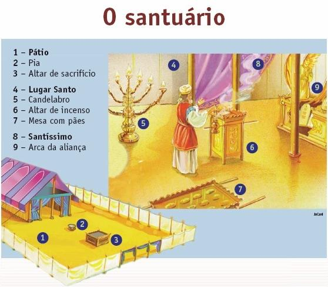

---
puppeteer:
    pdf:
        format: A4
        displayHeaderFooter: true
        margin:
            top: .7cm
            right: .7cm
            bottom: .9cm
            left: .7cm
    imagen:
        quality: 100
        fullPage: true
---
**Lição da Escola Bíblica**{class=titulo_capa}


**Os Pilares da Fé**{class=titulo_capa}

<div class='page'>&nbsp;</div>

[[TOC]]

**Citações bíblicas:** ARA: Almeida Revista e Atualizada, ARC: Almeida Revista e Corrigida
 
**Versão:** 20200918

# Introdução

A igreja é o lugar onde os membros do corpo de Cristo devem ser amados, preservados das falsas doutrinas ou ensinamentos; deve também fortalecê-los na fé e na palavra, crescendo no conhecimento da Bíblia como a verdade e a fonte do conhecimento espiritual.

Ela também precisa suprir a necessidade dos membros para treinamento ao serviço de Cristo: ir em busca das almas por quem Jesus morreu e fazer dessas pessoas discípulos ou alunos da escola de Cristo, ensinando-os a guardar todas as coisas que Jesus ensinou e nos tem ensinado.

A fim de que o propósito de Cristo para a igreja seja cumprido, temos as lições da escola bíblica. O objetivo é preparar os alunos a serem firmes em Cristo, sabendo defender suas crenças pela palavra, a Bíblia, assim como Jesus refutou e venceu o próprio inimigo das almas, Satanás, com um *"está escrito".* A Bíblia é a nossa regra de fé e prática para esta vida e para a preparação da vida eterna na companhia dos anjos que se encontram na santa presença de Deus.

Oramos para que o nosso Pai eterno possa cumprir este propósito em sua vida e que estes estudos se tornem um meio para ajudá-lo neste propósito em Cristo Jesus. Amém.

**Instruções para a lição bíblica:**

Antes de iniciar a sua lição, sugerimos que o irmão ore pedindo a iluminação do Espírito de Deus para habilitá-lo a entender, compreender, as verdades bíblicas a serem estudadas a cada dia. Também sugerimos que as lições sejam feitas logo pela manhã, nas primeiras horas do dia, para que o irmão possa colocar em prática o que aprendeu no dia que se passará, seja no tomar pequenas ou grandes decisões diárias.

A maior parte das passagens bíblicas já se encontram na lição afim de evitar dificuldades com traduções, mas sempre é bom conferir na sua própria Bíblia e estar seguro de que entendeu o assunto em tese. Depois de ler e compreender bem os versículos, você terá três tipos de questões. O primeiro tipo é de alternativa, marcar X, você deverá escolher a única resposta correta na questão e marcá-la conforme solicitado. O segundo tipo de questão são as de verdadeiro e falso, você deverá colocar a frente da pergunta se esta é verdadeira ou se é falsa. Já no terceiro tipo, você deverá relacionar as questões, conforme o enunciado.

Sugerimos, ainda, que os textos bíblicos que forem somente citados deverão ser procurados e estudados em sua Bíblia. Ao final de cada lição terá um apelo no sentido do irmão tomar uma decisão com relação ao estudo realizado em que o irmão deverá preencher sim ou não. Para o caso de dúvidas, esclarecimentos e/ou sugestões, deixamos um espaço no final de cada lição para que o irmão possa preencher se desejar. Oramos para que o Senhor Jesus o abençoe e auxilie nesta caminhada cristã.

Atenciosamente,

Os Editores

Ministério Quarto Anjo- Advertência Final

# (1) O Evangelho em Símbolos

!!!quote Verso Áureo
    **E me farão um santuário, para que eu possa habitar no meio deles.**{class=verso} **Êxodo 25:8**{class=livro}

## Domingo

Deus deseja que Seu povo conheça as verdades especiais ou fundamentais, antes do final da história deste mundo, que os ajudará a conhecer o tempo e os acontecimentos que os cercam e sua relação com os propósitos de Deus.

O conhecimento da verdade e a aplicação destas verdades em nossa vida nos farão testemunhas vivas a pregar e proclamar a última advertência; a ADVERTÊNCIA FINAL aos habitantes da terra a fim de que façam sua decisão ao lado de Deus ou ao lado do inimigo de Deus e das almas por quem Jesus morreu.

Há quase dois mil anos atrás, Cristo andava entre os homens, alguns o aceitaram como o profeta e ou como messias que havia de vir; outros O viram apenas como um novo mestre entre eles; ainda outros como um homem bom. Porém alguns ao saberem de Jesus não se contentaram com o que diziam sobre Ele e nem com Seus ensinamentos públicos, mas quiseram e sentiram necessidade de mais tempo com Ele à sós; reconheceram-nO como Salvador e Senhor e por isso queriam saber onde Ele morava. Ficaram com Ele em Sua casa. **João 1:35-39.**{class=livro}

Depois que Jesus ensinava as multidões; posteriormente em particular, alguns de forma mais íntima perguntavam mais detalhes para terem maior entendimento, estes eram conhecidos como os doze apóstolos e mesmo entre os apóstolos existia um grupo menor que acompanhava Jesus em situações especiais. Por fim, a Bíblia fala do discípulo amado João, que dos doze foi o mais chegado do Mestre. A este João foi dado conhecer de forma especial sobre o Salvador, como podemos ver no evangelho que ele escreveu, como nas suas cartas repletas de amor pelos irmãos. Também a João foi dado o Apocalipse, a revelação das coisas que em breve deveriam acontecer.

Como povo, devemos conhecer as verdades para o tempo do fim, mas como indivíduos podemos manter um relacionamento mais íntimo com Jesus a fim de revelar ao mundo o poder de Deus que se manifesta por Cristo vivendo em nós.

**1) Como será o povo peculiar de Deus na terra pouco antes da volta de Jesus?**{class=questao} **Apocalipse 14:1,4,5**{class=livroQ}  
**Olhei, e eis o Cordeiro em pé sobre o monte Sião, e com ele cento e quarenta e quatro mil, tendo na fronte escrito o seu nome e o nome de seu Pai. São estes os que não se contaminaram com mulheres, porque são castos. São eles os que seguem o Cordeiro por onde quer que vá. São os que foram redimidos dentre os homens, primícias para Deus e para o Cordeiro; e não se achou engano na sua boca; não têm mácula.**{class=versoQ} **Apocalipse 14:1,4,5**{class=livroVerso}

**Marque as afirmações com V quando verdadeiras e F quando falsas.**  
a) ( ) O povo de Deus que viverá nos últimos dias será um povo santo, ou seja, separado da corrupção do mundo.  
b) ( ) Serão testemunhas vivas do poder transformador de Deus.  
c) ( ) Não terão nenhuma doutrina ou ensinamento diferente daqueles da Bíblia.  
d) ( ) Serão extremamente estranhos e diferentes de Jesus.  

## Segunda-Feira

Vimos no livro de Apocalipse que o povo de Deus (neste tempo em que vivemos), em que a Bíblia denomina tempo do fim, não se contaminaram com "mulheres" porque são castos e seguem o Cordeiro por onde quer que vá.

**2) O que representa o símbolo *"mulher"* na profecia?**{class=questao} **Efésios 5:22-25**{class=livroQ}  
**As mulheres sejam submissas ao seu próprio marido, como ao Senhor; porque o marido é o cabeça da mulher, como também Cristo é o cabeça da igreja, sendo este mesmo o salvador do corpo... Maridos, amai vossa mulher, como também Cristo amou a igreja e a si mesmo se entregou por ela.**{class=versoQ} **Efésios 5:22-25**{class=livroVerso}

**Assinale a resposta correta:**  
a) Mulher representa a figura do sexo feminino.  
b) Mulher representa uma deusa.  
c) Mulher representa na Bíblia igreja.  

!!!note ""
	A igreja de Cristo é representada como uma mulher, da qual Cristo é o marido que se entregou para salvá-la. A igreja é composta pelos fiéis seguidores de Jesus Cristo.

**3) Quem é a casa de Cristo, e como esta casa deve ser estabelecida?**{class=questao} **Hebreus 3:6**{class=livroQ}  
**Cristo, porém, como Filho, em sua casa; a qual casa somos nós, se guardarmos firme confiança, até ao fim, a ousadia e a exaltação da esperança.**{class=versoQ} **Hebreus 3:6**{class=livroVerso}

**Assinale a resposta correta:**  
a) A casa de Cristo é a igreja que eu frequento.  
b) Nós somos a casa de Cristo, se o Espírito de Deus habita em nós.  
c) A casa de Cristo está no céu com os anjos.  

!!!note ""
	Devemos considerar a Jesus Cristo, apóstolo e sumo sacerdote da nossa confissão, como, sendo fiel a Deus, que O constituiu sobre Sua casa ou Sua igreja. Porque toda casa é edificada por alguém, mas o que edificou todas as coisas é Deus. Veja **Hebreus 3:4**{class=livro}

## Terça-Feira

**4) A que a Bíblia compara Cristo?**{class=questao} **I Coríntios 1:24,30**{class=livroQ}  
**Mas para os que foram chamados, tanto judeus como gregos, pregamos a Cristo, poder de Deus e Sabedoria de Deus.**{class=versoQ} **I Coríntios 1:24,30**{class=livroVerso}

**Assinale a resposta correta:**  
a) Cristo é chamado de sábio.  
b) Cristo é chamado de sabedoria de Deus.  
c) Cristo é chamado de casa.  

!!!note ""
	Cristo quer que nossa mente seja sua casa, onde Ele deseja morar. Vemos em Apocalipse a figura de Jesus estando à porta de nosso coração solicitando permissão para entrar. **"Eis que estou a porta e bato, se alguém ouvir a minha voz e abrir a porta, entrarei em sua casa e com ele cearei com ele e ele comigo."**{class=verso} **Apocalipse 3:20**{class=livro}

Toda casa possui pilares que a sustentam.

**5) Quantos são os pilares da casa ou igreja de Deus?**{class=questao} **Provérbios 9:1**{class=livroQ}  
**A Sabedoria edificou a sua casa, lavrou as suas sete colunas.**{class=versoQ} **Provérbios 9:1**{class=livroVerso}

**Assinale a resposta correta:**  
a) Seis pilares ou colunas.  
b) Dez pilares ou colunas.  
c) Sete pilares ou colunas.  

A Palavra de Deus nos mostra que a casa de Deus, que somos nós (Sua igreja), possui sete colunas (ou pilares). Nos próximos estudos veremos com mais detalhes cada um dos pilares de nossa fé, que são:


|     | Pilares                                |
| --- | -------------------------------------- |
| I   | O TEMPLO DE DEUS NO CÉU                |
| II  | A PURIFICAÇÃO DO SANTUÁRIO             |
| III | AS TRÊS MENSAGENS ANGÉLICAS            |
| IV  | OS MANDAMENTOS DE DEUS E A FÉ DE JESUS |
| V   | A LEI DE DEUS                          |
| VI  | O SÁBADO                               |
| VII | A MORTALIDADE DA ALMA                  |


## Quarta-Feira

**O Santuário - O Evangelho em símbolos**

Os israelitas eram o povo de Deus ao sair do Egito. Eles estiveram ali como escravos por quatrocentos e trinta anos e tinham perdido muito do conhecimento do Deus que nos criou. Como escravos não tinham como adorar e servir ao Seu Deus e, agora ao saírem pelo poder manifestado pelo grande Deus, eles deveriam aprender ou reaprender muito da adoração, gratidão e louvor ao único Deus verdadeiro. Era propósito de Deus ser revelado a todos os povos através do amor, misericórdia, bondade e conhecimento de Si mesmo manifestado ao povo de Israel. Foi comunicada a Moisés, enquanto se achava no monte com Deus, uma ordem...

**6) O que Deus ordenou ao povo de Israel, por intermédio de Moisés?**{class=questao} **Êxodo 25:8,9,40**{class=livroQ}  
**E me farão um santuário, para que eu possa habitar no meio deles. Segundo tudo o que eu te mostrar para modelo do tabernáculo e para modelo de todos os seus móveis, assim mesmo o fareis. Vê, pois, que tudo faça segundo o modelo que te foi mostrado no monte.**{class=versoQ} **Êxodo 25:8,9,40**{class=livroVerso}

**Assinale a resposta correta:**  
a) Deus ordenou a Moisés que fizesse uma grande festa.  
b) Deus ordenou a Moisés que fizesse um lugar para Sua habitação. Mostrou a Moisés o modelo - o santuário do céu para que fizesse uma cópia dele aqui na terra.  
c) Deus ordenou que o povo fosse à igreja, pois ali e só ali Ele estaria com Seu povo.  

!!!note ""
	Em virtude de sua apostasia, os israelitas ficaram despojados da bênção da presença divina, e por algum tempo impossibilitaram a edificação de um santuário para Deus, entre eles. Mas, depois de novamente haverem sido recebidos no favor do Céu, o grande chefe procedeu à execução da ordem divina. O santuário era uma tenda desmontável composta de diversas coberturas. Continha um pátio e uma tenda propriamente dita com dois compartimentos: o lugar santo e o lugar santíssimo os quais eram separados por um véu. Cada compartimento tinha móveis específicos a fim de ensinar sobre a obra da redenção e salvação de Cristo por nós.

**7) Aonde está o modelo, mostrado a Moisés no monte para que ele fizesse igual?**{class=questao} **Hebreus 9:24**{class=livroQ}  
**Porque Cristo não entrou num santuário feito por mãos, figura do verdadeiro, porém no mesmo céu, para agora comparecer por nós, perante a face de Deus.**{class=versoQ} **Hebreus 9:24**{class=livroVerso}

**Assinale a resposta correta:**  
a) O verdadeiro santuário foi feito por mãos humanas e se encontra em Jerusalém.  
b) A cópia do santuário não foi feita por mãos humanas e se encontra no Egito.  
c) O verdadeiro santuário está no céu e não foi feito por mãos humanas.  

## Quinta-Feira

**8) O que era oferecido no santuário?**{class=questao} **Hebreus 9:9**{class=livroQ}  
**É isto uma parábola para a época presente; e, segundo esta, se oferecem tanto dons como sacrifícios, embora estes, no tocante à consciência, sejam ineficazes para aperfeiçoar aquele que presta culto.**{class=versoQ} **Hebreus 9:9**{class=livroVerso}

**Assinale a resposta correta:**  
a) Era oferecido dinheiro e bens.  
b) Dons e sacrifícios que na verdade não aperfeiçoavam os adoradores.  
c) Não se oferecia nada.  



**9) O que havia no pátio, ou também chamado átrio, do santuário?**{class=questao} **Êxodo 40:29-33**{class=livroQ}  
**E pôs o altar do holocausto à porta do tabernáculo da tenda da congregação, e sobre ele ofereceu holocausto e oferta de alimentos, como o SENHOR ordenara a Moisés. Pôs também a pia entre a tenda da congregação e o altar, e nela pôs água para lavar. E Moisés, e Arão e seus filhos nela lavaram as suas mãos e os seus pés. Quando entravam na tenda da congregação, e quando chegavam ao altar, lavavam-se, como o SENHOR ordenara a Moisés. Levantou também o pátio ao redor do tabernáculo e do altar, e pendurou a cortina da porta do pátio. Assim Moisés acabou a obra.**{class=versoQ} **Êxodo 40:29-33**{class=livroVerso}

**Assinale a resposta correta:**  
a) Flores, animais e uma fonte.  
b) Altar de sacrifício, lavatório ou pia.  
c) Muitos bancos para o povo se assentar.  

!!!note ""
	O altar do holocausto ou sacrifício, que ficava bem próximo a entrado do pátio, representava ou apontava para o grande sacrifício da cruz do calvário onde Jesus, o verdadeiro Cordeiro de Deus morreu em nosso lugar. Ali o pecador arrependido comparecia levando um animal como seu substituto, ou para ocupar o lugar do pecador; orientado pelos sacerdotes do plano da salvação, o pecador colocava sua mão sobre a cabeça da vítima e o matava. Nossos pecados mataram o Filho de Deus. Depois o sacerdote tomava o sangue da vítima e colocava sobre o altar e aspergia no véu. O pecado ficava registrado no santuário e o pecador saia perdoado. A pia ou bacia era onde o sacerdote deveria lavar as mãos e os pés sempre que entrasse nos compartimentos sagrados ou se aproximasse do altar para oferecer uma oferta queimada ao Senhor. Após o sacrifício do animal em seu lugar o pecador era substituído pelo sacerdote que oficiava em seu favor no santuário. Onde o pecador não podia entrar. Ele era lavado e limpo pela água na pia, assim como Cristo nos limpa e purifica pela Palavra aplicada a nossa experiência de vida.

**10) Além do pátio, quantas partes haviam neste santuário?**{class=questao} **Hebreus 9:2,3**{class=livroQ}  
**Com efeito, foi preparado o tabernáculo, cuja parte anterior, onde estavam o candeeiro, e a mesa, e a exposição dos pães, se chama o Santo Lugar; por trás do segundo véu, se encontrava o tabernáculo que se chama o Santo dos Santos**{class=versoQ} **Hebreus 9:2,3**{class=livroVerso}

**Assinale a resposta correta:**  
a) Além do pátio havia mais duas partes: Lugar Santo e o Lugar Santíssimo.  
b) Não havia outras partes.  
c) Além do pátio havia mais uma parte a igreja.  


**11) O que havia no lugar santo?**{class=questao} **Êxodo 40:22-26**{class=livroQ}  
**pôs também a mesa na tenda da congregação, ao lado do tabernáculo, para o norte, fora do véu, E sobre ela pôs em ordem o pão perante o SENHOR, como o SENHOR ordenara a Moisés. Pôs também na tenda da congregação o candelabro na frente da mesa, ao lado do tabernáculo, para o sul, e acendeu as lâmpadas perante o SENHOR, como o SENHOR ordenara a Moisés. E pôs o altar de ouro na tenda da congregação, diante do véu.**{class=versoQ} **Êxodo 40:22-26**{class=livroVerso}  
**Porque um tabernáculo estava preparado, o primeiro, em que havia o candelabro, e a mesa, e os pães da proposição; ao que se chama o santuário.**{class=versoQ} **Hebreus 9:2**{class=livroVerso}

**Assinale a resposta correta:**  
a) Muitas imagens e velas acessas.  
b) Um lindo altar de ouro.  
c) Mesa de pães, castiçal, e diante do véu o altar de ouro.  


Os três móveis que estavam no Lugar Santo, como vimos eram:

a) O **Candeeiro ou Castiçal** que servia para iluminação do santuário, assim como Cristo é a Luz do mundo; os cristãos são chamados para serem luz, serem como Jesus neste mundo atraindo as pessoas para Cristo.  
b) **Mesa dos pães da proposição** que apontam para Jesus, o verdadeiro Pão do céu que nos alimenta e nos dá vida eterna; nos livrando do pecado.  
c) **Altar de incenso** que aponta para Cristo Jesus, o único mediador entre Deus e o pecador. Este móvel estava mais próximo da **Arca da aliança** e isto para nos lembrar que através da oração nos aproximamos mais de Deus. Precisamente, diante do véu que separava o lugar santo do santíssimo e da presença imediata de Deus, achava-se o áureo altar de incenso. Sobre este altar o sacerdote devia queimar incenso todas as manhãs e toda as tardes; suas pontas eram tocadas com o sangue da oferta para o pecado, e era aspergido com sangue no grande dia de expiação. O fogo neste altar fora aceso pelo próprio Deus, e conservado de maneira sagrada. A fragrância do incenso santo era difundida pelos compartimentos do santuário e ainda ao seu exterior ao longe se podia sentir sua suave fragrância.

## Sexta-Feira

Era no santo dos santos ou no santíssimo lugar, além do véu interior que se centralizava o serviço simbólico da expiação e da intercessão, e que formava o elo entre o céu e a terra.

**12) O que havia no lugar santíssimo do santuário?**{class=questao} **Hebreus 9:3-5 e Êxodo 26:33**{class=livroQ}  
**Mas depois do segundo véu estava o tabernáculo que se chama o santo dos santos.**{class=versoQ} **Hebreus 9:3**{class=livroVerso}  
**Pendurarás o véu debaixo dos colchetes, e porás a arca do testemunho ali dentro do véu; e este véu vos fará separação entre o santuário e o lugar santíssimo.**{class=versoQ} **Êxodo 26:33**{class=livroVerso}

**Assinale a resposta correta:**  
a) Arca de Testemunho, coberta com o propiciatório e dentro da arca estava as tábuas da Lei de Deus.  
b) Uma grande estátua de santo para ser adorado.  
c) A arca que Noé usou no dilúvio.  

**13) O que havia dentro da arca da aliança, sob o propiciatório?**{class=questao} **Deuteronômio 10:4,5**{class=livroQ}  
**Então escreveu nas tábuas, conforme à primeira escritura, os dez mandamentos, que o SENHOR vos falara no dia da assembleia, no monte, do meio do fogo; e o SENHOR as deu a mim; E virei-me, e desci do monte, e pus as tábuas na arca que fizera; e ali estão, como o SENHOR me ordenou.**{class=versoQ} **Deuteronômio.10:4,5**{class=livroVerso}

**Assinale a resposta correta:**  
a) Muito ouro e prata.  
b) As tábuas contendo os dez mandamentos.  
c) Não havia nada.  

!!!note ""
	No lugar Santíssimo estava a arca da aliança e dentro dela estava:  
		1. Uma porção do _maná,_ alimento dado para os Israelitas enquanto estiveram no deserto por quarenta anos (símbolo do alimento divinamente escolhido para nós. **I  Coríntios 10:31**{class=livro}  
		2. A _vara de Arão_ que floresceu (uma lembrança da murmuração do povo contra Deus). **Números 17:5**{class=livro}  
		3. O _testemunho,_ os _dez mandamentos;_ a santa lei; a regra do governo de Deus. **Deuteronômio.9:9,10**{class=livro}


**14) Como se chamava a cobertura da arca da aliança?**{class=questao} **Êxodo 25:21**{class=livroQ}  
**E porás o propiciatório em cima da arca, depois que houveres posto na arca o testemunho que eu te darei.**{class=versoQ} **Êxodo.25:21**{class=livroVerso}

**Assinale a resposta correta:**  
a) Tampa da arca.  
b) A cobertura era chamada de Propiciatório.  
c) A arca não tinha cobertura.  

!!!note ""
	Sobre a cobertura ou Propiciatório estava a figura de dois anjos, querubins **(Hebreus 9:5).**{class=livro} Ele era todo feito de ouro puro e de uma única peça com os querubins.

**15) Quem entrava no Lugar Santo e quando?**{class=questao} **Hebreus 9:6**{class=livroQ}  
**Ora, estando estas coisas assim preparadas, a todo o tempo entravam os sacerdotes no primeiro tabernáculo, cumprindo os serviços.**{class=versoQ} **Hebreus 9:6**{class=livroVerso}

**Assinale a resposta correta:**  
a) O pecador arrependido, sempre que pecava.  
b) Os sacerdotes, a todo tempo para realização dos serviços sagrados.  
c) Todos os adoradores, quando iam a casa do Senhor.  

!!!note ""
	Era permitido somente aos sacerdotes entrarem no compartimento *"santo"* do santuário, quando da realização dos serviços sagrados.

**16) Quem podia entrar no lugar Santíssimo e quando?**{class=questao} **Hebreus 9:7**{class=livroQ}  
**Mas, no segundo, só o sumo sacerdote, uma vez no ano, não sem sangue, que oferecia por si mesmo e pelas culpas do povo;**{class=versoQ} **Hebreus 9:7**{class=livroVerso}

**Assinale a resposta correta:**  
a) O sumo Sacerdote, uma vez por ano.  
b) O pecador arrependido quando pecava.  
c) Ninguém entrava neste lugar santíssimo.  

!!!note ""
	No Lugar Santíssimo, somente o Sumo Sacerdote poderia entrar, e isto ocorria apenas uma vez por ano no dia da expiação **(Levítico 16:23; 23:27-32).**{class=livro} Se em outro dia qualquer alguém ousasse entrar neste compartimento, era morto pela glória de Jeová. **Levítico 16:2**{class=livro}

**17) Quais os serviços ou cerimônias que eram realizadas ali no santuário?**{class=questao} **Levítico 4:2,27-30; Números 28:3,4; Levítico 16:29,30,34; Números 28:3-4**{class=livroQ}  
**Fala aos filhos de Israel, dizendo: Quando uma alma pecar, por ignorância, contra alguns dos mandamentos do SENHOR, acerca do que não se deve fazer, e proceder contra algum deles;**{class=versoQ} **Levítico 4:2**{class=livroVerso}  
**E, se qualquer pessoa do povo da terra pecar por ignorância, fazendo contra algum dos mandamentos do SENHOR, aquilo que não se deve fazer, e assim for culpada; Ou se o pecado que cometeu lhe for notificado, então trará pela sua oferta uma cabra sem defeito, pelo seu pecado que cometeu, E porá a sua mão sobre a cabeça da oferta da expiação do pecado, e a degolará no lugar do holocausto. Depois o sacerdote com o seu dedo tomará do seu sangue, e o porá sobre as pontas do altar do holocausto; e todo o restante do seu sangue derramará à base do altar;**{class=versoQ} **Levítico 4:27-30**{class=livroVerso}  
**E isto vos será por estatuto perpétuo: no sétimo mês, aos dez do mês, afligireis as vossas almas, e nenhum trabalho fareis nem o natural nem o estrangeiro que peregrina entre vós. Porque naquele dia se fará expiação por vós, para purificar-vos; e sereis purificados de todos os vossos pecados perante o SENHOR.**{class=versoQ} **Levítico 16:29,30**{class=livroVerso}  
**E isto vos será por estatuto perpétuo, para fazer expiação pelos filhos de Israel de todos os seus pecados, uma vez no ano. E fez Arão como o SENHOR ordenara a Moisés.**{class=versoQ} **Levítico 16:34**{class=livroVerso}  
**E dir-lhes-ás: Esta é a oferta queimada que oferecereis ao SENHOR: dois cordeiros de um ano, sem defeito, cada dia, em contínuo holocausto; Um cordeiro sacrificarás pela manhã, e o outro cordeiro sacrificarás à tarde;**{class=versoQ} **Números 28:3-4**{class=livroVerso}

**Marque as afirmações com V quando verdadeiras e F quando falsas.**  
a) ( ) O serviço diário feito pelo sacerdote ao oferecer o sangue para perdão dos pecados do pecador arrependido depois deste apresentar e matar a vítima em seu lugar.  
b) ( ) O serviço anual da expiação ou purificação do santuário feito pelo sumo sacerdote.  
c) ( ) Sacrifício diário de dois cordeiros, um pela manhã e outro à tarde.  
d) ( ) Às vezes celebravam casamentos ali.  

**18) O perdão dos pecados exigia um sacrifício pelo pecado?**{class=questao}

**Assinale a resposta correta:**  ( ) Sim ( ) Não

!!!note ""
	O pecado era simbolicamente transferido do pecador para o santuário, via sacerdote, simbolizando absolvição. O pecador saía perdoado, enquanto seu pecado ficava registrado até o dia da purificação anual do santuário.

**19) No dia da expiação o santuário era purificado ou limpo de quê?**{class=questao} **Levítico 16:16, 29,30,34.**{class=livroQ}  
**Assim fará expiação pelo santuário por causa das imundícias dos filhos de Israel e das suas transgressões, e de todos os seus pecados; e assim fará para a tenda da congregação que reside com eles no meio das suas imundícias. <br/> E isto vos será por estatuto perpétuo: no sétimo mês, aos dez do mês, afligireis as vossas almas, e nenhum trabalho fareis nem o natural nem o estrangeiro que peregrina entre vós. Porque naquele dia se fará expiação por vós, para purificar-vos; e sereis purificados de todos os vossos pecados perante o SENHOR.<br/> E isto vos será por estatuto perpétuo, para fazer expiação pelos filhos de Israel de todos os seus pecados, uma vez no ano. E fez Arão como o SENHOR ordenara a Moisés.**{class=versoQ} **Levítico 16:16, 29,30,34**{class=livroVerso}

**Assinale a resposta correta:**  
a) De todos os pecados cometidos pelos filhos de Israel.  
b) Dos pecados transferidos para o santuário, durante o ano.  
c) De todos os pecados que o povo tinha cometido e dos que ainda iriam cometer, pois eram pecadores.  
<div class='page'>&nbsp;</div>

## Sábado

**Para estudar e meditar em família:**

O santuário referido pelo apóstolo Paulo em Hebreus era aquele construído por Moisés, por ordem de Deus, enquanto os israelitas jornadeavam pelo deserto. Foi construído de maneira que pudesse ser levado de um lugar para outro. Além do pátio exterior, onde estava o altar das ofertas queimadas; o tabernáculo continha dois compartimentos chamados santo e santíssimo; separados por uma rica e bela cortina ou véu idêntico ao que cerrava a entrada ao primeiro compartimento.

No lugar santo estava de um lado a mesa com os pães da presença e, do lado sul o castiçal com sete lâmpadas a iluminar o santuário dia e noite; e, diante do véu que separava o lugar santo do lugar santíssimo ficava o altar de ouro para o incenso, do qual a fragrante nuvem, com as orações de Israel, ascendiam diariamente à presença de Deus. No lugar santíssimo estava a arca coberta de ouro e depositária das tábuas de pedra sobre as quais Deus inscrevera a lei dos Dez Mandamentos.

Acima da arca formando a cobertura desse receptáculo sagrado, estava o propiciatório, encimado por dois querubins, um de cada lado, tudo trabalhado de ouro maciço. Neste lugar a presença divina se manifestava na nuvem de glória entre os querubins. Quando os hebreus se estabeleceram em Canaã, o tabernáculo foi substituído pelo templo de Salomão, uma estrutura permanente que guardava as mesmas proporções e era guarnecido de modo semelhante. Sob esta forma o santuário existiu até a sua destruição pelos romanos, no ano 70 de nossa era, exceção feita no tempo em que esteve em ruínas durante a época de Daniel.

**20) Este santuário terreno continua vigente atualmente, mesmo após a morte de Jesus Cristo?**{class=questao} **Mateus 27:50,51**{class=livroQ}  
**E Jesus, clamando outra vez com grande voz, rendeu o espírito. E eis que o véu do templo se rasgou em dois, de alto a baixo; e tremeu a terra, e fenderam-se as pedras;**{class=versoQ} **Mateus 27:50,51**{class=livroVerso}

**Assinale a resposta correta:**  
a) Sim em cada igreja que existe.  
b) Não, sua validade foi até a morte do verdadeiro Cordeiro de Deus que tira o pecado do mundo, Jesus.  
c) Sim ele está em Jerusalém até hoje e se quero ser perdoado de meus pecados tenho que ir até lá.  

!!!check Minha Decisão
	Aceito hoje, o Senhor Jesus como meu único mediador e salvador. Oro para ser limpo, perdoado de meus pecados e viva uma vida plena em Cristo Jesus.

	( ) Sim ( ) Não

**Anotações:**

# (2) O Santuário Celestial - O Templo de Deus no Céu

!!!quote Verso Áureo
	**Porque Cristo não entrou em santuário feito por mãos, figura do verdadeiro, porém no mesmo céu, para comparecer, agora, por nós, diante de Deus;**{class=verso} **Hebreus 9:24**{class=livro}

## Domingo

A Bíblia relata a existência de um outro santuário, que na verdade já existia, no céu, o qual o próprio Deus mostrou para Moisés, quando ordenou que construísse um santuário conforme o modelo que lhe foi mostrado. **"Ora a suma do que havemos dito é que temos um sacerdote tal, que está assentado nos Céus à destra do trono da Majestade, ministro do santuário, e do verdadeiro tabernáculo, o qual o Senhor fundou, e não o homem."**{class=verso} **Hebreus 8:1,2**{class=livro}

Este é revelado como o santuário do novo concerto. O santuário do primeiro concerto foi erigido pelo homem, construído por Moisés. O último foi construído pelo Senhor e não pelo homem. Quando o apóstolo João recebeu a visão do Apocalipse, ele contemplou o santuário celestial, conforme podemos observar pelos compartimentos e móveis que são relatados...

**1) O que João viu no Céu?**{class=questao} **Apocalipse 11:19; 15:8**{class=livroQ}  
**Abriu-se, então, o santuário de Deus, que se acha no céu, e foi vista a arca da Aliança no seu santuário, e sobrevieram relâmpagos, vozes, trovões, terremoto e grande saraivada.**{class=versoQ} **Apocalipse 11:19**{class=livroVerso}  
**O santuário se encheu de fumaça procedente da glória de Deus e do seu poder, e ninguém podia penetrar no santuário, enquanto não se cumprissem os sete flagelos dos sete anjos.**{class=versoQ} **Apocalipse 15:8**{class=livroVerso}

**Assinale a resposta correta:**  
a) João viu anjos.  
b) João viu um santuário.  
c) João viu o céu.  

**2) A obra que os sacerdotes realizavam no santuário terrestre era um exemplo de que?**{class=questao} **Hebreus 8:5**{class=livroQ}  
**Os quais ministram em figura e sombra das coisas celestes, assim como foi Moisés divinamente instruído, quando estava para construir o tabernáculo; pois diz ele: Vê que faças todas as coisas de acordo com o modelo que te foi mostrado no monte.**{class=versoQ} **Hebreus 8:5**{class=livroVerso}

**Assinale a resposta correta:**  
a) A ministração feita pelos sacerdotes no santuário da terra era uma *"figura"* (exemplo) da ministração de Cristo no verdadeiro santuário do céu.  
b) A ministração feita pelos sacerdotes no santuário da terra era uma imitação dos cultos pagãos de outros povos.  
c) A ministração feita pelos sacerdotes no santuário da terra não representava nada.  

**3) Quem é o Sumo Sacerdote, ministro deste verdadeiro tabernáculo?**{class=questao} **Hebreus 8:1,2; 4:14**{class=livroQ}  
**Ora, o essencial das coisas que temos dito é que possuímos tal sumo sacerdote, que se assentou à destra do trono da Majestade nos céus, como ministro do santuário e do verdadeiro tabernáculo que o Senhor erigiu, não o homem.**{class=versoQ} **Hebreus 8:1,2**{class=livroVerso}  
**Tendo, pois, a Jesus, o Filho de Deus, como grande sumo sacerdote que penetrou os céus, conservemos firmes a nossa confissão.**{class=versoQ} **Hebreus 4:14**{class=livroVerso}

**Assinale a resposta correta:**  
a) Arão é o Sumo Sacerdote do verdadeiro tabernáculo.  
b) Jesus é o Sumo Sacerdote do verdadeiro tabernáculo.  
c) Moisés é o Sumo Sacerdote do verdadeiro tabernáculo.  

!!!note ""
	Enquanto no santuário terrestre os sacerdotes terrenos realizavam seus serviços; no santuário celeste, Cristo, nosso grande Sumo Sacerdote, ministra à destra de Deus.
<div class='page'>&nbsp;</div>

## Segunda-Feira

No santuário construído por Moisés, todos os dias animais eram mortos como oferta pelo pecado no lugar do pecador para simbolizar o perdão dos pecados. Assim também Jesus ofereceu-Se como sacrifício para pagar a nossa culpa. O salário do pecado é a morte **(Romanos 6:23),**{class=livro} e Jesus morreu em nosso lugar para nos dar o perdão.

**4) Quem é a vítima ou cordeiro no santuário do Céu?**{class=questao} **Hebreus 7:27**{class=livroQ}  
**Que não tem necessidade, como os sumos sacerdotes, de oferecer todos os dias sacrifícios, primeiro, por seus próprios pecados, depois, pelos do povo; porque fez isto uma vez por todas, quando a Si mesmo se ofereceu.**{class=versoQ} **Hebreus 7:27**{class=livroVerso}

**Assinale a resposta correta:**  
a) Jesus ofereceu-se como sacrifício para pagar a nossa culpa. Ele morreu por nós uma só vez para nos dar o perdão.  
b) Os sacerdotes da terra eram as vítimas dos sacrifícios.  
c) Um cordeiro é morto no céu todos os dias como sacrifício.  

**5) Havia alguma relação do santuário da terra, do antigo testamento, e seus serviços com o santuário do Céu?**{class=questao} **Êxodo 25:8,9,40**{class=livroQ}  
**E me farão um santuário, para que eu possa habitar no meio deles. Segundo tudo o que eu te mostrar para modelo do tabernáculo e para modelo de todos os seus móveis, assim mesmo o fareis. Êxodo 25:8,9 Vê, pois, que tudo faças segundo o modelo que te foi mostrado no monte.**{class=versoQ} **Êxodo 25:40**{class=livroVerso}

**Assinale a resposta correta:**  
a) Não havia relação nenhuma.  
b) Assim como nos cultos pagãos, o santuário da terra foi feito para acalmar a ira de Deus.  
c) O santuário da terra foi feito baseado no modelo celeste, no verdadeiro tabernáculo feito por Deus.  

**6) A quem representavam todos os sacrifícios do Antigo Testamento?**{class=questao} **João 1:29**{class=livroQ}  
**No dia seguinte, viu João a Jesus, que vinha para ele, e disse: Eis o Cordeiro de Deus, que tira o pecado do mundo!**{class=versoQ} **João 1:29**{class=livroVerso}

**Assinale a resposta correta:**  
a) Representavam a virgem Maria.  
b) Representavam a Jesus.  
c) Representavam a Deus.  

Jesus é o verdadeiro cordeiro que foi sacrificado por nossos pecados.

## Terça-Feira

A Bíblia nos relata que Cristo não entrou num santuário feito por mãos, figura do verdadeiro, porém no mesmo Céu para agora comparecer por nós perante a face de Deus.

**7) Onde entrou Jesus após sua morte?**{class=questao} **Hebreus 8:1,2**{class=livroQ}  
**Ora, o essencial das coisas que temos dito é que possuímos tal sumo sacerdote, que se assentou à destra do trono da Majestade nos céus, como ministro do santuário e do verdadeiro tabernáculo que o Senhor erigiu, não o homem.**{class=versoQ} **Hebreus 8:1,2**{class=livroVerso}

**Assinale a resposta correta:**  
a) Jesus entrou no túmulo de José de Arimatéia.  
b) Jesus não entrou em lugar nenhum.  
c) Jesus entrou no santuário celestial.  

**8) Em qual compartimento Jesus estava ministrando quando João teve as visões do Apocalipse?**{class=questao} **Apocalipse 1:12,13**{class=livroQ}  
**Voltei-me para ver quem falava comigo e, voltado, vi sete candeeiros de ouro e, no meio dos candeeiros, um semelhante a filho de homem, com vestes talares e cingido, à altura do peito, com uma cinta de ouro.**{class=versoQ} **Apocalipse 1:12,13**{class=livroVerso}

**Assinale a resposta correta:**  
a) No compartimento Santo.  
b) No átrio ou pátio.  
c) No compartimento Santíssimo.  

!!!note ""
	Quando João foi levado em visão ao céu, ele viu que Jesus se achava entre os candeeiros de ouro. Como vimos no estudo anterior, o candeeiro era um móvel do compartimento *"Santo"* do santuário, portanto, quando João teve a visão (no século I), Jesus estava ministrando em favor dos pecadores no compartimento *"Santo"* do santuário celestial.

**9) Para que entrou Jesus no santuário celestial?**{class=questao} **Hebreus 9:24; 7:25**{class=livroQ}
**Porque Cristo não entrou em santuário feito por mãos, figura do verdadeiro, porém no mesmo céu, para comparecer, agora, por nós, diante de Deus; Hebreus 9:24 Por isso, também pode salvar totalmente os que por ele se chegam a Deus, vivendo sempre para interceder por eles.**{class=versoQ} **Hebreus 7:25**{class=livroVerso}

**Assinale a resposta correta:**  
a) Jesus entrou no santuário celestial para interceder por nós diante de Deus, o Pai.  
b) Jesus entrou no santuário celestial para descansar um poucos
c) Jesus não está no santuário celestial, está no céu.  

**Assinale a resposta correta:**  
a) Não havia relação nenhuma.  
b) Assim como nos cultos pagãos, o santuário da terra foi feito para acalmar a ira de Deus.  
c) O santuário da terra foi feito baseado no modelo celeste, no verdadeiro tabernáculo feito por Deus.  

**10) A quem representavam todos os sacrifícios do Antigo Testamento?**{class=questao} **João 1:29**{class=livroQ}  
**No dia seguinte, viu João a Jesus, que vinha para ele, e disse: Eis o Cordeiro de Deus, que tira o pecado do mundo!**{class=versoQ} **João 1:29**{class=livroVerso}  

**Assinale a resposta correta:**  
a) Representavam a virgem Maria.  
b) Representavam a Jesus.  
c) Representavam a Deus.  

!!!note ""
	 Jesus é o verdadeiro cordeiro que foi sacrificado por nossos pecados.

## Terça-Feira

A Bíblia nos relata que Cristo não entrou num santuário feito por mãos, figura do verdadeiro, porém no mesmo Céu para agora comparecer por nós perante a face de Deus.

**11) Onde entrou Jesus após sua morte?**{class=questao} **Hebreus 8:1,2**{class=livroQ}  
**Ora, o essencial das coisas que temos dito é que possuímos tal sumo sacerdote, que se assentou à destra do trono da Majestade nos céus, como ministro do santuário e do verdadeiro tabernáculo que o Senhor erigiu, não o homem.**{class=versoQ} **Hebreus 8:1,2**{class=livroVerso}  

**Assinale a resposta correta:**  
a) Jesus entrou no túmulo de José de Arimatéia.  
b) Jesus não entrou em lugar nenhum.  
c) Jesus entrou no santuário celestial.  

**12) Em qual compartimento Jesus estava ministrando quando João teve as visões do Apocalipse?**{class=questao} **Apocalipse 1:12,13**{class=livroQ}  
**Voltei-me para ver quem falava comigo e, voltado, vi sete candeeiros de ouro e, no meio dos candeeiros, um semelhante a filho de homem, com vestes talares e cingido, à altura do peito, com uma cinta de ouro.**{class=versoQ} **Apocalipse 1:12,13**{class=livroVerso}  

**Assinale a resposta correta:**  
a) No compartimento Santo.  
b) No átrio ou pátio.  
c) No compartimento Santíssimo.  

!!!note ""
	 Quando João foi levado em visão ao céu, ele viu que Jesus se achava entre os candeeiros de ouro. Como vimos no estudo anterior, o candeeiro era um móvel do compartimento *"Santo"* do santuário, portanto, quando João teve a visão (no século I), Jesus estava ministrando em favor dos pecadores no compartimento *"Santo"* do santuário celestial.

**13) Para que entrou Jesus no santuário celestial?**{class=questao} **Hebreus 9:24; 7:25**{class=livroQ}  
**Porque Cristo não entrou em santuário feito por mãos, figura do verdadeiro, porém no mesmo céu, para comparecer, agora, por nós, diante de Deus;**{class=versoQ} **Hebreus 9:24**{class=livroVerso}  
**Por isso, também pode salvar totalmente os que por ele se chegam a Deus, vivendo sempre para interceder por eles.**{class=versoQ} **Hebreus 7:25**{class=livroVerso}  

**Assinale a resposta correta:**  
a) Jesus entrou no santuário celestial para interceder por nós diante de Deus, o Pai.  
b) Jesus entrou no santuário celestial para descansar um poucos  
c) Jesus não está no santuário celestial, está no céu.  

## Quarta-Feira

Precisamente diante do véu que separava o lugar santo do santíssimo e da presença imediata de Deus, achava-se o áureo altar de incenso. Sobre este altar o sacerdote devia queimar incenso todas as manhãs e tardes, suas pontas eram tocadas com o sangue da oferta para o pecado, e era aspergido com sangue no grande dia da expiação. Assim também Cristo como nosso sacerdote apresenta seu próprio e suficiente sacrifício em nosso favor, formando um elo entre a terra e o Céu. Vivendo sempre para interceder por nós.

**14) O que Jesus faz, quando confessamos nossos pecados?**{class=questao} **I João 1:9**{class=livroQ}  
**Se confessarmos os nossos pecados, ele é fiel e justo para nos perdoar os pecados e nos purificar de toda injustiça.**{class=versoQ} **I João 1:9**{class=livroVerso}  

**Assinale a resposta correta:**  
a) Jesus nos julga e analisa o nosso pecado para ver se pode perdoar.  
b) Jesus nos perdoa de nossos pecados e nos purifica de todo o pecado.  
c) Jesus escreve o nosso pecado em nossos livros e os mostra para Deus, o Pai.  

**15) Que mais faz Jesus em nós?**{class=questao} **Romanos 6:22**{class=livroQ}  
**Agora, porém, libertados do pecado, transformados em servos de Deus, tendes o vosso fruto para a santificação e, por fim, a vida eterna;**{class=versoQ} **Romanos 6:22**{class=livroVerso}  

**Marque as afirmações com V quando verdadeiras e F quando falsas.**

a) ( ) Quando aceitamos a Cristo como nosso Salvador e Intercessor, Ele passa a viver em nós e nos leva a uma experiência de santificação (separação das práticas do mundo).  
b) ( ) Jesus nos liberta dos nossos pecados.  
c) ( ) Jesus nos dá a vida eterna.  
d) ( ) Jesus não faz nada por nós, afinal de contas fomos nós que pecamos e não Ele.  

**16) Que convite nos é feito?**{class=questao} **Hebreus 4:16**{class=livroQ}  
**Acheguemo-nos, portanto, confiadamente, junto ao trono da graça, a fim de recebermos misericórdia e acharmos graça para socorro em ocasião oportuna.**{class=versoQ} **Hebreus 4:16**{class=livroVerso}  

**Assinale a resposta correta:**  
a) Somos convidados para uma festa no céu.  
b) Não somos convidados para nada.  
c) Jesus nos convida a, mediante os Seus méritos, que nos acheguemos com confiança diante do trono de Deus sabendo que, por Seu Filho, Ele nos aceita.  

## Quinta-Feira

O incomparável esplendor do tabernáculo terrestre refletia à vista humana as glórias do templo celestial em que Cristo, nosso Precursor, ministra por nós perante Deus. A morada do Rei dos reis, em que milhares de milhares O servem, e milhões de milhões estão em pé diante dEle, sim, aquele templo, repleto de glória do trono eterno, onde serafins, seus resplandecentes guardas, velam a face em adoração - não poderia encontrar na estrutura mais maravilhosa que mãos humanas pudessem erigir, senão pálido reflexo de sua grandeza e glória. Contudo, importantes verdades relativas ao santuário celestial e à grande obra ali levada a efeito pela redenção do homem, eram ensinadas pelo santuário terrestre e seu culto.

**17) Leia com atenção e observe o lugar do santuário celeste, onde se referem as passagens bíblicas seguintes:**{class=questao}  
**E do trono saíam relâmpagos, e trovões, e vozes; e diante do trono ardiam sete lâmpadas de fogo, as quais são os sete espíritos de Deus.**{class=versoQ} **Apocalipse 4:5**{class=livroVerso}  
**E veio outro anjo, e pôs-se junto ao altar, tendo um incensário de ouro; e foi-lhe dado muito incenso, para o pôr com as orações de todos os santos sobre o altar de ouro, que está diante do trono.**{class=versoQ} **Apocalipse 8:3**{class=livroVerso}  

**Assinale a resposta correta:**  
a) Se referem ao pátio do santuário terrestre.  
b) Se referem ao lugar santo.  
c) Se referem ao lugar Santo dos Santos  

!!!note ""
	 Foi permitido ao profeta contemplar o primeiro compartimento de santuário celestial; e viu ali as *"sete lâmpadas de fogo",* e o *"altar de ouro",* representados pelo castiçal de ouro e altar de incenso, do santuário terrestre.

**18) Leia com atenção a passagem bíblica e responda qual o compartimento do santuário que ela se refere?**{class=questao} **Apocalipse 11:19**{class=livroQ}  
**Abriu-se, então, o santuário de Deus, que se acha no céu, e foi vista a arca da Aliança no seu santuário, e sobrevieram relâmpagos, vozes, trovões, terremoto e grande saraivada.**{class=versoQ} **Apocalipse 11:19**{class=livroVerso}  

**Assinale a resposta correta:**  
a) Se refere ao lugar santo.  
b) Se refere ao lugar santíssimo.  
c) Se refere ao pátio do santuário terrestre.  

!!!note ""
	 No templo celestial, morada de Deus, acha-se o Seu trono, estabelecido em justiça e juízo. No lugar santíssimo está a Sua lei, a grande regra da justiça, pela qual a humanidade toda é provada. A arca que encerra a tábuas da lei se encontra coberta pelo propiciatório, diante do qual Cristo, pelo Seu sangue, pleiteia em prol do pecador. Assim se representa a união da justiça com a misericórdia no plano da redenção humana. Somente a sabedoria infinita poderia conceber esta união, e o poder infinito realizá-la; é uma união que enche o Céu todo de admiração e adoração.

## Sexta-Feira

Os querubins do santuário terrestre, olhando reverentemente para o propiciatório, representam o interesse com que a hoste celestial contempla a obra da redenção. Este é o mistério da misericórdia a que os anjos desejam atentar: que Deus pode ser justo, ao mesmo tempo em que justifica o pecador arrependido e renova Suas relações com a raça decaída; que Cristo pode humilhar-Se para erguer inumeráveis multidões do abismo da ruína e vesti-las com vestes imaculadas de Sua própria justiça, a fim de se unirem aos anjos que jamais caíram e habitarem para sempre na presença de Deus.

**19) Observe como o profeta Zacarias apresenta a obra de Cristo como intercessor do homem nesta profecia.**{class=questao} 
**... Eis aqui o homem cujo nome é Renovo; ele brotará do seu lugar e edificará o templo do Senhor. Ele mesmo edificará o templo do Senhor, e levará a glória, e assentar-se-á, e dominará no seu trono, e será sacerdote no seu trono, e o conselho de paz haverá entre ambos.**{class=verso} **Zacarias 6:12,13**{class=livro}  

**Marque as afirmativas com V quando verdadeiras e F quando falsas.**  
a) ( ) Ele mesmo edificará o templo do Senhor.  
b) ( ) Pelo Seu sacrifício e mediação, Cristo é o fundamento e o edificador da igreja de Deus.  
c) ( ) A Cristo pertence a glória da redenção da raça caída.  
d) ( ) Cristo é tanto Rei como Sacerdote.  
e) ( ) Cristo vai construir o templo que foi destruído em Jerusalém.  

!!!note ""
	E assentar-Se-á, e dominará no Seu trono, e será sacerdote no Seu trono. Agora não está Cristo no trono de Sua glória; o reino de glória ainda não foi inaugurado. Só depois que termine a Sua obra como mediador, Lhe dará Deus o trono de Davi, Seu pai, reino que não terá fim (**Lucas 1:32,33**{class=livro}). Como sacerdote, Cristo está agora assentado com o Pai em Seu trono (**Apocalipse 3:21**{class=livro}). Cristo apresenta a intercessão de um corpo ferido e quebrantado, de uma vida imaculada. As mãos feridas, o lado traspassado, os pés cravejados, pleiteiam pelo homem decaído, cuja redenção foi comprada com tão infinito preço.

## Sábado

Para meditar e estudar com a família.

E o conselho de paz haverá entre Eles ambos. O amor do Pai, não menos que amor do Filho, é o fundamento da salvação para raça perdida. Disse Jesus aos Seus discípulos, antes de Se retirar deles: **Não vos digo que Eu rogarei ao Pai; pois o Pai mesmo vos ama.**{class=versoQ} **João 16:26,27**{class=livroVerso}  
**Deus estava em Cristo reconciliando consigo o mundo.**{class=versoQ} **II Coríntios 5:19**{class=livroVerso}  

E no ministério do santuário, no Céu, **... conselho de paz haverá entre Eles ambos.**{class=versoQ} **Zacarias 6:13**{class=livroVerso}  
**Deus amou o mundo de tal maneira que deu o Seu Filho unigênito, para que todo aquele que nEle crê não pereça, mas tenha a vida eterna.**{class=versoQ} **João 3:16**{class=livroVerso}  

**20) Qual é o motivo pelo qual nós não devemos temer nos achegar diante da presença de Deus?**{class=questao} **I João 2:1**{class=livroQ}  
**Meus filhinhos, estas coisas vos escrevo, para que não pequeis; e, se alguém pecar, temos um Advogado para com o Pai, Jesus Cristo, o justo.**{class=versoQ} **I João 2:1**{class=livroVerso}  

**Assinale a resposta correta:**  
a) Jesus é nosso advogado junto Pai.  
b) Porque o Pai sempre nos ama.  
c) Porque Jesus sempre nos aceita.  

!!!check Minha Decisão
	Conhecendo a verdade sobre o santuário celestial e a intercessão de Cristo por mim, aceito a mediação dEle por mim?

	( ) Sim ( ) Não

**Anotações:**

# (3) A Purificação do Santuário

!!!quote Verso Áureo
    **Mas, no segundo, o sumo sacerdote, ele sozinho, uma vez por ano, não sem sangue, que ele oferece por si e pelos pecados de ignorância do povo.**{class=verso} **Hebreus 9:7**{class=livro}

## Domingo

A Bíblia faz referência no livro do profeta Daniel, a um santuário que deveria ser purificado **"E ele me disse: Até duas mil e trezentas tardes e manhãs; e o santuário será purificado"**{class=verso} **Daniel 8:14**{class=livro}. Não poderia ser o tabernáculo que fora construído por Moisés; pois, no tempo de Daniel ele já não existia, e, também o anjo falou para o profeta e disse: **"Entende, filho do homem, porque esta visão se realizará no tempo do fim"**{class=verso} **Daniel 8:17**{class=livro}. 

Portanto um tempo muito à frente dos dias do profeta Daniel. O termo santuário na Bíblia refere- se, primeiramente ao tabernáculo terreno construído por Moisés, como modelo das coisas celestiais; e, em segundo lugar, ao verdadeiro tabernáculo, no Céu, para o qual o santuário apontava. Na morte de Cristo, terminou o serviço típicos O *"verdadeiro tabernáculo"*, no Céu, é o santuário do concerto, e deve ser aquele que deveria ser purificado, conforme as palavras do anjo.

Uma importante pergunta nos salta à mente: O que é a purificação do santuário?

Aprendemos sobre a purificação no livro de Hebreus, capítulo 9.

**"Quase todas as coisas, segundo a lei, se purificam com sangue; e sem derramamento de sangue não há remissão, ou expurgamento do pecado. De sorte que era bem necessário que as figuras das coisas que estão no Céu assim se purificassem [com sangue de animais]; mas as próprias coisas celestiais com sacrifícios melhores do que estes"**{class=verso}, ou seja, com o precioso sangue de Cristo.

A ministração do santuário terreno consistia em duas partes: os sacerdotes ministravam diariamente no lugar santo, enquanto uma vez por ano o sumo sacerdote efetuava uma obra especial de expiação no lugar santíssimo, para a purificação do santuário. Dia após dia o pecador arrependido levava sua oferta à porta do tabernáculo e, colocando a mão sobre a cabeça da vítima, confessava seus pecados, transferindo-os assim em figura de si para o sacrifício inocente. O animal era morto então. *"Sem derramamento de sangue"*, diz o apóstolo, não há remissão de pecado. **A vida da carne está no seu sangue.**{class=versoQ} **Levítico 17:11**{class=livroVerso}  

**1) Quando era feita a oferta pelo pecado, o que se fazia com o sangue da oferta?**{class=questao} **Levítico 4:17,30**{class=livroQ}  
**Molhará o dedo no sangue e o aspergirá sete vezes perante o SENHOR, diante do véu.**{class=versoQ} **Levítico 4:17**{class=livroVerso}  
**Então, o sacerdote, com o dedo, tomará do sangue da oferta e o porá sobre os chifres do altar do holocausto; e todo o restante do sangue derramará à base do altar.**{class=versoQ} **Levítico 4:30**{class=livroVerso}  

**Assinale a resposta correta:**  
a) O sangue da oferta era derramado aos pés do pecador arrependido.  
b) O sangue da oferta era colocado pelo sacerdote nas pontas ou chifres do altar e o resto derramado na base do altar no caso de pecado individual. Quando este era cometido pelo sacerdote ou por toda a congregação, o sangue era aspergido no véu, ficando como um registro do pecado até o dia da purificação do santuário.  
c) O sangue era aspergido no cordeiro.  

!!!note ""
	 Depois de a pessoa descobrir o seu pecado pela lei que requeria a morte do transgressor, primeiramente trazia sua oferta, confessava o seu pecado enquanto mantinha as mãos postas sobre a vítima, e assim, em figura, transferia o seu pecado para a vítima; esta era em seguida morta no pátio, ou na parte externa do santuário, e seu sangue posto nas pontas do altar e derramado à sua base. Mediante esse procedimento os pecados eram perdoados e, no serviço típico, transferido para o santuário.

**2) Há também um registro dos nossos pecados no céu?**{class=questao} **Isaías 65:6,7**{class=livroQ}  
**Eis que está escrito diante de mim, e não me calarei; mas eu pagarei, vingar-me-ei, totalmente, das vossas iniquidades e, juntamente, das iniquidades de vossos pais, diz o SENHOR...**{class=versoQ} **Isaías 65:6,7**{class=livroVerso}  

**Assinale a resposta correta:**  
a) Sim, da mesma forma que no santuário da terra, quando nós pelos méritos de Cristo nos arrependemos de nossos pecados Ele nos perdoa, mas permanece no céu um registro dos nossos pecados.  
b) Não, quando pedimos perdão pelos nossos pecados Deus apaga-os como se nunca houvessem existido.  
c) Não, no céu não há santuário.  

!!!note ""
	 Da mesma forma que no santuário da terra, quando nós, pelos méritos de Cristo, arrependemo-nos de nossos pecados, Ele nos perdoa; mas, permanece no Céu um registro de nossos pecados.

## Segunda-Feira

Essa era a obra que prosseguia, dia após dia, através de todo o ano. Os pecados de Israel eram assim transferidos para o santuário, e uma obra especial tornava-se imperiosa para sua remoção.

**3) Por espaço de um ano os pecados eram ali acumulados. Qual cerimônia se realizava no décimo dia do sétimo mês de cada ano?**{class=questao} **Levítico 16:29,30**{class=livroQ}  
**Isso vos será por estatuto perpétuo: no sétimo mês, aos dez dias do mês, afligireis a vossa alma e nenhuma obra fareis, nem o natural nem o estrangeiro que peregrina entre vós. Porque, naquele dia, se fará expiação por vós, para purificar-vos; e sereis purificados de todos os vossos pecados, perante o SENHOR.**{class=versoQ} **Levítico 16:29,30**{class=livroVerso}  

**Assinale a resposta correta:**  
a) A cerimônia da Páscoa.  
b) A cerimônia da Expiação.  
c) A cerimônia do Pentecostes.  

!!!note ""
	 Uma vez por ano no calendário hebreu, havia o dia da expiação, em que todos os registros dos pecados da congregação eram apagados do santuário e então eles eram purificados de todos os pecados.

**4) A cerimônia realizada no dia da expiação era feita em qual compartimento do santuário?**{class=questao} **Hebreus 9:7; Levítico 16:2**{class=livroQ}  
**Mas, no segundo[véu], o sumo sacerdote, ele sozinho, uma vez por ano, não sem sangue, que oferece por si e pelos pecados de ignorância do povo.**{class=versoQ} **Hebreus 9:7**{class=livroVerso}  
**Então, disse o SENHOR a Moisés: Dize a Arão, teu irmão, que não entre no santuário em todo tempo, para dentro do véu, diante do propiciatório que está sobre a arca, para que não morra; porque aparecerei na nuvem sobre o propiciatório.**{class=versoQ} **Levítico 16:2**{class=livroVerso}  

**Assinale a resposta correta:**  
a) No átrio.  
b) No compartimento Santo.  
c) No compartimento Santíssimo.  

!!!note ""
	 Era proibido ao Sumo Sacerdote entrar no compartimento mais sagrado do santuário (Santíssimo) todos os dias. O único dia em todo o ano em que ele poderia penetrar neste lugar era no dia da expiação. A cerimônia da expiação era realizada no Santíssimo.

**5) Como seria purificado o santuário e o que ocorreria finalmente com os pecados do povo ali depositados?**{class=questao} **Levítico 16:9,10**{class=livroQ}  
**Arão fará chegar o bode sobre o qual cair a sorte para o SENHOR e o oferecerá por oferta pelo pecado. Mas o bode sobre que cair a sorte para bode emissário será apresentado vivo perante o SENHOR, para fazer expiação por meio dele e enviá-lo ao deserto como bode emissário.**{class=versoQ} **Levítico 16:9,10**{class=livroVerso}  

**Assinale a resposta correta:**  
a) Eram levados dois bodes perante o Sumo Sacerdote. Lançava- se sorte sobre ambos. Um era escolhido para ser sacrificado para purificação dos pecados do povo, enquanto o outro permanecia vivo e recebia todos os pecados sobre si. Assim o santuário era limpo dos pecados do povo.  
b) O santuário era lavado com água pelos levitas. Assim o santuário era limpo dos pecados do povo.  
c) Trocava-se o santuário de lugar. Assim o santuário era limpo  
dos pecados do povo.

**6) O que era feito com o sangue do bode sobre o qual recaia a sorte do Senhor?**{class=questao} **Levítico 16:15**{class=livroQ}  
**Depois, imolará o bode da oferta pelo pecado, que será para o povo, e trará o seu sangue para dentro do véu; e fará com o seu sangue como fez com o sangue do novilho; aspergi-lo-á no propiciatório e também diante dele.**{class=versoQ} **Levítico 16:15**{class=livroVerso}  

**Assinale a resposta correta:**  
a) O sangue do bode era jogado fora, uma vez que estava cheio dos pecados do povo.  
b) O sangue do bode era levado ao Santíssimo para ser oferecido como expiação pelos pecados de todo o povo. Da mesma forma, Cristo, ao entrar no santuário celestial, entrou não com sangue de bodes, mas com Seu próprio sangue. (Veja também: **Hebreus 9:11-13**{class=livro})  
c) O sangue do bode era derramado no altar de holocausto no átrio do santuário.  

## Terça-Feira

Deus ordenou que fosse feita expiação para cada um dos compartimentos sagrados. **"Fará expiação pelo santuário por causa das imundícias dos filhos de Israel e das suas transgressões, segundo todos os seus pecados: para a tenda da congregação que mora com eles no meio das suas imundícias."**{class=verso} **Levítico 16:16**{class=livro} 

E, uma expiação deveria ser feita pelo altar, para purificá-lo.

**7) Por que era preciso fazer essa expiação e como o povo deveria estar neste dia?**{class=questao} **Levítico 16:16**{class=livroQ}  
**Assim, fará expiação pelo santuário por causa das impurezas dos filhos de Israel, e das suas transgressões, e de todos os seus pecados. Da mesma sorte, fará pela tenda da congregação, que está com eles no meio das suas impurezas.**{class=versoQ} **Levítico 16:16**{class=livroVerso}  
**Porque toda alma que, nesse dia, se não afligir será eliminada do seu povo.**{class=versoQ} **Levítico 23:29**{class=livroVerso}  

**Assinale a resposta correta:**  
a) Por que era costume da época e o povo não deveria fazer nada.  
b) Para imitar os cultos pagãos dos povos ao redor do povo de Israel e o povo deveria se alegrar.  
c) Por que os pecados eram lançados dia após dia sobre o santuário e o contaminava. No dia da expiação todo o registro dos pecados era limpo e o santuário ficava purificado e o povo deveria se afligir, examinar seus corações e pedir perdão pelos seus pecados.  

**8) Depois de feita a expiação pelo povo no Santíssimo, o que fazia o Sumo Sacerdote?**{class=questao} **Levítico 16:20,21**{class=livroQ}  
**Havendo, pois, acabado de fazer expiação pelo santuário, pela tenda da congregação e pelo altar, então, fará chegar o bode vivo. Arão porá ambas as mãos sobre a cabeça do bode vivo e sobre ele confessará todas as iniquidades dos filhos de Israel, todas as suas transgressões e todos os seus pecados; e os porá sobre a cabeça do bode e enviá-lo-á ao deserto, pela mão de um homem à disposição para isso.**{class=versoQ} **Levítico 16:20,21**{class=livroVerso}  

**Assinale a resposta correta:**  
a) Depois que o Sumo Sacerdote terminava a expiação, ele punha as mãos sobre a cabeça do bode emissário e simbolicamente transferia os pecados que estavam registrados no santuário para este bode, então o bode era levado ao deserto.  
b) Depois que o Sumo Sacerdote terminava a expiação fazia-se uma grande festa.  
c) Depois que o Sumo Sacerdote terminava a expiação todos iam para suas casas.  

**9) O que acontecia finalmente com os pecados do povo?**{class=questao} **Levítico 16:22**{class=livroQ}  
**Assim, aquele bode levará sobre si todas as iniquidades deles para terra solitária; e o homem soltará o bode no deserto.**{class=versoQ} **Levítico 16:22**{class=livroVerso}  

**Assinale a resposta correta:**  
a) Os pecados do povo eram colocados sobre o Sumo Sacerdote.  
b) Os pecados do povo eram colocados sobre o bode, que neste ato representa a Satanás, então o bode era levado a uma terra solitária, longe do acampamento de Israel para nunca mais tornar para ali.  
c) Os pecados do povo eram colocados sobre o bode e este era solto no meio da congregação.  

**10) O que representava o bode emissário ser levado ao deserto?**{class=questao} **Apocalipse 20:1,2**{class=livroQ}  
**Então, vi descer do céu um anjo; tinha na mão a chave do abismo e uma grande corrente. Ele segurou o dragão, a antiga serpente, que é o diabo, Satanás, e o prendeu por mil anos; lançou-o no abismo, fechou-o e pôs selo sobre ele, para que não mais enganasse as nações até se completarem os mil anos. Depois disto, é necessário que ele seja solto pouco tempo.**{class=versoQ} **Apocalipse 20:1,2**{class=livroVerso}  

**Assinale a resposta correta:**  
a) Não representava nada.  
b) Representava apenas um ato de se desfazer do bode.  
c) A prisão de Satanás por mil anos na terra desolada.  

!!!note ""
	 Como o bode emissário recebia os pecados e era levado para o deserto, quando Cristo terminar Sua intercessão no céu Satanás será preso nesta terra deserta, longe da congregação dos santos que estará no céu, e como originador do mal receberá todos os pecados que induziu o povo de Deus cometer, para que receba a sentença sobre si.

## Quarta-feira

Importantes verdades concernentes à expiação eram ensinadas pelo serviço típico:

1. Aceitava-se um substituto em lugar do pecador.
2. Porém o pecado não era cancelado pelo sangue da vítima.
3. Provia-se, desta maneira, um meio pelo qual ele era transferido para o santuário.
4. Pelo oferecimento do sangue, o pecador reconhecia a autoridade da lei.
5. Confessava sua culpa na transgressão e expressava seu desejo de perdão através da fé no Redentor vindouro.
6. Mas ainda não ficava inteiramente livre da condenação da lei.
7. No dia da expiação, o sumo sacerdote tomava uma oferta da congregação.
8. Ele entrava no lugar santíssimo com sangue dessa oferta e o aspergia sobre o propiciatório, diretamente sobre a lei, satisfazendo às suas reivindicações.
9. No caráter de mediador, o sumo sacerdote tomava sobre si os pecados e os retirava do santuário.
10. Colocando as mãos sobre a cabeça do bode emissário, confessava todos esses pecados, transferindo-os figuradamente de si para o bode.
11. O bode carregava os pecados para longe e assim eram considerados como separados para sempre do povo.


**11) O que era esse santuário terrestre e sua série de cerimônias?**{class=questao} **Hebreus 9:9,11**{class=livroQ}  
**É isto uma parábola para a época presente; e, segundo esta, se oferecem tanto dons como sacrifícios, embora estes, no tocante à consciência, sejam ineficazes para aperfeiçoar aquele que presta culto.**{class=versoQ} **Hebreus 9:9**{class=livroVerso}  
**Quando, porém, veio Cristo como sumo sacerdote dos bens já realizados, mediante o maior e mais perfeito tabernáculo, não feito por mãos, quer dizer, não desta criação.**{class=versoQ} **Hebreus 9:11**{class=livroVerso}  

**Assinale a resposta correta:**  
a) O santuário terrestre era uma "parábola", uma ilustração do verdadeiro santuário do céu. Tudo que ali havia era uma representação do que no futuro aconteceria no céu.  
b) O santuário era uma ilustração dos cultos pagãos da época.  
c) O santuário era um exemplo ineficaz.  

!!!note ""
	 Durante todo o ano, o ministério sacerdotal no primeiro compartimento do santuário, para dentro do véu que constituía a porta e separava o lugar santo do pátio exterior, representa a obra de ministração a qual Cristo deu início ao ascender ao Céu. Era a obra do sacerdote no ministério diário, a fim de apresentar perante Deus o sangue da oferta pelo pecado, bem como o incenso que ascendia com as orações de Israel. Era feito durante todo o ano. Assim pleiteia Cristo perante o Pai e mediante Seu sangue, em favor dos pecadores, e apresenta diante dEle também, com a preciosa fragrância de Sua própria justiça, as orações dos crentes arrependidos. Essa era a obra de ministração no primeiro compartimento do santuário celeste.

A fé dos discípulos acompanhou Jesus quando Ele subiu ao Céu diante de seus olhos. Suas esperanças foram então ali centralizadas, como diz o apostolo Paulo: **A qual temos como âncora da alma, segura e firme, e que penetra até ao interior do véu, Onde Jesus, nosso precursor, entrou por nós, feito eternamente sumo sacerdote, segundo a ordem de Melquisedeque. Nem por sangue de bodes e bezerros, mas por Seu próprio sangue, entrou uma vez no santuário, havendo efetuado uma eterna redenção.**{class=versoQ} **Hebreus 6:19,20; 9:12**{class=livroVerso}  

**12) Quando o santuário da terra perdeu sua vigência?**{class=questao} **Mateus 27:50,51**{class=livroQ}  
**E Jesus, clamando outra vez com grande voz, entregou o espírito. Eis que o véu do santuário se rasgou em duas partes de alto a baixo; tremeu a terra, fenderam-se as rochas;**{class=versoQ} **Mateus 27:50,51**{class=livroVerso}  

**Assinale a resposta correta:**  
a) O santuário da terra ainda não perdeu sua vigência.  
b) Quando Jesus, o verdadeiro Cordeiro, foi sacrificado por nossos pecados, o véu do santuário se rasgou mostrando que aquele santuário terrestre já não estava mais em vigor e que Cristo estaria então entrando no verdadeiro santuário do céu. (Veja também:  **Hebreus 9:23-24**{class=livro})  
c) O santuário da terra nunca valeu, era um simples culto judeu.  

## Quinta-Feira


**13) Por meio de que comparação se mostra que o santuário celestial será purificado?**{class=questao} **Hebreus 9:23**{class=livroQ}  
**Era necessário, portanto, que as figuras das coisas que se acham nos céus se purificassem com tais sacrifícios, mas as próprias coisas celestiais, com sacrifícios a eles superiores.**{class=versoQ} **Hebreus 9:23**{class=livroVerso}  

**Assinale a resposta correta:**  
a) Assim como o santuário da terra precisava ser purificado por causa dos pecados registrados dos filhos de Israel, o santuário do céu também precisa ser purificado por causa dos registros de nossos pecados.  
b) O santuário do céu não precisa ser purificado, ele já é puro pois lá no céu não entra pecado.  
c) Não existe santuário.  

**14) Que decreto será feito ao terminar Cristo sua obra mediadora no santuário celestial?**{class=questao} **Apocalipse 22:11**{class=livroQ}  
**Continue o injusto fazendo injustiça, continue o imundo ainda sendo imundo; o justo continue na prática da justiça, e o santo continue a santificar-se.**{class=versoQ} **Apocalipse 22:11**{class=livroVerso}  

**Assinale a resposta correta:**  
a) Cristo dirá que virá nos buscar outra vez.  
b) Cristo decretará a morte dos ímpios.  
c) O justo continuará justo e o imundo ainda continuará praticando injustiças, e o santo prosseguirá a santificar-se.  

!!!note ""
	 Quando a obra mediadora de Cristo terminar no céu, o caso de todos os habitantes desta terra estará decidido para sempre, todos terão tomado a sua decisão, ou para a justiça, para receberem o galardão da vida eterna, ou para a injustiça, para a morte eterna.

**15) Depois que Cristo terminar a Sua obra no santuário celestial o que Ele fará?**{class=questao} **Apocalipse 22:12; Atos 3:19,20**{class=livroQ}  
**E eis que venho sem demora, e comigo está o galardão que tenho para retribuir a cada um segundo as suas obras.**{class=versoQ} **Apocalipse 22:12**{class=livroVerso}  
**Arrependei-vos, pois, e convertei-vos, para que sejam apagados os vossos pecados, e venham assim os tempos do refrigério pela presença do Senhor, E envie ele a Jesus Cristo, que já dantes vos foi pregado.**{class=versoQ} **Atos 3:19,20**{class=livroVerso}


**Assinale a resposta correta:**  
a) Cristo virá nos buscar e dará a recompensa de cada um segundo as suas obras.  
b) Cristo não fará nada.  
c) Cristo destruirá a terra.  

**16) Que acontecimento está diretamente ligado ao apagamento do pecado e ao final refrigério da presença de Deus?**{class=questao} **Atos 3: 19-21**{class=livroQ}  
**Arrependei-vos, pois, e convertei-vos para serem cancelados os vossos pecados, a fim de que, da presença do Senhor, venham tempos de refrigério, e que envie ele o Cristo, que já vos foi designado, Jesus, ao qual é necessário que o céu receba até aos tempos da restauração de todas as coisas, de que Deus falou por boca dos seus santos profetas desde a antiguidade.**{class=versoQ} **Atos 3:19 -21**{class=livroVerso}  

**Assinale a resposta correta:**  
a) A volta de Jesus a esta terra  
b) Jesus será recebido no Céu.  
c) Deus falará aos profetas.  

!!!note ""
	 Quando Jesus terminar a obra de purificação dos nossos pecados e apagar a todos eles, então Ele virá para nos buscar.
<div class='page'>&nbsp;</div>

## Sexta-Feira

**17) Qual é o tempo para a purificação do santuário?**{class=questao} **Daniel 8:14**{class=livroQ}  
**Ele me disse: Até duas mil e trezentas tardes e manhãs; e o santuário será purificado.**{class=versoQ} **Daniel 8:14**{class=livroVerso}  

**Assinale a resposta correta:**  
a) A profecia dada a Daniel indica o tempo em que se iniciaria a obra de purificação do santuário celestial.  
b) A profecia de 2012.  
c) Não há tempo para a purificação do santuário.  

**18) Seria este santuário o santuário terrestre?**{class=questao} **Daniel 8:17**{class=livroQ}  
**Veio, pois, para perto donde eu estava; ao chegar ele, fiquei amedrontado e prostrei-me com o rosto em terra; mas ele me disse: Entende, filho do homem, pois esta visão se refere ao tempo do fim.**{class=versoQ} **Daniel 8:17**{class=livroVerso}  

**Assinale a resposta correta:**  
a) Não, o santuário ou templo de Jerusalém foi destruído em 70 d.C., logo não se trata de um santuário terrestre e sim de um santuário celestial.  
b) Sim, quando os judeus o construírem de novo.  
c) Não sei.  

**19) Qual deveria ser a atitude do povo durante o dia da expiação?**{class=questao} **Levítico 23:29.**{class=livroQ}  
**Porque toda alma que, nesse dia, se não afligir será extirpada do seu povo.**{class=versoQ} **Levítico 23:29**{class=livroVerso}  

**Assinale a resposta correta:**  
a) Deveria se alegrar pelo afastamento dos pecados.  
b) Profundo exame de coração para não serem expulsos do povo de Deus.  
c) A atitude não era importante, pois já estavam com seus pecados perdoados.  
<div class='page'>&nbsp;</div>

## Sábado

**Para meditar e estudar com a família.**

Por mais de dezoito séculos Jesus fez a obra de oferecer Seu sangue em favor do crente arrependido; assegurou-lhes o perdão e aceitação perante o Pai; todavia, seus pecados ainda permanecem nos livros de registro. Assim como acontecia no serviço típico uma obra de expiação no encerramento de cada ano, assim, antes que a obra de Cristo pela redenção do homem seja completada, há também uma obra de expiação para remover o pecado do santuário. Esse é o serviço iniciado quando os 2300 dias se encerram. Naquela ocasião nosso Sumo Sacerdote entrou no lugar santíssimo para efetivar a última fase de Sua solene obra- purificar o santuário. Essa purificação real do santuário celeste deve ser efetuada pela remoção, ou apagamento dos pecados que ali estão registrados.

Mas, antes que isso seja consumado, deve haver um exame dos livros de registro para determinar quem, por meio de arrependimento dos pecados e fé em Cristo, tem direito aos benefícios de Sua expiação. A purificação do santuário, portanto envolve uma investigação - um julgamento. Essa obra tem de ser feita antes da vinda de Cristo para resgatar Seu povo, já que quando Ele vier trará Sua recompensa a fim de dar a cada um de acordo com suas obras.

**"E Arão (o sumo sacerdote) porá as suas mãos sobre a cabeça do bode vivo, e sobre ele confessará todas as iniquidades dos filhos de Israel, e todas as suas transgressões, segundo todos os seus pecados; e os porá sobre a cabeça do bode, e enviá-lo-á ao deserto, pela mão de um homem designado para isso. Assim a aquele bode levará sobre si as iniquidades deles à terra solitária"**{class=verso} (**Levítico 16:21,22**{class=livro}). O bode emissário não vinha mais ao acampamento de Israel, e exigia-se que o homem, que o levara, lavasse com água a si e suas vestes, antes de voltar ao acampamento.

Toda esta cerimônia tinha por fim impressionar os israelitas com a santidade de Deus e o Seu horror ao pecado; e, demais, mostrar-lhes que não poderiam entrar em contato com o pecado sem se poluir. Exigia-se que enquanto a obra da expiação se efetuava, todas as ocupações fossem postas de parte, e toda a congregação de Israel deveria passar o dia em solene humilhação diante de Deus, com oração, jejum e profundo exame de coração.

!!!check Minha Decisão
	Quero me preparar para que no dia em que meu caso for analisado eu seja encontrado limpo por Jesus.
	
	( ) Sim ( ) Não

**Anotações:**

# (4) A Profecia das 2300 tardes e manhãs

!!!quote Verso Áureo
    **Ele me disse: Até duas mil e trezentas tardes e manhãs; e o santuário será purificado.**{class=verso} **Daniel 8:14**{class=livro}

## Domingo

Deus havia estabelecido de antemão no Seu calendário profético uma data em que iniciaria no santuário celestial a obra de purificação do mesmo.
A Daniel, que viveu a maior parte de sua vida em Babilônia, depois de ter sido deportado para lá por volta do ano 606 a.C. foi revelada a data que teria início a *"Purificação do santuário"*. Daniel nos relata no livro que leva o seu nome, no capítulo 9:1,2 da Escritura, que estudando os livros do profeta Jeremias chegou à conclusão de que os anos do cativeiro do seu povo estavam perto do fim e por isso começou a orar a Deus sobre isto. Este era o primeiro ano do rei Dario, 538 a.C. Os anos da assolação, conforme o profeta Jeremias deveriam ser de 70 anos; portanto, faltavam aproximadamente dois anos para a restauração...

**1) Ao aproximar-se o tempo da libertação do cativeiro, que fez Daniel então?**{class=questao} **Daniel 9:3**{class=livroQ}  
**E eu dirigi o meu rosto ao Senhor Deus, para o buscar com oração e súplicas, com jejum, e saco e cinza.**{class=versoQ} **Daniel 9:3**{class=livroVerso}  

**Assinale a resposta correta:**  
a) Começou a movimentar as pessoas para partirem para Jerusalém.  
b) Começou a orar e suplicar a Deus.  
c) Parou de trabalhar, pois já estava no fim do cativeiro.  

**2) Em que estava o profeta especialmente interessado?**{class=questao} **Daniel 9:17**{class=livroQ}  
**Agora, pois, ó Deus nosso, ouve a oração do teu servo, e as suas súplicas, e sobre o teu santuário assolado faze resplandecer o teu rosto, por amor do Senhor.**{class=versoQ} **Daniel 9:17**{class=livroVerso}  

**Assinale a resposta correta:**  
a) Que o santuário de Deus, em Jerusalém que estava assolado fosse restaurado.  
b) Que o rosto de Deus resplandecesse de novo sobre ele.  
c) Que o povo de Deus fosse enviado de volta para Jerusalém.  

**3) Quando Daniel terminou a oração, Gabriel chegou e lhe deu uma certeza, que certeza foi esta?**{class=questao} **Daniel 9:21-23**{class=livroQ}  
**Estando eu, digo, ainda falando na oração, o homem Gabriel, que eu tinha visto na minha visão ao princípio, veio, voando rapidamente, e tocou-me, à hora do sacrifício da tarde. Ele me instruiu, e falou comigo, dizendo: Daniel, agora saí para fazer-te entender o sentido. No princípio das tuas súplicas, saiu a ordem, e eu vim, para te declarar, porque és mui amado; considera, pois, a palavra, e entende a visão.**{class=versoQ} **Daniel 9:21-23**{class=livroVerso}  

**Assinale a resposta correta:**  
a) Quanto ao tempo da partida do povo de volta para sua pátria.  
b) O anjo queria fazer Daniel entender o sentido da visão.  
c) Que Daniel era muito querido de Deus.  

**4) Que instrução anterior, relacionada com a visão de Daniel 8, estava sendo assim mais amplamente executada?**{class=questao} **Daniel 8:14-16**{class=livroQ}  
**E ele me disse: Até duas mil e trezentas tardes e manhãs; e o santuário será purificado. E aconteceu que, havendo eu, Daniel, tido a visão, procurei o significado, e eis que se apresentou diante de mim como que uma semelhança de homem. E ouvi uma voz de homem entre as margens do Ulai, a qual gritou, e disse: Gabriel, dá a entender a este a visão.**{class=versoQ} **Daniel 8:14-16**{class=livroVerso}  

**Assinale a resposta correta:**  
a) A visão dos animais monstruosos.  
b) A visão do santuário a ser purificado.  
c) A visão do fim do mundo.  

**5) Por que eram necessárias instruções adicionais quanto a essa visão?**{class=questao} **Daniel 8:27**{class=livroQ}  
**E eu, Daniel, enfraqueci, e estive enfermo alguns dias; então levantei-me e tratei do negócio do rei. E espantei-me acerca da visão, e não havia quem a entendesse.**{class=versoQ} **Daniel 8:27**{class=livroVerso}  

**Assinale a resposta correta:**  
a) Porque ninguém sabia entender a visão, e Daniel se sentia espantado com ela.  
b) Para que Daniel pudesse explicar para o povo, quando perguntasse.  
c) Para ficar mais claro o que Deus queria que Daniel fizesse.  

**6) Gabriel dirigiu a atenção de Daniel para o assunto que lhe preocupava. Qual era este assunto?**{class=questao} **Daniel 9:23**{class=livroQ}  
**No princípio das tuas súplicas, saiu a ordem, e eu vim, para te declarar, porque és mui amado; considera, pois, a palavra, e entende a visão.**{class=versoQ} **Daniel 9:23**{class=livroVerso}  

**Assinale a resposta correta:**  
a) O assunto que preocupava Daniel era a volta do povo de Israel para sua terra.  
b) O que preocupava Daniel era a visão do santuário assolado e as palavras do anjo que demorariam 2300 tardes e manhãs para ele ser purificado.  
c) Daniel não estava preocupado com nada.  

!!!note ""
	 Muitos fatos nos confirmam que as instruções contidas no capítulo nono de Daniel suplementam e interpretam a visão do capítulo oitavo:

1. Daniel não entendeu a visão acerca de seu povo e do santuário serem pisados a pés, pelo que investigou novamente as profecias quanto ao período do cativeiro.
2. Certamente ele estabeleceu relação entre o período dos setenta anos mencionados por Jeremias, e os dois mil e trezentos dias da visão, e pôs-se imediatamente a orar com todo fervor pela restauração da cidade e do santuário.
3. O anjo Gabriel, que lhe apareceu ao princípio e interpretou toda a visão menos os dois mil e trezentos dias, apresentas-lhe agora, e dirige-lhe a atenção para a visão.
4. Os acontecimentos da visão começam com o reino dos medos e persas, a época da restauração dos Judeus em sua própria terra. Na ausência de qualquer instrução em contrário, seria este o tempo natural em que se deve localizar o começo do período dos dois mil e trezentos dias; e esse é precisamente o tempo apresentado para o início das setenta semanas, que são, claramente, uma parte dos 2300 dias, e determinam, assim, o tempo de seu começo.
5. As setenta semanas, ou quatrocentos e noventa dias, estendem-se desde a restauração de Jerusalém e do templo literal, até à pregação do evangelho a todo mundo.

## Segunda-Feira

**7) Em que tempo o santuário deveria ser purificado?**{class=questao} **Daniel 8:14**{class=livroQ}  
**Ele me disse: Até duas mil e trezentas tardes e manhãs; e o santuário será purificado.**{class=versoQ} **Daniel 8:14**{class=livroVerso}  

**Assinale a resposta correta:**  
a) Até duas mil e trezentas tardes e manhãs.  
b) Até mil e duzentos dias.  
c) Até 365 dias.  

**8) A que tempo, disse o anjo, pertencia a visão?**{class=questao} **Daniel 8:19,26**{class=livroQ}  
**E disse: Eis que te farei saber o que há de acontecer no último tempo da ira, porque esta visão se refere ao tempo determinado do fim.**{class=versoQ} **Daniel 8:19**{class=livroVerso}  
**A visão da tarde e da manhã, que foi dita, é verdadeira; tu, porém, preserva a visão, porque se refere a dias ainda mui distantes.**{class=versoQ} **Daniel 8:26**{class=livroVerso}  

**Assinale a resposta correta:**  
a) Esta visão se refere ao tempo de Daniel.  
b) Esta visão se refere ao tempo do rei Dario.  
c) Esta visão se refere ao tempo do fim.  

**9) O que representa "tarde e manhã" na Bíblia?**{class=questao} **Gênesis 1:5**{class=livroQ}  
**Chamou Deus à luz Dia e às trevas, Noite. Houve tarde e manhã, o primeiro dia.**{class=versoQ} **Gênesis 1:5**{class=livroVerso}  

**Assinale a resposta correta:**  
a) Uma tarde e manhã equivale a uma hora.  
b) Uma "tarde e manhã" equivale a um dia. Duas mil e trezentas tardes e manhãs equivalem a dois mil e trezentos dias.  
c) Uma tarde e manhã equivale a um mês.  

**10) O que representa um dia em símbolo profético?**{class=questao} **Números 14:34**{class=livroQ}  
**Segundo o número dos dias em que espiastes a terra, quarenta dias, cada dia representando um ano, levareis sobre vós as vossas iniquidades quarenta anos e tereis experiência do meu desagrado.**{class=versoQ} **Números 14:34**{class=livroVerso}  

**Assinale a resposta correta:**  
a) Cada dia representa um ano.  
b) Cada dia representa um dia mesmo  
c) Cada dia representa 1000 anos.  

!!!Note ""
    Se cada dia representa um ano, vejamos então abaixo a tabela de descrição:
    ```	 
	tarde e manhã = 1 dia
    2300 tardes e manhãs = 2300 dias
    1 dia = 1 ano
    2300 dias = 2300 anos
    ```
	 A profecia apontava, portanto, um tempo profético de 2.300 anos. (Veja também **Ezequiel 4:6-7**{class=livro})

## Terça-feira

**11) Como ficou Daniel ao ver o povo de Deus perseguido e a cidade e o santuário desolados?**{class=questao} **Daniel 8:27**{class=livroQ}  
**Eu, Daniel, enfraqueci e estive enfermo alguns dias; então, me levantei e tratei dos negócios do rei. Espantava-me com a visão, e não havia quem a entendesse.**{class=versoQ} **Daniel 8:27**{class=livroVerso}  

**Assinale a resposta correta:**  
a) Daniel ficou muito bem.  
b) Daniel ficou enfermo e não conseguiu entender a visão.  
c) Daniel ficou de mal humor.  

!!!note ""
	 Nem Daniel, nem qualquer dos seus amigos conseguia compreender o que significava aquela visão.

**12) O que o anjo de Deus disse a Daniel ao fim da oração que ele fizera?**{class=questao} **Daniel 9:22**{class=livroQ}  
**Ele queria instruir-me, falou comigo e disse: Daniel, agora, saí para fazer-te entender o sentido.**{class=versoQ} **Daniel 9:22**{class=livroVerso}  

**Assinale a resposta correta:**  
a) O anjo disse que iria fazer com que Daniel entendesse o sentido da visão das 2300 tardes e manhãs.  
b) O anjo disse para Daniel parar de orar que a visão não era para ser entendida.  
c) O anjo não disse nada.  

**13) Que instrução adicional da visão de Daniel 8 estava agora sendo dada?**{class=questao} **Daniel 8:26**{class=livroQ}  
**A visão da tarde e da manhã, que foi dita, é verdadeira; tu, porém, preserva a visão, porque se refere a dias ainda mui distantes.**{class=versoQ} **Daniel 8:26**{class=livroVerso}  

**Assinale a resposta correta:**  
a) O anjo instruiu a Daniel que a visão era falsa.  
b) O anjo instruiu Daniel que a visão era verdadeira e que se referia a dias muito distantes.  
c) O anjo instruiu Daniel que a visão era verdadeira e que estava para acontecer.  

**14) Que parte ou porção dos 2300 dias (anos) foi determinado ao povo judeu?**{class=questao} **Daniel 9:24**{class=livroQ}  
**Setenta semanas estão determinadas sobre o teu povo e sobre a tua santa cidade, para fazer cessar a transgressão, para dar fim aos pecados, para expiar a iniquidade, para trazer a justiça eterna, para selar a visão e a profecia e para ungir o Santo dos Santos.**{class=versoQ} **Daniel 9:24**{class=livroVerso}  

**Assinale a resposta correta:**  
a) Setenta semanas.  
b) Cinquenta semanas.  
c) Vinte semanas.  

!!!note ""
	 Dentro deste grande período de 2300 anos, Deus separou uma parte especial para o povo de Daniel (Judeus). Setenta semanas. Cada semana tem 7 dias. Vejamos abaixo a soma:
	 ```
    70 semanas = 490 dias
	```
    Como já vimos, cada dia representa um ano:
	```
    490 dias = 490 anos
    ```
    Dos 2300 dias da profecia para que o santuário fosse purificado, Deus separou 490 anos para que de maneira especial o evangelho fosse levado aos Judeus.

## Quarta-Feira

**15) Que deveria acontecer no fim das setenta semanas?**{class=questao} **Daniel 9:24**{class=livroQ}  
**Setenta semanas estão determinadas sobre o teu povo e sobre a tua santa cidade, para fazer cessar a transgressão, para dar fim aos pecados, para expiar a iniquidade, para trazer a justiça eterna, para selar a visão e a profecia e para ungir o Santo dos Santos.**{class=versoQ} **Daniel 9:24**{class=livroVerso}  

**Marque as afirmações com V quando verdadeiras e F quando falsas.**  
a) ( ) Para que a prevaricação se consuma. A medida da iniquidade se consuma, rejeitando e crucificando o Messias.  
b) ( ) Dar fim aos pecados. Jesus acabou com os pecados ao oferecer-se a si mesmo para morrer pelos pecados.  
c) ( ) Trazer a justiça eterna. A justiça de Cristo que pode fazer expiação pelo pecado e que pela fé pode ser imputada ao crente arrependido.  
d) ( ) Ungir o santo dos santos. Jesus ao tornar-se ministro do verdadeiro tabernáculo, o qual o Senhor fundou e não o homem.  

**16) Que parte desse período deveria ir até Cristo, o Messias ou Ungido?**{class=questao} **Daniel 9:25**{class=livroQ}  
**Sabe e entende: desde a saída da ordem para restaurar e para edificar Jerusalém, até ao Ungido, ao Príncipe, sete semanas e sessenta e duas semanas; as praças e as circunvalações se reedificarão, mas em tempos angustiosos.**{class=versoQ} **Daniel 9:25**{class=livroVerso}  

**Assinale a resposta correta:**  
a) Sete semanas e sessenta e duas semanas; ou seja, 69 semanas.  
b) Setenta semanas.  
c) Sete semanas.  

**17) Quando começaram as setenta semanas?**{class=questao} **Daniel 9:25**{class=livroQ}  
**Sabe e entende: desde a saída da ordem para restaurar e para edificar Jerusalém, até ao Ungido, ao Príncipe, sete semanas e sessenta e duas semanas; as praças e as circunvalações se reedificarão, mas em tempos angustiosos.**{class=versoQ} **Daniel 9:25**{class=livroVerso}  

**Assinale a resposta correta:**  
a) Desde a saída do rei Xerxes do trono.  
b) Desde a saída da arca para Jerusalém.  
c) Desde a saída do decreto ou ordem para que o povo restaurasse Jerusalém.  

!!!note ""
	 A data marcada para o início da contagem seria a ordem para que o povo de Israel retornasse para sua terra e restaurasse seu governo baseado na Lei de Deus. Depois que essa ordem fosse dada, poderia contar-se sete semanas mais sessenta e duas semanas que na data exata viria o Messias (Ungido). Vejamos abaixo a contagem:
    ```
    7 + 62 = 69 semanas
    69 semanas = 483 dias
    483 dias = 483 anos
    ```
    Depois da ordem dada para o povo Judeu voltar para sua terra, passar-se-iam 483 anos até que o Messias viesse.

**18) Quando esta ordem entrou em vigor?**{class=questao} **Esdras 7:8,13,14**{class=livroQ}  
**Esdras chegou a Jerusalém no quinto mês, no sétimo ano deste rei;**{class=versoQ} **Esdras 7:8**{class=livroVerso}  
**Por mim se decreta que, no meu reino, todo aquele do povo de Israel e dos seus sacerdotes e levitas que quiser ir contigo a Jerusalém, vá. Porquanto és mandado da parte do rei e dos seus sete conselheiros para fazeres inquirição a respeito de Judá e de Jerusalém, segundo a Lei do teu Deus, a qual está na tua mão;**{class=versoQ} **Esdras 7:13,14**{class=livroVerso}  

**Assinale a resposta correta:**  
a) No quinto mês, no sétimo ano deste rei.  
b) No sétimo mês, no oitavo ano deste rei.  
c) No nono mês, no quinto ano deste rei.  

!!!note ""
	Segundo a história, a ordem do rei Artaxerxes para que o povo de Israel voltasse a sua terra foi promulgada em 457 a.C. Agora já temos a data de partida para a contagem dos 2300 anos.  
	Vejamos quando terminou os 2300 anos:
	Tendo como data de início da contagem o ano de 457 a.C., vemos o seguinte:
	`2300 - 457 = 1843`

Como não houve o ano "0" na contagem da história, ou seja, do ano 1 a.C. passou-se direto para o ano 1 d.C., devemos acrescentar mais um ano na contagem para que tenhamos a data correta:

`1843+1 = 1844 d.C.`

## Quinta-Feira

Em 1844 começou a purificação do santuário do céu, o juízo e a restauração da verdade na terra.

Vamos tirar a prova real da profecia:

a) Após 7 semanas e 62 semanas (`69 x 7 = 483 anos`) havia de vir o Messias: `483-456 = 27 d.C.`  
A palavra Messias significa ungido. O ano em que Jesus foi ungido ou batizado com o Espírito foi exatamente o ano `27 d.C.` (**Mateus 3:16; Atos 10:38**{class=livro})  
b) Na metade da última das 70 semanas o Messias seria morto (ver **Daniel 9:26-27**{class=livro}): Exatamente 3 anos e meio após o batismo Jesus foi morto (entre março e abril do ano 31 d.C). A profecia foi confirmada (ver **Daniel 9:24**{class=livro}).  
c) No fim das 70 semanas Estevão foi morto e o apóstolo Paulo converteu-se, a partir de então o Evangelho foi levado para os gentios (ver **Atos 7:58-59; 8:1-5; 9:15**{class=livro}).  

!!!note ""
	 Como a parte do grande período profético apontado pelo anjo que seria separado para o povo de Daniel, os judeus; se cumpriu com precisão matemática, podemos ter certeza que o restante do período que aponta o cumprimento final da profecia também vai estar se cumprindo da mesma forma.  
	 
	 A parte visível da profecia cumprida lança credibilidade quanto a interpretação da profecia e do real cumprimento da parte que ainda falta se cumprir, apesar de não podermos ver o que ocorreu no Céu na data apontada pela profecia (22/10/1844); temos confiança que nesta data Jesus e Seu Pai na presença dos anjos iniciaram o juízo investigativo para analisar o caso de cada um que aceitou a Jesus como seu Salvador e Senhor.  
	 
	 E tão logo este juízo seja concluído, determinando quem tem direito aos benefícios que Jesus veio conceder, permanecendo nEle e vivendo a vida dEle aqui. Jesus virá para buscar os que o aguardam para a salvação.

**19) O que o anjo disse que ocorreria com o povo de Israel até o tempo do fim?**{class=questao} **Daniel 9:26**{class=livroQ}  
**Depois das sessenta e duas semanas, será morto o Ungido e já não estará; e o povo de um príncipe que há de vir destruirá a cidade e o santuário, e o seu fim será num dilúvio, e até ao fim haverá guerra; desolações são determinadas.**{class=versoQ} **Daniel 9:26**{class=livroVerso}  

**Assinale a resposta correta:**  
a) Deus deixou escrito que após matarem o Messias, nunca mais haveria paz em Israel. Vemos até hoje esta nação constantemente em guerra mostrando que a profecia está  
cumprindo-se.
b) O anjo não disse nada.  
c) Não sei, não entendi a profecia.  

## Sexta-Feira

Para entender melhor o que vimos da profecia até aqui, acompanhe as datas e os períodos olhando no diagrama abaixo:


!!!note ""
	 No ano de 1844 Jesus entrou no compartimento Santíssimo do santuário celestial para iniciar a última obra de intercessão em favor do Seu povo.

O juízo está em andamento, você deseja consagrar-se hoje a Deus para ser aprovado quando o seu nome for passado em pauta? O anjo afirmou que ao se concluir o período de 2300 dias proféticos ou anos literais começaria nesse tempo a grande obra finalizadora de Cristo para o mundo, a expiação, ou o juízo investigativo. O típico Dia da expiação para Israel ocupava só um dia do ano. O juízo investigativo poderá ocupar um tempo relativamente breve. Já há mais de um século que essa obra está em prosseguimento, e logo deverá concluir-se. Quem estará preparado para suas decisões?

**20) Como é acentuada a importância da mensagem da hora do juízo?**{class=questao} **Apocalipse 14:6,7**{class=livroQ}  
**E vi outro anjo voar pelo meio do céu, e tinha o evangelho eterno, para o proclamar aos que habitam sobre a terra, e a toda a nação, e tribo, e língua, e povo. Dizendo com grande voz: Temei a Deus, e dai-lhe glória; porque é vinda a hora do seu juízo. E adorai aquele que fez o céu, e a terra, e o mar, e as fontes das águas.**{class=versoQ} **Apocalipse 14:6-7**{class=livroVerso}  

**Marque as afirmações com V quando verdadeiras e F quando falsas.**  
a) ( ) O uso do símbolo de um anjo voando representa um grande movimento religioso.  
b) ( ) Não é acentuada a importância.  
c) ( ) A mensagem a ser proclamada é a de juízo  
d) ( ) O juízo já começou.  
e) ( ) Precisamos atentar para o convite e aviso de Deus.  
f) ( ) O juízo ainda vai demorar não precisamos apressar.  

**21) Em face do juízo investigativo que já está em andamento, que somos recomendados a fazer?**{class=questao} **Apocalipse 14:7**{class=livroQ}  
**Dizendo com grande voz: Temei a Deus, e dai-lhe glória; porque é vinda a hora do seu juízo. E adorai aquele que fez o céu, e a terra, e o mar, e as fontes das águas.**{class=versoQ} **Apocalipse 14:7**{class=livroVerso}

**Assinale a resposta correta:**  
a) Temer a Deus e adorar ao Criador.  
b) A estudar a Bíblia de vez em quando.  
c) Nenhuma recomendação especial.  

**22) Que séria advertência é feita pelo apóstolo Paulo?**{class=questao} **Atos.17: 30,31**{class=livroQ}  
**Mas Deus, não tendo em conta os tempos da ignorância, anuncia agora a todos os homens, e em todo o lugar, que se arrependam; Porquanto tem determinado um dia em que com justiça há de julgar o mundo, por meio do homem que destinou; e disso deu certeza a todos, ressuscitando-o dentre os mortos.**{class=versoQ} **Atos 17:30-31**{class=livroVerso}  

**Assinale a resposta correta:**  
a) Que Jesus ressuscitou dos mortos.  
b) Que Deus não levou em conta o tempo da ignorância.  
c) Que todos se arrependam, porque está chegando o tempo do juízo.  

## Sábado

**Para meditar e estudar com a família.**

Conquanto a oferta pelo pecado apontasse para Cristo como sacrifício, e o sumo sacerdote O representasse como mediador, o bode emissário tipificava Satanás, autor do pecado e sobre quem os pecados dos verdadeiros penitentes serão finalmente colocados. Quando no fim da cerimônia da expiação, o sumo sacerdote colocava os pecados sobre a cabeça do bode vivo que era levado amarrado para o deserto e era deixado ali. Assim também quando Cristo, por virtude e mérito de Seu próprio sangue, remover os pecados de Seu povo do santuário celestial, no encerramento de Seu ministério, Ele colocará os pecados sobre Satanás que, na execução do juízo, deverá arrostar a pena final. O bode emissário era enviado para uma terra desabitada, para nunca mais voltar à congregação de Israel. Assim será Satanás para sempre banido da presença de Deus e de Seu povo, e eliminado da existência na destruição final do pecado e pecadores.

!!!check Minha Decisão
	Você gostaria de confessar os seus pecados a Deus para que eles possam ser colocados no santuário e serem finalmente apagados pelo ministério de Cristo?

	( ) Sim ( ) Não

**Anotações:**

# (5) O Juízo Investigativo

!!!quote Verso Áureo
    **Continuei olhando, até que foram postos uns tronos, e o Ancião de Dias Se assentou; Sua veste era branca como a neve, e os cabelos da cabeça, como a pura lã; o Seu trono eram chamas de fogo, e suas rodas eram fogo ardente. Um rio de fogo manava e saía de diante dEle; milhares de milhares O serviam, miríades de miríades estavam diante dEle; assentou-se o tribunal, e se abriram os livros.**{class=verso} **Daniel 7:9,10**{class=livro}

## Domingo

Foi apresentada ao profeta Daniel a visão do grande e solene dia, quando os caracteres e as vidas dos homens seriam passados em revista diante do Juiz de toda a terra, porque o homem recebe o galardão *"de acordo com suas obras"*. O Ancião de Dias é Deus, o Pai. Diz o salmista: **Antes que os montes nascessem e se formassem a terra e o mundo, de eternidade a eternidade, Tu és Deus**{class=versoQ} **(Salmos 90:2)**{class=livroVerso}. É Ele, a fonte de todo o ser, de toda lei, que deve presidir o Juízo. E os santos anjos, como ministros e testemunhas, em número de milhares e milhares, assistem a este grande tribunal.

**1) O que fará Deus no juízo?**{class=questao} **Eclesiastes 12:14**{class=livroQ}  
**Porque Deus há de trazer a juízo todas as obras, até as que estão encobertas, quer sejam boas, quer sejam más.**{class=versoQ} **Eclesiastes 12:14**{class=livroVerso}  

**Assinale a resposta correta:**  
a) Deus apurará o caso de cada pessoa como se fosse única.  
b) Deus julgará somente as coisas mais importantes de cada caso.  
c) Deus não fará nada porque nem haverá juízo.  

!!!note ""
	 No juízo que agora ocorrendo no céu, Deus investiga o caso de cada pessoa minuciosamente, nem mesmo as coisas *"escondidas"* (os pecados ocultos) deixam de ser avaliadas. Nada passa desapercebida diante dos olhos dAquele que tudo vê.

**2) Como era a cena do Juízo?**{class=questao} **Daniel 7:9,10**{class=livroQ}  
**Continuei olhando, até que foram postos uns tronos, e o Ancião de Dias se assentou; sua veste era branca como a neve, e os cabelos da cabeça, como a pura lã; o seu trono eram chamas de fogo, e suas rodas eram fogo ardente. Um rio de fogo manava e saía de diante dele; milhares de milhares o serviam, e miríades de miríades estavam diante dele; assentou-se o juízo, e se abriram os livros.**{class=versoQ} **Daniel 7:9,10**{class=livroVerso}  

**Marque as afirmações com V quando verdadeiras e F quando falsas**

a) ( ) A cena era de destruição total.  
b) ( ) Daniel, em visão, contemplou a cena que ocorreria no céu a partir de 1844.  
c) ( ) Daniel viu o tribunal se assentando.  
d) ( ) Os livros de cada pessoa foram examinados perante Deus.  
e) ( ) O Ancião que preside o Juízo é o próprio Deus.  

**3) Quem é o juiz?**{class=questao} **João 5:22; Atos 17:31**{class=livroQ}  
**E o Pai a ninguém julga, mas ao Filho confiou todo julgamento.**{class=versoQ} **João 5:22**{class=livroVerso}  
**Porquanto estabeleceu um dia em que há de julgar o mundo com justiça, por meio de um varão que destinou e acreditou diante de todos, ressuscitando-O dentre os mortos.**{class=versoQ} **Atos 17:31**{class=livroVerso}  

**Assinale a resposta correta:**  
a) Neste tribunal celestial, Deus confiou o julgamento ao Seu Filho, Jesus Cristo.  
b) O juiz é o próprio Deus.  
c) Será comissionado um juiz da terra.  

**4) Quem são as testemunhas?**{class=questao} **Apocalipse 5:11**{class=livroQ}  
**Vi e ouvi uma voz de muitos anjos ao redor do trono dos seres viventes e dos anciãos, cujo número era de milhões de milhões e milhares de milhares...**{class=versoQ} **Apocalipse 5:11**{class=livroVerso}  

**Assinale a resposta correta:**  
a) Os homens são as testemunhas.  
b) Os anjos são as testemunhas.  
c) Os santos de Deus são as testemunhas.  

!!!note ""
	 Os anjos do Senhor sempre estão ao lado dos fiéis para os protegerem e, portanto, contemplam como testemunhas, todas as cenas da vida destas pessoas. São, portanto fiéis testemunhas oculares do tribunal de Deus. (Veja também: Daniel 7:10)

## Segunda-Feira

**"Eu estava olhando nas minhas visões da noite, e eis que vinha com as nuvens do céu um como o Filho do Homem, e dirigiu-Se ao Ancião de Dias, e O fizeram chegar até Ele. Foi-Lhe dado domínio, e glória, e o reino, para que os povos, nações e homens de todas as línguas O servissem; o Seu domínio é domínio eterno, que não passará, e o Seu reino jamais será destruído"**{class=verso} **Daniel 7:13,14**{class=livro}. 

A vinda de Cristo aqui descrita não é o Seu segundo advento à terra. Ele vem ao Ancião de Dias no Céu para receber o domínio, a glória e o reino, que lhe serão dados ao fim de Sua obra como mediador. Foi esta vinda e não Seu retorno terra, que foi predita na profecia a se cumprir ao término dos 2300 dias, em 1844. Assistido pelos anjos celestiais, nosso grande Sumo Sacerdote penetra no Lugar Santíssimo e ali comparece à presença de Deus para Se empenhar nos últimos atos de Sua ministração em favor do homem para executar o Juízo Investigativo e fazer expiação por todos os que são tidos por dignos de receber seus benefícios.

**5) Quem é o nosso advogado de defesa?**{class=questao} **I João 2:1**{class=livroQ}  
**Filhinhos meus, estas coisas vos escrevo para que não pequeis. Se, todavia, alguém pecar, temos advogado junto ao Pai, Jesus Cristo, o Justo;**{class=versoQ} **I João 12:1**{class=livroVerso}  

**Assinale a resposta correta:**  
a) O nosso advogado é o anjo que nos acompanhou aqui na terra  
b) Cada um escolhe o seu advogado.  
c) Jesus Cristo é o nosso advogado.  
<div class='page'>&nbsp;</div>

!!!note ""
	 Jesus Cristo, além de ser o juiz do tribunal do céu, é também nosso advogado. Defende-nos diante do acusador.

**6) Quem é o acusador?**{class=questao} **Apocalipse 12:9-10**{class=livroQ}  
**E foi expulso o grande dragão, a antiga serpente, que se chama diabo e Satanás, o sedutor de todo o mundo, sim, foi atirado para a terra, e, com ele, os seus anjos... pois foi expulso o acusador de nossos irmãos, o mesmo que os acusa de dia e de noite, diante do nosso Deus.**{class=versoQ} **Apocalipse 12:9,10**{class=livroVerso}  

**Assinale a resposta correta:**  
a) O acusador é Satanás.  
b) O acusador é juiz.  
c) Não tem acusador neste julgamento.  

!!!note ""
	 Satanás constantemente nos acusa perante Deus. Cada atitude errada que tomamos é um pretexto que concedemos a ele para que nos acuse. Graças a Deus por possuirmos no céu a Cristo como nosso advogado para nos defender.

## Terça-Feira

No serviço típico realizado no santuário dos israelitas, apenas aqueles que haviam comparecido diante de Deus com confissão e arrependimento, e cujas transgressões, mediante o sangue da oferta pelo pecado, eram transferidos para o santuário tinham parte no serviço do dia da expiação. Assim, no grande dia final da expiação perante juízo investigativo, os únicos casos considerados são os do professo povo de Deus.

**7) Quais são os livros do julgamento?**{class=questao}

**Marque as afirmações com V quando verdadeiras e F quando falsas:**  
a) ( ) Livro da Vida - Possui o nome de todos aqueles que entraram para o serviço de Cristo. **E peço-te também a ti, meu verdadeiro companheiro, que ajudes essas mulheres que trabalharam comigo no evangelho, e com Clemente, e com os outros cooperadores, cujos nomes estão no livro da vida.**{class=versoQ} **Filipenses 624:3**{class=livro}  
b) ( ) Livro Memorial - Contém o registro dos santos (ver também **Isaías 65:6,7**{class=livro}). **E vi os mortos, grandes e pequenos, que estavam diante de Deus, e abriram-se os livros; e abriu-se outro livro, que é o da vida. E os mortos foram julgados pelas coisas que estavam escritas nos livros, segundo as suas obras.**{class=versoQ} **Apocalipse 20:12**{class=livro}  

!!!note ""
	 Os livros de registro no Céu, nos quais os nomes e os atos dos homens são inscritos, devem determinar as decisões do Juízo. Diz o profeta Daniel: *"Assentou-se o tribunal, e abriram os livros."* João, o revelador, descrevendo a mesma cena, acrescenta: **"Ainda outro livro, o Livro da Vida, foi aberto. E os mortos foram julgados, segundo as obras, conforme o que se achava escrito nos livros."**{class=verso} **Apocalipse 20:12**{class=livro}

O livro da vida contém os nomes de todos aqueles que entraram para o serviço de Deus, os únicos que entrarão na cidade de Deus são os que estão escritos no livro da vida do Cordeiro.

Já no livro memorial estão registradas as boas obras dos que temem ao Senhor e para os que se lembram do Seu nome. Suas palavras de fé e atos de amor estão colocados ali. Cada tentação resistida, cada mal vencido, cada palavra de terna piedade expressa, estão fielmente registrados. Assim como cada ato de sacrifício, cada sofrimento e tristeza suportados por causa de Cristo estão ali marcados. **"... recolheste as minhas lágrimas no teu odre; não estão elas inscritas no teu livro?"**{class=versoQ} **Salmos 56:8**{class=livro}. **"Porque Deus há de trazer a juízo todas as obras até as que estão escondidas, quer sejam boas, quer sejam más"**{class=verso} **Eclesiastes 12;14**{class=livro}. **"Digo-vos que de toda palavra frívola que proferirem os homens, dela darão conta no Dia do Juízo; porque pelas tuas palavras serás justificado e pelas tuas palavras serás condenado"**{class=verso} **Mateus 12:36,37**{class=livroVerso}  
Os secretos propósitos do coração e os motivos aparecem no infalível registro, pois o Senhor **trará à plena luz as coisas ocultas das trevas, mas também manifestará os desígnios dos corações**{class=versoQ} **I Coríntios 4:5**{class=livroVerso}  

**8) Quando o nome de alguém é escrito no livro da vida?**{class=questao} **João 5:24; Filipenses 4:3**{class=livroQ}
**Em verdade, em verdade vos digo: quem ouve a minha palavra e crê naquele que me enviou tem a vida eterna, não entra em juízo, mas passou da morte para a vida.**{class=versoQ} **João 5:24**{class=livroVerso}  
**A ti, fiel companheiro de jugo, também peço que as auxilies, pois juntas se esforçaram comigo no evangelho, também com Clemente e com os demais cooperadores meus, cujos nomes se encontram no Livro da Vida.**{class=versoQ} **Filipenses 4:3**{class=livroVerso}  

**Assinale a resposta correta:**  
a) Quando nascemos.  
b) Quando entramos para o serviço de Cristo  
c) Quando somos batizados.  

Quando entramos para o serviço de Cristo, passamos a ser portadores da Vida Eterna e nossos nomes são inscritos no Livro da Vida.

**9) Quem será julgado?**{class=questao} **I Pedro 4:17; II Coríntios 5:10**{class=livroQ}  
**Porque a ocasião de começar o juízo pela casa de Deus é chegada; ora, se primeiro vem por nós, qual será o fim daqueles que não obedecem ao evangelho de Deus?**{class=versoQ} **I Pedro 4:17**{class=livroVerso}  
**Porque importa que todos nós compareçamos perante o tribunal de Cristo, para que cada um receba segundo o bem ou o mal que tiver feito por meio do corpo.**{class=versoQ} **II Coríntios 5:10**{class=livroVerso}  

**Assinale a resposta correta:**  
a) O povo de Israel.  
b) Todos os habitantes da terra.  
c) Os cooperadores de Jesus Cristo.  

!!!note ""
	 Neste tribunal, os casos de todos aqueles que entraram para o serviço de Cristo serão analisados.

**10) Os que não creem em Jesus serão julgados neste tribunal?**{class=questao} **João 3:18,19**{class=livroQ}  
**Quem nele crê não é condenado; o que não crê já está condenado, porquanto não crê no nome do unigênito Filho de Deus.**{class=versoQ} **João 3:18,19**{class=livroVerso}  

**Assinale a resposta correta:**  
a) Sim    b) Não     c) Só alguns dos ímpios.  
<div class='page'>&nbsp;</div>

!!!note ""
	 O salário do pecado é a morte. A morte passou a todos os homens por isso... todos pecaram (**Romanos 6;23; 5:12**{class=livro}). Assim, a menos que submetam a guia do espírito de Jesus, estão condenados. Portanto não precisam ter seus casos avaliados no Juízo Investigativo iniciado em 1844. A Bíblia revela que o caso dos ímpios será tratado noutra ocasião, ao final dos mil anos, depois da vinda de Jesus.

## Quarta-Feira

Ao abrirem-se os livros de registro no Juízo, é passada em revista perante Deus a vida de todos os que creram em Jesus. Começando pelos primeiros que viveram na terra, nosso Advogado apresenta os casos de cada geração sucessiva, finalizando com os vivos. Todo nome é mencionado, cada caso minuciosamente investigado. Aceitam-se nomes, e rejeitam-se nomes. Quando alguém tem pecados que permanecem nos livros de registro, para os quais não houve arrependimento nem perdão, seu nome será omitido do livro da vida, e o relato de suas boas ações apagados do livro memorial de Deus.

Todos os que verdadeiramente se tenham arrependido do pecado e que, pela fé, hajam reclamado o sangue de Jesus Cristo como seu sacrifício expiatório, tiveram o perdão acrescentado(aposto) ao seu nome, nos livros do Céu; tornando-se eles participantes da justiça de Cristo, e verificando-se estar o seu caráter em harmonia com a lei de Deus, seus pecados serão riscados e eles próprios havidos por dignos da vida eterna.

**11) Como é feito o juízo?**{class=questao} **Apocalipse 20:12**{class=livroQ}  
**Vi também os mortos, os grandes e os pequenos, postos em pé diante do trono. Então, se abriram os livros. Ainda outro livro, o Livro da Vida, foi aberto. E os mortos foram julgados, segundo as suas obras, conforme o que se achava escrito nos livros.**{class=versoQ} **Apocalipse 20:12**{class=livroVerso}  

**Marque as afirmações com V quando verdadeiras e F quando falsas.**  
a) ( ) Primeiramente abre-se o livro da vida. Se o nome da pessoa está ali,  
b) ( ) Verifica-se o seu registro de pecados, se tem andado em conformidade com a vontade de Deus.  
c) ( ) Se esta pessoa confessou os seus pecados e aceitou a Jesus como o seu Salvador pessoal e procura viver uma vida santa, sem pecado, em Cristo Jesus, estará salva.  
d) ( ) Receberá então o seu galardão baseado no livro das boas obras (memorial).  
e) ( ) Se esta pessoa não vive uma vida digna de um cristão, receberá o salário pelo seu pecado (morte).  
f) ( ) Se o nome da pessoa está no Livro da Vida estará salva, não importando o que fez, pois aceitou a Jesus.  

!!!note ""
	 Todo tribunal possui uma lei pela qual são julgados os atos dos se apresentam para julgamento. A lei de Deus é a norma pela qual o caráter e vida dos homens serão aferidos no juízo. Diz o sábio: **"Teme a Deus e guarda os Seus mandamentos; porque este é o dever de todo o homem. Porque Deus há de trazer a juízo toda a obra."**{class=verso} **Eclesiastes 12:13,14.**{class=livro}

O apóstolo Tiago admoesta a Seus irmãos: **Assim falai, e assim procedei, como devendo ser julgados pela lei da liberdade.**{class=versoQ} **Tiago 2:12**{class=livroVerso}  

**12) Qual é a norma do juízo?**{class=questao} **Tiago 2:10-12**{class=livroQ}  
**Pois qualquer que guarda toda a lei, mas tropeça em um só ponto, se torna culpado de todos. Porquanto, aquele que disse: Não adulterarás também ordenou: Não matarás. Ora, se não adulteras, porém matas, vens a ser transgressor da lei. Falai de tal maneira e de tal maneira procedei como aqueles que hão de ser julgados pela lei da liberdade.**{class=versoQ} **Tiago 2:10-12**{class=livroVerso}  

**Assinale a resposta correta:**  
a) A norma é a sinceridade de cada um.  
b) A norma é a lei de Deus.  
c) Conforme o que eles acreditavam na sua mente.  

## Quinta-Feira

**13) Se alguém aceitou a Cristo Jesus, mas não permitiu que Ele fizesse uma transformação em sua vida, vencendo seus pecados, o que ocorrerá com a pessoa?**{class=questao} **Êxodo 32:33; Salmos 69:27-28**{class=livroQ}  
**Então, disse o SENHOR a Moisés: riscarei do meu livro todo aquele que pecar contra mim.**{class=versoQ} **Êxodo 32:33**{class=livroVerso}  
**Soma-lhes iniquidade a iniquidade, e não gozem da tua absolvição. Sejam riscados do Livro dos Vivos e não tenham registro com os justos.**{class=versoQ} **Salmos 69:27,28**{class=livroVerso}  

**Assinale a resposta correta:**  
a) Seu nome será riscado do Livro da Vida. Será condenada à morte.  
b) Terão outra chance para se arrependerem.  
c) Gozarão da absolvição de Deus.  

!!!note ""
	 Quando o caso desta pessoa que pratica pecados contra Deus for analisado, seu nome será riscado do Livro da Vida para sempre e o registro dos justos (memorial das boas obras) será apagado.

**14) Que decreto é feito na conclusão do juízo?**{class=questao} **Apocalipse 22:11**{class=livroQ}  
**Continue o injusto fazendo injustiça, continue o imundo ainda sendo imundo; o justo continue na prática da justiça, e o santo continue a santificar-se.**{class=versoQ} **Apocalipse 22:11**{class=livroVerso}  

**Marque as afirmações com V quando verdadeiras e F quando falsas.**

a) ( ) O decreto final não poderá ser mudado.  
b) ( ) O decreto final é o resultado das escolhas que fazemos a cada dia, por isso não será mudado  
c) ( ) A sentença final será revogável.  
d) ( ) Quando Cristo terminar Sua obra todos os casos estarão selados para toda a eternidade.  

**15) Quando começou este juízo?**{class=questao} **Daniel 8:14**{class=livroQ}  
**Ele me disse: Até duas mil e trezentas tardes e manhãs; e o santuário será purificado.**{class=versoQ} **Daniel 8:14**{class=livroVerso}  

**Assinale a resposta correta:**  
a) Ao final das 2300 tardes e manhãs.  
b) Quando Jesus voltar.  
c) Quando cada um morre.  

!!!note ""
	 Como vimos nos dois últimos estudos, a purificação do santuário era uma obra na qual cada caso era analisado perante Deus e os pecados do povo arrependido eram apagados. Esta obra iniciou-se, no céu, no dia `22 de outubro de 1844`.

## Sexta-Feira

Vimos até aqui que necessitamos de um coração puro para sermos considerados aptos para a vida eterna no Juízo do Céu. Mas, o fato é que hoje os homens têm o coração imundo. E ao ver a maldade espalhada entre eles, muitos chegam a declarar como o patriarca Jó: **"Quem do imundo tirará o puro? Ninguém"**{class=verso} **Jó 14:4**{class=livro}. Mas o que é impossível aos homens é possível para Deus.

**16) O que prometeu Deus fazer em favor dos que se arrependem dos seus pecados e se convertem?**{class=questao} **Atos.3:19**{class=livroQ}  
**Arrependei-vos, pois, e convertei-vos, para que sejam apagados os vossos pecados, e venham assim os tempos do refrigério pela presença do Senhor.**{class=versoQ} **Atos 3:19**{class=livroVerso}  

**Assinale a resposta correta:**  
a) Que os pecados seriam apagados.  
b) Que seriam apagados da presença do Senhor.  
c) Que não teriam tempos de refrigério.  

**17) Qual era o pedido de Davi quando confessou o seu pecado a Deus?**{class=questao} **Salmos 51:1**{class=livroQ}  
**Tem misericórdia de mim, ó Deus, segundo a tua benignidade; apaga as minhas transgressões, segundo a multidão das tuas misericórdias.**{class=versoQ} **Salmos 51:1**{class=livroVerso}  

**Assinale a resposta correta:**  
a) Que ele fosse apagado de diante de Deus.  
b) Que Deus tivesse misericórdia dele e apagasse os seus pecados.  
c) Que Deus tivesse benignidade para com as suas transgressões.  

!!!note ""
	 Na cena do juízo que estamos estudando, da qual Daniel viu o seu início no Céu, começou a obra de apagamento dos pecados daqueles que sinceramente se arrependeram e se converteram. O juízo começa juntamente com a obra de purificação do santuário. Ambos vão juntos. Vimos que as 2300 tardes e manhãs terminaram em 1844, quando começou a obra de purificação. Então concluímos que nesta mesma data iniciou-se o Juízo Investigativo.

É verdade que basta crer em Jesus para que Ele atue como nosso advogado. Mas é necessário entendermos quais são os frutos da verdadeira crença para evitarmos uma falsa segurança. Um pai e uma mãe que realmente ame seu filho, o assumirá diante da sociedade. O mesmo faz o filho para com seus pais. Confessa ser seu filho e não se envergonha deles; ainda que sejam pobres, ele não os nega diante de amigos ricos e influentes.

Jesus nos recebeu como filhos. E, como tais, espera que O confessemos como pai da nossa eternidade, Autor da nossa fé e razão da nossa esperança. Se O amamos e nEle cremos, certamente reconheceremos nossa ligação com Cristo diante de todas as pessoas com quem nos relacionamos. E Jesus disse: **todo aquele que me confessar diante dos homens, também Eu o confessarei diante de Meu Pai que está nos Céus**{class=versoQ} **Mateus 10:32**{class=livroVerso}  

## Sábado

**Para meditar e estudar com a família.**

Não somos salvos pelas obras, somos salvos pela fé no que Jesus fez por nós e faz em nós. Mas somos julgados pelas obras que são a consequência, ou fruto da fé. Quem realmente crê obedece a Jesus. A fé não é apenas a profissão, o dizer *"eu creio"*, mas a crença arraigada no coração, a qual move o homem a fazer de Jesus sua única esperança e obedecer a tudo o que Ele mandar. Por uma fé como esta o cego recebeu a ordem de Jesus para lavar seus olhos no tanque de Siloé e foi curado. Creu na palavra, obedeceu, e Deus o restaurou.

O juízo de Deus não cancela o evangelho. Não muda o ensino de que somos salvos pela fé, nela apenas constata quem teve fé verdadeira para a salvação, e nela perseverou até o fim.

**18) Que classe de pessoas entrará no reino dos Céus?**{class=questao} **Mateus 7:21**{class=livroQ}  
**Nem todo o que me diz: Senhor, Senhor! entrará no reino dos céus, mas aquele que faz a vontade de meu Pai, que está nos céus.**{class=versoQ} **Mateus 7:21**{class=livroVerso}  

**Assinale a resposta correta:**  
a) A classe dos que dizem: Senhor, Senhor.  
b) A classe dos que fazem a vontade de Deus.  
c) A classe que crê e não obedece.  

Desde que o juízo começou, `em 1844`, os casos dos que morreram estão a passar diante de Deus. Em 2001, os vivos começaram a ser julgados, Jesus declara que os que estão sendo santificados deverão continuar a ser santificados quando Ele terminar Sua obra de Julgar. Portanto precisamos do poder de Jesus em nossas vidas para lutar e vencer toda falta de caráter a fim de estarmos limpos, diante dEle, na Sua vinda. A Bíblia diz que Jesus vem buscar uma igreja pura, pronta, perfeita e adornada para o Seu esposo o qual é Cristo. Os que fazem parte deste grupo seguem o Cordeiro por onde quer que Ele vai. Foram comprados como primícias para Deus e para o Cordeiro. E na sua boca não se achou engano; porque são irrepreensíveis diante do trono de Deus. Amém!

!!!check Minha Decisão
	Desejo ardentemente preparar-me para o Juízo.
	
	( ) Sim ( ) Não

**Anotações:**

# (6) A Primeira Mensagem Angélica

!!!quote Verso Áureo
    **dizendo em grande voz: Temei a Deus e dai-lhe glória, pois é chegada a hora do Seu juízo; e adorai aquele que fez o céu, e a terra, e o mar, e as fontes das águas.**{class=verso} **Apocalipse 14:7**{class=livro}

## Domingo


**1) Sobre qual tema envolve a última advertência no grande conflito na terra?**{class=questao} **Apocalipse 14:7-9**{class=livroQ}  
**Dizendo, em grande voz: Temei a Deus e dai-lhe glória, pois é chegada a hora do seu juízo; e adorai aquele que fez o céu, e a terra, e o mar, e as fontes das águas. Seguiu-se outro anjo, o segundo, dizendo: Caiu, caiu a grande Babilônia que tem dado a beber a todas as nações do vinho da fúria da sua prostituição. Seguiu-se a estes, outro anjo, o terceiro, dizendo, em grande voz: Se alguém adora a besta e a sua imagem e recebe a sua marca na fronte ou sobre a mão.**{class=versoQ} **Apocalipse 14:7-9**{class=livroVerso}  

**Marque as afirmações com V quando verdadeiras e F quando falsas.**

a) ( ) Temor a Deus.  
b) ( ) Adoração.  
c) ( ) Queda de Babilônia.  
d) ( ) A besta, sua imagem e marca.  
e) ( ) Sobre guerras e conflitos.  

**2) Qual a mensagem do primeiro anjo?**{class=questao} **Apocalipse 14:6,7**{class=livroQ}  
**Vi outro anjo voando pelo meio do céu, tendo um evangelho eterno para pregar aos que se assentam sobre a terra, e a cada nação, e tribo, e língua, e povo, dizendo, em grande voz: temei a Deus e dai- lhe glória, pois é chegada a hora do seu juízo; e adorai aquele que fez o céu, e a terra, e o mar, e as fontes das águas.**{class=versoQ} **Apocalipse 14:6,7**{class=livroVerso}  

**Assinale a resposta correta:**  
a) A mensagem do primeiro anjo conclama o povo a temer, glorificar e adorar ao Deus verdadeiro, pois chegou o tempo do juízo.  
b) A mensagem do primeiro anjo fala sobre a necessidade de cuidar da saúde.  
c) A mensagem do primeiro anjo fala sobre o primeiro anjo a entrar no céu.  

**3) O que representa o símbolo *"anjo"* na profecia bíblica?**{class=questao} **Gálatas 4:14**{class=livroQ}  
**E, posto que a minha enfermidade na carne vos foi uma tentação, contudo, não me revelastes desprezo nem desgosto; antes, me recebestes como anjo de Deus, como o próprio Cristo Jesus.**{class=versoQ} **Gálatas 4:14**{class=livroVerso}  

**Assinale a resposta correta:**  
a) Anjo representa um ser celestial.  
b) Anjo representa mensageiro.  
c) Anjo não representa nada  

!!!note ""
	 O apóstolo Paulo disse que foi recebido como um *"anjo de Deus"* pelos crentes da Galácia. A palavra *"anjo"* em seu idioma original (grego) é *"ággelos"* que significa *"mensageiro"*. O povo de Deus dos últimos dias serão os mensageiros que proclamarão esta mensagem em *"grande voz"* ao mundo.

## Segunda-Feira

**4) Qual o alcance da mensagem do Evangelho Eterno?**{class=questao} **Mateus 24:14**{class=livroQ}  
**E será pregado este evangelho do reino por todo o mundo, para testemunho a todas as nações. Então, virá o fim.**{class=versoQ} **Mateus 24:14**{class=livroVerso}  

**Assinale a resposta correta:**  
a) Será pregado na cidade inteira.  
b) Será pregado no país inteiro.  
c) Será pregado no mundo inteiro.  

**5) O que é o Evangelho Eterno?**{class=questao} **Romanos 1:16**{class=livroQ}  
**Pois não me envergonho do evangelho, porque é o poder de Deus para a salvação de todo aquele que crê, primeiro do judeu e do grego.**{class=versoQ} **Romanos 1:16**{class=livroVerso}  

**Assinale a resposta correta:**  
a) O verdadeiro Evangelho - Evangelho Eterno - é o poder de Deus para nossa salvação.  
b) O Evangelho Eterno é um simples nome.  
c) O Evangelho Eterno é o poder dos homens para a nossa salvação.  

**6) Como entender a expressão "grande voz"?**{class=questao} **Lucas 1:41,42**{class=livroQ}  
**Ouvindo esta a saudação de Maria, a criança lhe estremeceu no ventre; então, Isabel ficou possuída do Espírito Santo. E exclamou em alta voz: Bendita és tu entre as mulheres, e bendito o fruto do teu ventre!**{class=versoQ} **Lucas 1:41,42**{class=livroVerso}  

**Assinale a resposta correta:**  
a) É quando gritamos bem alto na igreja.  
b) É falar cheia do Espírito de Deus  
c) É falar bem alto com os outros.  

!!!note ""
	 Para que Isabel falasse em *"grande voz"* ela teve que ser cheia do Espírito Santo. Para que a mensagem dos três anjos seja proclamada com poder, precisaremos estar também cheios deste mesmo Espírito.

**7) O que é temer a Deus, conforme a Bíblia?**{class=questao} **Eclesiastes 12:13,14**{class=livroQ}  
**De tudo o que se tem ouvido, a suma é: Teme a Deus e guarda os seus mandamentos; porque isto é o dever de todo homem. Porque Deus há de trazer a juízo todas as obras, até as que estão escondidas, quer sejam boas, quer sejam más.**{class=versoQ} **Eclesiastes 12:13,14**{class=livroVerso}  

**Assinale a resposta correta:**  
a) Temer a Deus é ter medo de Deus.  
b) Temer a Deus é ter admiração e respeito por Deus e guardar os seus mandamentos.  
c) Temer a Deus é desrespeitá-lo.  

**Como podemos dar glória a Deus?**

1. Com o que comemos e bebemos
	- **Portanto, quer comais quer bebais, ou façais outra qualquer coisa, fazei tudo para glória de Deus.**{class=versoQ} **I Coríntios 10:31**{class=livro}
1. Através do nosso corpo (vida)
	- **Ou não sabeis que o vosso corpo é o templo do Espírito Santo, que habita em vós, proveniente de Deus, e que não sois de vós mesmos? Porque fostes comprados por bom preço; glorificai, pois, a Deus no vosso corpo, e no vosso espírito, os quais pertencem a Deus.**{class=versoQ} **1 Coríntios 6:19,20**{class=livro}
1. Quando reconhecemos o sacrifício de Cristo
	- **E, clamando Jesus com grande voz, disse: Pai, nas tuas mãos entrego o meu espírito. E, havendo dito isto, expirou. E o centurião, vendo o que tinha acontecido, deu glória a Deus, dizendo: Na verdade, este homem era justo.**{class=versoQ} **Lucas 23:46-47**{class=livro}
1. Quando damos bons frutos
	- **Nisto é glorificado meu Pai, que deis muito fruto; e assim sereis meus discípulos.**{class=versoQ} **João 15:8**{class=livro}
1. Quando cumprimos a vontade de Deus para nossa vida
	- **Eu glorifiquei-te na terra, tendo consumado a obra que me deste a fazer.**{class=versoQ} **João 17:4**{class=livro}
1. Quando nos arrependemos dos nossos pecados
	- **E os homens foram abrasados com grandes calores, e blasfemaram o nome de Deus, que tem poder sobre estas pragas; e não se arrependeram para lhe darem glória.**{class=versoQ} **Apocalipse 16:9**{class=livro}
1. Quando cremos implicitamente em Deus
	- **O qual, em esperança, creu contra a esperança, tanto que ele se tornou pai de muitas nações, conforme o que lhe fora dito: Assim será a tua descendência. E não enfraquecendo na fé, não atentou para o seu próprio corpo já amortecido, pois era já de quase cem anos, nem tampouco para o amortecimento do ventre de Sara. E não duvidou da promessa de Deus por incredulidade, mas foi fortificado na fé, dando glória a Deus.**{class=versoQ} **Romanos 4:18-20**{class=livro}

## Terça-Feira

**A QUEM DEVEMOS ADORAR?**

No mundo cristão atual existe um conceito predominante com respeito a Deus. O conceito seria basicamente este: Um único Deus dividido em três pessoas: Pai, Filho e Espírito Santo. Onipotente, onipresente, onisciente, conhecido como *"trindade"*. A mensagem do primeiro anjo faz um convite para o povo que vive no tempo do fim, para que se volte à adoração ao verdadeiro e único Deus. Se este convite é feito, é necessário que revisemos os nossos conceitos sobre Deus na Bíblia para ver se não estamos andando de maneira errada e contrária a verdade.

**QUEM É DEUS?**

**8) Quem é aquele que somos convidados a adorar?**{class=questao} **Apocalipse 14:7**{class=livroQ}  
**Dizendo, em grande voz: Temei a Deus e dai-lhe glória, pois é chegada a hora do seu juízo; e adorai aquele que fez o céu, e a terra, e o mar, e as fontes das águas.**{class=versoQ} **Apocalipse 14:7**{class=livroVerso}  

**Assinale a resposta correta:**  
a) Somos convidados a adorar uma trindade.  
b) Somos convidados a adorar todos os santos.  
c) Somos convidados a adorar ao Deus verdadeiro, o Criador de todas as coisas.  

**9) Quem é o Criador de todas as coisas?**{class=questao} **Gênesis 1:1**{class=livroQ}  
**No princípio, criou Deus os céus e a terra.**{class=versoQ} **Gênesis 1:1**{class=livroVerso}  

**Assinale a resposta correta:**  
a) Deus, o soberano do universo, é Criador de tudo.  
b) O mundo não foi criado, mas surgiu de uma grande explosão, o Big Bem.  
c) Os anjos criaram todas as coisas.  

Veja também: **Gênesis 2:1-3; Êxodo 20: 10.11; Salmos 95:3-6.**{class=livro}

**10) Quantos deuses existem?**{class=questao} **I Coríntios 8:5,6**{class=livroQ}  
**Porque, ainda que há também alguns que se chamem deuses, quer no céu ou sobre a terra, como há muitos deuses e muitos senhores, todavia, para nós há um só Deus, o Pai, de quem são todas as coisas e para quem existimos; e um só Senhor, Jesus Cristo, pelo qual são todas as coisas, e nós também, por ele.**{class=versoQ} **I Coríntios 8:5,6**{class=livroVerso}  

**Assinale a resposta correta:**  
a) Existem muitos deuses.  
b) Existe apenas um Deus, o Pai.  
c) Existem dois deuses, o Pai e Jesus.  
d) Segundo as palavras do apóstolo Paulo, para nós, a igreja de Cristo, há um só Deus, o Pai.  

**11) Nas palavras de Cristo, quem é o único Deus?**{class=questao} **João 17:1,3**{class=livroQ}  
**Tendo Jesus falado estas coisas, levantou os olhos ao céu e disse: Pai, é chegada a hora; glorifica a teu Filho, para que o Filho te glorifique a ti. E a vida eterna é esta: que te conheçam a Ti, o único Deus verdadeiro, e a Jesus Cristo, a quem enviaste.**{class=versoQ} **João 17:1,3**{class=livroVerso}  

**Assinale a resposta correta:**  
a) Jesus é o único Deus verdadeiro.  
b) Jesus disse que Seu Pai é o único Deus verdadeiro.  
c) Jesus e Deus, Seu Pai são os deuses verdadeiros.  

**12) Existe de fato, apenas um Deus?**{class=questao} **I Timóteo 1:17; 2:5**{class=livroQ}  
**Assim, ao Rei eterno, imortal, invisível, Deus único, honra e glória pelos séculos dos séculos. Amém!**{class=versoQ} **I Timóteo 1:17**{class=livroVerso}  
**Porquanto há um só Deus e um só Mediador entre Deus e os homens, Cristo Jesus, homem.**{class=versoQ} **I Timóteo 2:5**{class=livroVerso}  

**Assinale a resposta correta:**  
a) Há um só Deus conforme diz a Palavra de Deus.  
b) Existem dois: Deus o Pai e Deus o Filho.  
c) Há uma trindade composta de três deuses.  

## Quarta-feira

**13) O que aprendemos do primeiro mandamento da Lei de Deus?**{class=questao} **Êxodo 20:3**{class=livroQ}  
**Não terás outros deuses diante de Mim.**{class=versoQ} **Êxodo 20:3**{class=livroVerso}  

**Marque as afirmações com V quando verdadeiras e F quando falsas.**

a) ( ) O termo *"mim"* é usado para determinar uma única pessoa. Deus é um só.  
b) ( ) Deus, o Pai é o único criador de todas as coisas.  
c) ( ) Não importa a quem eu devo adorar, basta ser sincero  

**14) Qual a consideração de Jesus com respeito ao Pai no Apocalipse?**{class=questao} **Apocalipse 3:12**{class=livroQ}  
**Ao vencedor, fá-lo-ei coluna no santuário do meu Deus, e daí jamais sairá; gravarei também sobre ele o nome do meu Deus, o nome da cidade do meu Deus, a nova Jerusalém que desce do céu, vinda da parte do meu Deus, e o meu novo nome.**{class=versoQ} **Apocalipse 3:12**{class=livroVerso}  

**Assinale a resposta correta:**  
a) Jesus considera Seu pai como uma trindade.  
b) Jesus considera Seu Pai como digno de honra.  
c) Jesus considera Seu Pai como sendo o Seu Deus.  

!!!note ""
	 Na mensagem do primeiro anjo, somos chamados a adorar a Deus. A mensagem do anjo de Apocalipse 14 nos pede para que adoremos Aquele que fez a terra, o mar e as fontes das águas, e este é o Pai.

**QUEM É JESUS?**

Primeiramente sabemos que Cristo é nosso Salvador pessoal e que veio a esta terra viver uma vida em carne e ser portador dos nossos pecados para nos dar a vida eterna. Mas a pergunta que surge é: **Jesus é Deus?**

Para obtermos a resposta analisaremos a Palavra de Deus.

**15) Quando Jesus perguntou aos discípulos o que as pessoas pensavam que Ele era, o que eles responderam?**{class=questao} **Mateus 16:14**{class=livroQ}  
**E eles responderam: Uns dizem: João Batista; outros: Elias; e outros: Jeremias ou algum dos profetas.**{class=versoQ} **Mateus 16:14**{class=livroVerso}  

a) João Batista ou Elias.  
b) João Batista, Elias ou Jeremias.  
c) João Batista, Elias, Jeremias ou algum outro profeta.  

**16) E ao Jesus perguntar a eles o que eles achavam que Ele era, o que os discípulos responderam?**{class=questao} **Mateus 16:16**{class=livroQ}  
**Respondendo Simão Pedro, disse: Tu és o Cristo, o Filho do Deus vivo.**{class=versoQ} **Mateus 16:16**{class=livroVerso}  

**Assinale a resposta correta:**  
a) Responderam que não sabiam.  
b) Pedro respondeu que Ele era o Cristo, o Filho de Deus.  
c) Responderam que Ele era o próprio Deus.  

**17) Qual foi a resposta de Jesus para Pedro quando este O respondeu?**{class=questao} **Mateus 16:17**{class=livroQ}  
**Então, Jesus lhe afirmou: Bem aventurado és, Simão Barjonas, porque não foi carne e sangue que te revelaram, mas meu Pai, que está nos céus.**{class=versoQ} **Mateus 16:17**{class=livroVerso}  

**Assinale a resposta correta:**  
a) Jesus disse que Pedro estava errado.  
b) Jesus disse que o próprio Deus havia revelado para Pedro que Ele, Jesus era o Filho de Deus.  
c) Jesus perguntou a Pedro de onde ele tinha tirado esta ideia.  

## Quinta-Feira

**18) Deus amou o mundo dando a quem para nós?**{class=questao} **João 3:16**{class=livroQ}  
**Porque Deus amou ao mundo de tal maneira que deu o seu Filho unigênito, para que todo o que nele crê não pereça, mas tenha a vida eterna.**{class=versoQ} **João 3:16**{class=livroVerso}  

**Assinale a resposta correta:**  
a) Deus deu os anjos para nós.  
b) Deus deu a Si mesmo por nós.  
c) Deus deu seu Filho unigênito.  

!!!note ""
	 Cristo é o Filho unigênito de Deus. A palavra *"unigênito"* significa *"único (uni) gerado (genito)"* Cristo é o único Filho gerado de Deus. Os anjos e os homens são seres criados e não gerados. (ver **João 3:18; 1 João 4:9**{class=livro})

**"E eis uma voz dos céus, que dizia: Este é o meu Filho amado, em quem me comprazo"**{class=verso} **Mateus 3:17**{class=livro}.  
**Falava ele ainda, quando uma nuvem luminosa os envolveu; e eis, vindo da nuvem, uma voz que dizia: Este é o meu Filho amado, em quem me comprazo; a ele ouvi**{class=versoQ} **Mateus 17:5**{class=livroVerso}  

**19) Quem é a sabedoria de Deus?**{class=questao} **I Coríntios 1:24**{class=livroQ}  
**Mas para os que foram chamados, tanto judeus como gregos, pregamos a Cristo, poder de Deus e sabedoria de Deus.**{class=versoQ} **I Coríntios 1:24**{class=livroVerso}  

**Assinale a resposta correta:**  
a) Cristo é a sabedoria de Deus.  
b) O anjo Gabriel é a sabedoria de Deus.  
c) O espírito santo é a sabedoria de Deus.  

**20) O que a Bíblia diz sobre o nascimento de Cristo - Sabedoria de Deus, como ele foi gerado no céu?**{class=questao} **Provérbios 8:22-25**{class=livroQ}  
**O SENHOR me possuía no início de sua obra, antes de suas obras mais antigas. Desde a eternidade fui estabelecida, desde o princípio, antes do começo da terra. Antes de haver abismos, eu nasci, e antes ainda de haver fontes carregadas de águas. Antes que os montes fossem firmados, antes de haver outeiros, eu nasci.**{class=versoQ} **Provérbios 8:22-25**{class=livroVerso}  

**Assinale a resposta correta:**  
a) Cristo sempre existiu pois é Deus.  
b) Cristo teve um princípio, Ele foi gerado de Deus antes que o mundo existisse. As suas origens são desde "os dias da eternidade" **(Miquéias 5:2).**{class=livro}  
c) Cristo nasceu em Belém.  

**21) Depois de dizer que o único Deus é o Pai, o que é dito que Jesus é?**{class=questao} **I Coríntios 8:6**{class=livroQ}  
**Todavia, para nós há um só Deus, o Pai, de quem são todas as coisas e para quem existimos; e um só Senhor, Jesus Cristo, pelo qual são todas as coisas, e nós também, por ele.**{class=versoQ} **I Coríntios 8:6**{class=livroVerso}  

**Assinale a resposta correta:**  
a) Jesus é Deus também.  
b) Jesus é Deus e Senhor.  
c) Jesus Cristo é chamado de Senhor pela Palavra de Deus. O Senhor é aquele que governa a casa **(Mateus 24:45-46).**{class=livro} Ele é o cabeça da igreja **(Efésios 5:22-25).**{class=livro}  

**22) Jesus pode ser adorado?**{class=questao} **Hebreus 1:6; João 5:23**{class=livroQ}  
**E, novamente, ao introduzir o Primogênito no mundo, diz: E todos os anjos de Deus o adorem.**{class=versoQ} **Hebreus 1:6**{class=livroVerso}  
**A fim de que todos honrem o Filho do modo porque honram o Pai. Quem não honra o Filho não honra o Pai que o enviou.**{class=versoQ} **João 5:23**{class=livroVerso}  

**Assinale a resposta correta:**  
a) Não, só podemos adorar a Deus o Pai.  
b) Sim, pois Deus mesmo ordenou a adoração de Seu Filho Jesus Cristo.  
c) Podemos adorar os santos e os anjos também.  
<div class='page'>&nbsp;</div>

## Sexta-Feira

**23) A presença de Jesus vale pela presença de quem?**{class=questao} **João 14:9; 1:18**{class=livroQ}  
**Disse-lhe Jesus: Filipe, há tanto tempo estou convosco, e não me tens conhecido? Quem me vê a Mim vê o Pai; como dizes tu: Mostra-nos o Pai?**{class=versoQ} **João 14:9**{class=livroVerso}  
**Ninguém jamais viu a Deus; o Filho unigênito, que está no seio do Pai, é quem o revelou.**{class=versoQ} **João 1:18**{class=livroVerso}  

**Assinale a resposta correta:**  
a) A presença de Jesus vale pela presença dos anjos de Deus.  
b) A presença de Jesus vale pela presença do Pai.  
c) A presença de Jesus vale por si só  

**24) Cristo é também o Criador?**{class=questao} **João 1:3**{class=livroQ}  
**Todas as coisas foram feitas por intermédio dele, e, sem ele, nada do que foi feito se fez.**{class=versoQ} **João 1:3**{class=livroVerso}  

**Assinale a resposta correta:**  
a) Todas as coisas foram feitas somente por Deus, o Pai.  
b) Todas as coisas foram feitas pelos anjos.  
c) Todas as coisas foram feitas por intermédio de Jesus.  

A Bíblia nos diz que todas as coisas foram feitas por intermédio de Cristo, ou seja, o Pai é o Criador e Jesus o executor. (Veja também: **Colossenses 1:15-17; Atos 2:22; João 5:30; 6:38**{class=livro})

**QUEM OU O QUE É O ESPÍRITO SANTO**

**25) De que o Espírito Santo é chamado?**{class=questao} **Atos 2:38; 10:45**{class=livroQ}  
**Respondeu-lhes Pedro: Arrependei-vos, e cada um de vós seja batizado em nome de Jesus Cristo para remissão dos vossos pecados, e recebereis o dom do Espírito Santo.**{class=versoQ} **Atos 2:38**{class=livroVerso}  
**E os fiéis que eram da circuncisão, que vieram com Pedro, admiraram-se, porque também sobre os gentios foi derramado o dom do Espírito Santo.**{class=versoQ} **Atos 10:45**{class=livroVerso}  

**Assinale a resposta correta:**  
a) O Espírito Santo é chamado de *"dom"*.  
b) O Espírito Santo é a terceira pessoa da trindade na Bíblia.  
c) O Espírito Santo é chamado de Deus.  

**26) O que é dado para nós através do Espírito Santo?**{class=questao} **Atos 1:8**{class=livroQ}  
**Mas recebereis poder, ao descer sobre vós o Espírito Santo, e sereis minhas testemunhas tanto em Jerusalém como em toda a Judéia e Samaria e até aos confins da terra.**{class=versoQ} **Atos 1:8**{class=livroVerso}  

**Assinale a resposta correta:**  
a) É nos dado muito dinheiro.  
b) Ao recebermos o Espírito Santo recebemos poder para sermos fiéis testemunhas de Jesus.  
c) Ao recebermos o Espírito Santo somos feitos iguais a Deus.  

**27) Quais são as características do Espírito Santo?**{class=questao} **João 14:16-18**{class=livroQ}  
**E eu rogarei ao Pai, e ele vos dará outro Consolador, para que fique convosco para sempre, o Espírito da verdade, que o mundo não pode receber, porque não o vê, nem o conhece; mas vós o conheceis, porque habita convosco e estará em vós. Não vos deixarei órfãos; voltarei para vós.**{class=versoQ} **João 14:16-18**{class=livroVerso}  

**Marque as afirmações com V quando verdadeiras e F quando falsas.**

a) ( ) Espírito da verdade: Jesus é a verdade. **Respondeu-lhes Jesus: Eu sou o caminho, e a verdade e a vida...**{class=versoQ} **(João 14:6)**{class=livro}  
b) ( ) O mundo não conhece: O mundo não conheceu a Jesus. **O Verbo estava no mundo, o mundo foi feito por intermédio dEle, porém o mundo não o conheceu.**{class=versoQ} **(João 1:10)**{class=livro}  
c) ( ) Habitava com os discípulos: Jesus habitava com eles naquela hora. **O Verbo se fez carne e habitou entre nós...**{class=versoQ} **(João 1:14)**{class=livro}  
d) ( ) Estaria neles: Jesus disse que Ele mesmo estaria nos discípulos. **Naquele dia vós conhecereis que Eu estou em meu Pai, e vós, em mim, e Eu em vós.**{class=versoQ} **(João 14:20)**{class=livro}  

!!!note ""
	 Todas as características que Cristo deu sobre o Espírito Santo eram as características dEle mesmo.
<div class='page'>&nbsp;</div>

**28) O Espírito Santo é o Espírito de quem?**{class=questao} **I Pedro 1:11; Gálatas 4:6; Romanos 8:14**{class=livroQ}  
**Investigando atentamente, qual a ocasião ou quais as circunstâncias oportunas, indicadas pelo Espírito de Cristo, que neles estava...**{class=versoQ} **I Pedro 1:11**{class=livroVerso}  
**E, porque vós sois filhos, enviou Deus ao nosso coração o Espírito de seu Filho, que clama: Aba, Pai!**{class=versoQ} **Gálatas 4:6**{class=livroVerso} **Pois todos os que são guiados pelo Espírito de Deus são filhos de Deus.**{class=verso} **Romanos 8:14**{class=livroVerso}  

**Assinale a resposta correta:**  
a) O Espírito Santo é o Espírito de Deus e de Cristo. Procede ‟Eles para nós.  
b) O Espírito Santo é o espírito dos profetas.  
c) O Espírito Santo é a terceira pessoa da trindade.  

## Sábado

**29) Como Jesus comunicou o Espírito Santo sobre os discípulos?**{class=questao} **João 20:22**{class=livroQ}  
**E, havendo dito isto, soprou sobre eles e disse-lhes: Recebei o Espírito Santo.**{class=versoQ} **João 202:22**{class=livroVerso}  

**Assinale a resposta correta:**  
a) Jesus falou e ele veio.  
b) Jesus soprou sobre os discípulos o Espírito Santo.  
c) Jesus colocou ou impôs as mãos sobre os discípulos.  

**30) Ele é um ser pessoal independente do Pai e de Cristo?**{class=questao} **João 15:26**{class=livroQ}  
**Quando, porém, vier o Consolador, que Eu vos enviarei da parte do Pai, o Espírito da verdade, que dele procede, esse dará testemunho de mim;**{class=versoQ} **João 15:26**{class=livroVerso}  

**Assinale a resposta correta:** (  ) Sim   (  ) Não

**31) Quem envia o Espírito Santo a nós?**{class=questao} **João 16:7**{class=livroQ}  
**Mas eu vos digo a verdade: convém-vos que eu vá, porque, se eu não for, o Consolador não virá para vós outros; se, porém, eu for, eu vo-lo enviarei.**{class=versoQ} **João 16:7**{class=livroVerso}  

**Assinale a resposta correta:**  
a) O Pai envia o Consolador, o Espírito Santo.  
b) Os anjos enviam o Espírito Santo.  
c) Cristo recebe do Pai o Espírito Santo e envia a nós este maravilhoso dom.  

**32) Quem é o Espírito Santo?**{class=questao} **II Coríntios 3:17**{class=livroQ}  
**Ora, o Senhor é o Espírito; e, onde está o Espírito do Senhor, aí há liberdade.**{class=versoQ} **II Coríntios 3:17**{class=livroVerso}  

**Marque as afirmações com V quando verdadeiras e F quando falsas.**  
a) ( ) Jesus é o nosso Senhor (**I Coríntios 8:6**{class=livro}), e a Palavra diz que este Senhor é o Espírito.  
b) ( ) Mediante o Espírito a vida de Cristo é comunicada a nós (**Efésios 3:16-17**{class=livro}) e Cristo passa a morar no nosso coração.  
c) ( ) Jesus e Deus e o Espírito Santo são todos o mesmo e único Deus.  

!!!note ""
    Vemos, portanto, que existe um só Deus, um Ser pessoal, espiritual, o criador de todas as coisas, onipotente, onisciente e eterno; infinito em sabedoria, santidade, justiça, bondade, verdade e misericórdia; imutável; e presente em toda parte por seu representante o Espírito Santo.
    Que existe um Senhor Jesus Cristo, o Filho do Eterno Pai, pelo qual todas as coisas foram criadas e por quem elas existem; que ele tomou a natureza do homem para redenção da nossa raça caída.

!!!check Minha Decisão
	Desejo ser fiel a primeira mensagem angélica adorando ao Deus verdadeiro.

	( ) Sim ( ) Não

**Anotações:**

# (7) A Mensagem do Segundo Anjo

!!!quote Verso Áureo
    **Seguiu-se outro anjo, o segundo, dizendo: Caiu, caiu a grande Babilônia que tem dado a beber a todas as nações do vinho da ira da sua prostituição.**{class=verso} **Apocalipse 14:6,7**{class=livro}

## Domingo

Um anjo seguiu o primeiro que enviava uma mensagem para todos os habitantes da terra. Isto nos mostra que a mensagem que este segundo anjo traz é adicional à primeira mensagem. Para compreender a mensagem do segundo anjo, é necessário ter compreendido e aceito a mensagem do primeiro anjo. Podemos comparar as mensagens a etapas a serem vencidas numa prova antes de prosseguir. 

Vários pontos importantes foram vistos e que precisamos tê-los em mente: O juízo no Céu está em curso, e precisamos nos preparar para ele, pois todos nós, que aceitamos a Jesus como nosso Salvador e Senhor, seremos julgados; Deus espera que reconheçamos que Ele é o único Deus verdadeiro, digno de adoração e nenhum outro mais. 

Quando observamos o mundo cristão hoje nos deparamos com a crença e aceitação de muitas doutrinas que não encontram nenhum apoio bíblico para sua aceitação e ensino. E mesmo os protestantes que a princípio defendiam a pureza das doutrinas bíblicas, hoje rejeitam muitas doutrinas fundamentais defendidas pela Bíblia. No estudo desta verdade da Bíblia vamos estudar algumas delas e a forma como o Céu, Deus e Seu filho Jesus são desonrados com esta confusão.

**1) O que diz a mensagem do segundo anjo?**{class=questao} **Apocalipse 14:8; Isaías 21:9**{class=livroQ}  
**Seguiu-se outro anjo, o segundo, dizendo: Caiu, caiu a grande Babilônia que tem dado a beber a todas as nações do vinho da fúria da sua prostituição.**{class=versoQ} **Apocalipse 14:8**{class=livroVerso}  
**Eis agora vem uma tropa de homens, cavaleiros de dois a dois. Então, ergueu ele a voz e disse: Caiu, caiu Babilônia; e todas as imagens de escultura dos seus deuses jazem despedaçadas por terra**{class=versoQ} ** Isaías 21:9**{class=livroVerso}  

**Assinale a resposta correta:**  
a) A mensagem do segundo anjo refere-se a uma guerra que irá acontecer.  
b) A mensagem do segundo anjo aponta a queda de Babilônia no tempo do fim.  
c) A mensagem do segundo anjo pede para que fiquemos longe das prostituições.  

!!!note ""
	 A mensagem do segundo anjo aponta a queda de Babilônia.

**2) Quem é a Babilônia moderna ou também chamada Babilônia mãe?**{class=questao} **Apocalipse 17:4,5**{class=livroQ}  
**Achava-se a mulher vestida de púrpura e de escarlata, adornada de ouro, de pedras preciosas e de pérolas, tendo na mão um cálice de ouro transbordante de abominações e com as imundícias da sua prostituição. Na sua fronte, achava-se escrito um nome, um mistério: Babilônia, a grande, a mãe das meretrizes e das abominações da terra.**{class=versoQ} **Apocalipse 17:4,5**{class=livroVerso}

**Assinale a resposta correta:**  
a) A Babilônia moderna é apresentada como sendo uma mulher que se prostitui e que é mãe de outras mulheres prostitutas.  
b) A Babilônia moderna é a Madona.  
c) A Babilônia moderna é os Estados Unidos.  

**3) O que representa "mulher" na profecia bíblica?**{class=questao} **Efésios 5:24**{class=livroQ}  
**Como, porém, a igreja está sujeita a Cristo, assim também as mulheres sejam em tudo submissas ao seu marido.**{class=versoQ} **Efésios 5:24**{class=livroVerso}  

**Assinale a resposta correta:**  
a) Mulher representa alguém do sexo feminino.  
b) Mulher representa igreja.  
c) Mulher na profecia não representa nada.  
<div class='page'>&nbsp;</div>

!!!note ""
	 A Bíblia faz a comparação de mulher com a igreja quando se refere a este termo em profecia. Por exemplo, o marido no lar é o representante de Cristo, enquanto a mulher é representante da Igreja. Temos, portanto, uma igreja que se prostitui no tempo do fim como sendo mãe de outras igrejas que também se prostituem.

## Segunda-Feira

Babilônia vem do termo Babel, que significa confusão. Em Gênesis, o primeiro livro da Bíblia, temos o relato de alguém que buscou guiar o povo a agir em direta oposição a Deus. Deus havia dito a Noé e seus filhos para que se espalhassem e enchessem a terra; porém Ninrode, cujo nome significa *"rebelde"*. Ou ele se rebelou, conhecendo a vontade de Deus, intentou construir várias cidades, onde o povo pudesse viver reunido. Na primeira cidade que edificou, Ninrode buscou construir um monumento que se constituiria no maior exemplo de desafio às ordens do Deus do Céu. 

Este monumento, porém, nunca foi concluído pois ao observar o Senhor o que os homens faziam, frustrou o seu intento, confundindo a língua daqueles que construíam a torre que ficou conhecida na história, como a Torre de Babel, porque ali Deus confundiu a linguagem de toda a terra, e dali o Senhor os espalhou sobre a face de toda a terra. **Gênesis 11:3-9**{class=livro}

**4) O que esta igreja apóstata faria?**{class=questao} **Apocalipse 17:6**{class=livroQ}  
**Então, vi a mulher embriagada com o sangue dos santos e com o sangue das testemunhas de Jesus; e, quando a vi, admirei-me com grande espanto.**{class=versoQ} **Apocalipse 17:6**{class=livroVerso}  

**Assinale a resposta correta:**  
a) Esta mulher estava embriagada com o sangue dos santos, logo, sobre esta igreja pesa o sangue de milhares de cristãos que foram mortos na idade média.  
b) Esta igreja nos levaria para mais perto do Senhor Jesus.  
c) Esta igreja uniria o coração dos pais aos filhos e dos filhos aos pais.  
<div class='page'>&nbsp;</div>

**5) Onde estaria localizada no futuro a Babilônia moderna?**{class=questao} **Apocalipse 17:9**{class=livroQ}  
**Aqui está o sentido, que tem sabedoria: as sete cabeças são sete montes, nos quais a mulher está sentada.**{class=versoQ} **Apocalipse 17:9**{class=livroVerso}  

**Assinale a resposta correta:**  
a) Em Nova York.  
b) Na África.  
c) A mulher ou a igreja estaria localizada sobre sete montes.  

!!!note ""
	 Esta igreja estaria *"sentada"* ou localizada em um local onde houvesse sete montes. A cidade de Roma é conhecida como "cidade das sete colinas". Em Roma está a sede mundial da Igreja Católica Apostólica Romana - o Vaticano. Esta igreja na idade média, por meio da chamada "santa inquisição" matou mais de cem milhões de cristãos que não queriam aceitar seus dogmas.

**6) O que disse Jesus do vinho da comunhão?**{class=questao} **Lucas 22:20**{class=livroQ}  
**Semelhantemente, depois de cear, tomou o cálice, dizendo: Este é o cálice da nova aliança no meu sangue derramado em favor de vós.**{class=versoQ} **Lucas 22:20**{class=livroVerso}  

**Assinale a resposta correta:**  
a) Jesus disse que não há mal algum em tomar um pouco de vinho socialmente, pois Ele mesmo tomou na santa ceia.  
b) O vinho puro que Cristo oferece - o puro suco da uva não fermentado - representa a nova aliança que Ele faria conosco.  
c) Jesus não disse nada.  

**7) Que fez a antiga Babilônia a todas as nações?**{class=questao} **Jeremias 51:7**{class=livroQ}  
**babilônia era um copo de ouro na mão do SENHOR, o qual embriagava a toda a terra; do seu vinho beberam as nações; por isso as nações enlouqueceram.**{class=versoQ} **Jeremias 51:7**{class=livroVerso}  

**Assinale a resposta correta:**  
a) Fez que todas as nações prosperassem.  
b) Embriagava a toda a terra com seu vinho e por isso enlouqueceram as nações.  
c) Dava água a todos que tinham sede.  

**8) Qual foi o efeito desta atitude de apostasia?**{class=questao} **Jeremias 51:8**{class=livroQ}  
**Num momento caiu babilônia, e ficou arruinada; lamentai por ela, tomai bálsamo para a sua dor, porventura sarará.**{class=versoQ} **Jeremias 51:8**{class=livroVerso}  

**Assinale a resposta correta:**  
a) Caiu repentinamente e ficou arruinada.  
b) Lamentou e chorou pelas nações.  
c) Foi curada de suas feridas.  

**9) O que Deus prometeu que faria a Babilônia?**{class=questao} **Jeremias 51:24**{class=livroQ}  
**E pagarei a babilônia, e a todos os moradores da Caldéia, toda a maldade que fizeram em Sião, aos vossos olhos, diz o SENHOR.**{class=versoQ} **Jeremias 51:24**{class=livroVerso}  

**Assinale a resposta correta:**  
a) Que abençoaria esta cidade para sempre.  
b) Que retribuiria a Babilônia toda a sua maldade que fizera.  
c) Que ainda teria mais uma chance.  

!!!note ""
	 Babilônia seria visitada com os juízos de Deus. Seria completamente destruída, como retribuição pela maldade que havia praticado, desviando os homens de Deus e reinando sobre as nações com tirania. De fato, esta cidade foi destruída e até hoje jamais foi reedificada.

## Terça-feira

No livro do Apocalipse, Deus revela que, embora a cidade de Babilônia nunca mais devesse ser edificada, um sistema religioso falso, nos moldes da antiga cidade se levantaria e cumpriria papel semelhante nos tempos modernos. E para que ninguém fosse enganado por este sistema e conduzido para a destruição que lhe aguarda, revelou características, por meio de símbolos que permitem identificá-lo.

**10) Nas visões de João, que interpretação é dada à mulher que se assenta sobre muitas águas?**{class=questao} **Apocalipse17:18**{class=livroQ}  
**E a mulher que viste é a grande cidade que reina sobre os reis da terra.**{class=versoQ} **Apocalipse 17:18**{class=livroVerso}  

**Assinale a resposta correta:**  
a) A grande cidade que reinava sobre os reis da terra era Roma.  
b) Uma mulher que havia sido apedrejada por seus pecados.  
c) Os Estados Unidos da América.  

!!!note ""
	 O apóstolo João teve esta visão e a escreveu no fim do século primeiro da era cristã. A grande cidade que imperava sobre os reis neste tempo era Roma, e aquela cidade deu nome à organização representada pela mulher, a Igreja de Roma, ou papado, ou ainda a Igreja Católica Apostólica Romana.

**11) Nessa mesma profecia, como é a Igreja de Roma, o papado, designada como símbolo da antiga Babilônia?**{class=questao} **Apocalipse 17:5.**{class=livroQ}  
**E na sua testa estava escrito o nome: Mistério, a grande babilônia, a mãe das prostituições e abominações da terra.**{class=versoQ} **Apocalipse 17:5**{class=livroVerso}  

**Assinale a resposta correta:**  
a) Babilônia dos Caldeus.  
b) Babilônia a mãe das meretrizes e das abominações da terra.  
c) A cidade dos mistérios.  

**12) O que faz a Babilônia moderna da profecia?**{class=questao} **Apocalipse 17:2**{class=livroQ}  
**Com quem se prostituíram os reis da terra; e, com o vinho de sua devassidão, foi que se embebedaram os que habitam na terra.**{class=versoQ} **Apocalipse 17:2**{class=livroVerso}  

**Assinale a resposta correta:**  
a) Babilônia toma vinho.  
b) Babilônia se prostitui.  
c) Embebeda os habitantes da terra.  

!!!note ""
	 A Igreja de Roma é chamada Babilônia, e sua religião foi um restabelecimento da religião da antiga Babilônia. O vinho de Babilônia é aqui representado como o símbolo de falsos ensinamentos. A *"prostituição"* descrita em **Apocalipse 17:2,**{class=livro} são verdades adulteradas que confundem as pessoas levando-as a adorarem o que é falso. Todas as igrejas que existem atualmente e aceitam dogmas e tradições católicas como a trindade, guarda do domingo e imortalidade da alma, são consideradas pela palavra de Deus como *"filhas da meretriz"*.

## Quarta-Feira

**13) Que disse Jesus do vinho da comunhão?**{class=questao} **Lucas 22:20.**{class=livroQ}  
**Semelhantemente, tomou o cálice, depois da ceia, dizendo: Este cálice é o novo testamento no meu sangue, que é derramado por vós.**{class=versoQ} **Lucas 22:20**{class=livroVerso}  

**Assinale a resposta correta:**  
a) Que a aliança não precisava de sangue.  
b) Que a aliança deveria ser renovada.  
c) Que a nova aliança seria feita no Seu sangue.  

**14) Qual é o ensino essencial da Nova Aliança?**{class=questao} **Hebreus 8:10**{class=livroQ}  
**Porque esta é a aliança que firmarei com a casa de Israel, depois daqueles dias, diz o Senhor: na sua mente imprimirei as minhas leis, também sobre o seu coração as inscreverei; e eu serei o seu Deus, e eles serão o meu povo.**{class=versoQ} **Hebreus 8:10**{class=livroVerso}  

**Assinale a resposta correta:**  
a) A Nova Aliança que Cristo faz conosco através do Seu sangue, é imprimir na nossa mente e no nosso coração a obediência às Suas leis, enquanto o "vinho da Babilônia" moderna apresenta que a Lei de Deus foi abolida.  
b) A Nova Aliança é o casamento do crente com Cristo.  
c) A Nova Aliança é obedecer somente ao Novo Testamento, pois o Antigo foi abolido na cruz.  

**15) Quando Cristo assim ministra a lei ao coração, que se torna ela?**{class=questao} **Romanos 8:2-4**{class=livroQ}  
**Porque a lei do Espírito de vida, em Cristo Jesus, me livrou da lei do pecado e da morte. Porquanto o que era impossível à lei, visto como estava enferma pela carne, Deus, enviando o seu Filho em semelhança da carne do pecado, pelo pecado condenou o pecado na carne; Para que a justiça da lei se cumprisse em nós, que não andamos segundo a carne, mas segundo o Espírito.**{class=versoQ} **Romanos 8:2-4**{class=livroVerso}  

**Marque as afirmações com V quando verdadeiras e F quando falsas.**  
a) ( ) A lei é vida em nós por Cristo Jesus.  
b) ( ) Jesus veio em carne de pecado para que eu possa vencer  
c) ( ) O pecado pode ser vencido por todos nós.  
d) ( ) O pecado pode ser vencido para os que vivem no Espírito com Cristo.  
e) ( ) A lei está enferma e não serve pra nada.  

**16) Que verdade é confirmada por Jesus?**{class=questao} **João 6:63**{class=livroQ}  
**O espírito é o que vivifica, a carne para nada aproveita; as palavras que eu vos disse são espírito e vida.**{class=versoQ} **João 6:63**{class=livroVerso}  

**Assinale a resposta correta:**  
a) As palavras de Jesus são vida.  
b) A vida de Jesus foi de palavras.  
c) Tenho que ter uma carne forte.  

**17) Por acaso os homens, guiados por Satanás, colocaram doutrinas de homens e tradições no lugar da palavra de Deus?**{class=questao} **Marcos 7:7-9**{class=livroQ}  
**E em vão me adoram, ensinando doutrinas que são preceitos de homens. Negligenciando o mandamento de Deus, guardais a tradição dos homens. E disse-lhes ainda: Jeitosamente rejeitais o preceito de Deus para guardardes a vossa própria tradição.**{class=versoQ} **Marcos 7:7-9**{class=livroVerso}  

**Assinale a resposta correta:**  
a) Não, em todas as épocas os homens foram fiéis a Deus.  
b) Sim, invalidam os mandamentos de Deus colocando em seu lugar tradições e mandamentos dos homens.  
c) Não, as doutrinas dos homens faz parte da Bíblia.  

!!!note ""
	 Ao exaltar as tradições a Igreja Católica, ou o papado faz exatamente o que a Babilônia moderna faz: *"A Tradição católica se torna como que um rio vivo que nos liga às origens, o rio vivo no qual as origens estão sempre presentes".* **(Declaração de BENTO XVI, 2006)**

## Quinta-Feira

Há duas taças apresentadas na Palavra de Deus: A taça do Senhor e a taça de Babilônia. O vinho na taça de Senhor representa a verdade viva, "como a verdade é em Jesus"; o vinho na taça de Babilônia representa suas falsas doutrinas, a substituição da Palavra viva e lei de Deus pela tradição humana, e a união ilícita que fez entre a igreja e o poder secular (político), para dar forças ao seu ensino. 

Por isso mesmo, é que, embora mantenha uma forma de piedade, nega, porém, a sua eficácia. A substituição da lei de Deus pela lei da igreja, em cumprimento da profecia de **Daniel 7:25,**{class=livro} testifica da completa subordinação da Palavra de Deus à autoridade da igreja. 

O ensino universal destas doutrinas em lugar do evangelho puro, desviou o mundo do bom caminho e fez com que todas as nações bebessem do vinho da ira da sua prostituição. A reforma do século dezesseis foi um esforço para a volta às verdades puras da Palavra de Deus. Nesta os reformadores negaram supremacia da tradição sobre as Escrituras Sagradas.

**18) Que relação mantém a igreja de Roma para com as outras igrejas apostatadas?**{class=questao} **Apocalipse 17:5**{class=livroQ}  
**E na sua testa estava escrito o nome: Mistério, a grande babilônia, a mãe das prostituições e abominações da terra.**{class=versoQ} **Apocalipse 17:5**{class=livroVerso}  

**Assinale a resposta correta:**  
a) É a irmã das meretrizes.  
b) É a mãe das meretrizes.  
c) É a filha das meretrizes.  

!!!note ""
	 No credo do Papa Pio IV, uma autorizada declaração da fé Católica Romana é encontrada na seguinte afirmação: *"Reconheço a Santa Igreja Católica como mãe e soberana de todas as igrejas."*  https://www1.folha.uol.com.br/fsp/mundo/ft0609200005.htm

Quando as igrejas protestantes repudiaram o princípio fundamental do protestantismo, pondo de parte a autoridade da Bíblia, aceitando em seu lugar a tradição e especulação humanas, adotaram o princípio fundamental da moderna Babilônia, e podem ser chamadas filhas de Babilônia. Sua queda está então incluída na de Babilônia, e exige uma proclamação da queda da moderna Babilônia. 

Muitos representantes do moderno protestantismo tem rejeitado, dum modo ou doutro, muitas doutrinas fundamentais da Bíblia, tais como:

1. A criação em ideias literais
1. A queda do homem
1. A doutrina bíblica do pecado
1. A infalibilidade das Escrituras
1. A perfeição das Escrituras como regra de fé e prática
1. O que é a divindade de Cristo afirmada na Bíblia
1. A ressurreição de Cristo
1. A morte de Jesus, sua expiação em nosso lugar
1. A salvação pela graça
1. A lei de Deus
1. O sábado da Criação
1. Um só Deus, o Pai
1. A mortalidade da alma, e outras etc.


!!!note ""
	 Ainda que os líderes do moderno protestantismo não tenham adotado oficialmente o credo da Igreja de Roma, e não sejam parte orgânica desta corporação, mesmo assim pertencem à mesma classe ao rejeitar a autoridade da Palavra de Deus, aceitando em seu lugar o produto de suas próprias argumentações. Há tanta apostasia num caso como no outro, e ambos devem ser incluídos, portanto, em Babilônia, e ambos se acharão envolvidos, afinal, em sua queda.

## Sexta-Feira

No mais amplo sentido do termo, Babilônia inclui todas as falsas religiões; toda a apostasia. A mensagem do evangelho anunciando sua final subversão deveria ser motivo de júbilo para todo amante da verdade e da justiça.

**19) Até que ponto deveria ir a apostasia?**{class=questao} **Apocalipse 18:2**{class=livroQ}  
**Então, exclamou com potente voz, dizendo: Caiu! Caiu a grande Babilônia e se tornou morada de demônios, covil de toda espécie de espírito imundo e esconderijo de todo gênero de ave imunda e detestável.**{class=versoQ} **Apocalipse 18:2**{class=livroVerso}  

**Assinale a resposta correta:**  
a) A apostasia entre as Igrejas modernas aumentaria cada dia mais até que elas se tornem completamente morada de demônios. Igrejas que não tem pregado a verdade da Palavra de Deus estão qualificadas entre estas da profecia.  
b) Este negócio de Apostasia é invenção humana.  
c) Até que as aves imundas entrassem na igreja.  

**20) Que convite final é feito por Deus ao Seu povo em Babilônia?**{class=questao} **Apocalipse 18:4,5**{class=livroQ}  
**Ouvi outra voz do céu, dizendo: Retirai-vos dela, povo meu, para não serdes cúmplices em seus pecados e para não participardes dos seus flagelos; porque os seus pecados se acumularam até ao céu, e Deus se lembrou dos atos iníquos que ela praticou.**{class=versoQ} **Apocalipse 18:4,5**{class=livroVerso}  

**Assinale a resposta correta:**  
a) Deus pede que amem Babilônia como a si mesmos.  
b) Deus faz um convite para que todos que são povo dEle deixem estas igrejas caídas e se unam ao remanescente de Deus (**Apocalipse 12:17.**{class=livro})  
c) Deus pede para que derrubemos este falso sistema religioso.  

!!!note ""
	 Os que escaparam desta confusão doutrinaria tem uma característica apresentada em **Apocalipse 14:12...**{class=livro} **"guardam os Seus mandamentos".**{class=verso} Ficar dentro destas igrejas que pregam a mentira, é correr o risco de receber as pragas finais da ira de Deus.

**21) Como será a queda da Babilônia moderna?**{class=questao} **Apocalipse 18:21**{class=livroQ}  
**Então, um anjo forte levantou uma pedra como grande pedra de moinho e arrojou-a para dentro do mar, dizendo: Assim, com ímpeto, será arrojada Babilônia, a grande cidade, e nunca jamais será achada.**{class=versoQ} **Apocalipse 18:21**{class=livroVerso}  

**Assinale a resposta correta:**  
a) Cairá uma pedra do céu, um meteoro, em cima de Babilônia.  
b) Babilônia se auto destruirá.  
c) Será destruída totalmente.  

!!!note ""
	 A destruição da Babilônia mãe (Igreja Católica) e de suas filhas (Igrejas Evangélicas apostatadas) não tardará, Deus as destruirá. Cada dia os pecados praticados por estas igrejas estão se acumulando e em breve virá sua retribuição final, por isso é que Deus nos pede para que saiamos de Babilônia, para que não soframos a ira de Deus que cairá sobre ela.
<div class='page'>&nbsp;</div>

**22) Por que a profecia diz duas vezes que "caiu, caiu" este sistema religioso apóstata?**{class=questao} **Apocalipse 14:8; 18:1-4**{class=livroQ}  
**Seguiu-se outro anjo, o segundo, dizendo: Caiu, caiu a grande Babilônia que tem dado a beber a todas as nações do vinho da fúria da sua prostituição.**{class=versoQ} **Apocalipse 14:8**{class=livroVerso}  
**E depois destas coisas vi descer do céu outro anjo, que tinha grande poder, e a terra foi iluminada com a sua glória. E clamou fortemente com grande voz, dizendo: Caiu, caiu a grande babilônia, e se tornou morada de demônios, e covil de todo espírito imundo, e esconderijo de toda ave imunda e odiável. Porque todas as nações beberam do vinho da ira da sua prostituição, e os reis da terra se prostituíram com ela; e os mercadores da terra se enriqueceram com a abundância de suas delícias. E ouvi outra voz do céu, que dizia: Sai dela, povo meu, para que não sejas participante dos seus pecados, e para que não incorras nas suas pragas.**{class=versoQ} **Apocalipse 18:1-4**{class=livroVerso}

**Marque as afirmações com V quando verdadeiras e F quando falsas.**  
a) ( ) A Palavra de Deus menciona dois momentos para a queda de Babilônia.  
b) ( ) Porque o tombo foi muito grande.  
c) ( ) Uma queda é da mãe e outra é das filhas.  
d) ( ) Uma vez se refere a queda e depois apresenta os pecados.  
e) ( ) Porque quando apresenta as razoes da queda faz o convite para saírem dela o povo de Deus.  

!!!note ""
	 A profecia apresenta esta queda em duas instâncias visto que a primeira igreja a cair no conceito divino foi a Igreja Católica, pois já no ano 325 d.C. iníciou-se a introdução de falsas doutrinas por parte desta igreja. E a repetição do termo *"caiu"* apresenta um tempo no futuro (tempo em que estamos vivendo hoje) em que as igrejas em geral por aceitarem estas falsas doutrinas estariam invalidando os mandamentos de Deus e por consequência se tornando participantes dos pecados da igreja mãe.

!!!note ""
    *"A Igreja Católica é a mãe de todas as igrejas cristãs. Por isso, outras igrejas não devem ser consideradas 'irmãs' da Igreja Católica."* Declaração de Bento XVI **(Fonte: Folha Online** - www1.folha.uol.com.br/folha/mundo/ult94u82983.shtml)

## Sábado

Para meditar e estudar com a família:

**23) Que conselho e promessa deixou Jesus para aqueles que enfrentarão os perigos de morte por sua fé?**{class=questao} **Apocalipse 2:10,11; Mateus 10:28**{class=livroQ}
**Nada temas das coisas que hás de padecer. Eis que o diabo lançará alguns de vós na prisão, para que sejais tentados; e tereis uma tribulação de dez dias. Sê fiel até à morte, e dar-te-ei a coroa da vida. Quem tem ouvidos, ouça o que o Espírito diz às igrejas: O que vencer não receberá o dano da segunda morte.**{class=versoQ} **Apocalipse 2:10,11**{class=livroVerso}  
**E não temais os que matam o corpo e não podem matar a alma; temei antes aquele que pode fazer perecer no inferno a alma e o corpo.**{class=versoQ} **Mateus 10:28**{class=livroVerso}  

**Assinale a resposta correta:**  
a) Para serem fiéis até a morte e receberiam a coroa da vida.  
b) Para matarem aqueles que os ameaçassem.  
c) Para fugirem da perseguição e ficarem calados.  

**24) Que cântico de triunfo se segue à queda de Babilônia?**{class=questao} **Apocalipse 19:6,7**{class=livroQ}  
**E ouvi como que a voz de uma grande multidão, e como que a voz de muitas águas, e como que a voz de grandes trovões, que dizia: Aleluia! pois já o Senhor Deus Todo-Poderoso reina. Regozijemo-nos, e alegremo-nos, e demos-lhe glória; porque vindas são as bodas do Cordeiro, e já a sua esposa se aprontou.**{class=versoQ} **Apocalipse 19:6,7**{class=livroVerso}  

**Assinale a resposta correta:**  
a) Que pena que a grande cidade caiu!  
b) Aleluia pois o Senhor, Deus Todo-poderoso reina!  
c) Vamos para uma festa de casamento!  

!!!check Minha Decisão
	Desejo não me contaminar com as heresias pregadas pelas falsas igrejas e me unir aos remanescentes (os que guardam os mandamentos de Deus e tem a fé de Jesus).

	( ) Sim ( ) Não

**Anotações:**

# (8) A Mensagem do Terceiro Anjo

!!!quote Verso Áureo
    **Seguiu-se a estes, outro anjo, o terceiro, dizendo, em grande voz: Se alguém adorar a besta e a sua imagem e recebe a sua marca na fronte ou sobre a mão...**{class=verso} **Apocalipse 14:9-12**{class=livro}

## Domingo

Seguiu os ainda um terceiro anjo... Também a mensagem do terceiro anjo faz parte ou completa as mensagens anteriores dadas pelo primeiro e segundo anjos. As mensagens do primeiro, segundo e terceiro anjos formam um todo; um evangelho eterno para ser proclamado no momento final da história da terra, antes do retorno de Jesus aqui para buscar a Sua igreja. Assim sendo aceitar o evangelho do Céu significa aceitar a mensagem final trazida pelos três anjos. Não há como aceitar uma e rejeitar outra. É uma experiência progressiva. 

Quem aceita a mensagem do primeiro anjo: *"é chegada a hora do Seu juízo"*, busca temer a Deus, que é guardar Seus mandamentos. Ao fazê-lo, se dá conta de que as corporações religiosas caídas ensinam o erro, e para obedecer ao evangelho que recebeu, terá que romper sua ligação com elas.

Assim cumprirá a recomendação do segundo anjo: *"Caiu, caiu Babilônia!"*. *"Minha igreja caiu"*- diz. Por este exemplo, vemos que a experiência de quem entendeu e atendeu a mensagem do primeiro anjo vai levar a entender e atender a mensagem do segundo anjo. 

Mas, se não perceber luz na primeira mensagem não verá como e porque atender a mensagem do segundo anjo também. Podemos comparar as mensagens a uma escada de três degraus. É necessário subir um de cada vez.
<div class='page'>&nbsp;</div>

**1) Como podemos comparar a mensagem dos três anjos dada pelas profecias do Apocalipse?**{class=questao} **II Pedro1:19**{class=livroQ}  
**E temos, mui firme, a palavra dos profetas, à qual bem fazeis em estar atentos, como a uma luz que alumia em lugar escuro, até que o dia amanheça, e a estrela da alva apareça em vossos corações.**{class=versoQ} **II Pedro 1:19**{class=livroVerso}  

**Assinale a resposta correta:**  
a) Podemos comparar a um caminho que vai se estreitando cada vez mais.  
b) Podemos comparar a uma luz que brilha cada vez mais até o dia clarear.  
c) Podemos comparar a uma estrela muito brilhante.  

**2) A mensagem do terceiro anjo faz um solene aviso contra qual apostasia?**{class=questao} **Apocalipse 14:9**{class=livroQ}  
**E seguiu-os o terceiro anjo, dizendo com grande voz: Se alguém adorar a besta, e a sua imagem, e receber o sinal na sua testa, ou na sua mão,**{class=versoQ} **Apocalipse 14:9**{class=livroVerso}  

**Assinale a resposta correta:**  
a) A mensagem do terceiro anjo faz um aviso contra a adoração de imagens.  
b) É um solene aviso contra a adoração a besta, a sua imagem e contra a sua marca.  
c) A mensagem do terceiro anjo faz um aviso contra adoração de marcas e patentes.  

!!!note ""
	 A mensagem do terceiro anjo é a última parte do evangelho enviado ao mundo. A palavra evangelho significa boas novas. O terceiro anjo tem o encargo de apresentar a parte final das boas novas do Céu enviadas ao mundo. É como o último capítulo de um livro. Apresenta o desfecho de tudo e a solução do drama. Anuncia qual será o fim dos que rejeitarem as boas novas do evangelho, e dá a característica que possuem os que aceitam as advertências e as boas novas no tempo do fim.

**3) Qual será a característica dos que obedecem e aceitam o evangelho eterno dado pelos três anjos?**{class=questao} **Apocalipse 14:12**{class=livroQ}  
**Aqui está a paciência dos santos; aqui estão os que guardam os mandamentos de Deus e a fé em Jesus.**{class=versoQ} **Apocalipse 14:12**{class=livroVerso}  

**Assinale a resposta correta:**  
a) Eles guardam os mandamentos de Deus e tem a fé de Jesus.  
b) Eles guardam os mandamentos, mas não tem fé em Jesus.  
c) Eles tem fé no sacrifício de Jesus e por isso não guardam os mandamentos de Deus.  

## Segunda-Feira

**4) Qual será a consequência de adorar a besta e a sua imagem e de receber a sua marca?**{class=questao} **Apocalipse 14:10**{class=livroQ}  
**Também esse beberá do vinho da cólera de Deus, preparado, sem mistura, do cálice da sua ira, e será atormentado com fogo e enxofre, diante dos santos anjos e na presença do Cordeiro.**{class=versoQ} **Apocalipse 14:10**{class=livroVerso}  

**Assinale a resposta correta:**  
a) Os adoradores da besta e da sua imagem irão receber o cálice ira de Deus.  
b) Os adoradores da besta e da sua imagem irão receber uma garrafa de vinho, não misturado.  
c) Os adoradores da besta e da sua imagem irão receber um prêmio que só a besta pode dar.  

**5) O que é o vinho da cólera (ira) de Deus?**{class=questao} **Apocalipse 15:1**{class=livroQ}  
**Vi no céu outro sinal grande e admirável: sete anjos tendo os sete últimos flagelos, pois com estes se consumou a cólera de Deus.**{class=versoQ} **Apocalipse 15:1**{class=livroVerso}  
a) O vinho da cólera de Deus é um tsunami que cairá sobre a terra.  
b) O vinho da cólera de Deus será um sinal no céu grande e admirável.  
c) O vinho da cólera de Deus será, no tempo final, as sete últimas pragas como consequência da escolha que fizeram. Ao fazerem esta escolha perderão a proteção divina.  

!!!note ""
	 Como pode uma mensagem que anuncia o derramamento da ira de Deus, o lago de fogo e a destruição dos ímpios ser uma boa nova. A resposta é simples. Depende do ponto de vista. Olhada pelo olhar do mundo, pode parecer uma ameaça de punição. Mas, do ponto de vista divino, é uma placa certa no lugar certo. É como as placas de viso junto aos fios de alta tensão que dizem: <br/>`NÃO ULTARPASSE, PERIGO DE MORTE.`<br/> Ninguém ao se deparar com estas placas de advertências amaldiçoam os técnicos por tê-las colocado ali, não é mesmo? Antes ficamos satisfeitos e agradecidos pelo cuidado conosco. Sua mensagem nos salva a vida! Embora anuncie morte para os que a desobedecerem, para os que atendem sua mensagem, a placa salva a vida. Portanto, tem uma boa notícia, a mensagem certa dada no tempo certo. É o que acontece com a mensagem do terceiro anjo; ela anuncia para os adoradores da besta que, se adorarem a besta e sua imagem e receberem a sua marca serão mortos.

## Terça-Feira

**6) Que descrição é feita da Besta?**{class=questao} **Apocalipse 13:1,2; Apocalipse 17:3**{class=livroQ}
**Vi emergir do mar uma besta que tinha dez chifres e sete cabeças e, sobre os chifres, dez diademas e, sobre as cabeças, nomes de blasfêmia.**{class=versoQ} **Apocalipse 13:1,2**{class=livroVerso}  
**Transportou-me o anjo, em espírito, a um deserto e vi uma mulher montada numa besta escarlate, besta repleta de nomes de blasfêmia, com sete cabeças e dez chifres.**{class=versoQ} **Apocalipse 17:3**{class=livroVerso}  

**Assinale a resposta correta:**  
a) A besta é um animal de sete cabeças e dez chifres.  
b) A besta é um animal sem cabeça.  
c) A besta é um animal com dez cabeças e sete chifres.  

**7) O que representa animal em profecia na Bíblia?**{class=questao} **Daniel 7:17,23**{class=livroQ}  
**Estes grandes animais, que são quatro, são quatro reis, que se levantarão da terra.**{class=versoQ} **Daniel 7:17**{class=livroVerso}  
**Disse assim: O quarto animal será o quarto reino na terra, o qual será diferente de todos os reinos; e devorará toda a terra, e a pisará aos pés, e a fará em pedaços.**{class=versoQ} **Daniel 7:23**{class=livroVerso}  

**Assinale a resposta correta:**  
a) Animal representa uma criatura de Deus.  
b) Animal representa reino ou rei.  
c) Não sei.  

!!!note ""
	 Animal na Bíblia significa *"reino"* ou *"rei"* **(Daniel 7:17,23).**{class=livro} A mulher (Igreja) está montada neste reino, ou seja, governa sobre ele. O reino sobre o qual a mulher (a igreja de apocalipse 17:3) governa, está situada no Vaticano. No Apocalipse encontramos algumas características que nos permitem identificá-la. 
	 - Se ela é adorada, é um poder religioso - Foi lhe permitido fazer guerra aos santos, e, vencê-los **(Apocalipse 13:5).**{class=livro} Daí entendemos que é um poder perseguidor dos santos de Deus. E deu-se-lhe autoridade sobre toda a tribo, e povo, e língua e nação. **Apocalipse 13:7**{class=livro}. 
	 - Tinha poder político - A besta tinha autoridade sobre reis. Apenas um poder cumpre todas as características aqui descritas; o papado medieval. E voltará a ter este poder nos últimos dias.
	 
	 Foi um poder político e religioso que perseguia e matava os santos, aos quais chamava-os de *"hereges"*, e tinha autoridade sobre reis.
	 
	 O papa tem em sua tiara a inscrição: `VICARIVS FILII DEI`, que significa Vigário (substituto do Filho de Deus). Diz ser o representante divino na terra. _Mas manda matar os que não aceitam suas doutrinas_. Mas, não foi assim que Cristo procedeu; pelo contrário Ele deu a vida pelos que o rejeitaram.


A mensagem do terceiro anjo mostra aos que adorarem a besta ou se associarem a ela, será: sofrerem a ira de Deus e serem destruídos no lago de fogo, preparado para o diabo e seus anjos. A besta vai a perdição. A mensagem do terceiro anjo alerta a todos os sinceros para que não sigam e não partilhem da sua sorte. Também nos dá a oportunidade de mudarmos de caminho. E assim, podemos romper toda e qualquer ligação com a besta e salvar nossa alma.

**8) Que dizem as pessoas que adoram a besta, cujos nomes não estão escritos no livro da vida?**{class=questao} **Apocalipse 13:4**{class=livroQ}  
**E adoraram o dragão porque deu a sua autoridade à besta; também adoraram a besta, dizendo: Quem é semelhante à besta? Quem pode pelejar contra ela?**{class=versoQ} **Apocalipse 13:4**{class=livroVerso}  

**Assinale a resposta correta:**  
a) As pessoas ficam assustadas com a besta e querem fugir dela.  
b) As pessoas ficam admiradas com a aparição da besta e *dizem "quem é semelhante a besta, quem pode pelejar contra ela".*  
c) As pessoas falam mal da besta, afinal de contas é uma besta.  

!!!note ""
	 A Bíblia declara para os que adoram a besta, na verdade estão adorando o dragão que deu poder e autoridade à besta.
<div class='page'>&nbsp;</div>

**9) Quem é o dragão que deu poder e autoridade à besta?**{class=questao} **Apocalipse 12:9**{class=livroQ}  
**E foi precipitado o grande dragão, a antiga serpente, chamada o Diabo, e Satanás, que engana todo o mundo; ele foi precipitado na terra, e os seus anjos foram lançados com ele.**{class=versoQ} **Apocalipse 12:9**{class=livroVerso}  

**Assinale a resposta correta:**  
a) O dragão é um animal do deserto.  
b) O dragão é o diabo e Satanás.  
c) O dragão é uma figura lendária, que só aparece em fábulas.  

!!!note ""
	 Pode parecer estranho que a Palavra de Deus se refira a um sistema religioso dirigido pelo poder de Satanás e que a grande maioria dos que se dizem cristãos ainda que sejam sinceros esteja adorando e prestando culto ao inimigo, porém o em Paulo escreveu: **"o deus deste século cegou o entendimento dos incrédulos"**{class=verso} **2 Coríntios 4:4**{class=livro}. Este deus é o próprio Satanás.

## Quarta-Feira

A mensagem adverte quanto a adorar a besta e a sua imagem. A imagem não é a pessoa, mas uma cópia fiel dela. No sentido espiritual, Deus fala que a besta tem imagem. Um poder que seja uma cópia fiel do poder chamado *"besta"*, mas que não seja exatamente a besta. Já vimos pela história que a besta é o papado. Vimos que este símbolo, besta, representa a união do poder religioso com o governo com o propósito de poder perseguir e matar os santos. A união do poder *"religioso"* com o poder *"civil"*, caracteriza o que a Bíblia chama de besta.

A imagem da besta não é ela mesma, mas uma cópia dela. Deve, portanto representar a união do poder religioso com o civil, para perseguir e matar os santos. Não é difícil perceber quem a imagem da besta representa. Da mesma forma que a igreja católica no passado fazia acordos com os governantes para obter vantagens, hoje vemos as igrejas protestantes e evangélicas agirem da mesma forma. Por meio do movimento ecumênico, católicos e protestantes estão unindo-se em um só corpo, buscando atingir os mesmos objetivos.

Como a imagem da besta é uma cópia fiel da união igreja/estado que caracterizou o papado no passado, ela é hoje a união das igrejas protestantes e evangélicas com o estado.
```
Besta = união da igreja papal com os governos da terra.
Imagem da besta = união das igrejas protestantes com os governos de terra.
```

**10) A mensagem do terceiro anjo também adverte quanto a adoração de que?**{class=questao} **Apocalipse 14:9**{class=livroQ}  
**E seguiu-os o terceiro anjo, dizendo com grande voz: Se alguém adorar a besta, e a sua imagem, e receber o sinal na sua testa, ou na sua mão.**{class=versoQ} **Apocalipse 14:9**{class=livroVerso}  

**Assinale a resposta correta:**  
a) Imagem da besta.  
b) Dos ensinos da besta.  
c) Dos costumes da besta.  

**11) O que acontecerá com aqueles que adorarem a imagem da besta?**{class=questao} **Apocalipse 14:9,10**{class=livroQ}  
**E seguiu-os o terceiro anjo, dizendo com grande voz: Se alguém adorar a besta, e a sua imagem, e receber o sinal na sua testa, ou na sua mão, Também este beberá do vinho da ira de Deus, que se deitou, não misturado, no cálice da sua ira; e será atormentado com fogo e enxofre diante dos santos anjos e diante do Cordeiro.**{class=versoQ} **Apocalipse 14:9,10**{class=livroVerso}  

**Assinale a resposta correta:**  
a) Vão à perdição.  
b) Também beberão do vinho da ira de Deus.  
c) Ficarão igual a besta.  

!!!note ""
	 Deus nos adverte hoje a não seguirmos o caminho das igrejas corruptas e caídas. A mensagem diz para não adorarmos a besta e a sua imagem. Podemos estar seguros de não estarmos cultuando ou adorando a besta? A palavra adorar na Bíblia está relacionada com culto. O apóstolo Paulo nos adverte que cultuar é apresentar sacrifícios a Deus e nos diz qual é o sacrifício que devemos oferecer.
<div class='page'>&nbsp;</div>

**12) Como deve ser nossa adoração ou culto racional?**{class=questao} **Romanos 12:1**{class=livroQ}  
**Rogo-vos, pois, irmãos, pela compaixão de Deus, que apresenteis os vossos corpos em sacrifício vivo, santo e agradável a Deus, que é o vosso culto racional.**{class=versoQ} **Romanos 12:1**{class=livroVerso}  

a) Adorar está relacionado com prestar culto.  
b) Adorar é gostar muito de alguém.  
c) Adorar é oferecer sacrifícios.  

!!!note ""
    Adorar a besta e sua imagem está relacionado com o aceitar o culto que as igrejas promovem. Jesus frequentava a casa de culto a Deus aos sábados: **"Chegando a Nazaré, onde fora criado; entrou na sinagoga no dia do sábado, segundo o Seu costume, e levantou-se para ler"**{class=verso} **(Lucas 4:16).**{class=livro} O papado, ao contrário, promove culto aos domingos. As igrejas protestantes de hoje também fazem o mesmo. Portanto adorar a besta e sua imagem está relacionado com o prestar culto aos domingos.

**13) Qual é o dia de realizarmos culto de adoração, segundo a Palavra de Deus?**{class=questao} **Isaías 66:23**{class=livroQ}  
**E será que desde uma lua nova até à outra, e desde um sábado até ao outro, virá toda a carne a adorar perante mim, diz o SENHOR.**{class=versoQ} **Isaías 66:23**{class=livroVerso}  

**Assinale a resposta correta:**  
a) Sábado.  
b) Domingo.  
c) Quinta-Feira  
d) Qualquer dia  

!!!help Por que Sábado?
	Sobre este assunto, veremos com detalhes na lição 10 e 11

**14) Como tirará por algum tempo este sistema religioso a honra que só pertence a Deus?**{class=questao} **Jeremias 10:6**{class=livroQ}  
**Ninguém há semelhante a ti, ó Senhor; tu és grande, e grande é o poder do teu nome.**{class=versoQ} **Jeremias 10:6**{class=livroVerso}  

**Assinale a resposta correta:**  
a) Se tira a honra que só pertence a Deus e se coloca sobre a besta adorando as modas.  
b) Se tira a honra que só pertence a Deus e se coloca sobre a besta adorando o futebol.  
c) A Palavra de Deus nos mostra que não há ninguém semelhante a Deus e que é a Ele que devemos adorar. Os adoradores da besta ao dizerem que não há ninguém semelhante a ela, estão indo diretamente contra Deus. (Veja também: **Salmos 71:19; Salmos; 86:8; Salmos 89:6-8**{class=livro})  

**15) Como o apóstolo Paulo se refere à besta?**{class=questao} **II Tessalonicenses 2:3,4**{class=livroQ}
**Ninguém, de nenhum modo, vos engane, porque isto não acontecerá sem que primeiro venha a apostasia e seja revelado o homem da iniquidade, o filho da perdição, o qual se opõe e se levanta contra tudo que se chama Deus ou é objeto de culto, a ponto de assentar-se no santuário de Deus, ostentando-se como se fosse o próprio Deus.**{class=versoQ} **II Tessalonicenses 2:3,4**{class=livroVerso}  

**Assinale a resposta correta:**  
a) O nome dado a besta no livro de Paulo é "homem da iniquidade". A besta atuará da mesma maneira que Satanás atua, através do engano.  
b) A besta se assentará no trono de Deus.  
c) O apóstolo Paulo não se refere a besta.  

**16) O que Babilônia deu de beber a todas as nações?**{class=questao} **Apocalipse 14:8**{class=livroQ}  
**E outro anjo seguiu, dizendo: Caiu, caiu babilônia, aquela grande cidade, que a todas as nações deu a beber do vinho da ira da sua prostituição.**{class=versoQ} **Apocalipse 14:8**{class=livroVerso}  

**Assinale a resposta correta:**  
a) Deu a beber bebida forte.  
b) Deu a beber bebida misturada.  
c) Deu a beber o vinho da fúria de sua prostituição.  

**17) Que terão de beber os que aceitam os ensinos de Babilônia, rendendo assim homenagem a ela?**{class=questao} **Apocalipse.14:10**{class=livroQ}  
**Também este beberá do vinho da ira de Deus, que se deitou, não misturado, no cálice da sua ira; e será atormentado com fogo e enxofre diante dos santos anjos e diante do Cordeiro.**{class=versoQ} **Apocalipse 14:10**{class=livroVerso}  

**Assinale a resposta correta:**  
a) Vinho da cólera de Deus.  
b) Vinho da prostituição.  
c) Bebida venenosa.  

!!!note ""
	 O vinho do cálice de Deus contém o novo concerto no sangue de Jesus.
	 O vinho do cálice de Babilônia é aceitar o evangelho falso ensinado pelo papado, também dado pelas filhas.
	 
	 Os vinhos, ambos são oferecidos ao mundo. Beber do primeiro, é aceitar o ensino do evangelho verdadeiro, é receber vida eterna, mas beber do segundo, resultará em beber o vinho da ira de Deus, do cálice de Sua indignação. 
	 
	 O evangelho verdadeiro significa vida eterna; o falso evangelho significa morte eterna.

## Sexta-Feira

**18) Sob qual ameaça é imposto o culto a imagem da besta?**{class=questao} **Apocalipse 13:15**{class=livroQ}  
**E lhe foi dado comunicar fôlego à imagem da besta, para que não só a imagem falasse, como ainda fizesse morrer quantos não adorassem a imagem da besta.**{class=versoQ} **Apocalipse 13:15**{class=livroVerso}  

**Assinale a resposta correta:**  
a) Todos os que não quiserem se submeter à autoridade da besta ouvirão a voz da besta e cairão mortos.  
b) Todos os que não quiserem se submeter à autoridade da besta serão perseguidos e muitos serão mortos.  
c) Todos os que não quiserem se submeter à autoridade da besta não mais terão fôlego.  

**19) Que medida universal será usada para obrigar a todos a receberem o sinal da besta?**{class=questao} **Apocalipse 13:16,17**{class=livroQ}  
**A todos, os pequenos e os grandes, os ricos e os pobres, os livres e os escravos, faz que lhes seja dada certa marca sobre a mão direita ou sobre a fronte, para que ninguém possa comprar ou vender, senão aquele que tem a marca, o nome da besta ou o número do seu nome.**{class=versoQ} **Apocalipse 13:16,17**{class=livroVerso}  

**Assinale a resposta correta:**  
a) Será posto um chip nas pessoas para que estas sejam obrigadas a adorar a besta.  
b) Não será feito nada àqueles que não quiserem adorar a besta.  
c) Será imposta uma marca sobre os homens.  

!!!note ""
	 Aqueles que não quiserem aceitar esta marca não poderão comprar nem vender. O fato de dizer que será posta sobre a mão ou sobre a testa significa o seguinte:
	 
	 _Mão:_ é com a mão que praticamos as obras. Eles desejarão que coloquemos em prática o que eles determinarem. 
	 
	 _Testa:_ simboliza o entendimento. Desejarão forçar-nos para que aceitemos esta imposição.

**20) Que poder na realidade opera por meio da besta exigindo adoração?**{class=questao} **Apocalipse 13:2**{class=livroQ}  
**A besta que vi era semelhante a leopardo, com pés como de urso e boca como de leão. E deu-lhe o dragão o seu poder, o seu trono e grande autoridade.**{class=versoQ} **Apocalipse 13:2**{class=livroVerso}  

**Assinale a resposta correta:**  
a) Um semelhante ao leopardo.  
b) Um semelhante ao leão.  
c) O dragão.  

**21) Quem é o dragão?**{class=questao} **Apocalipse 12:9**{class=livroQ}  
**E foi expulso o grande dragão, a antiga serpente, que se chama diabo e Satanás, o sedutor de todo o mundo, sim, foi atirado para a terra, e, com ele, os seus anjos.**{class=versoQ} **Apocalipse 12:9**{class=livroVerso}  

**Assinale a resposta correta:**  
a) O dragão é a besta.  
b) O dragão é Satanás.  
c) O dragão é Elias.  

**22) Qual foi a resposta de Jesus para Satanás quando este o tentou?**{class=questao} **Lucas 4:8**{class=livroQ}  
**Mas Jesus lhe respondeu: Está escrito: Ao Senhor, teu Deus, adorarás e só a ele darás culto.**{class=versoQ} **Lucas 4:8**{class=livroVerso}  

**Assinale a resposta correta:**  
a) Jesus baseou a sua resposta no "está escrito" ou seja, na Bíblia.  
b) Jesus discutiu com Satanás na linguagem do diabo.  
c) Jesus não falou nada.  

**23) Quantos cederão aos reclamos do culto a besta?**{class=questao} **Apocalipse 13:8**{class=livroQ}  
**E adorá-la-ão todos os que habitam sobre a terra, aqueles cujos nomes não foram escritos no Livro da Vida do Cordeiro que foi morto desde a fundação do mundo.**{class=versoQ} **Apocalipse 13:8**{class=livroVerso}  

**Assinale a resposta correta:**  
a) Somente os menos informados.  
b) Todos cederão aos reclamos do culto a besta.  
c) Todos aqueles que não aceitaram verdadeiramente a Jesus para que seus nomes fossem escritos no Livro da Vida, serão enganados pela besta.  

## Sábado

Para estudar e meditar com a família:

**24) A quem somos chamados a adorar?**{class=questao} **Apocalipse 14:7**{class=livroQ}  
**Dizendo, em grande voz: Temei a Deus e dai-lhe glória, pois é chegada a hora do seu juízo; e adorai aquele que fez o céu, e a terra, e o mar, e as fontes das águas.**{class=versoQ} **Apocalipse 14:7**{class=livroVerso}  
a) Devemos adorar ao Deus criador, que criou os céus, o mar e as fontes das águas.  
b) Devemos adorar ao Espírito Santo.  
c) Devemos adorar a Virgem Maria.  

**25) Quem cantará o cântico de Moisés e do Cordeiro no mar de vidro?**{class=questao} **Apocalipse 15:2-4**{class=livroQ}  
**Vi como que um mar de vidro, mesclado de fogo, e os vencedores da besta, da sua imagem e do número do seu nome, que se achavam em pé no mar de vidro, tendo harpas de Deus;**{class=versoQ} **Apocalipse 15:2-4**{class=livroVerso}  

**Assinale a resposta correta:**  
a) Os vencedores da besta e da sua imagem.  
b) Os vencedores do Oscar.  
c) Os vencedores da Copa do Mundo.  
<div class='page'>&nbsp;</div>

!!!check Minha Decisão
	Desejo me preparar para estar entre aqueles que serão vencedores contra o poder do mal.

	( ) Sim ( ) Não

**Anotações:**

# (9) Os Mandamentos de Deus e a fé de Jesus

!!!quote Verso Áureo
    **Aqui está a perseverança dos santos, os que guardam os mandamentos de Deus e a fé de Jesus.**{class=verso} **Apocalipse 14:12**{class=livro}

## Domingo

Deus nos deu Seus preceitos santos, porque ama a humanidade. Para proteger-nos dos resultados da transgressão, revela os princípios da justiça. A lei é uma expressão do caráter divino; quando recebida em Cristo, torna-se nosso pensamento. Ergue-nos acima do poder dos desejos e tendências naturais, acima das tentações que induzem ao pecado. Deus quer que sejamos felizes, e deu-nos os preceitos da lei para que obedecendo-lhes, possamos ter alegria. Quando, por ocasião do nascimento de Jesus, os anjos cantaram; **"Glória a Deus nas alturas, Paz na terra, boa vontade para com os homens"**{class=verso} **Lucas 2:14**{class=livro}

**1) Em quem foi manifestado o amor de Deus por nós?**{class=questao} **João 3:16**{class=livroQ}  
**Porque Deus amou ao mundo de tal maneira que deu o seu Filho unigênito, para que todo o que nele crê não pereça, mas tenha a vida eterna.**{class=versoQ} **João 3:16**{class=livroVerso}  

**Assinale a resposta correta:**  
a) O amor de Deus se manifestou por nós ao Deus permitir que morássemos no planeta terra.  
b) O amor de Deus se manifestou por nós ao dar seu único Filho como pagamento para os nossos pecados.  
c) O amor de Deus se manifestou por nós ao termos bens neste mundo.  

**2) Como este amor deve ser manifestado em nós?**{class=questao} **I João 4:19,20**{class=livroQ}  
**Nós amamos porque ele nos amou primeiro. Se alguém disser: Amo a Deus, e odiar a seu irmão, é mentiroso; pois aquele que não ama a seu irmão, a quem vê, não pode amar a Deus, a quem não vê.**{class=versoQ} **I João 4:19,20**{class=livroVerso}  

**Assinale a resposta correta:**  
a) O amor de Deus se manifesta em nós quando amamos o nosso próximo.  
b) O amor de Deus se manifesta em nós quando odiamos o nosso próximo.  
c) O amor de Deus não pode ser manifestado ao homem.  

**3) Como podemos retribuir o amor de Deus?**{class=questao} **João 14:15; I João 2:4**{class=livroQ}  
**Se me amais, guardareis os meus mandamentos.**{class=versoQ} **João 14:15**{class=livroVerso}  
**Aquele que diz: Eu o conheço e não guarda os seus mandamentos é mentiroso, e nele não está a verdade.**{class=versoQ} **I João 2:4**{class=livroVerso}  

**Assinale a resposta correta:**  
a) Nós retribuímos o amor de Deus por nós, fazendo boas ações.  
b) Nós retribuímos o amor de Deus por nós, ajudando ao próximo.  
c) Nós retribuímos o amor de Deus por nós, quando somos obedientes aos Seus mandamentos.  

**4) Qual é o mandamento de Deus, segundo Jesus?**{class=questao} **João 12:50**{class=livroQ}  
**E sei que o seu mandamento é a vida eterna. As coisas, pois, que eu falo, como o Pai me tem dito, assim falo.**{class=versoQ} **João 12:50**{class=livroVerso}  

**Assinale a resposta correta:**  
a) O mandamento de Deus é vida eterna para todo aquele que aceita Jesus como seu Salvador pessoal.  
b) Jesus nos trouxe a liberdade, logo não precisamos guardar seus mandamentos.  
c) O mandamento de Deus é uma escravidão, não deve ser guardado.  

**5) O que expressa o mandamento de Deus?**{class=questao} **Romanos 7:12**{class=livroQ}  
**Por conseguinte, a lei é santa; e o mandamento, santo, e justo, e bom.**{class=versoQ} **Romanos 7:12**{class=livroVerso}  

**Marque as afirmações com V quando verdadeiras e F quando falsas.**  
a) ( ) Que Deus é santo, justo e bom.  
b) ( ) Que a lei de Deus é uma expressão exata do Seu caráter.  
c) ( ) Que Deus é amor e o cumprimento da Lei é o amor, portanto, quando andamos em obediência a Lei de Deus, estamos sendo aperfeiçoados conforme o caráter de Deus.  
d) ( ) Que Deus é tirano ao nos pedir para guardar uma lei que não conseguimos.  
<div class='page'>&nbsp;</div>

## Segunda-Feira

Quando a lei foi proclamada do Sinai, Deus tornou conhecida a santidade de Seu caráter afim de que, por contraste, pudessem ver sua própria pecaminosidade. A lei foi dada para convencer do pecado, e para revelar-lhes sua necessidade de um salvador. Assim o faria, à medida que seus princípios fossem aplicados no coração pelo Espírito Santo. 

Esta obra ainda há de ser feita (antes do fim). Na vida de Cristo se tornam patentes os princípios da lei; e, ao tocar o Espírito Santo de Deus o coração, ao revelar a luz de Cristo aos homens a necessidade que têm de Seu sangue purificador e de Sua justificadora justiça, a lei é ainda um instrumento em nos levar a Cristo para sermos justificados pela fé. **"A lei do Senhor é perfeita, e restaura a alma".**{class=verso} **Salmos 19:1**{class=livro}

**6) Por que devemos ser santos e perfeitos?**{class=questao} **Mateus 5:48; Levítico 19:2**{class=livroQ}  
**Portanto, sede vós perfeitos como perfeito é o vosso Pai celeste.**{class=versoQ} **Mateus 5:48**{class=livroVerso}  
**Fala a toda a congregação dos filhos de Israel e dize-lhes: Santo sereis, porque eu, o SENHOR, vosso Deus, sou santo.**{class=versoQ} **Levítico 19:2**{class=livroVerso}  

**Assinale a resposta correta:**  
a) É impossível ser santo aqui na terra, santo somente no céu.  
b) A palavra *"santo"* significa "separado para um fim sagrado". Deus deseja que sejamos separados deste mundo e vivamos em um patamar e obediência a Sua vontade.  
c) Quando morrermos e formos para o céu seremos santos e intercederemos junto ao Pai igual a virgem Maria faz.  

**7) Como seremos perfeitos diante de Deus?**{class=questao} **Gênesis 17:1; 5:22-24**{class=livroQ}  
**Quando atingiu Abrão a idade de noventa e nove anos, apareceu-lhe o SENHOR e disse-lhe: Eu sou o Deus Todo-Poderoso; anda na minha presença e sê perfeito.**{class=versoQ} **Gênesis 17:1**{class=livroVerso}  
**Andou Enoque com Deus... e já não era, porque Deus o tomou para si.**{class=versoQ} **Gênesis 5:22-24**{class=livroVerso}  

**Assinale a resposta correta:**  
a) Para sermos perfeitos diante de Deus basta ofertar na igreja e Deus faz o resto.  
b) Para sermos perfeitos precisamos entregar-nos diariamente ao Senhor. Andar na presença de Deus é escolher servi-lo em cada momento e atitude da vida.  
c) Não dá para ser perfeito, é impossível.  

**8) Para que a lei foi dada?**{class=questao} **Romanos 3:20; 7:7**{class=livroQ}  
**Visto que ninguém será justificado diante dele por obras da lei, em razão de que pela lei vem o pleno conhecimento do pecado.**{class=versoQ} **Romanos 3:20**{class=livroVerso}  
**Que diremos, pois? É a lei pecado? De modo nenhum! Mas eu não teria conhecido o pecado, senão por intermédio da lei; pois não teria eu conhecido a cobiça, se a lei não dissera: Não cobiçarás.**{class=versoQ} **Romanos 7:7**{class=livroVerso}

**Assinale a resposta correta:**  
a) A Lei de Deus revela a nós o que é o pecado. É o padrão divino ideal para a santidade.  
b) A lei foi dada somente para o antigo Israel, não é válida para nós.  
c) A lei foi abolida na cruz.  

**9) Poderemos agradar a Deus vivendo segundo as nossas próprias vontades?**{class=questao} **Romanos 8:7,8**{class=livroQ}  
**Por isso, o pendor da carne é inimizade contra Deus, pois não está sujeito à lei de Deus, nem mesmo pode estar. Portanto, os que estão na carne não podem agradar a Deus.**{class=versoQ} **Romanos 8:7,8**{class=livroVerso}  

**Assinale a resposta correta:**  
a) Sim, basta aceitar Jesus como seu Salvador e está salvo.  
b) Sim, uma vez salvo, sempre salvo.  
c) Não, por sermos carnais e pecadores, a nossa natureza é contrária a natureza divina que é santa. Nós não somos, por natureza, inclinados à obediência. Precisamos de um poder de fora (externo), que não possuímos, para nos fazer guardadores da Lei.  


## Terça-Feira

Uma vez que a lei do Senhor é perfeita, qualquer mudança dela deve ser um mal. Os que desobedecem aos mandamentos de Deus, e ensinam outros a fazer assim, são condenados por Cristo.

**10) Qual é o poder que precisamos obter para sermos obedientes a Lei de Deus?**{class=questao} **Romanos 1:4,5; 3:26,31**{class=livroQ}  
**... Jesus Cristo, por intermédio de quem viemos a receber graça e apostolado por amor do seu nome, para a obediência por fé, entre todos os gentios.**{class=versoQ} **Romanos 1:4,5**{class=livroVerso}  
**Tendo em vista a manifestação da sua justiça no tempo presente, para ele mesmo ser justo e o justificador daquele que tem fé em Jesus.**{class=versoQ} **Romanos 3:26**{class=livroVerso}  
**Anulamos, pois, a lei pela fé? Não, de maneira nenhuma! Antes, confirmamos a lei.**{class=versoQ} **Romanos 3:31**{class=livroVerso}

**Assinale a resposta correta:**  
a) Mediante a fé em Jesus recebemos a graça vivificadora. A graça possui o poder de nos transformar em obedientes. Essa graça só é obtida por meio da fé em Jesus.  
b) O poder está no seu interior, basta olhar para dentro de você.  
c) Este negócio de poder não existe, é tudo invenção humana.  

**11) Qual o fundamento para a guarda dos mandamentos no Antigo Testamento e no Novo Testamento?**{class=questao} **Gênesis 15:6**{class=livroQ}  
**Ele creu no SENHOR, e isso lhe foi imputado para justiça.**{class=versoQ} **Gênesis 15:6**{class=livroVerso}  

**Assinale a resposta correta:**  
a) O fundamento para a guarda dos mandamentos é a fé.  
b) O fundamento para a guarda dos mandamentos são as obras.  
c) O fundamento para a guarda dos mandamentos são os próprios mandamentos.  

!!!note ""
	 A justiça de Deus foi imputada (dada) a Abraão não por alguma boa obra que ele tivesse feito, mas porque ele creu, teve fé que Deus era poderoso para cumprir o que pedia. Justiça é guardar os mandamentos de Deus (**Salmos 119:172**{class=livro}). Abraão se tornou obediente porque creu, teve fé em Deus. (Veja também: **Gênesis 17:1,2; Deuteronômio 6:5, Romanos 1:17; 9:32,33**{class=livro})

**12) Qual é a Nova Aliança que Cristo quer fazer conosco?**{class=questao} **Hebreus 10:15,16**{class=livroQ}  
**E disto nos dá testemunho também o Espírito Santo; porquanto, após ter dito: Esta é a aliança que farei com eles, depois daqueles dias, diz o Senhor: Porei no seu coração as minhas leis e sobre a sua mente as inscreverei.**{class=versoQ} **Hebreus 10:15,16**{class=livroVerso}  

**Assinale a resposta correta:**  
a) Na nova aliança Jesus nos oferece a salvação ao aceitarmos o Seu nome e isto nos basta.  
b) Na nova aliança feita conosco através do sangue de Cristo, mediante o Espírito Santo, Jesus escreve a lei no nosso coração e na nossa mente, ou seja, mediante o Seu poder Ele nos faz obedientes se nos submetermos a Ele.  
c) A nova aliança não existe.  

## Quarta-Feira

A vida de obediência do Salvador manteve as reivindicações da lei; provou que a lei pode ser observada pela humanidade, e mostrou a excelência de caráter que a obediência havia de desenvolver. Todos quantos obedecem como Ele fez, estão semelhantemente declarando que a lei é *"santa, justa e boa".*

**13) Recebemos a lei ao recebermos a Cristo?**{class=questao} **Salmos 40:7,8**{class=livroQ}  
**Então, eu disse: eis aqui estou, no rolo do livro está escrito a meu respeito; agrada-me fazer a tua vontade, ó Deus meu; dentro do meu coração, está a tua lei.**{class=versoQ} **Salmos 40:7,8**{class=livroVerso}  

**Assinale a resposta correta:**  
a) Não, lei é uma coisa e Jesus é outra.  
b) Sim, Jesus possuía a lei em Seu coração. Ele mesmo diz: **"Eu tenho guardado os mandamentos de meu Pai"**{class=verso} **(João 15:10).**{class=livro} Ao permitirmos que Jesus viva em nós, traremos para nossa vida a obediência dEle.  
c) Não, pois só seremos guardadores da lei de Deus no céu.  

**14) O que ocorre quando Cristo vive em nós?**{class=questao} **Romanos 8:10,14**{class=livroQ}  
**Se, porém, Cristo está em vós, o corpo, na verdade, está morto por causa do pecado, mas o espírito é vida, por causa da justiça. Pois todos os que são guiados pelo Espírito de Deus são filhos de Deus.**{class=versoQ} **Romanos 8:10,14**{class=livroVerso}  

**Assinale a resposta correta:**  
a) Se Cristo habitar em nós somos semideuses.  
b) Se Cristo habitar em nós seremos arrebatados com Ele, no momento em que isto acontecer.  
c) Se Cristo habitar em nós, os nossos desejos da carne deixam de ter força (morrem) e a vida espiritual (Cristo) passa a dominar.  

**15) Como Cristo passa a viver em nós?**{class=questao} **Efésios 3:16,17; Apocalipse 3:20**{class=livroQ}  
**Para que, segundo a riqueza da sua glória, vos conceda que sejais fortalecidos com poder, mediante o seu Espírito no homem interior; e, assim, habite Cristo no vosso coração, pela fé, estando vós arraigados e alicerçados em amor.**{class=versoQ} **Efésios 3:16,17**{class=livroVerso}  
**Eis que estou à porta e bato; se alguém ouvir a minha voz e abrir a porta, entrarei em sua casa e cearei com ele, e ele, comigo.**{class=versoQ} **Apocalipse 3:20**{class=livroVerso}  

**Assinale a resposta correta:**  
a) Mediante a fé em Cristo nós recebemos o Espírito Santo em nós, e este Espírito transmite-nos a vida de Cristo.  
b) Cristo não pode viver em nós, pois isto não tem como ocorrer.  
c) Não sei.  

**16) Qual é a verdadeira fé?**{class=questao} **Apocalipse 14:12**{class=livroQ}  
**Aqui está a perseverança dos santos, os que guardam os mandamentos de Deus e a fé de Jesus.**{class=versoQ} **Apocalipse 14:12**{class=livroVerso}  

**Assinale a resposta correta:**  
a) A verdadeira fé vem pelas obras.  
b) Fé verdadeira é a fé de Jesus. É perfeita e ao recebermos Jesus em nós, recebemos sua graciosa fé.  
c) A verdadeira fé é a fé na Virgem Maria.  

**17) Como a fé de Jesus se manifestava?**{class=questao} **João 15:10; 6:38**{class=livroQ}  
**Se guardardes os meus mandamentos, permanecereis no meu amor; assim como também eu tenho guardado os mandamentos de meu Pai e no seu amor permaneço.**{class=versoQ} **João 15:10**{class=livroVerso}  
**Porque eu desci do céu, não para fazer a minha própria vontade, e sim a vontade daquele que me enviou.**{class=versoQ} **João 6:38**{class=livroVerso}  

**Assinale a resposta correta:**  
a) A fé de Jesus se manifesta nos dons de cura.  
b) A fé de Jesus se manifestava na obediência a todos os mandamentos da Lei de Deus **(Mateus 5:17-18).**{class=verso} Jesus não veio ao mundo fazer Sua própria vontade, mas a vontade de Deus. Quando de fato, possuirmos a Cristo, assim será também nossa vida.  
c) A fé de Jesus se manifesta no dom de profecia.  

## Quinta-Feira

**18) O que Jesus afirmou de Si mesmo?**{class=questao} **João 6:57,63**{class=livroQ}  
**Assim como o Pai, que vive, me enviou, e igualmente eu vivo pelo Pai, também quem de mim se alimenta por mim viverá.**{class=versoQ} **João 6:57**{class=livroVerso}  
**O espírito é o que vivifica; a carne para nada aproveita; as palavras que Eu vos tenho dito são espírito e são vida.**{class=versoQ} **João 6:63**{class=livroVerso}  

**Assinale a resposta correta:**  
a) Precisamos nos alimentar diariamente de Jesus para vivermos por Ele. Através do estudo das palavras de Jesus na Bíblia, aprenderemos.  
b) Jesus veio ao mundo para que possamos ter comida.  
c) Jesus afirmou que a carne para nada aproveita, logo não podemos comer carne.  

**19) Para que Jesus nos comunica Sua vida?**{class=questao} **Efésios 2:10**{class=livroQ}  
**Pois somos feitura dele, criados em Cristo Jesus para boas obras, as quais Deus de antemão preparou para que andássemos nelas.**{class=versoQ} **Efésios 2:10**{class=livroVerso}  

**Assinale a resposta correta:**  
a) Jesus nos comunica Sua vida para que tenhamos vida.  
b) Jesus nos comunica Sua vida para que assim como Ele viveu na prática das boas obras, assim também nós vivamos.  
c) Não sei.  

**20) O que foi visto por João no Céu?**{class=questao} **Apocalipse 11:19**{class=livroQ}  
**Abriu-se, então, o santuário de Deus, que se acha no céu, e foi vista a arca da Aliança no seu santuário, e sobrevieram relâmpagos, vozes, trovões, terremoto e grande saraivada.**{class=versoQ} **Apocalipse 11:19**{class=livroVerso}  

**Assinale a resposta correta:**  
a) João viu grandes nuvens.  
b) João viu a arca da Aliança, no céu, no santuário.  
c) João viu uma grande multidão de anjos.  

**21) O que estava dentro da Arca da Aliança?**{class=questao} **Êxodo 25:21; Deuteronômio 10:4,5**{class=livroQ}  
**Porás o propiciatório em cima da arca; e dentro dela porás o Testemunho, que eu te darei.**{class=versoQ} **Êxodo 25:21**{class=livroVerso}  
**Então, escreveu o SENHOR nas tábuas, segundo a primeira escritura, os dez mandamentos que ele vos falara no dia da congregação, no monte, no meio do fogo; e o SENHOR mas deu a mim. Virei-me, e desci do monte, e pus as tábuas na arca que eu fizera; e ali estão, como o SENHOR me ordenou.**{class=versoQ} **Deuteronômio10:4,5**{class=livroVerso}  

**Assinale a resposta correta:**  
a) Dentro da arca tinha muito dinheiro.  
b) Dentro da Arca estavam os Dez Mandamentos - a santa Lei de Deus.
c) Dentro da arca não havia nada.  

!!!note ""
	Dentro da arca da aliança também contem a vara de arão e o maná

**22) Por quem foram escritos os dez mandamentos?**{class=questao} **Êxodo 31:18; Deuteronômio 4: 13**{class=livroQ}  
**E, tendo acabado de falar com ele no monte Sinai, deu a Moisés as duas tábuas do Testemunho, tábuas de pedra, escritas pelo dedo de Deus.**{class=versoQ} **Êxodo 31:18**{class=livroVerso}  
**Então, vos anunciou ele a sua aliança, que vos prescreveu, os dez mandamentos, e os escreveu em duas tábuas de pedra.**{class=versoQ} **Deuteronômio4:13**{class=livroVerso}  

**Assinale a resposta correta:**  
a) Homens santos da parte de Deus.  
b) O próprio Deus escreveu os Seus Mandamentos.  
c) Anjos escreveram os mandamentos que Deus ditou. No estudo 1 deste livro, vimos que a Bíblia toda foi escrita por homens inspirados por Deus, no entanto, a Lei de Deus é tão santa, que Ele mesmo escreveu com Seu próprio dedo.  

**23) O que diz a lei de Deus?**{class=questao} **Êxodo 20:3-17**{class=livroQ}  

3. **Não terás outros deuses diante de mim.**{class=verso}
4. **Não farás para ti imagem de escultura, nem alguma semelhança do que há em cima nos céus, nem em baixo na terra, nem nas águas debaixo da terra.**{class=verso}
5. **Não te encurvarás a elas nem as servirás; porque eu, o Senhor teu Deus, sou Deus zeloso, que visito a iniquidade dos pais nos filhos, até a terceira e quarta geração daqueles que me odeiam.**{class=verso}
6. **E faço misericórdia a milhares dos que me amam e aos que guardam os meus mandamentos.**{class=verso}
7. **Não tomarás o nome do Senhor teu Deus em vão; porque o Senhor não terá por inocente o que tomar o seu nome em vão.**{class=verso}
8. **Lembra-te do dia do sábado, para o santificar.**{class=verso}
9. **Seis dias trabalharás, e farás toda a tua obra.**{class=verso}
10. **Mas o sétimo dia é o sábado do Senhor teu Deus; não farás nenhuma obra, nem tu, nem teu filho, nem tua filha, nem o teu servo, nem a tua serva, nem o teu animal, nem o teu estrangeiro, que está dentro das tuas portas.**{class=verso}
11. **Porque em seis dias fez o Senhor os céus e a terra, o mar e tudo que neles há, e ao sétimo dia descansou; portanto abençoou o Senhor o dia do sábado, e o santificou.**{class=verso}
12. **Honra a teu pai e a tua mãe, para que se prolonguem os teus dias na terra que o Senhor teu Deus te dá.**{class=verso}
13. **Não matarás.**{class=verso}
14. **Não adulterarás.**{class=verso}
15. **Não furtarás.**{class=verso}
16. **Não dirás falso testemunho contra o teu próximo.**{class=verso}
17. **Não cobiçarás a casa do teu próximo, não cobiçarás a mulher do teu próximo, nem o seu servo, nem a sua serva, nem o seu boi, nem o seu jumento, nem coisa alguma do teu próximo.**{class=verso}

**Êxodo 20:3-17**{class=livro}

!!!note ""
	 A igreja católica mudou o segundo mandamento da Lei de Deus que fala da adoração de imagens, o papado tirou este mandamento alegando que já está incluído no primeiro, e o quarto mandamento foi mudado de *"sábado"* para *"domingo"*. Note que Daniel havia dito que seria feita uma mudança ousada na Lei de Deus. O mandamento mudado foi o que ordena a guarda do sábado como dia de repouso.

## Sexta-Feira

**24) Como se resume o conteúdo das tábuas da lei?**{class=questao} **Mateus 22:36-40**{class=livroQ}  
**Mestre, qual é o grande mandamento na lei? Respondeu-lhe Jesus: Amarás o Senhor, teu Deus, de todo o teu coração, de toda a tua alma e de todo o teu entendimento. Este é o grande e primeiro mandamento. O segundo, semelhante a este, é: Amarás o teu próximo como a ti mesmo. Destes dois mandamentos dependem toda a Lei e os Profetas.**{class=versoQ} **Mateus 22:36-40**{class=livroVerso}  

**Assinale a resposta correta:**  
a) Amor aos homens e animais.  
b) Amor a Deus e aos amigos  
c) Amor a Deus e ao próximo.  

!!!note ""
	A Lei de Deus se resume nestes dois mandamentos: Amor a Deus e amor ao próximo. Exatamente por isso ela foi escrita em duas tábuas.

**25) Qual a atitude de Jesus em relação a validade da lei de Deus?**{class=questao} **Mateus 5:17,18; 19:17**{class=livroQ}  
**Não penseis que vim revogar a Lei ou os Profetas; não vim para revogar, vim para cumprir. Porque em verdade vos digo: até que o céu e a terra passem, nem um i ou um til jamais passará da Lei, até que tudo se cumpra.**{class=versoQ} **Mateus 5:17,18**{class=livroVerso}  
**Respondeu-lhe Jesus: Por que me perguntas acerca do que é bom? Bom só existe um. Se queres, porém, entrar na vida, guarda os mandamentos.**{class=versoQ} **Mateus 19:17**{class=livroVerso}  

**Assinale a resposta correta:**  
a) Jesus veio para mudar a Lei.  
b) Jesus veio nos ensinar a cumprir os Mandamentos de Deus.  
c) Jesus não falou nada com respeito a Lei de Deus.  

!!!note ""
	 A Lei de Deus é Eterna, como Deus é Eterno. É o padrão de santidade para entrarmos na vida eterna.

**26) Acaso Deus permite mudanças em sua palavra ou mandamentos?**{class=questao} **Salmos 89:34**{class=livroQ}  
**Não violarei a minha aliança, nem modificarei o que os meus lábios proferiram.**{class=versoQ} **Salmos 89:34**{class=livroVerso}  

**Assinale a resposta correta:**  
a) Ninguém pode mudar a Lei de Deus.  
b) Só os líderes das igrejas podem mudar o Lei de Deus.  
c) A Lei de Deus era só para os Judeus.  

!!!note ""
	A Lei de Deus nunca foi mudada, nem nunca será.

**27) O que Paulo escreveu sobre os mandamentos de Deus?**{class=questao} **Romanos 3:31; 7:12**{class=livroQ}  
**Anulamos, pois, a lei pela fé? Não, de maneira nenhuma! Antes, confirmamos a lei.**{class=versoQ} **Romanos 3:31**{class=livroVerso}  
**Por conseguinte, a lei é santa, e o mandamento, santo, e justo, e bom.**{class=versoQ} **Romanos 7:12**{class=livroVerso}  

**Assinale a resposta correta:**  
a) Quem tem fé não precisa obedecer os Mandamentos de Deus.  
b) A Lei de Deus é boa, é para nossa felicidade.  
c) Podemos anular a Lei de Deus se formos bons.  
d) Mediante a fé em Cristo tornamo-nos obedientes a Lei de Deus.  

**28) O que aconteceria no futuro, segundo a Bíblia, com a lei de Deus?**{class=questao} **Daniel 8:12; 7:25**{class=livroQ}  
**O exército lhe foi entregue, com o diário, por causa das transgressões; e deitou por terra a verdade; e o que fez prosperou.**{class=versoQ} **Daniel 8:12**{class=livroVerso}  
**Proferirá palavras contra o Altíssimo, magoará os santos do Altíssimo e cuidará em mudar os tempos e a lei; e os santos lhe serão entregues nas mãos, por um tempo, dois tempos e metade de um tempo.**{class=versoQ} **Daniel 7:25**{class=livroVerso}  

**Assinale a resposta correta:**  
a) A Lei de Deus seria respeitada e guardada por todos.  
b) Surgiria um poder que faria uma mudança ousada na Lei de Deus, sem ter a autorização para isso.  
c) Deus daria permissão para fazer mudanças em Sua Lei.  

## Sábado

**29) O que os homens fizeram com a verdade de Deus?**{class=questao} **Romanos 1:25**{class=livroQ}  
**Pois eles mudaram a verdade de Deus em mentira, adorando e servindo a criatura em lugar do Criador, o qual é bendito eternamente. Amém!**{class=versoQ} **Romanos 1:25**{class=livroVerso}  

**Assinale a resposta correta:**  
a) Mudaram o dia de guarda que era o sábado colocando o domingo.  
b) Quando guardamos o domingo estamos agradando a Deus.  
c) Quem observa o sábado está adorando a criatura no lugar do Criador.  

**30) O que muitos seguem no lugar dos mandamentos de Deus?**{class=questao} **Marcos 7:6-9**{class=livroQ}  
**Respondeu-lhes: Bem profetizou Isaías a respeito de vós, hipócritas, como está escrito: Este povo honra-me com os lábios, mas o seu coração está longe de mim. E em vão me adoram, ensinando doutrinas que são preceitos de homens. Negligenciando o mandamento de Deus, guardais a tradição dos homens. E disse-lhes ainda: Jeitosamente rejeitais o preceito de Deus para guardardes a vossa própria tradição.**{class=versoQ} **Marcos 7:6-9**{class=livroVerso}  

**Assinale a resposta correta:**  
a) Muitos pensam adorar a Deus, mas obedecem aos pastores e líderes com suas tradições.  
b) Quando tentamos adorar a Deus segundo a nossa própria vontade, Ele não recebe a adoração, estamos adorando em vão.  
c) Quando adoramos a Deus segundo a Sua vontade e segundo os Seus mandamentos, a adoração é válida.  
d) Todas as alternativas estão corretas.  

**31) Podemos observar um mandamento e rejeitar outro?**{class=questao} **Tiago 2:10-12**{class=livroQ}  
**Pois qualquer que guardar toda a lei, mas tropeça em um só ponto, se torna culpado de todos. Porquanto, aquele que disse: Não adulterarás também ordenou: Não matarás. Ora, se não adulteras, porém matas, vens a ser transgressor da lei. Falai de tal maneira e de tal maneira procedei como aqueles que hão de ser julgados pela lei da liberdade.**{class=versoQ} **Tiago 2:10-12**{class=livroVerso}  

**Assinale a resposta correta:**  
a) Não adianta guardar nove mandamentos e esquecer-se de um. Deus requer uma obediência completa. A Lei de Deus será o padrão do julgamento no céu.  
b) Não precisamos nos preocupar com isso.  
c) Os pastores é quem devem nos esclarecer estas coisas, afinal eles estudaram e devem saber o que dizem.  

**32) Qual a característica do povo de Deus no tempo do fim?**{class=questao} **Apocalipse 14:12**{class=livroQ}  
**Aqui está a perseverança dos santos, os que guardam os mandamentos de Deus e a fé de Jesus.**{class=versoQ} **Apocalipse 14:12**{class=livroVerso}  

**Assinale a resposta correta:**  
a) Deus chama ao Seu povo para falar que Jesus salva.  
b) Deus diz que Seu povo no tempo do fim guardará Seus mandamentos com o poder de Jesus, pois foram perseverantes em segui-Lo.  
c) Deus não faz nenhum chamado ao Seu povo.  

**33) O que envolve o "temer a Deus" de Apocalipse 14:7?**{class=questao} **Eclesiastes 12:13**{class=livroQ}  
**De tudo o que se tem ouvido, a suma é: Teme a Deus e guarda os seus mandamentos; porque isto é o dever de todo homem.**{class=versoQ} **Eclesiastes 12:13**{class=livroVerso}  

**Assinale a resposta correta:**  
a) Temer a Deus envolve ter medo de Deus.  
b) O verdadeiro temor a Deus se manifesta na observância dos Seus mandamentos. Este é o nosso dever.  
c) Não envolve nada.  

**34) O que é mais importante para Deus?**{class=questao} **Atos 5:29, Tito 1:14**{class=livroQ}
**Então, Pedro e os demais apóstolos afirmaram: Antes, importa obedecer a Deus do que aos homens.**{class=versoQ} **Atos 5:29**{class=livroVerso}  
**E não se ocupem com fábulas judaicas, nem com mandamentos de homens desviados da verdade.**{class=versoQ} **Tito 1:14**{class=livroVerso}  

**Assinale a resposta correta:**  
a) O que importa é a sinceridade  
b) O mais importante é a obediência a Deus.  
c) O mais importante é obedecer aos pastores.  

!!!check Minha Decisão
	Você deseja ser obediente a Deus antes que aos homens e ser uma testemunha da verdade para o mundo?

	( ) Sim ( ) Não

**Anotações:**

# (10) Sábado - O dia do Senhor

!!!quote Verso Áureo
    **Tu, pois, fala aos filhos de Israel, dizendo: Certamente guardareis meus sábados; porquanto isso é um sinal entre mim e vós nas vossas gerações; para que saibais que eu sou o SENHOR, que vos santifica**{class=verso} **Êxodo 31:13**{class=livro}

## Domingo

Quando lemos no livro do Apocalipse 14:11, na mensagem dada pelo terceiro anjo; observamos que os que adoram a besta e a sua imagem e ainda aqueles que recebem o sinal do seu nome não tem descanso ou repouso. Daí, podemos afirmar que existe nas Escrituras um repouso ou descanso preparado para o povo de Deus e que os ímpios jamais terão.

Sabemos que os ímpios são os que rejeitam a Deus, o repouso que eles não possuem deve ser o repouso que Deus oferece. 

O apóstolo Paulo escreveu em Hebreus: **"Resta ainda um repouso sabático para o povo de Deus; pois em certo lugar disse Ele assim do dia sétimo: E descansou Deus, no sétimo dia, de todas as Suas obras; Pois aquele que entrou no descanso de Deus, esse também descansou de suas obras, assim como Deus das Suas"**{class=verso} **Hebreus 4:9,4,10**{class=livro}. 

Logo entrar no descanso de Deus é descansar das suas obras no sábado, assim como Ele descansou.

**1) Ao criar o mundo, o que fez Deus?**{class=questao} **Gênesis 2:1-3**{class=livroQ}  
**Assim, pois, foram acabados os céus e a terra e todo o seu exército. E, havendo Deus terminado no dia sétimo a sua obra, que fizera, descansou nesse dia de toda a sua obra que tinha feito. E abençoou Deus o dia sétimo e o santificou; porque nele descansou de toda a obra que, como Criador, fizera.**{class=versoQ} **Gênesis 2:1-3**{class=livroVerso}  

**Assinale a resposta correta:**  
a) Deus abençoou, santificou e descansou no sétimo dia de toda obra que fizera.  
b) Deus ficou feliz.  
c) Deus fez uma comemoração.  

**2) Quando Deus instituiu o repouso do sétimo dia?**{class=questao} **Gênesis 2:2-4**{class=livroQ}  
**E havendo Deus acabado no dia sétimo a obra que fizera, descansou no sétimo dia de toda a sua obra, que tinha feito. E abençoou Deus o dia sétimo, e o santificou; porque nele descansou de toda a sua obra que Deus criara e fizera. Estas são as origens dos céus e da terra, quando foram criados; no dia em que o SENHOR Deus fez a terra e os céu.**{class=versoQ} **Gênesis 2:2-4**{class=livroVerso}  

**Assinale a resposta correta:**  
a) Quando acabou a obra da criação.  
b) Quando o povo de Israel saiu do Egito.  
c) Na vinda de Jesus aqui como um bebê.  

!!!note ""
	 Quando Deus criou os céus e a terra, Deus instituiu o descanso do sábado do sétimo dia. O homem foi criado no sexto dia, e Deus descansou no sétimo. Não porque Ele necessitasse descansar, mas para benefício do homem descansou Deus neste dia. **"O sábado foi feito por causa do homem"**{class=verso} **Marcos 2:27**{class=livro}. Ele é o repouso de Deus.

**3) Qual é o quarto mandamento da Lei de Deus?**{class=questao} **Êxodo 20:8-10**{class=livroQ}  
**Lembra-te do dia de sábado, para o santificar. Seis dias trabalharás e farás toda a tua obra. Mas o sétimo dia é o sábado do Senhor, teu Deus; não farás nenhum trabalho, nem tu, nem o teu filho, nem a tua filha, nem o teu servo, nem a tua serva, nem o teu animal, nem o forasteiro das tuas portas para dentro**{class=versoQ} **Êxodo 20:8-10**{class=livroVerso}  

**Assinale a resposta correta:**  
a) O quarto mandamento refere-se a não se cultuar imagens de escultura.  
b) O quarto mandamento refere-se a guardar dia de festas.  
c) O quarto mandamento refere-se a santificação do dia de sábado, o sétimo dia da criação.  

**4) Por que estabeleceu Deus o Sábado?**{class=questao} **Marcos 2:27,28**{class=livroQ}  
**E acrescentou: O sábado foi estabelecido por causa do homem, e não o homem por causa do sábado; de sorte que o Filho do Homem é senhor do sábado.**{class=versoQ} **Marcos 2:27,28**{class=livroVerso}  

**Assinale a resposta correta:**  
a) Deus estabeleceu o dia de sábado por causa do homem, pois sabia que a correria do dia a dia faria com que o homem se esquecesse de Deus, seu Criador e Mantenedor.  
b) Deus estabeleceu o dia de sábado por que Deus também se cansa e gostaria de descansar também um dia da semana.  
c) Deus estabeleceu o dia de sábado para que neste dia as pessoas possam ficar sem fazer nada.  

**5) O Sábado foi dado só para os Judeus?**{class=questao} **Isaías 56:6,7**{class=livroQ}  
**Aos estrangeiros que se chegam ao SENHOR, para o servirem e para amarem o nome do SENHOR, sendo deste modo servos seus, sim, todos os que guardam o sábado, não o profanando, e abraçam a minha aliança, também os levarei ao meu santo monte e os alegrarei na minha Casa de Oração...**{class=versoQ} **Isaías 56:6,7**{class=livroVerso}  

**Assinale a resposta correta:**  
a) Não, o sábado foi dado à todos, basta que as pessoas o aceitem.  
b) Sim, isto é coisa de judeu.  
c) Sim, somente para os judeus ortodoxos.  

## Segunda-Feira

**6) De que o sábado era um sinal?**{class=questao} **Ezequiel 20:12,20**{class=livroQ}  
**Também lhes dei os meus sábados, para servirem de sinal entre mim e eles, para que soubessem que eu sou o SENHOR que os santifica.**{class=versoQ} **Ezequiel 20:12**{class=livroVerso}  
**Santificai os meus sábados, pois servirão de sinal entre mim e vós, para que saibais que eu sou o SENHOR, vosso Deus.**{class=versoQ} **Ezequiel 20:20**{class=livroVerso}  

**Assinale a resposta correta:**  
a) O sábado não é sinal nenhum.  
b) O sábado é um sinal de obediência e santificação, que separa o povo de Deus do resto do mundo.  
c) O sábado é um sinal de escravidão.  

**7) Há três características do selo de Deus que encontramos nos dez mandamentos.**{class=questao}  **Êxodo 20:8-11**{class=livroQ}  
**Lembra-te do dia de sábado, para o santificar. Seis dias trabalharás e farás toda a tua obra. Mas o sétimo dia é o sábado do Senhor, teu Deus; não farás nenhum trabalho, nem tu, nem o teu filho, nem a tua filha, nem o teu servo, nem a tua serva, nem o teu animal, nem o forasteiro das tuas portas para dentro, porque, em seis dias, fez os Senhor os céus, a terra, o mar e tudo o que neles há, e ao sétimo dia descansou, por isso, o Senhor abençoou o dia de sábado e o santificou.**{class=versoQ} **Êxodo 20:8-10**{class=livroVerso}  

**Marque as afirmações com V quando verdadeiras e F quando falsas**  
a) ( ) Nome: Senhor Deus.  
b) ( ) Cargo: Criador.  
c) ( ) Jurisdição: Os céus e a terra.  
d) ( ) Não tem nenhum atributo.  

!!!note ""
	 Antigamente um rei selava suas leis com o seu anel que continha seus três atributos. O primeiro era o seu nome, o segundo o seu cargo e o terceiro a sua competência territorial. Quando as pessoas viam aquele selo elas já reconheciam o rei que a havia feito aquela lei. O dia de sábado é o selo de Deus, possui seu nome (Deus), seu cargo (Criador) e sua jurisdição ou competência territorial (Os céus e a terra). Por isso que o sábado é considerado o selo de Deus.

**8) Qual era a missão do Messias com relação a lei de Deus?**{class=questao} **Isaías 42:21, Mateus 5:17**{class=livroQ}  
**Foi do agrado do SENHOR, por amor da sua própria justiça, engrandecer a lei e fazê-la gloriosa.**{class=versoQ} **Isaías 42:21**{class=livroVerso}  
**Não penseis que vim revogar a Lei ou os Profetas; não vim para revogar, vim para cumprir.**{class=versoQ} **Mateus 5:17**{class=livroVerso}  

**Assinale a resposta correta:**  
a) A missão do Messias era abolir a lei.  
b) A missão do Messias era engrandecer a lei e torná-la gloriosa, ou seja, cumprir a lei e nos dando o exemplo de como se faz.  
c) O Messias veio com outro tipo de missão, não relacionado com a lei.  

**9) Qual dia era observado por Jesus?**{class=questao} **Lucas 4:16**{class=livroQ}  
**Indo para Nazaré, onde fora criado, entrou, num sábado, na sinagoga, segundo o seu costume, e levantou-se para ler.**{class=versoQ} **Lucas 4:16**{class=livroVerso}  

**Assinale a resposta correta:**  
a) Era costume de Jesus ir aos sábados na sinagoga.  
b) Era costume de Jesus ir aos domingos na sinagoga.  
c) Era costume de Jesus ir todos os dias na sinagoga.  

!!!note ""
	 O costume de Jesus era adorar ou cultuar a Deus nos dias de sábado, na sinagoga, que era a igreja da época. Se Jesus que é nosso exemplo, frequentava a sinagoga no dia de Sábado, em que dia devo eu frequentar a igreja?

## Terça-Feira

**10) Qual dia guardavam os seguidores de Jesus?**{class=questao} **Lucas 23:54-56**{class=livroQ}  
**Era o dia da preparação, e começava o sábado. As mulheres que tinham vindo da Galiléia com Jesus, seguindo, viram o túmulo e como o corpo fora ali depositado. Então, se retiraram para preparar aromas e bálsamos. E, no sábado, descansaram, segundo o mandamento.**{class=versoQ} **Lucas 23:54-56**{class=livroVerso}  

**Assinale a resposta correta:**  
a) Os discípulos de Jesus guardaram o domingo.  
b) O s discípulos de Jesus guardaram o sábado.  
c) Os discípulos de Jesus guardaram todos os dias.  

**11) O que o povo de Deus observará no tempo do fim?**{class=questao} **Apocalipse 14:12**{class=livroQ}  
**Aqui está a perseverança dos santos, os que guardam os mandamentos de Deus e a fé de Jesus.**{class=versoQ} **Apocalipse 14:12**{class=livroVerso}  

**Assinale a resposta correta:**  
a) O povo de Deus do fim do tempo observará os mandamentos de Deus e terá a fé de Jesus.  
b) O povo de Deus do fim do tempo não observará os mandamentos de Deus.  
c) Não haverá povo de Deus no fim do tempo.  

**12) O que a Palavra de Deus fala a respeito daquele que despreza a lei ou apenas um dos mandamentos nela contido?**{class=questao} **Tiago 2:10; I João 2:4**{class=livroQ}  
**Pois qualquer que guarda toda a lei, mas tropeça em um só ponto, se torna culpado de todos.**{class=versoQ} **Tiago 2:10**{class=livroVerso}  
**Aquele que diz: Eu o conheço e não guarda os seus mandamentos é mentiroso, e nele não está a verdade.**{class=versoQ} **I João 2:4**{class=livroVerso}  

**Assinale a resposta correta:**  
a) A palavra de Deus não diz nada a respeito disto.  
b) A palavra de Deus diz que se nós desprezarmos um dos mandamentos, não observamos nada.  
c) A palavra de Deus nos diz que podemos obedecer de forma parcial.  

!!!note ""
	 A verdadeira fé se manifesta na obediência a todos os mandamentos de Deus.

## Quarta-Feira

A obra de reforma do sábado a realizar-se nos últimos tempos acha-se predita na profecia de Isaías: **"Assim diz o Senhor: Mantende o juízo, e fazei justiça, porque a minha salvação está prestes a vir, e a minha justiça a manifestar-se. Bem aventurado o homem que fizer isto, e o filho do homem que lançar mão disto; que se guarda de profanar o sábado, e guarda a sua mão de perpetrar algum mal."**{class=verso}  **Isaías 56:1,2**{class=livro}. **"Aos filhos dos estrangeiros que se chegarem ao Senhor para O servirem, e para amarem o nome do Senhor, sendo deste modo servos Seus, todos os que guardarem o sábado, não o profanando, e os que abraçarem o Meu concerto, também os levarei ao Meu santo monte, e os festejarei na Minha casa de oração."**{class=verso} **Isaías 56:6,7**{class=livro}. Estas palavras se aplicam à era cristã, como se vê pelo contexto: **Assim diz o Senhor Jeová, que ajunta os dispersos de Israel: Ainda ajuntarei outros aos que já se lhe ajuntaram.**{class=verso} **(Isaías 56:8).**{class=livro} Aqui está prefigurado o ajuntamento dos gentios pelo evangelho. E sobre os que então honram o sábado, é pronunciada uma benção. 

Mostrando assim que o dever relativo ao quarto mandamento estende-se através da crucifixão, ressurreição e ascensão de Cristo, até ao tempo em que os Seus servos deveriam pregar a todas as nações a mensagem das alegres novas.

**13) Que ordem é dada por Deus em Isaias para o Seu povo?**{class=questao} **Isaías.58:1**{class=livroQ}  
**Clama em alta voz, não te detenhas, levanta a tua voz como a trombeta e anuncia ao meu povo a sua transgressão, e à casa de Jacó os seus pecados.**{class=versoQ} **Isaías 58:1**{class=livroVerso}  

**Assinale a resposta correta:**  
a) Anunciar ao povo a vinda do Senhor  
b) Anunciar ao povo a sua transgressão  
c) Anunciar para marchar para a guerra.  

!!!note ""
	 Deus manda uma reprovação para o Seu povo e não para o ímpio, pois apesar de sua desobediência eles ainda: **"Todavia, Me procuram cada dia, tomam prazer em saber os Meus caminhos, como um povo que pratica a justiça, e não deixa a ordenança do Seu Deus."**{class=verso} **Isaías 58:2**{class=livro}

**14) Leia atentamente o texto abaixo.**{class=questao}

**E os que de ti procederem edificarão as antigas ruínas; e levantarás os fundamentos de geração em geração; e chamar-te-ão reparador das roturas, e restaurador de veredas para morar. Se desviares o teu pé do sábado, de fazeres a tua vontade no meu santo dia, e chamares ao sábado deleitoso, e o santo dia do SENHOR, digno de honra, e o honrares não seguindo os teus caminhos, nem pretendendo fazer a tua própria vontade, nem falares as tuas próprias palavras, Então te deleitarás no SENHOR, e te farei cavalgar sobre as alturas da terra, e te sustentarei com a herança de teu pai Jacó; porque a boca do SENHOR o disse**{class=versoQ} **Isaías 58:12-14**{class=livroVerso}  

**Marque as afirmações com V quando verdadeiras e F quando falsas.**  
a) ( ) Os que levantarem os fundamentos da lei de Deus serão chamados por Ele de Reparadores de brechas.  
b) ( ) A brecha feita na lei de Deus diz respeito ao dia de adoração e culto.  
c) ( ) Deus promete um gozo ou deleite para aqueles que honrarem o sábado.  
d) ( ) A brecha na lei de Deus foi a mudança do sábado para o domingo.  
e) ( ) Posso guardar qualquer dia para o Senhor, não precisa ser o sábado.  

## Quinta-Feira

**15) O que fez Deus no sétimo dia?**{class=questao} **Gênesis 2:3**{class=livroQ}  
**E abençoou Deus o dia sétimo e o santificou; porque nele descansou de toda a obra que, como Criador, fizera.**{class=versoQ} **Gênesis 2:3**{class=livroVerso}  

**Assinale a resposta correta:**  
a) Abençoou, santificou e o tornou um dia de descanso.  
b) Fez as suas últimas obras criadas  
c) Não fez nada, foi embora para o Céu.  

**16) Quando começa o Sábado?**{class=questao} **Levítico 23:32**{class=livroQ}  
**Sábado de descanso solene vos será; então, afligireis a vossa alma; aos nove do mês, de uma tarde a outra tarde, celebrareis o vosso sábado.**{class=versoQ} **Levítico 23:32**{class=livroVerso}  

**Assinale a resposta correta:**  
a) À meia noite.  
b) À tarde.  
c) Pela manhã.  

**17) O que significa "tarde" na Bíblia?**{class=questao} **Deuteronômio 16:6**{class=livroQ}  
**Senão no lugar que o SENHOR, teu Deus, escolher para fazer habitar o seu nome, ali sacrificarás a Páscoa à tarde, ao pôr-do-sol, ao tempo em que saíste do Egito.**{class=versoQ} **Deuteronômio 16:6**{class=livroVerso}  

**Assinale a resposta correta:**  
a) Significa Pôr-do-sol.  
b) Significa o período do dia após ao meio-dia.  
c) Significa a parte escura da noite.  

!!!note ""
	 Tarde significa pôr-do-sol na Bíblia. O sábado deve ser guardado do pôr-do-sol de sexta, até o pôr-do-sol de sábado.

**18) Qual é o dia da preparação especial para o dia de Sábado?**{class=questao} **Marcos 15:42**{class=livroQ}  
**Ao cair da tarde, por ser o dia da preparação, isto é, a véspera do sábado.**{class=versoQ} **Marcos 15:42**{class=livroVerso}  

**Assinale a resposta correta:**  
a) O dia da preparação é o domingo.  
b) O dia da preparação é a sexta-feira, dia anterior ao sábado.  
c) O dia da preparação é a segunda-feira.  

!!!note ""
	 A sexta-feira é chamada em Israel até os dias de hoje de *"dia da preparação".* Este dia deve ser o dia em que nos preparamos para santificar o sábado.

**19) Em qual dia devem ser preparados os alimentos para o Sábado?**{class=questao} **Êxodo 16:22-26**{class=livroQ}  
**Ao sexto dia, colheram pão em dobro, dois gômeres para cada um; e os principais da congregação vieram e contaram-no a Moisés. Respondeu-lhes ele: Isto é o que disse o SENHOR: Amanhã é repouso, o santo sábado do SENHOR; o que quiserdes cozer no forno, cozei-o, e o que quiserdes cozer em água, cozei-o em água; e tudo o que sobrar separai, guardando para a manhã seguinte. E guardaram-no até pela manhã seguinte, como Moisés ordenara; e não cheirou mal, nem deu bichos. Então, disse Moisés: Comei-o hoje, porquanto o sábado é do SENHOR; hoje, não o achareis no campo.**{class=versoQ} **Êxodo 16:22-26**{class=livroVerso}  

**Assinale a resposta correta:**  
a) Os alimentos devem ser preparados no sábado.  
b) Os alimentos devem ser preparados na sexta-feira, dia de preparação.  
c) Os alimentos devem ser preparados na quinta-feira.  

!!!note ""
	 No plano de Deus ao estabelecer o sábado, Ele tem supremo cuidado até mesmo pelas donas de casa, e deseja que elas também descansem de suas atividades. Por isso, na sexta-feira todo o alimento deve ser preparado em dobro, para que no sábado não fiquemos ocupados no preparo do alimento e possamos nos dedicar unicamente para o Senhor.

## Sexta-Feira

**20) Em qual dia Jesus e as mulheres que iriam sepultá-Lo recomeçaram suas atividades?**{class=questao} **Marcos 16:1-6**{class=livroQ}  
**Passado o sábado, Maria Madalena, Maria, mãe de Tiago, e Salomé, compraram aromas para irem embalsamá-lo. E, muito cedo, no primeiro dia da semana, ao despontar do sol, foram ao túmulo.**{class=versoQ} **Marcos 16:1-6**{class=livroVerso}  

**Assinale a resposta correta:**  
a) No primeiro dia da semana, no domingo, dia depois do sábado.  
b) Na sexta-feira.  
c) No próprio sábado.  

!!!note ""
	 No sábado todos descansaram retomando suas atividades no primeiro dia da semana - o domingo. Este deve ser o dia no qual iniciamos nossas atividades.

**21) É correto mexermos com qualquer tipo de comércio no dia do Senhor?**{class=questao} **Neemias 13:16,17**{class=livroQ}  
**Também habitavam em Jerusalém tírios que traziam peixes e toda sorte de mercadorias, que no sábado vendiam aos filhos de Judá e em Jerusalém. Contendi com os nobres de Judá e lhes disse: Que mal é este que fazeis, profanando o dia de sábado?**{class=versoQ} **Neemias 13:16,17**{class=livroVerso}

**Assinale a resposta correta:**  
a) Não  
b) Sim  
c) Não sei  

!!!note ""
	 O comércio no sábado, mesmo de alimentos, é condenado pela Palavra de Deus. Se for necessário fazermos compras, devemos fazer até a sexta-feira. Fazer compras ou qualquer tipo de comércio no dia do Senhor é profaná-lo. (Veja também: **Jeremias 17:24-27**{class=livro})

**22) O que devemos ter no Sábado?**{class=questao} **Levítico 23:3**{class=livroQ}  
**Seis dias trabalhareis, mas o sétimo será o sábado do descanso solene, santa convocação; nenhuma obra fareis; é sábado do SENHOR em todas as vossas moradas.**{class=versoQ} **Levítico 23:3**{class=livroVerso}  

**Assinale a resposta correta:**  
a) Culto e adoração à Deus.  
b) Trabalhos comuns como todos os dias.  
c) Compras de mercado, reparos de roupas, cultivo de hortas e jardins.  

!!!note ""
	 O sábado é um dia de "santa convocação", ou seja, é um dia em que o povo de Deus deve se reunir para adorar ao Deus Criador de todas as coisas.

**23) Que dia Jesus frequentava a igreja (sinagoga)?**{class=questao} **Lucas 4:16,31**{class=livroQ}  
**Indo para Nazaré, onde fora criado, entrou, num sábado, na sinagoga, segundo o seu costume, e levantou-se para ler. E desceu a Cafarnaum, cidade da Galiléia, e os ensinava no sábado.**{class=versoQ} **Lucas 4:16,31**{class=livroVerso}

a) Jesus costumava ir à igreja no sábado.  
b) Jesus costumava ir à igreja aos domingos.  
c) Jesus costumava ir à igreja todos os dias.  

!!!note ""
	 Jesus se congregava com o povo de Deus no sábado. Era nesse dia de maneira especial que Ele ensinava a palavra **Lucas 4:17-21**{class=livro}.

**24) Qual era o outro tipo de atividade que Jesus realizava no sábado e que também devemos realizar?**{class=questao} **João 9:14**{class=livroQ}  
**E era sábado o dia em que Jesus fez o lodo e lhe abriu os olhos.**{class=versoQ} **João 9:14**{class=livroVerso}  

**Assinale a resposta correta:**  
a) Jesus dormia durante o tempo que não estava na igreja, pois é dia de descanso.  
b) Jesus aliviava os sofredores no Seu dia. Visitava os doentes e dava assistência a eles.  
c) Jesus debatia com os líderes das igrejas seus erros doutrinários.  

**25) Qual é o tipo de trabalho que devemos realizar no sábado?**{class=questao} **Mateus 12:12**{class=livroQ}  
**Ora, quanto mais vale um homem que uma ovelha? Logo, é lícito, nos sábados, fazer o bem.**{class=versoQ} **Mateus 12:12**{class=livroVerso}

**Assinale a resposta correta:**  
a) Devemos levar as ovelhas para pastar.  
b) Devemos fazer o bem aos que precisam principalmente no sábado.  
c) Devemos deixar os trabalhos em prol dos necessitados para o sábado, assim não perdemos tempo de trabalho durante a semana.  

!!!note ""
	 O sábado é o dia separado por Deus para realização de boas obras em benefício do nosso próximo. É o principal dia que devemos nos dedicar para servir aos outros. Claro que devemos servir sempre, e principalmente no sábado.

**26) Jesus é o Senhor de qual dia?**{class=questao} **Mateus 12:8**{class=livroQ}  
**Porque o Filho do Homem é senhor do sábado**{class=versoQ} **Mateus 12:8**{class=livroVerso}  
a) Jesus é o Senhor do sábado  
b) Jesus é Senhor do primeiro dia da semana, o domingo  
c) Jesus é o Senhor de todos os dias.  

!!!note ""
	 Jesus declara ser o Senhor do sábado.

## Sábado


**27) O que faziam os apóstolos no dia de Sábado?**{class=questao}

**Marque as afirmações com V quando verdadeiras e F quando falsas**  
a) ( ) Pregavam a palavra - **No sábado seguinte, afluiu quase toda a cidade para ouvir a palavra de Deus.**{class=versoQ} **Atos 13:14-15,27,42,44**{class=livro}  
b) ( ) Buscavam estar em meio a natureza - **No sábado, saímos da cidade para junto do rio, onde nos pareceu haver um lugar de oração...**{class=versoQ} **Atos 16:13**{class=livro}  
c) ( ) Separavam tempo para orar e pregar - **No sábado, saímos da cidade para junto do rio, onde nos pareceu haver um lugar de oração...**{class=versoQ} **Atos 16:13**{class=livro}  
d) ( ) Compravam e vendiam.  

**28) Como o sábado deve ser santificado?**{class=questao} **Isaías 58:13**{class=livroQ}  
**Se desviares o pé de profanar o sábado e de cuidar dos teus próprios interesses no meu santo dia; se chamares ao sábado deleitoso e santo dia do SENHOR, digno de honra, e o honrares não seguindo os teus caminhos, não pretendendo fazer a tua própria vontade, nem falando palavras vãs.**{class=versoQ} **Isaías 58:13**{class=livroVerso}  

**Marque as afirmações com V quando verdadeiras e F quando falsas**  
a) ( ) Subjugando a nossa vontade à de Deus neste dia.  
b) ( ) O dia de sábado foi separado por Deus para cuidarmos dos interesses do céu, em benefício da Sua causa.  
c) ( ) Nossas conversas devem ser de molde a nos levar para mais perto de Deus.  
d) ( ) As atividades devem ser aquelas que nos colocam mais próximas de Deus.  
e) ( ) Devemos passar dia na cama descansando dos trabalhos da semana.  

**29) O que devemos fazer no sábado?**{class=questao} **Êxodo 20:8-11**{class=livroQ}  
**Lembra-te do dia de sábado, para o santificar. Seis dias trabalharás e farás toda a tua obra. Mas o sétimo dia é o sábado do Senhor, teu Deus; não farás nenhum trabalho, nem tu, nem o teu filho, nem a tua filha, nem o teu servo, nem a tua serva, nem o teu animal, nem o forasteiro das tuas portas para dentro; porque, em seis dias, fez o SENHOR os céus e a terra, o mar e tudo o que neles há e, ao sétimo dia, descansou; por isso, o SENHOR abençoou o dia de sábado e o santificou.**{class=versoQ} **Êxodo 20:8-11**{class=livroVerso}  

**Marque as afirmações com V quando verdadeiras e F quando falsas**  
a) ( ) Trabalhos seculares.  
b) ( ) Pagar para outros fazerem por nós os trabalhos que não devemos fazer.  
c) ( ) Colocar em dia as leituras, cartas e correspondências.  
d) ( ) Trabalhos de família em equipe.  
e) ( ) Visitas aos doentes e afligidos.  

!!!note ""
	 No dia de sábado, devemos nos desligar das nossas atividades seculares para nos dedicar exclusivamente para Deus. Aqueles que são fiéis não ficarão desempregados, pois o mandamento de Deus diz *"seis dias trabalharás"*, ou seja, teremos trabalho para os seis dias se decidirmos ser fiéis ao sábado.

**30) Até quando o Sábado será guardado?**{class=questao} **Isaías 66:22,23**{class=livroQ}  
**Porque, como os novos céus e a nova terra, que hei de fazer, estarão diante de mim, diz o SENHOR, assim há de estar a vossa posteridade e o vosso nome. E será que, de uma Festa da Lua Nova à outra e de um sábado a outro, virá toda a carne a adorar perante mim, diz o SENHOR.**{class=versoQ} **Isaías 66:22,23**{class=livroVerso}  

**Assinale a resposta correta:**  
a) Até Jesus voltar.  
b) Até na Nova terra o sábado será guardado.  
c) O sábado era só para os judeus.  

!!!note ""
	 Quando a terra for restaurada, e o governo de Deus se estabelecer aqui, todos virão adorar perante Deus no sábado.

!!!check Minha Decisão
	Desejo estar entre aqueles que são obedientes ao mandamento do sábado.

	( ) Sim ( ) Não

**Anotações:**

# (11) Selo de Deus x Marca da Besta - O Sinal da Apostasia

!!!quote Verso Áureo
    **Se alguém adora a besta e a sua imagem e recebe a sua marca na fronte ou sobre a mão, também esse beberá do vinho da cólera de Deus, preparado, sem mistura, do cálice da sua ira.**{class=verso} **Apocalipse 14:9,10**{class=livro}

## Domingo


**1) Que apresenta a Bíblia como sendo o objetivo de um sinal ou selo?**{class=questao} **Daniel 6:8**{class=livroQ}  
**Agora, pois, ó rei, confirma a proibição, e assina o edito, para que não seja mudado, conforme a lei dos medos e dos persas, que não se pode revogar.**{class=versoQ} **Daniel 6:8**{class=livroVerso}

!!!help Quem é a besta, e sua imagem?
	Você poderá rever na lição 8, quarta-feira

**Assinale a resposta correta:**  
a) Definir quem é o autor, dar validade à lei e impedir de ser mudada.  
b) Deixar os envelopes e papéis mais bonitos.  
c) Alertar as pessoas.  

!!!note ""
	 Quando um decreto era assinado pelo rei ele passava a ter autoridade e entrava em vigor. Era costume, antigamente os reis usarem para esse propósito um anel, que continha o seu nome, iniciais ou monograma. Jezabel, mulher de Acabe, **"escreveu cartas em nome de Acabe e as selou com seu sinete"**{class=verso} (**I Reis 21:8**{class=livro}). Diz-se do decreto promulgado por Assuero, para a matança de todos os judeus no império persa, que **"em nome do rei Assuero se escreveu, e com o anel do rei se selou"**{class=verso} **Ester 3:12**{class=livro}

A fim de ser completo um selo precisa conter três requisitos básicos:

I - O NOME DO LEGISLADOR;  
II - O CARGO OFICIAL, TÍTULO, OU AUTORIDADE; BEM COMO SEU DIREITO A GOVERNAR;  
III - SEU REINO, OU A EXTENSÃO DE SEU DOMÍNIO E JURISDIÇÃO.  

**2) Com o que está relacionado o selo de Deus?**{class=questao} **Isaías. 8:16**{class=livroQ}  
**Liga o testemunho, sela a lei entre os meus discípulos.**{class=versoQ} **Isaías 8:16**{class=livroVerso}  

**Assinale a resposta correta:**  
a) O selo de Deus está relacionado com a Sua Lei.  
b) O selo de Deus está relacionado com Seu coração.  
c) O selo de Deus está relacionado com o Seu testemunho.  

**3) Mostra o primeiro mandamento quem é o autor da lei?**{class=questao} **Êxodo 20:3**{class=livroQ}  
**Não terás outros deuses diante de mim.**{class=versoQ} **Êxodo 20:3**{class=livroVerso}  

**Assinale a resposta correta:** (  ) Sim   (  ) Não

!!!note ""
	 Quem é o *"Mim"* aí citado, o próprio mandamento não declara. Essa proibição poderia provir de qualquer fonte. Qualquer pagão poderia atribuir esse mandamento, ao seu deus, e, no que se refere a esse único mandamento, ninguém poderia refutar essa pretensão.

**4) Indicam o segundo, o terceiro, o quinto, o sexto, o sétimo, o oitavo, o nono ou o décimo mandamentos, quem seja o autor do Decálogo?**{class=questao} **Êxodo 20:4; 7,22**{class=livroQ}  
**Não farás para ti imagem de escultura, nem alguma semelhança do que há em cima nos céus, nem em baixo na terra, nem nas águas debaixo da terra. Não te encurvarás a elas nem as servirás; porque eu, o SENHOR teu Deus, sou Deus zeloso, que visito a iniquidade dos pais nos filhos, até a terceira e quarta geração daqueles que me odeiam. E faço misericórdia a milhares dos que me amam e aos que guardam os meus mandamentos. Não tomarás o nome do SENHOR teu Deus em vão; porque o SENHOR não terá por inocente o que tomar o seu nome em vão.**{class=versoQ} **Êxodo 20:4-7**{class=livroVerso}  
**Então disse o SENHOR a Moisés: Assim dirás aos filhos de Israel: Vós tendes visto que, dos céus, eu falei convosco**{class=versoQ} **Êxodo 20:22**{class=livroVerso}  

**Assinale a resposta correta:** (  ) Sim   (  ) Não

!!!note ""
	 Nenhum dos mandamentos pesquisados indicam o autor do Decálogo. O segundo proíbe a adoração de imagens, ou mesmo feitura delas, mas não revela em si mesmo quem seja o verdadeiro Deus. O terceiro diz para não tomar o nome do Senhor teu Deus em vão, mas em semelhança do anterior não diz quem é verdadeiramente este Senhor. O adorador do sol poderia alegar haver observado este mandamento, visto não mencionar a que deus ele se refere. O mesmo acontece quanto aos demais preceitos citados. Nos últimos cinco mandamentos nem mesmo é citado o nome de Deus.

## Segunda-Feira

**5) Qual o único mandamento do Decálogo que revela o nome, a autoridade e o domínio do Autor dessa lei?**{class=questao} **Êxodo 20: 8-11**{class=livroQ}  
**Lembra-te do dia do sábado, para o santificar. Seis dias trabalharás, e farás toda a tua obra. Mas o sétimo dia é o sábado do SENHOR teu Deus; não farás nenhuma obra, nem tu, nem teu filho, nem tua filha, nem o teu servo, nem a tua serva, nem o teu animal, nem o teu estrangeiro, que está dentro das tuas portas. Porque em seis dias fez o SENHOR os céus e a terra, o mar e tudo que neles há, e ao sétimo dia descansou; portanto abençoou o SENHOR o dia do sábado, e o santificou.**{class=versoQ} **Êxodo 20:8-11**{class=livroVerso}  

**Marque as afirmações com V quando verdadeiras e F quando falsas**  
a) ( ) O quarto mandamento somente revela o autor desta lei.  
b) ( ) O nome do autor é o SENHOR.  
c) ( ) O atributo ou o cargo do Autor é CRIADOR.  
d) ( ) O domínio ou jurisdição é o Céu e a terra.  
e) ( ) O mandamento do sábado contém o selo de Deus.  
f) ( ) Recebendo a verdade do sábado eu recebo o selo de Deus.  
g) ( ) Guardando o sábado eu guardarei na memória que Deus é o Criador de todas as coisas.  
h) ( ) O sábado é o sinal entre o Criador e Suas criaturas obedientes.  
i) ( ) O homem nunca se esquecerá do sábado.  

!!!note ""
	 Se o sábado não fosse esquecido, não teríamos nenhum ateu

**6) A Bíblia afirma que o sábado é um sinal eterno entre Deus e Seu povo, por quê?**{class=questao} **Êxodo 31:17**{class=livroQ}  
**Entre mim e os filhos de Israel será um sinal para sempre; porque em seis dias fez o SENHOR os céus e a terra, e ao sétimo dia descansou, e restaurou-se.**{class=versoQ} **Êxodo 31:17**{class=livroVerso}  

**Assinale a resposta correta:**  
a) Porque Deus os amou.  
b) Porque eles foram obedientes e fiéis.  
c) Porque o único e verdadeiro Deus é o Criador de todas as coisas.  

**7) O sábado é um sinal...**{class=questao} **Ezequiel 20:20; Êxodo 31:13.**{class=livroQ}  
**Tu, pois, fala aos filhos de Israel, dizendo: Certamente guardareis meus sábados; porquanto isso é um sinal entre mim e vós nas vossas gerações; para que saibais que eu sou o SENHOR, que vos santifica.**{class=versoQ} **Êxodo 31:13**{class=livroVerso}  
**E santificai os meus sábados, e servirão de sinal entre mim e vós, para que saibais que eu sou o SENHOR vosso Deus.**{class=versoQ} **Ezequiel 20:20**{class=livroVerso}  

**Marque as afirmações com V quando verdadeiras e F quando falsas**  
a) ( ) O sábado é um sinal de que O Senhor é nosso Deus.  
b) ( ) O sábado é o sinal do poder criador de Deus.  
c) ( ) Onde quer que o poder criador de Deus se manifeste seja na criação ou redenção o sábado revela este sinal.  
d) ( ) Cada sábado nos lembra o poder criador e redentor de Cristo.  
e) ( ) O sábado acaba com a história do mal.  

!!!note ""
	 Criação ou Redenção manifesta o poder criador de Deus. Redenção é criação ou recriação, criar de novo. É necessário o mesmo poder para redimir como para criar. "Fomos criados em Cristo Jesus para boas obras." **Efésios 2:10.**{class=livro}
    A cada novo sábado designa Deus que ele faça lembrado Aquele que nos criou, e cuja graça e poder santificador em nós operam a fim de preparar-nos para o Seu reino eterno.

## Terça-Feira

**8) Leia o texto, e responda a questão**{class=questao}

**E depois destas coisas vi quatro anjos que estavam sobre os quatro cantos da terra, retendo os quatro ventos da terra, para que nenhum vento soprasse sobre a terra, nem sobre o mar, nem contra árvore alguma. E vi outro anjo subir do lado do sol nascente, e que tinha o selo do Deus vivo; e clamou com grande voz aos quatro anjos, a quem fora dado o poder de danificar a terra e o mar, dizendo: Não danifiqueis a terra, nem o mar, nem as árvores, até que hajamos assinalado nas suas testas os servos do nosso Deus. E ouvi o número dos assinalados, e eram cento e quarenta e quatro mil assinalados, de todas as tribos dos filhos de Israel.**{class=verso} **Apocalipse 7:1-4**{class=livro}  

**Marque as afirmações com V quando verdadeiras e F quando falsas**  
a) ( ) Um anjo tinha o *"selo do Deus vivo".*  
b) ( ) Não deveriam danificar a terra, nem o mar, nem as árvores até os servos de Deus serem selados.  
c) ( ) Os selo de Deus seria posto na fronte dos servos de Deus.  
d) ( ) Os selados eram em número de 140 mil.  

**9) O apóstolo João viu estes servos que foram selados mais tarde, com o Cordeiro. O que eles tinham nas frontes?**{class=questao} **Apocalipse 14:1**{class=livroQ}  
**E olhei, e eis que estava o Cordeiro sobre o monte Sião, e com ele cento e quarenta e quatro mil, que em suas testas tinham escrito o nome de seu Pai.**{class=versoQ} **Apocalipse 14:1**{class=livroVerso}  

**Assinale a resposta correta:**  
a) Escrito de onde eles viam.  
b) Escrito o nome do Cordeiro e de Seu Pai.  
c) Escrito o nome para onde eles deveriam ir.  

!!!note ""
	 O selo de Deus e o nome do Pai deve referir-se a mesma coisa. O selo é o sinal ou a marca de perfeição, e o nome de Deus equivale ao Seu caráter, que é perfeição. E o sábado de Deus, observado como Deus ordena que o seja em santidade é um sinal dessa mesma coisa, a perfeição do caráter. Quando este selo for finalmente posto sobre o povo de Deus, será uma prova de que Sua graça e poder santificante fizeram sua obra e os habilitaram para o Céu. No mundo por vir todos observarão o sábado, e terão, pois, este selo ou marca de santificação, santidade e perfeição de caráter. **Isaías 66:22,23**{class=livro}

O selo de Deus é apresentado como sendo colocado na fronte ou no centro da razão. É um ato voluntário, de escolha dos homens que aceitando a atuação de Deus neles lhes confere: PERFEIÇÃO, PROTEÇÃO e segurança de serem PROPRIEDADE especial de Deus. **"Todavia, o fundamento de Deus fica firme, tendo este selo: O Senhor conhece os que são seus, e qualquer que profere o nome de Cristo aparte-se da iniquidade."**{class=verso} **2 Timóteo 2:19**{class=livro}

**10 Que se diz do caráter desses assinalados?**{class=questao} **Apocalipse 14:5**{class=livroQ}  
**E na sua boca não se achou engano; porque são irrepreensíveis diante do trono de Deus.**{class=versoQ} **Apocalipse 14:5**{class=livroVerso}  

**Assinale a resposta correta:**  
a) Que não se achou mentira em sua boca.  
b) Que jamais serão enganados de novo.  
c) Que eles não puderam vencer.  

**11) Como é descrita a igreja Remanescente?**{class=questao} **Apocalipse 14:12**{class=livroQ}  
**Aqui está a paciência dos santos; aqui estão os que guardam os mandamentos de Deus e a fé em Jesus.**{class=versoQ} **Apocalipse 14:12**{class=livroVerso}  

**Assinale a resposta correta:**  
a) Esta igreja foi vencida pelo dragão.  
b) Esta igreja é perseverante, guarda os mandamentos de Deus e a Fé de Jesus.  
c) A igreja luta contra os falsos adoradores.  

**12) Quais são as três coisas em que o anjo de apocalipse 14, adverte aos homens?**{class=questao} **Apocalipse 14:9**{class=livroQ}  
**E seguiu-os o terceiro anjo, dizendo com grande voz: Se alguém adorar a besta, e a sua imagem, e receber o sinal na sua testa, ou na sua mão.**{class=versoQ} **Apocalipse 14:9**{class=livroVerso}  

**Assinale a resposta correta:**  
a) Contra adorar a besta e a sua imagem e a receber a sua marca na fronte e na mão.  
b) Contra a besta e seus colaboradores.  
c) Contra os grandes perigos da vida na cidade.  

## Quarta-Feira

**13) Quais são as características especiais daqueles que são apresentados na mensagem do Terceiro Anjo em contraste com os adoradores da besta e da sua imagem?**{class=questao} **Apocalipse 14:12**{class=livroQ}  
**Aqui está a paciência dos santos; aqui estão os que guardam os mandamentos de Deus e a fé em Jesus.**{class=versoQ} **Apocalipse 14:12**{class=livroVerso}  

**Assinale a resposta correta:**  
a) São os que compõem a igreja vitoriosa de Deus.  
b) Guardam os Mandamentos de Deus.  
c) Eles não têm características especiais.  

!!!note ""
	 Aqueles que são fiéis aos Dez Mandamentos de Deus, são apresentados em contraste com aqueles que adoram a besta. Isso significa que o combate será entre a lei de Deus e a lei da besta (ou dos homens).

**14) Que mudança ousada o profeta Daniel descreve que seria feita pela besta na Lei de Deus?**{class=questao} **Daniel 7:25**{class=livroQ}  
**Proferirá palavras contra o Altíssimo, magoará os santos do Altíssimo e cuidará em mudar os tempos e a lei; e os santos lhe serão entregues nas mãos, por um tempo, dois tempos e metade de um tempo.**{class=versoQ} **Daniel 7:25**{class=livroVerso}  

**Assinale a resposta correta:**  
a) Mudaria os santos das mãos do Altíssimo.  
b) Mudaria a lei de Deus.  
c) Mudaria os tempos conforme quisessem.  

!!!note ""
	 A Palavra de Deus nos revela que o poder papal mudaria a Lei de Deus e o combate final envolverá aqueles que não aceitam a mudança e decidem ser fiéis a Deus contra os que aceitam a mudança e querem impô-la.

Compare os Dez Mandamentos segundo a Bíblia e os Dez Mandamentos segundo o catecismo católico e veja qual deles foi *"mudado"*:

| Os 10 Mandamentos da Lei de Deus da Igreja Católica | Os 10 Mandamentos segundo a Bíblia                 |
| --------------------------------------------------- | -------------------------------------------------- |
| 1º Amar a Deus sobre todas as coisas                | 1º Não terás outros Deuses diante de mim           |
| 2º Não tomar o seu Santo Nome em vão                | 2º Não farás para ti imagem de escultura           |
| 3º Guardar domingos e festas de guarda              | 3º Não usar o santo nome de Deus em vão            |
| 4º Honrar pai e mãe                                 | 4º Lembra-te do dia de Sábado para o santificar    |
| 5º Não matar                                        | 5º Respeite seu pai e sua mãe                      |
| 6º Não pecar contra a castidade                     | 6º Não matarás                                     |
| 7º Não roubar                                       | 7º Não adulterarás                                 |
| 8º Não levantar falso testemunho                    | 8º Não furtarás;                                   |
| 9º Não desejar a mulher do próximo                  | 9º Não dirás falso testemunho contra o teu próximo |
| 10º Não cobiçar as coisas alheias                   | 10º Não cobiçar as coisas alheias                  |

!!!note ""
	 O segundo mandamento da Lei de Deus que fala de adorar imagens, o papado tirou alegando que já está incluído no primeiro, e o quarto mandamento foi mudado de *"sábado"* para *"domingo"*. Note que Daniel havia dito que seria feita uma mudança ousada na Lei de Deus. O mandamento mudado foi o que ordena a guarda do sábado como dia de repouso.

## Quinta-Feira

**15) O que os adoradores da besta e da sua imagem não têm?**{class=questao} **Apocalipse 14:11**{class=livroQ}  
**A fumaça do seu tormento sobe pelos séculos dos séculos, e não têm descanso algum, nem de dia nem de noite, os adoradores da besta e da sua imagem e quem quer que receba a marca do seu nome.**{class=versoQ} **Apocalipse 14:11**{class=livroVerso}  

**Assinale a resposta correta:**  
a) Não tem descanso, nem de dia e nem de noite.  
b) Não tem direito de operar esta mudança.  
c) Não tem lugar onde ficar com sua doutrina.  

**16) Qual é o descanso que os adoradores da besta e da sua imagem não têm?**{class=questao} **Hebreus 4:4,10; Êxodo 20:8-10**{class=livroQ}  
**Porque, em certo lugar, assim disse, no tocante ao sétimo dia: E descansou Deus, no sétimo dia, de todas as obras que fizera.**{class=versoQ} **Hebreus 4:4**{class=livroVerso}  
**Porque aquele que entrou no descanso de Deus, também ele mesmo descansou de suas obras, como Deus das suas.**{class=versoQ} **Hebreus 4:10**{class=livroVerso}  
**Lembra-te do dia de sábado, para o santificar. Seis dias trabalharás e farás toda a tua obra. Mas o sétimo dia é o sábado do Senhor, teu Deus; não farás nenhum trabalho, nem tu, nem o teu filho, nem a tua filha, nem o teu servo, nem a tua serva, nem o teu animal, nem o forasteiro das tuas portas para dentro;**{class=versoQ} **Êxodo 20:8-10**{class=livroVerso}  

**Assinale a resposta correta:**  
a) O descanso de Deus, o sábado do sétimo dia.  
b) O descanso de qualquer dia, basta parar minhas atividades.  
c) O descanso de Deus que é no primeiro dia, o domingo.  

!!!note ""
	 O dia de descanso é o sábado, logo os desobedientes que não guardam o sábado não terão o privilégio de ter este repouso.

**17) O que a besta diz ser a sua marca de autoridade?**{class=questao}

*O domingo é a marca de nossa autoridade. A Igreja [Católica] está acima da Bíblia e a transferência da prática do descanso sabático é a prova desse fato.* **The Catholic Record, 1 de setembro de 1923**  
*A observância do domingo pelos protestantes [evangélicos] é um respeito que eles demonstram, a despeito de si próprios, à autoridade da Igreja (Católica).* **Plain Talk About the Protestantismo of Today, do Monsenhor Segur, p. 123**  
*Mas a mente dos protestantes não parece compreender isso. Observando o domingo... estão aceitando a autoridade do porta-voz da Igreja, o papa.* **Our Sunday Visitor, Catholic weekly, 5 de fevereiro de 1950**

O papado considera como seu sinal de autoridade a mudança do sábado do quarto mandamento **(Êxodo 20:8)**{class=livro} para o domingo. Será imposta uma lei de observância do domingo nos Estados Unidos da América e posteriormente no mundo **(Apocalipse 13:11-17),**{class=livro} e todos serão obrigados a guardarem o domingo como um sinal da autoridade do Papa.

**18) Se o sinal da besta é a guarda do domingo, qual seria o sinal de Deus?**{class=questao} **Ezequiel 20:12,20**{class=livroQ}  
**Também lhes dei os meus sábados, para servirem de sinal entre mim e eles, para que soubessem que eu sou o Senhor que os santifica**{class=versoQ} **Ezequiel 20:12**{class=livroVerso}  
**Santificai os meus sábados, pois servirão de sinal entre mim em vós, para que saibais que eu sou o Senhor, vosso Deus.**{class=versoQ} **Ezequiel 20:20**{class=livroVerso}  

**Assinale a resposta correta:**  
a) O sinal de Deus é o primeiro dia- o domingo.  
b) O sinal de Deus é o sábado do sétimo dia.  
c) O sinal de Deus é o sexto dia da semana.  

!!!note ""
	 O Sábado foi dado desde a criação do mundo para o ser humano (ver **Gênesis 2:1-3**{class=livro} ), foi guardado por Abraão ( **Gênesis. 26:5**{class=livro} ), e foi dado como um concerto perpétuo (para sempre) entre Deus e Seu povo ( **Êxodo 31:16-17**{class=livro} ).

**19) Contra o que adverte aos homens o anjo de Apocalipse 14?**{class=questao} **Apocalipse 14:9**{class=livroQ}  
**E seguiu-os o terceiro anjo, dizendo com grande voz: Se alguém adorar a besta, e a sua imagem, e receber o sinal na sua testa, ou na sua mão**{class=versoQ} **Apocalipse 14:9**{class=livroVerso}  

**Assinale a resposta correta:**  
a) Contra a besta, a imagem da besta e a marca da besta.  
b) Contra a imagem na mão e na fronte  
c) Contra beber o vinho de Deus.  

!!!note ""
	 Dos estudos anteriores sabemos que a besta representa o papado; a imagem da besta união das igrejas evangélicas e protestantes com o poder civil dominante para impor suas doutrinas. Em oposição ao selo de Deus aparece a marca da besta, a marca da apostasia. Contra esse culto falso e idólatra, e contra a recepção dessa marca, Deus envia essa solene advertência.

**20) Que poder deve impor essa marca?**{class=questao} **Apocalipse 13:11,16**{class=livroQ}  
**E vi subir da terra outra besta, e tinha dois chifres semelhantes aos de um cordeiro; e falava como o dragão.**{class=versoQ} **Apocalipse 13:11**{class=livroVerso}  
**E faz que a todos, pequenos e grandes, ricos e pobres, livres e servos, lhes seja posto um sinal na sua mão direita, ou nas suas testas**{class=versoQ} **Apocalipse 13:16**{class=livroVerso}  

**Assinale a resposta correta:**  
a) A besta que tinha dois chifres semelhantes aos do cordeiro e que falava como um dragão.  
b) O dragão.  
c) Satanás.  

!!!note ""
	 Este animal de dois chifres representa: os Estados Unidos da América. Ao repudiar essa nação os princípios da liberdade civil e religiosa para impor atendendo às solicitações das igrejas protestantes e evangélicas, a guarda do primeiro dia da semana, o domingo. Tornar-se-á um poder perseguidor, ou uma besta e outras nações lhe seguirão o exemplo, oprimindo os que recusarem deixar sua fidelidade a Deus.

**21) Qual será a atitude do dragão para com o povo de Deus, o povo remanescente, que guarda os mandamentos de Deus e têm o testemunho de Jesus?**{class=questao} **Apocalipse 12:17**{class=livroQ}  
**E o dragão irou-se contra a mulher, e foi fazer guerra ao remanescente da sua semente, os que guardam os mandamentos de Deus, e têm o testemunho de Jesus Cristo.**{class=versoQ} **Apocalipse 12:17**{class=livroVerso}  

**Assinale a resposta correta:**  
a) Decidiu ficar amigo deste povo perseguido.  
b) Irou-se o dragão contra este povo e foi fazer guerra contra a mulher.  
c) Irou-se o dragão contra a igreja e foi fazer guerra contra os que guardam os mandamentos de Deus.  

!!!note ""
	 Remanescente: o que fica, resto, sobra
<div class='page'>&nbsp;</div>

## Sábado

Para meditar e estudar com a família:

**22) Como serão impostos esse falso culto e essa marca?**{class=questao} **Apocalipse 13:15-17**{class=livroQ}  
**E foi-lhe concedido que desse espírito à imagem da besta, para que também a imagem da besta falasse, e fizesse que fossem mortos todos os que não adorassem a imagem da besta. E faz que a todos, pequenos e grandes, ricos e pobres, livres e servos, lhes seja posto um sinal na sua mão direita, ou nas suas testas, Para que ninguém possa comprar ou vender, senão aquele que tiver o sinal, ou o nome da besta, ou o número do seu nome.**{class=versoQ} **Apocalipse 13:15-17**{class=livroVerso}  

**Marque as afirmações com V quando verdadeiras e F quando falsas**  
a) ( ) Será decretada a morte dos que guardarem o sábado.  
b) ( ) Serão confiscados os bens dos que permanecerem fiéis a Deus.  
c) ( ) A marca na mão tem a ver com o trabalho no dia do Senhor.  
d) ( ) A marca na fronte tem a ver com a aceitação do dia de culto e adoração falsos (domingo).  

!!!note ""
	 As nações falam por meio de seus decretos e leis

**23) Sobre que finalmente alcança o povo de Deus a vitória?**{class=questao} **Apocalipse 15:2**{class=livroQ}  
**E vi um como mar de vidro misturado com fogo; e os que saíram vitoriosos da besta, e da sua imagem, e do seu sinal, e do número do seu nome, que estavam junto ao mar de vidro, e tinham as harpas de Deus.**{class=versoQ} **Apocalipse 15:2**{class=livroVerso}  

**Assinale a resposta correta:**  
a) O povo alcança a vitória sobre o mar de vidro.  
b) O povo alcança a vitória sobre a besta, a sua imagem e do número do seu nome e do seu sinal.  
c) O povo de Deus não alcança a vitória.  

**24) Os que têm o sinal de Deus serão atingidos pelas pragas finais?**{class=questao} **Ezequiel 9:6; Apocalipse 9:4**{class=livroQ}  
**Matai a velhos, a moços e a virgens, a crianças e a mulheres, até exterminá-los; mas a todo homem que tiver o sinal não vos chegueis; começai pelo meu santuário.**{class=versoQ} **Ezequiel 9:6**{class=livroVerso}  
**E foi-lhes dito que não causassem dano à erva da terra, nem a qualquer coisa verde, nem a árvore alguma e tão-somente aos homens que não têm o sinal de Deus sobre a fronte.**{class=versoQ} **Apocalipse 9:4**{class=livroVerso}  

**Assinale a resposta correta:**  
a) Sim     b) Não   c) Não sei.  

!!!note ""
	 Sobre aqueles que forem fiéis ao Senhor e ao santo sábado do Senhor repousará a promessa dada em **Salmos 91:10**{class=livro} - **"praga nenhuma chegará a tua tenda".**{class=verso}

!!!check Minha Decisão
	Desejo de todo o coração ser fiel aos mandamentos de Deus antes que aos mandamentos do homem.

	( ) Sim ( ) Não

**Anotações:**

# (12) A Mortalidade da Alma

!!!quote Verso Áureo
    **Sabei que aquele que converte o pecador do caminho errado salvará da morte a alma dele e cobrirá multidão de pecados.**{class=verso} **Tiago 5:20**{class=livro}

## Domingo

Muitas vezes nos perguntamos sobre o que ocorre após a morte. Vemos muitas teorias serem ditas e pregadas e, muitas vezes, parece difícil discernir entre o que é a verdade e a mentira. A nossa segurança está em buscar essa verdade na Bíblia - a Palavra de Deus. Este assunto sobre a morte é pouco estudado no meio cristão, no entanto, precisamos entendê-lo a fundo, pois dentro deste tema encontramos a primeira mentira pregada por Satanás nesta terra, e sobre este tema concentra o inimigo das almas um dos seus últimos enganos nos dias que antecedem a vinda de Jesus a esta terra para buscar os Seus.

Já no início da história humana, começou Satanás seus esforços para enganar a nossa raça. Aquele que incitara a rebelião no Céu desejou levar os habitantes da terra a unirem-se com ele em luta contra o governo de Deus.

Adão e Eva tinham sido perfeitamente felizes na obediência à lei divina, e esse fato era um testemunho constante contra a alegação em que Satanás insistira no Céu, de que a lei de Deus era opressiva, e se opunha ao bem-estar de Suas criaturas. Também, despertou a inveja deste inimigo ao olhar ele para o belo lar preparado para o inocente casal. Decidiu-se a causar a sua queda, a fim de que, tendo-se separado de Deus e trazido sob o seu poder, pudesse obter posse da terra, e aqui estabelecer o seu reino em oposição do Altíssimo.

**1) Como Deus criou o homem?**{class=questao} **Gênesis 2:7**{class=livroQ}  
**Então, formou o SENHOR Deus ao homem do pó da terra e lhe soprou nas narinas o fôlego de vida, e o homem passou a ser alma vivente.**{class=versoQ} **Gênesis 2:7**{class=livroVerso}  

**Assinale a resposta correta:**  
a) Deus falou e o homem apareceu.  
b) Por meio dos macacos  
c) Deus formou o homem através da união do pó da terra + o fôlego de vida = alma vivente.  

!!!note ""
	 Observe que o texto não diz que o homem *"TEM"* uma alma, mas que ele "É" uma alma vivente. Uma alma é formada pela união do corpo (pó da terra) com o fôlego de vida. Veja como fica a equação que forma a alma: `PÓ DA terra (CORPO) + FOLEGO DE VIDA = ALMA VIVENTE`

Portanto, dizer que temos uma alma é errado, pois somos uma alma enquanto o fôlego de Deus permanecer em nós.

**2) Deus fez o homem para morrer ou para viver eternamente?**{class=questao} **Gênesis 2:16,17**{class=livroQ}  
**E o SENHOR Deus lhe deu esta ordem: De toda árvore do jardim comerás livremente, mas da árvore do conhecimento do bem e do mal não comerás; porque, no dia em que dela comeres, certamente morrerás.**{class=versoQ} **Gênesis 2:16,17**{class=livroVerso}  

**Assinale a resposta correta:**  
a) Deus fez o homem para viver eternamente, com a condição de obediência, se desobedecesse a consequência seria a morte.  
b) Deus fez o homem para viver eternamente sem nenhuma condição.  
c) Deus criou o homem para ser um ser mortal, ou seja, para morrer algum dia.  

!!!note ""
	 Deus havia criado o homem para viver para sempre em felicidade, mas havia uma condição: a perfeita obediência. Em desobedecer, a consequência certa seria a morte.

## Segunda-Feira

Houvesse Satanás se manifestado em seu verdadeiro caráter, e teria sido repelido de pronto. Porém ele operou na treva, ocultando seu propósito, para que mais eficazmente pudesse realizar o seu objetivo. Empregando como seu intermediário a serpente, então criatura de fascinante aspecto, dirigiu-se a Eva...

**3) Qual mentira Satanás, o sedutor do mundo, introduziu?**{class=questao} **Gênesis 3:4; Apocalipse 12:9**{class=livroQ}  
**Então, a serpente disse à mulher: É certo que não morrereis.**{class=versoQ} **Gênesis 3:4**{class=livroVerso}  
**E foi expulso o grande dragão, a antiga serpente, que se chama diabo e Satanás, o sedutor de todo o mundo, sim, foi atirado para a terra, e, com ele, os seus anjos.**{class=versoQ} **Apocalipse 12:9**{class=livroVerso}  

**Assinale a resposta correta:**  
a) A serpente disse à mulher que esta seria sempre bonita.  
b) A serpente disse à mulher que se desobedecesse a ela não morreria.  
c) A serpente não disse nada para a mulher pois serpente não fala.  

!!!note ""
	 Se Eva tivesse evitado entrar em argumentação com o tentador, teria estado em segurança; mas arriscou-se a conversar com ele, e caiu vítima de seus enganos. É assim que muitos ainda são vencidos. Duvidam e argumentam com relação aos preceitos de Deus; e, ao invés de obedecerem aos mandados divinos, aceitam teorias humanas, que tão-somente disfarçam as armadilhas de Satanás. O primeiro sermão pregado por Satanás (a serpente) foi de que o homem seria imortal mesmo na desobediência. Ele desde o princípio quer nos levar a crer na imortalidade em uma vida de pecado.

**4) O que perdeu Adão ao pecar?**{class=questao} **Romanos 5:12**{class=livroQ}  
**Portanto, assim como por um só homem entrou o pecado no mundo, e pelo pecado, a morte, assim também a morte passou a todos os homens, porque todos pecaram.**{class=versoQ} **Romanos 5:12**{class=livroVerso}  

**Assinale a resposta correta:**  
a) Adão perdeu a companhia de Eva.  
b) Adão perdeu a chave do jardim do Éden.  
c) Adão perdeu a vida eterna.  

!!!note ""
	 A Bíblia nos mostra claramente que Deus estava certo ao dizer que o homem (alma vivente) morreria ao pecar.

**5) O que afirma a Palavra de Deus ser o salário do pecado?**{class=questao} **Romanos 6:23**{class=livroQ}  
**Porque o salário do pecado é a morte, mas o dom gratuito de Deus é a vida eterna, por Cristo Jesus nosso Senhor.**{class=versoQ} **Romanos 6:23**{class=livroVerso}  

**Assinale a resposta correta:**  
a) O salário do pecado é a vida eterna.  
b) O salário do pecado é a morte.  
c) O salário do pecado é um dom gratuito de Deus.  

## Terça-Feira

A palavra *"espírito"* de **Eclesiastes 12:7**{class=livro} no idioma original da Bíblia é *"ruash"*, que significa *"fôlego de vida"*, respiração, ar. Quando Deus corta nossa respiração (retira de nós o fôlego de vida), esse fôlego que Ele nos havia dado volta para Ele, enquanto o corpo que surgiu do pó, volta ao pó.

**6) O que acontece com a pessoa (alma vivente) quando morre?**{class=questao} **Gênesis 3:19; Eclesiastes 12:7; Salmos 104:29**{class=livroQ}  
**No suor do rosto comerás o teu pão, até que tornes à terra, pois dela foste formado; porque tu és pó e ao pó tornarás.**{class=versoQ} **Gênesis 3:19**{class=livroVerso}  
**E o pó volte à terra, como o era, e o espírito volte a Deus, que o deu.**{class=versoQ} **Eclesiastes 12:7**{class=livroVerso}  
**Se ocultas o rosto, eles se perturbam; se lhes cortas a respiração, morrem e voltam ao seu pó.**{class=versoQ} **Salmos 104:29**{class=livroVerso}  

**Assinale a resposta correta:**  
a) A pessoa vira pó de terra.  
b) A pessoa vira água.  
c) A pessoa vira ar.  

**7) Para onde vai a pessoa (alma vivente) após a morte?**{class=questao} **Eclesiastes 9:10; Jó 7:9,10**{class=livroQ}  
**Tudo quanto te vier à mão para fazer, faze-o conforme as tuas forças, porque na sepultura, para onde tu vais, não há obra, nem projetos, nem conhecimento, nem sabedoria alguma.**{class=versoQ} **Eclesiastes 9:10**{class=livroVerso}  
**Tal como a nuvem se desfaz e passa, aquele que desce à sepultura jamais tornará a subir. Nunca mais tornará à sua casa, nem o lugar onde habita o conhecerá jamais.**{class=versoQ} **Jó 7:9,10**{class=livroVerso}  

**Assinale a resposta correta:**  
a) A pessoa quando morre permanece na sepultura.  
b) A pessoa quando morre vai para o céu.  
c) A pessoa quando morre vai para o inferno.  

!!!note ""
	 Quando morremos permanecemos na sepultura. A Bíblia não diz que os mortos vão para algum lugar além deste.

## Quarta-Feira

A serpente declarou a Eva que eles se tornariam como Deus, possuindo maior sabedoria que antes, e sendo capazes de uma condição mais elevada de existência. Eva cedeu à tentação; e, por sua influência, Adão foi levado ao pecado. Aceitaram as palavras da serpente, de que Deus não queria dizer o que falara; desconfiaram de seu Criador, e imaginaram que Ele estava a restringir-lhes a liberdade, e que poderiam obter grande sabedoria e exultação, por transgredir Sua lei.

Mas como compreendeu Adão depois de seu pecado, o sentido das palavras: *"No dia em que dela comeres, certamente morreras"?* Achou que elas significavam, conforme Satanás o tinha levado a crer, que ele deveria ser introduzido em condição mais elevada de existência? Nesse caso haveria, na verdade, grande bem a ganhar pela transgressão, e Satanás se demonstraria um benfeitor da raça. Mas Adão não achou ser este o sentido da sentença divina. Deus declarou que, como pena de seu pecado, o homem voltaria à terra donde fora tirado: **"És pó, e em pó te tornarás"**{class=verso} **(Gênesis 3:19).**{class=livro} As palavras de Satanás: *"... se abrirão os vossos olhos",*{class=verso} mostraram-se verdadeiras apenas neste sentido: Depois que Adão e Eva desobedeceram a Deus, seus olhos se abriram para discernirem a sua loucura; conheceram o mal, e provaram o amargo fruto da transgressão.

A imortalidade, prometida ao homem sob condição de obediência, foi perdida pela transgressão... O único que prometeu a Adão vida em desobediência foi o grande enganador. E a declaração da serpente a Eva, no Éden- **"Certamente não morrereis"**{class=verso} - foi o primeiro sermão pregado acerca da imortalidade da alma. Todavia, esta declaração, repousando apenas na autoridade de Satanás, ecoa dos púlpitos da cristandade, e é recebida pela maior parte da humanidade tão facilmente como o foi pelos nossos primeiros pais.

**8) Os homens (alma vivente) são imortais?**{class=questao} **Ezequiel 18:4,20; Isaías 51:12**{class=livroQ}  
**Eis que todas as almas são minhas; como a alma do pai, também a alma do filho é minha; a alma que pecar, essa morrerá.**{class=versoQ} **Ezequiel 18:4**{class=livroVerso}  
**A alma que pecar, essa morrerá; o filho não levará a iniquidade do pai, nem o pai, a iniquidade do filho; a justiça do justo ficará sobre ele, e a perversidade do perverso cairá sobre este.**{class=versoQ} **Ezequiel 18:20**{class=livroVerso}  
**"Eu, eu sou aquele que vos consola; quem, pois, és tu, para que temas o homem, que é mortal, ou o filho do homem, que não passa de erva?**{class=versoQ} **Isaías 51:12**{class=livroVerso}  

**Assinale a resposta correta:**  
a) Sim, os homens são como os anjos.  
b) Não, depois que Adão pecou o homem passou a ser um ser mortal.  
c) Sim, os homens são semideuses, imortais.  

**9) O que os mortos sabem?**{class=questao} **Eclesiastes 9:5,6**{class=livroQ}  
**Porque os vivos sabem que hão de morrer, mas os mortos não sabem coisa nenhuma, nem tampouco terão eles recompensa, porque a sua memória jaz no esquecimento. Amor, ódio e inveja para eles já pereceram; para sempre não têm eles parte em coisa alguma do que se faz debaixo do sol.**{class=versoQ} **Eclesiastes 9:5,6**{class=livroVerso}  

**Assinale a resposta correta:**  
a) Os homens quando morrerem não sabem mais nada, a sua memória jaz no esquecimento.  
b) Os homens sabem tudo o que está acontecendo com os seus queridos aqui na terra.  
c) Os homens sabem só o que Deus lhes revela.  

**10) Quem unicamente possui imortalidade?**{class=questao} **I Timóteo 6:16**{class=livroQ}  
**O único que possui imortalidade, que habita em luz inacessível, a quem homem algum jamais viu, nem é capaz de ver. A ele honra e poder eterno. Amém!**{class=versoQ} **I Timóteo 6:16**{class=livroVerso}  

**Assinale a resposta correta:**  
a) Somente os anjos possuem imortalidade.  
b) Somente Jesus possui imortalidade.  
c) Somente Deus possui imortalidade.  

**11) Como pode o homem mortal tornar-se imortal outra vez?**{class=questao} **João 3:16; 17:3**{class=livroQ}  
**Porque Deus amou ao mundo de tal maneira que deu o seu Filho unigênito, para que todo o que nele crê não pereça, mas tenha a vida eterna**{class=verso} **João 3:16**{class=livro} 
**E a vida eterna é esta: que te conheçam a ti, o único Deus verdadeiro, e a Jesus Cristo, a quem enviaste.**{class=versoQ} **João 17:3**{class=livroVerso}  

**Assinale a resposta correta:**  
a) Somente poderemos obter a vida eterna através de um pensamento positivo.  
b) Somente poderemos obter a vida eterna através de Jesus Cristo, o nosso Salvador.  
c) Não poderemos obter a vida eterna.  

## Quinta-Feira


**12) Quando é que o ser humano passa a ter direito a vida eterna outra vez?**{class=questao} **João 5:24**{class=livroQ}  
**Em verdade, em verdade vos digo: quem ouve a minha palavra e crê naquele que me enviou tem a vida eterna, não entra em juízo, mas passou da morte para a vida.**{class=versoQ} **João 5:24**{class=livroVerso}  

**Assinale a resposta correta:**  
a) Quando o ser humano crê na palavra de Deus e aceita a Jesus Cristo como seu Senhor e Salvador.  
b) Quando o ser humano faz o bem ao próximo.  
c) Quando o ser humano encontra o seu homem interior.  

**13) Quando Jesus dará esta vida eterna aos que creem?**{class=questao} **I Coríntios 15:21-23**{class=livroQ}  
**Visto que a morte veio por um homem, também por um homem veio a ressurreição dos mortos. Porque, assim como, em Adão, todos morrem, assim também todos serão vivificados em Cristo. Cada um, porém, por sua própria ordem: Cristo, as primícias; depois, os que são de Cristo, na sua vinda.**{class=versoQ} **I Coríntios 15:21-23**{class=livroVerso}  

**Assinale a resposta correta:**  
a) Quando morrerem.  
b) Quando Jesus voltar e os ressuscitar para aqueles que estiverem mortos, e transformar os que estiverem vivos.  
c) Jesus não dará a vida eterna a ninguém, cada um deve pagar pelos seus atos cometido aqui na terra.  

**14) Com o que Jesus comparou a morte?**{class=questao} **João 11:11-14**{class=livroQ}  
**Isto dizia e depois lhes acrescentou: Nosso amigo Lázaro adormeceu, mas vou para despertá-lo. Disseram-lhe, pois, os discípulos: Senhor, se dorme, estará salvo. Jesus, porém, falara com respeito à morte de Lázaro; mas eles supunham que tivesse falado do repouso do sono. Então, Jesus lhes disse claramente: Lázaro morreu.**{class=versoQ} **João 11:11-14**{class=livroVerso}  

**Marque as afirmações com V quando verdadeiras e F quando falsas**  
a) ( ) Com o começo de uma nova vida.  
b) ( ) Com o sono de alguém que dorme.  
c) ( ) Com espíritos dos mortos vagueando.  
d) ( ) Com morar no céu.  

**15) Enquanto Jesus não vem, onde estão os mortos?**{class=questao} **Daniel 12:2**{class=livroQ}  
**Muitos dos que dormem no pó da terra ressuscitarão, uns para a vida eterna, e outros para vergonha e horror eterno.;**{class=versoQ} **Daniel 12:2**{class=livroVerso}  

**Assinale a resposta correta:**  
a) E morte é comparada por Cristo a um sono, logo, os mortos estão dormindo na sepultura.  
b) Os mortos, enquanto Jesus não vem, estarão esperando no céu.  
c) Os mortos, enquanto Jesus não vem, estarão esperando no inferno ou no purgatório.  

!!!note ""
	 O profeta Daniel também comparou a morte com um sono. Todos que morreram estão dormindo um sono profundo em suas sepulturas.

## Sexta-Feira

A Palavra de Deus ensina que os que morreram em Cristo, todos os que foram fiéis a Ele estão nas suas sepulturas dormindo até que Jesus retorne a esta terra para lhes dar a vida eterna. A tão sonhada imortalidade nos será dada na volta de Jesus caso sejamos fiéis a Ele. Então e só então o homem tornar-se-á imortal. Os outros mortos ressuscitarão depois dos mil anos no Céu, para receber a condenação do lago de fogo - a morte eterna. Veja também **Apocalipse 20:5,14,15.**{class=livro}

**16) Até quando os mortos em Cristo permanecerão dormindo na sepultura?**{class=questao} **João 5:28,29; I Tessalonicenses 4:16**{class=livroQ}  
**Não vos maravilheis disto, porque vem a hora em que todos os que se acham nos túmulos ouvirão a sua voz e sairão: os que tiverem feito o bem, para a ressurreição da vida; e os que tiverem praticado o mal, para a ressurreição do juízo.**{class=versoQ} **João 5:28,29**{class=livroVerso}  
**Porquanto o Senhor mesmo, dada a sua palavra de ordem, ouvida a voz do arcanjo, e ressoada a trombeta de Deus, descerá dos céus, e os mortos em Cristo ressuscitarão primeiro;**{class=versoQ} **I Tessalonicenses 4:16**{class=livroVerso}  

**Assinale a resposta correta:**  
a) Até Jesus voltar e os despertar, ou seja, os ressuscitar.  
b) Até quando Jesus quiser.  
c) Depois da caída das pragas sobre a terra.  

**17) Qual será a recompensa dos que participarem da ressurreição dos justos?**{class=questao} **I Coríntios 15:51-53**{class=livroQ}  
**Eis que vos digo um mistério: nem todos dormiremos, mas transformados seremos todos, num momento, num abrir e fechar de olhos, ao ressoar da última trombeta. A trombeta soará, os mortos ressuscitarão incorruptíveis, e nós seremos transformados. Porque é necessário que este corpo corruptível se revista da incorruptibilidade, e que o corpo mortal se revista da imortalidade.**{class=versoQ} **I Coríntios 15:51-53**{class=livroVerso}  

**Assinale a resposta correta:**  
a) A recompensa será um planeta para cada pessoa morar.  
b) A recompensa será a imortalidade e a incorruptibilidade.  
c) Não haverá recompensa.  

## Sábado

Satanás tem o poder de se transfigurar para enganar as pessoas. Assim com ele usou a serpente para conversar com Eva e enganá-la no jardim do Éden, hoje, ele se faz passar pelos parentes falecidos ou amigos com manifestações que não passam da atuação do próprio Satanás e seus anjos maus operadores de sinais para tentar nos enganar.

**18) O que são as manifestações do espiritismo moderno em que os mortos aparecem e conversam com as pessoas?**{class=questao} **II Coríntios 11:14**{class=livroQ}  
**E não é de admirar, porque o próprio Satanás se transforma em anjo de luz.**{class=versoQ} **II Coríntios 11:14**{class=livroVerso}  

**Assinale a resposta correta:**  
a) São os nossos parentes que precisam conversar conosco  
b) São pessoas não resolvidas que voltam a terra.  
c) São espíritos de demônios que se disfarçam de amigos e parentes que já morreram para enganar as pessoas.  

**19) Qual será um último grande engano de Satanás antes da volta de Jesus?**{class=questao} **Apocalipse 16:13,14; 18:23**{class=livroQ}  
**Então, vi sair da boca do dragão, da boca da besta e da boca do falso profeta três espíritos imundos semelhantes a rãs; porque eles são espíritos de demônios, operadores de sinais, e se dirigem aos reis do mundo inteiro com o fim de ajuntá-los para a peleja do grande Dia do Deus Todo-Poderoso.**{class=versoQ} **Apocalipse 16:13,14**{class=livroVerso}  
**Também jamais em ti brilhará luz de candeia; nem voz de noivo ou de noiva jamais em ti se ouvirá, pois os teus mercadores foram os grandes da terra, porque todas as nações foram seduzidas pela tua feitiçaria.**{class=versoQ} **Apocalipse 18:23**{class=livroVerso}  

**Assinale a resposta correta:**  
a) O grande engano de Satanás virá por meio do espiritismo, feitiçaria.  
b) O grande engano de Satanás será o selo da besta, o chip na mão das pessoas.  
c) Satanás não terá mais nenhum grande engano.  

!!!note ""
	 Depois da queda, Satanás ordenou a seus anjos que fizessem um esforço especial a fim de inculcar a crença da imortalidade inerente ao homem; e, tendo induzido o povo a receber este erro, deveriam levá-lo a concluir que o pecador viveria em estado de eterna miséria. Agora o príncipe das trevas, operando por meio de seus agentes, representa a Deus como um tirano vingativo, declarando que Ele mergulha no inferno todos que não lhe agradam, e faz com que sempre sintam a Sua ira; e que, enquanto sofrem angustia indizível, e se contorcem nas chamas eternas, Seus Criador olha para eles com satisfação.
Assim o príncipe dos demônios reveste com seus próprios atributos ao Criador e Benfeitor da humanidade. A crueldade é satânica. Deus é amor: e tudo quanto criou era puro, santo e formoso, até o pecado ser introduzido pelo primeiro grande rebelde.

!!!check Minha Decisão
	Desejo estar pronto para não ser enganado pelo último engano de Satanás antes da vinda de Cristo referente a imortalidade da alma?

	( ) Sim ( ) Não

**Anotações:**

# (13) Espiritismo ou Espiritualismo

!!!quote Verso Áureo
    **Quando vos disserem: consultai os necromantes e os adivinhos, que chilreiam e murmuram, acaso, não consultará o povo ao seu Deus? Em favor dos vivos se consultarão os mortos?**{class=verso} **Isaías 8:19**{class=livro}

## Domingo

A relação do mundo visível com o mundo invisível, a ministração dos anjos de Deus e a operação dos espíritos maus, são claramente revelados nas Escrituras, e inseparavelmente mesclados com a história humana. Existe uma tendência crescente para não crer na existência dos espíritos maus, enquanto os santos anjos que **"ministram em favor daqueles que hão de herdar a salvação"**{class=verso} **(Hebreus 1:14),**{class=livro} são considerados por muitos como os espíritos dos mortos.

Antes da criação do homem, os anjos já existiam, pois quando os fundamentos da terra foram lançados, **"as estrelas da alva cantavam louvores e todos os filhos de Deus rejubilavam"**{class=verso} **Jó:38:7**{class=livro}. Depois da queda do homem, anjos foram enviados para guardar a árvore da vida, e isso, antes que qualquer ser humano houvesse falecido. Os anjos são superiores ao homem em natureza, pois o salmista diz que o homem foi feito **"um pouco menor que os anjos"**{class=verso} **(Salmos 8:5)**{class=livro}.

A doutrina da consciência do homem na morte, especialmente a crença de que os espíritos dos mortos voltam para ministrar aos vivos, abriu caminho para o moderno espiritismo.

!!!note ""
    **O que é Espiritismo?** Segundo o Dicionário é: Uma doutrina cujos partidários pretendem se comunicar com os espíritos dos mortos por um intermediário a quem dão o nome de médium.

**1) Existia esta doutrina nos tempos antigos?**{class=questao} **Levítico 19:31**{class=livroQ}  
**Não vos voltareis para os necromantes, nem para os adivinhos; não os procureis para serdes contaminados por eles. Eu sou o SENHOR, vosso Deus.**{class=versoQ} **Levítico 19:31**{class=livroVerso}  

**Assinale a resposta correta:**  
a) Não.  
b) Sim. Desde os tempos antigos já existia a doutrina espírita de comunicação com os mortos. Deus não deseja que tenhamos estas práticas.  
c) Não sei.  

**2) Sobre quem os juízos de Deus cairão?**{class=questao} **Malaquias 3:5**{class=livroQ}  
**Chegar-me-ei a vós outros para juízo; serei testemunha veloz contra os feiticeiros, e contra os adúlteros, e contra os que juram falsamente, e contra os que defraudam o salário do jornaleiro, e oprimem a viúva e o órfão, e torcem o direito do estrangeiro, e não me temem, diz o SENHOR dos Exércitos.**{class=versoQ} **Malaquias 3:5**{class=livroVerso}  

**Assinale a resposta correta:**  
a) Sobre os descuidados.  
b) Sobre os feiticeiros.  
c) Deus não vai enviar juízos contra ninguém.  

## Segunda-Feira

O próprio nome de feitiçaria é agora mantido em desprezo. A afirmação de que os homens podem manter comunicação com maus espíritos é considerada uma fábula da Idade Escura. Mas o Espiritismo, que conta com centenas de milhares, sim, milhões, que tem aberto seu caminho nos círculos científicos, invadido igrejas, e encontrado favor em corpos legislativos e mesmo em cortes dos reis- este colossal engano não é mais que um reavivamento, sob um novo disfarce, da feitiçaria condenada e proibida do passado. 

Os modernos teólogos populares ensinam que os mortos são admitidos na presença de Deus e dos santos anjos e são favorecidos com conhecimentos que superam em muito o que antes possuíam. E, como estão à pairar sobre seus amigos na terra, por que não lhes seria permitido comunicar-se com ele a fim de os advertir contra o mal, ou consolá-los na tristeza? E como podem os que creem no estado consciente dos mortos rejeitar o que lhes vem como luz divina transmitida por espíritos glorificados? 

Assim o inimigo tem um meio de comunicação eficaz, considerado sagrado para realizar seus propósitos. Os anjos decaídos que executam suas ordens, aparecem como mensageiros do mundo dos espíritos. Ao mesmo tempo em que professam trazer os vivos em comunicação com os mortos, o príncipe do mal sobre eles exerce sua influência fascinante.

**3) Devemos ouvir os ensinos dos feiticeiros e encantadores?**{class=questao} **Jeremias 27:9,10**{class=livroQ}  
**Não deis ouvidos aos vossos profetas e aos vossos adivinhos, aos vossos sonhadores, aos vossos agoureiros e aos vossos encantadores, que vos falam... Porque eles vos profetizam mentiras para vos mandarem para longe da vossa terra, e para que eu vos expulse, e pereçais.**{class=versoQ} **Jeremias 27:9,10**{class=livroVerso}  

**Assinale a resposta correta:**  
a) Não. O objetivo de satanás através dos feiticeiros e encantadores é fazer que nós não entremos na terra prometida - a nova terra.  
b) Devemos, mas só às vezes, quando não sabemos qual decisão tomar.  
c) Sim.  

**4) Quais instruções mandou Deus, por meio de Moisés, aos israelitas antes de entrar em Canaã?**{class=questao} **Deuteronômio 18:9-12**{class=livroQ}  
**Quando entrares na terra que o SENHOR, teu Deus, te der, não aprenderás a fazer conforme as abominações daqueles povos. Não se achará entre ti quem faça passar pelo fogo o seu filho ou a sua filha, nem adivinhador, nem prognosticador, nem agoureiro, nem feiticeiro; nem encantador, nem necromante, nem mágico, nem quem consulte os mortos; pois todo aquele que faz tal coisa é abominação ao SENHOR; e por estas abominações o SENHOR, teu Deus, os lança de diante de ti.**{class=versoQ} **Deuteronômio 18:9-12**{class=livroVerso}  

**Assinale a resposta correta:**  
a) Deus declarou que consultar os mortos é abominação.  
b) Deus proibiu os israelitas de se associarem com os cananitas.  
c) Deus lançaria fora o povo de Israel de Canaã.  

## Terça-Feira

Deus proibiu expressamente toda pretensa comunicação com os espíritos dos mortos. Nos dias dos hebreus havia uma classe de pessoas que pretendia, como os Espiritualistas de hoje, manter comunicação com os mortos. Mas os *"espíritos familiares",* como são chamados estes visitantes de outros mundos, são declarados, na Bíblia como *"espíritos de demônios".* A obra de relacionar-se com os espíritos familiares foi declarada uma abominação ao Senhor, e foi solenemente proibida sob pena de morte.

**5) Qual a ordem de Deus com respeito aos feiticeiros e adivinhos?**{class=questao} **Êxodo 22:18; Levítico 20:27**{class=livroQ}  
**A feiticeira não deixarás viver.**{class=versoQ} **Êxodo 22:18**{class=livroVerso}  
**O homem ou mulher que sejam necromantes ou sejam feiticeiros serão mortos; serão apedrejados; o seu sangue cairá sobre eles.**{class=versoQ} **Levítico 20:27**{class=livroVerso}  

**Assinale a resposta correta:**  
a) Quem consultasse os mortos deveria ser preso.  
b) Quem consultasse os mortos seria morto.  
c) Quem consultasse os mortos deveria voltar para o Egito.  

!!!note ""
	 Na constituição israelita dada por Deus, todos os que praticassem o contato com os mortos deveriam morrer. Daí vê-se como Deus considera este assunto.

**7) Quem não herdará o Reino de Deus?**{class=questao} **Gálatas 5:20,21**{class=livroQ}  
**Idolatria, feitiçarias, inimizades, porfias, ciúmes, iras, discórdias, dissensões, facções, invejas, bebedices, glutonarias e coisas semelhantes a estas, a respeito das quais eu vos declaro, como já, outrora, vos preveni, que não herdarão o reino de Deus os que tais coisas praticam.**{class=versoQ} **Gálatas 5:20,21**{class=livroVerso}  

**Assinale a resposta correta:**  
a) Os que praticam feitiçarias não entrarão no reino do céu.  
b) Os que não vão à igreja.  
c) Os estrangeiros, que não pertencem ao povo de Israel.  

**8) O que devemos fazer quando nos convidam para consultar os espíritos e os adivinhos?**{class=questao} **Isaías 8:19**{class=livroQ}  
**Quando vos disserem: Consultai os necromantes e os adivinhos, que chilreiam e murmuram, acaso, não consultará o povo ao seu Deus? A favor dos vivos se consultarão os mortos?**{class=versoQ} **Isaías 8:19**{class=livroVerso}  

**Assinale a resposta correta:**  
a) Devemos consultar ao nosso Deus, pois Ele é único que sabe de todas as coisas.  
b) Devemos ir com os que nos convidam.  
c) Podemos ir, mas não devemos perguntar nada.  

**9) Qual a instrução que Deus nos deu, por meio de João, a esse respeito?**{class=questao} **I João 4:1**{class=livroQ}  
**Amados, não deis crédito a qualquer espírito; antes, provai os espíritos se procedem de Deus, porque muitos falsos profetas têm saído pelo mundo fora.**{class=versoQ} **I João 4:1**{class=livroVerso}  

**Assinale a resposta correta:**  
a) Não devemos ouvir pessoas que não são cristãs.  
b) Devemos provar os espíritos para ver se vêm de Deus.  
c) Deus não deu nenhuma instrução para nós.  

**10) De que modo devemos provar os espíritos?**{class=questao} **Isaías 8:20**{class=livroQ}  
**À lei e ao testemunho! Se eles não falarem desta maneira, jamais verão a alva.**{class=versoQ} **Isaías 8:20**{class=livroVerso}

**Assinale a resposta correta:**  
a) Devemos verificar se os espíritos falam sério.  
b) Devemos verificar se o que os espíritos falam está conforme a Bíblia diz, e se as pessoas vivem de acordo com os ensinamentos da Bíblia.  
c) Devemos ouvir tudo e verificar com os pastores da igreja se o que eles dizem está certo.  

## Quarta-feira

Se não houvesse outra evidência do real caráter do Espiritismo, deveria bastar para o cristão o fato de que os espíritos não fazem diferença nenhuma entre justiça e pecado, entre o mais nobre e puro dos apóstolos de Cristo e os mais corruptos dos servos de Satanás. Representando os homens mais vis como estando no Céu, sendo altamente exaltados lá, Satanás diz ao mundo: Não importa quão ímpio você é, não importa se você crê ou não crê em Deus e na Bíblia. Viva como desejas; o Céu é seu lar. 

Os professos espiritualistas virtualmente declaram, **"Qualquer que faz o mal passa por bom aos olhos do Senhor, e desses é que Ele se agrada; ou, onde está o Deus do juízo"**{class=verso} **Malaquias 2:17.**{class=livro}  

A Palavra de Deus diz: **Ai dos que ao mal chamam bem, e ao bem, mal; que fazem da escuridão luz e da luz, escuridão!**{class=versoQ} **Isaías 5:20**{class=livroVerso}  

**11) Quando profeta ou sonhador se levanta no meio do povo de Deus dando um sinal ou prodígio e dizendo para que se adore outro *"deus"*, o que devemos fazer?**{class=questao} **Deuteronômio 13:1-4**{class=livroQ}  
**Quando profeta ou sonhador se levantar no meio de ti e te anunciar um sinal ou prodígio, e suceder o tal sinal ou prodígio de que te houver falado, e disser: Vamos após outros deuses, que não conheceste, e sirvamo-los, não ouvirás as palavras desse profeta ou sonhador; porquanto o SENHOR, vosso Deus, vos prova, para saber se amais o SENHOR, vosso Deus, de todo o vosso coração e de toda a vossa alma.**{class=versoQ} **Deuteronômio 13:1-4**{class=livroVerso}  

**Marque as afirmações com V quando verdadeiras e F quando falsas**  
a) ( ) Deus permite que surjam estes falsos profetas para provar a nossa fé, porém, não devemos aceitá-los.  
b) ( ) Se o sinal acontecer é prova de que ele dizia a verdade e falava por Deus.  
c) ( ) Nossa segurança é conferir o que o profeta diz com o um assim diz o Senhor, na Palavra de Deus.  
d) ( ) Se amamos a Deus obedeceremos a Sua palavra.  

**12) Sabem os mortos alguma coisa?**{class=questao} **Eclesiastes 9:5**{class=livroQ}  
**Porque os vivos sabem que hão de morrer, mas os mortos não sabem coisa nenhuma, nem tampouco terão eles recompensa, porque a sua memória jaz no esquecimento**{class=versoQ} **Eclesiastes 9:5**{class=livroVerso}  

**Assinale a resposta correta:**  
a) Os mortos não sabem nada.  
b) Só os mortos que amaram a Jesus, pois estão no céu com Deus.  
c) Não sei.  

Veja também: **Jó 14:20-21; Salmos 146:4**{class=livro}

**13) Os mortos voltam para comunicar-se com os vivos?**{class=questao} **Eclesiastes 9:6**{class=livroQ}  
**Amor, ódio e inveja para eles já pereceram; para sempre não têm eles parte em coisa alguma do que se faz debaixo do sol.**{class=versoQ} **Eclesiastes 9:6**{class=livroVerso}  

**Assinale a resposta correta:**  
a) Sim   b) Não   c) Não sei.  

**14) Se os mortos não se comunicam com os vivos, quem realiza os sinais atribuídos aos nossos amigos mortos?**{class=questao} **Apocalipse 16:14**{class=livroQ}  
**Porque eles são espíritos de demônios, operadores de sinais, e se dirigem aos reis do mundo inteiro com o fim de ajuntá-los para a peleja do grande Dia do Deus Todo-Poderoso.**{class=versoQ} **Apocalipse 16:14**{class=livroVerso}  

**Assinale a resposta correta:**  
a) Os anjos de Satanás, o inimigo de Cristo e nosso.  
b) Não passa de uma farsa.  
c) Os reis e poderosos.  

!!!note ""
	 O inimigo das almas aparece às pessoas como um dos queridos mortos como se estes estivessem vivendo em outro lugar. Ele opera estes sinais para tentar enganar-nos e levar-nos ao erro.

## Quinta-feira

Satanás tem poder para fazer surgir perante os homens a aparência de seus amigos falecidos. A contrafação é perfeita; a expressão familiar, as palavras, o tom de voz, são reproduzidos com maravilhosa exatidão. Muitos são consolados com a afirmativa de que seus queridos estão gozando a ventura celestial; e, sem suspeita de perigo, dão ouvidos a **"espíritos enganadores, e doutrinas de demônios"**{class=verso}.

**15) O que acontecerá nos últimos dias?**{class=questao} **I Timóteo 4:1**{class=livroQ}  
**Ora, o Espírito afirma expressamente que, nos últimos tempos, alguns apostatarão da fé, por obedecerem a espíritos enganadores e a ensinos de demônios.**{class=versoQ} **I Timóteo 4:1**{class=livroVerso}  

**Assinale a resposta correta:**  
a) Satanás finalmente se converterá  
b) Alguns se desviariam da verdade seguindo ensinos satânicos.  
c) Satanás manda seus anjos, seus demônios, para enganar os espíritos.  

**16) Como Satanás e seus agentes nos enganam?**{class=questao} **II Coríntios 11:14,15; Mateus 24:23,24**{class=livroQ}  
**E não é de admirar, porque o próprio Satanás se transforma em anjo de luz. Não é muito, pois, que os seus próprios ministros se transformem em ministros de justiça; e o fim deles será conforme as suas obras.**{class=versoQ} **II Coríntios 11:14,15**{class=livroVerso}  
**Então, se alguém vos disser: Eis aqui o Cristo! Ou: Ei-lo ali! Não acrediteis; porque surgirão falsos cristos e falsos profetas operando grandes sinais e prodígios para enganar, se possível, os próprios eleitos.**{class=versoQ} **Mateus 24:23,24**{class=livroVerso}  

**Assinale a resposta correta:**  
a) Ele não engana ninguém.  
b) Satanás se transfigura à semelhança de pessoas que já morreram para tentar nos enganar.  
c) Os homens inventam mentiras sobre o diabo e seus anjos.  

**17) Qual será um de seus grandes sinais para enganar no fim dos tempos?**{class=questao} **Apocalipse 13:13-14**{class=livroQ}  
**Também opera grandes sinais, de maneira que até fogo do céu faz descer à terra, diante dos homens. Seduz os que habitam sobre a terra por causa dos sinais que lhe foi dado executar diante da besta, dizendo aos que habitam sobre a terra que façam uma imagem à besta, àquela que, ferida à espada, sobreviveu;**{class=versoQ} **Apocalipse 13:13,14**{class=livroVerso}  

**Assinale a resposta correta:**  
a) Os homens adorarão a besta, um grande animal.  
b) Satanás operará fazendo cair fogo do céu como fez Elias, para que as pessoas aceitem suas falsas doutrinas.  
c) Satanás fará um filme cheio de ação e terror.  

**18) Como agirá Satanás justamente antes da segunda vinda de Cristo?**{class=questao} **II Tessalonicenses 2:9,10**{class=livroQ}  
**Ora, o aparecimento do iníquo é segundo a eficácia de Satanás, com todo poder, e sinais, e prodígios da mentira, e com todo engano de injustiça aos que perecem, porque não acolheram o amor da verdade para serem salvos.**{class=versoQ} **II Tessalonicenses 2:9,10**{class=livroVerso}  

**Assinale a resposta correta:**  
a) Satanás operará nos nossos dias com todo seu poder de engano. (Veja também: **Apocalipse 12:12**{class=livro}).  
b) Ele acolherá o amor da verdade.  
c) Satanás fará que todos amem a Deus.  

## Sexta-Feira

Muitas vezes, os pretensos visitantes do mundo dos espíritos proferem avisos e advertências que se demonstram corretos. Então, quando ganham a confiança, apresentam doutrinas que solapam diretamente a fé nas Escrituras. Com a aparência de profundo interesse no bem estar de seus amigos na terra, insinuam os mais perigosos erros. 

O fato de declararem algumas verdades e poderem por vezes predizer acontecimentos futuros, dá as suas declarações uma aparência de credito; e seus falsos ensinos são tão de pronto aceitos pelas multidões, e tão implicitamente cridos, como se fossem as mais sagradas verdades da Bíblia. 

A lei é posta de parte, desprezado o Espírito da graça, o sangue do concerto tido em conta de coisa profana. Os espíritos negam a divindade de Cristo, colocando o próprio Criador no mesmo nível em que estão. Assim sob disfarce novo, o grande rebelde ainda prossegue com a luta contra Deus- luta iniciada no Céu, e durante quase seis mil anos continuada na terra.

**19) De que nos adverte Jesus através de Pedro?**{class=questao} **I Pedro 5:8**{class=livroQ}  
**Sede sóbrios e vigilantes. O diabo, vosso adversário, anda em derredor, como leão que ruge procurando alguém para devorar**{class=versoQ} **I Pedro 5:8**{class=livroVerso}  

**Assinale a resposta correta:**  
a) Pedro diz para não bebermos bebida forte.  
b) Ele diz para estarmos atentos estudando a Bíblia e, orando para não sermos enganados pelo inimigo.  
c) Ele diz que devemos sair desafiando a Satanás para envergonhá-lo diante de todos. Pois ele não oferece perigo à ninguém mais.  

**20) O que Jesus declarará aos que conservaram o amor a verdade quando Ele vier pela segunda vez?**{class=questao} **Mateus 25:34**{class=livroQ}  
**Então, dirá o Rei aos que estiverem à sua direita: Vinde, benditos de meu Pai! Entrai na posse do reino que vos está preparado desde a fundação do mundo.**{class=versoQ} **Mateus 25:34**{class=livroVerso}  

**Assinale a resposta correta:**  
a) Não dirá nada.  
b) Jesus vai dizer que os levará para o reino de Seu Pai, pois já está pronto.  
c) Ele dirá: fiquem à minha direita até a fundação do mundo.  
<div class='page'>&nbsp;</div>

## Sábado

**Para meditar e estudar com a família!**

Muitos se esforçam para explicar as manifestações espíritas, atribuindo-as inteiramente a fraudes por parte do médium. Mas, conquanto seja verdade que os resultados da trapaça tenham muitas vezes sido apresentadas como manifestações genuínas, tem havido também assinaladas exibições de poder sobrenatural. As pancadas misteriosas com que o espiritismo moderno se iníciou, não foram resultado de trapaça o artifício humano, mas obra direta dos anjos maus, que assim introduziam um engano dos mais eficazes para a destruição de almas. Muitos são levados a crer que as manifestações que julgavam ser um mentira são a manifestação do poder de Deus quando verificam não se tratar de impostura humana. Devemos lembrar porém que o diabo também tem poder de até fogo do céu fazer descer.

É verdade que o espiritismo em sua forma atual reveste-se de aparência cristã, declarando aceitar a Cristo e a Escritura Sagrada, mas a Bíblia é interpretada de molde a agradar o coração não regenerado, enquanto suas verdades solenes e vitais são anuladas. Preocupa-se com o amor como sendo o principal atributo de Deus, rebaixando-o, porém, até reduzi-lo a sentimentalismo, fazendo pouca distinção entre o bem e o mal. A justiça de Deus, Sua reprovação ao pecado, os requisitos de Sua santa lei, tudo isto é posto de parte. O povo é ensinado a considerar o decálogo como letra morta, Fábulas aprazíveis e fascinantes, cativam os sentidos, levando os homens a rejeitar as Sagradas Escrituras como o fundamento da fé. Cristo é tão verdadeiramente negado como antes; mas Satanás a tal ponto cegou o povo que o engano não pode ser discernido.

Muitos se aventuram por curiosidade a colocar sob sua influencia. Não tem a menor intenção de crer ou aceitar estes ensinos de espíritos. Entram, porém em terreno proibido e o poderosos destruidor exerce a sua força sobre eles contra sua vontade. Uma vez induzidos a submeter a mente à sua direção, segura-os ele em cativeiro. É impossível pela sua própria força romperem com o fascinante, sedutor encanto. Nada, a não ser o poder de Deus, concedido em resposta à fervorosa oração da fé, poderá livrar essas almas prisioneiras.
<div class='page'>&nbsp;</div>

!!!check Minha Decisão
	Quando tiver dúvidas, desejo consultar somente a Deus.

	( ) Sim ( ) Não

**Anotações:**